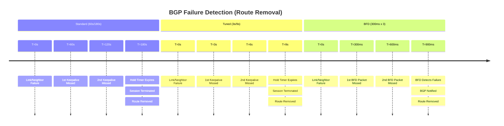
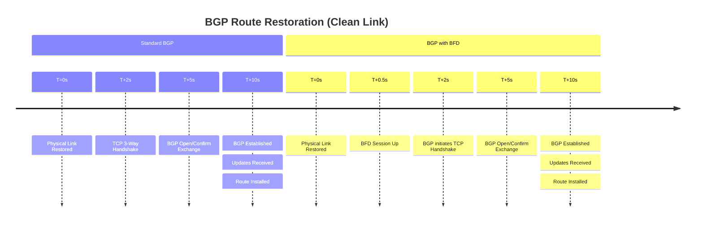
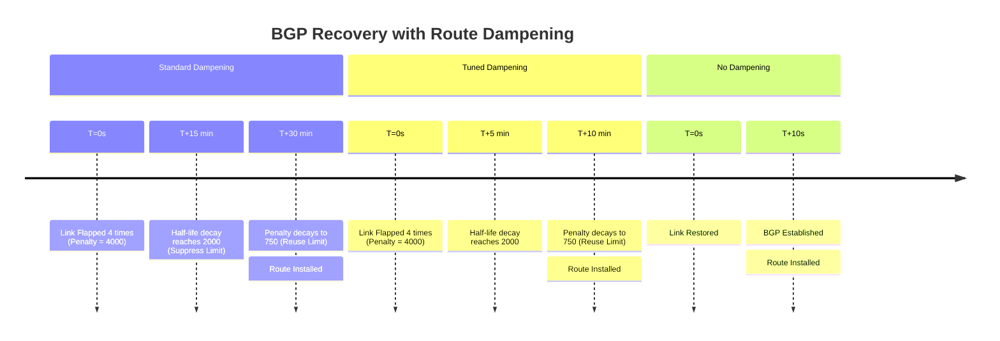

# BGP Convergence: Failure Detection, Restoration, and Dampening

This documentation compares Border Gateway Protocol (BGP) behavior under different
timer configurations, BFD usage, and the impact of Route Dampening on recovery.

---

## 1. Failure Detection Timeline (Route Removal)

Failure detection is where BFD provides the most significant advantage. Standard
BGP relies on control-plane keepalives, whereas BFD operates in the forwarding plane
for sub-second reaction.

---

## 2. Restoration Timeline (Clean Link)

When a stable link returns, restoration involves the TCP handshake and BGP state
machine. BFD facilitates the initial signal, but protocol overhead is the bottleneck.

---

## 3. Restoration Timeline (Flapping Link / Dampening)

If a link has been unstable, **Route Dampening** prevents the route from being used
immediately upon restoration. The "Penalty" must decay below the "Reuse" limit before
the route is re-installed.

---

## 4. Comparison Summary

| Metric | Standard BGP | Tuned BGP | BGP with BFD |
| :--- | :--- | :--- | :--- |
| **Detection Time** | ~180 Seconds | ~9 Seconds | < 1 Second |
| **Restoration (Stable)** | ~10-15 Seconds | ~10-15 Seconds | ~10-15 Seconds |
| **Restoration (Flap)** | ~30-60 Minutes | ~10-20 Minutes | ~30-60 Minutes |
| **CPU Impact** | Very Low | **High** | Low (Offloaded) |
| **Stability** | Very High | Risky | Very High |

### Dampening Logic Reference

- **Penalty per Flap:** 1000
- **Suppress Limit:** 2000 (Default)
- **Reuse Limit:** 750 (Default)
- **Half-life:** 15 minutes (Standard) vs 5 minutes (Aggressive/Tuned)

### Engineering Guidance

- **Use BFD** for sub-second failure detection.
- **Avoid Tuned BGP Timers** if hardware supports BFD; they tax the control plane
    CPU.
- **Use Dampening** on EBGP edge interfaces to protect your internal network from
    unstable internet routes.
