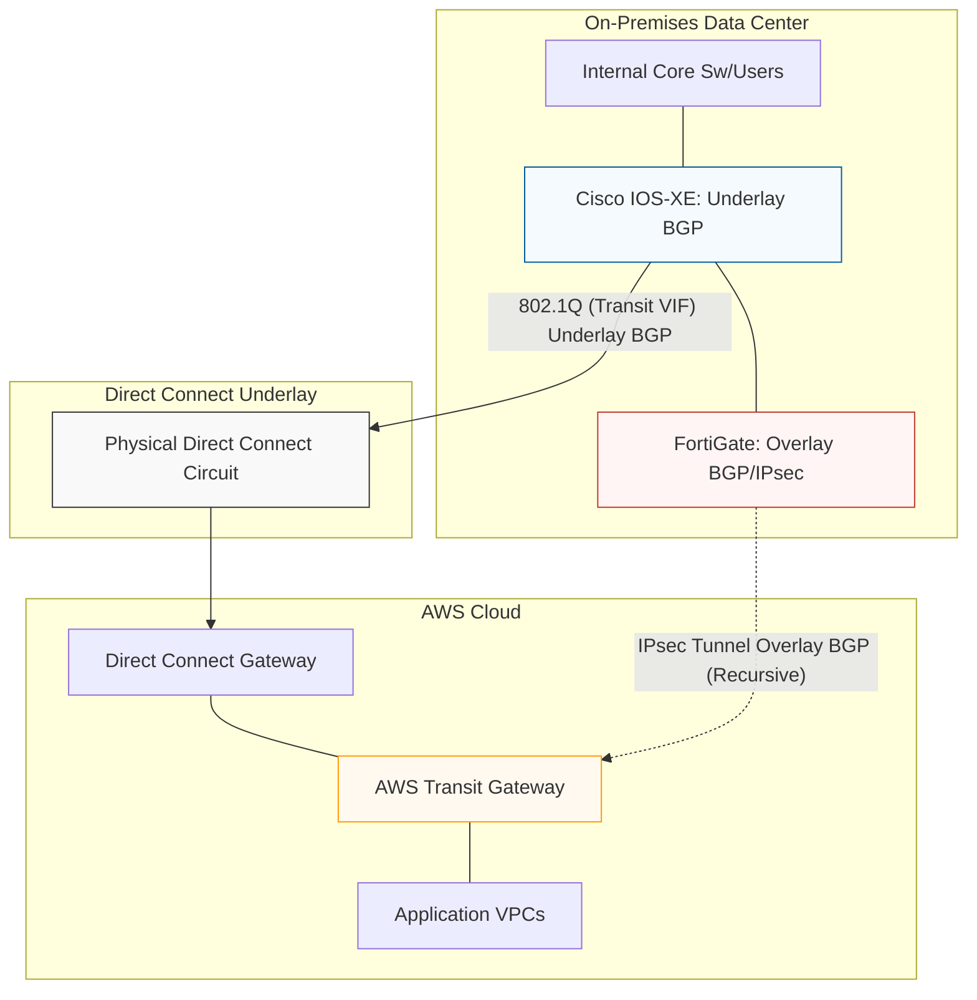
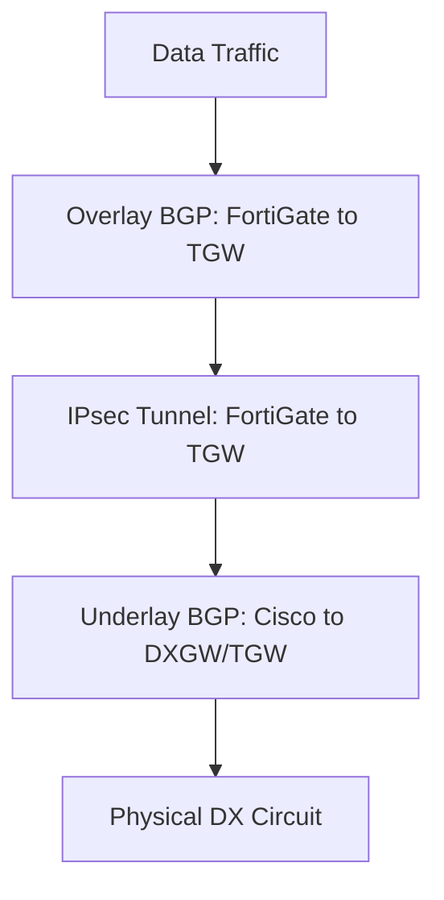
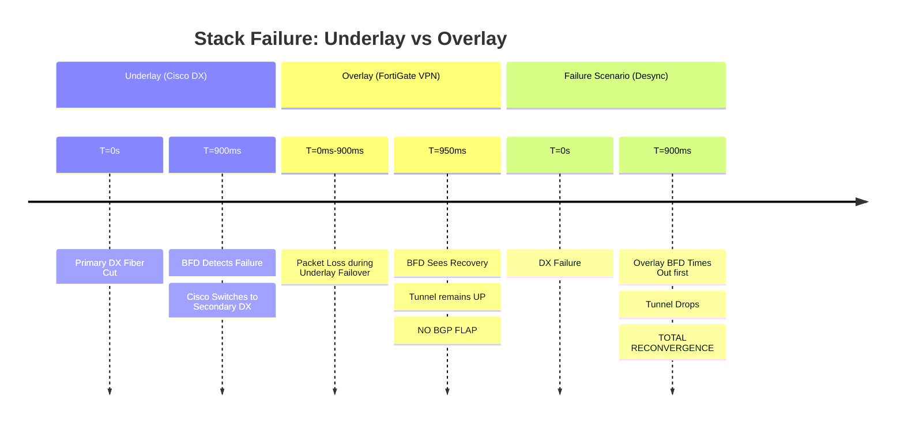

# BGP Stack Analysis: VPN Overlay over DX Transit VIF

This architecture utilizes a layered protocol approach to provide encrypted, high-bandwidth
connectivity to AWS. The Cisco IOS-XE handles the physical path (Direct Connect),
while the FortiGate manages the security layer (IPsec).

---

## 1. Physical and Logical Architecture

The diagram below illustrates how the **Overlay** BGP session is "tunneled" inside
the **Underlay** transport provided by the Direct Connect Transit VIF.



---

## 2. The Protocol Stack Layers



---

## 3. Convergence Timelines

### A. Failure Detection (Layered Impact)

The goal is for the Underlay to recover within the BFD window to prevent an Overlay
flap.



---

## 4. Optimized Device Configurations

### A. Cisco IOS-XE (Underlay - Active/Passive Dual DX)

```ios
! BFD Template
bfd-template single-hop AWS-DX-BFD
 interval min-tx 300 min-rx 300 multiplier 3
 no bfd echo
!
! 1. Filtering for Underlay
! Prefixes received FROM AWS (Tunnel Endpoints in VPC/TGW)
ip prefix-list PL-AWS-VPN-ENDPOINTS-IN permit 1.2.3.4/32
ip prefix-list PL-AWS-VPN-ENDPOINTS-IN permit 1.2.3.5/32
! Prefixes advertised TO AWS (FortiGate local external IPs)
ip prefix-list PL-ONPREM-VTI-IPS-OUT permit 10.10.10.1/32
!
! 2. Inbound Policy (Influences OUTBOUND traffic)
route-map RM-DX-PRIMARY-IN permit 10
 match ip address prefix-list PL-AWS-VPN-ENDPOINTS-IN
 set local-preference 200
!
route-map RM-DX-SECONDARY-IN permit 10
 match ip address prefix-list PL-AWS-VPN-ENDPOINTS-IN
 set local-preference 100
!
! 3. Outbound Policy (Influences INBOUND traffic from AWS)
route-map RM-DX-PRIMARY-OUT permit 10
 match ip address prefix-list PL-ONPREM-VTI-IPS-OUT
 set community 7224:7300
!
route-map RM-DX-SECONDARY-OUT permit 10
 match ip address prefix-list PL-ONPREM-VTI-IPS-OUT
 set community 7224:7100
!
! 4. BGP Config
router bgp 65000
 bgp log-neighbor-changes
 bgp graceful-restart
 neighbor 169.254.x.2 remote-as 64512
 neighbor 169.254.x.2 fall-over bfd
 neighbor 169.254.y.2 remote-as 64512
 neighbor 169.254.y.2 fall-over bfd
 !
 address-family ipv4 unicast
  neighbor 169.254.x.2 activate
  neighbor 169.254.x.2 send-community
  neighbor 169.254.x.2 route-map RM-DX-PRIMARY-IN in
  neighbor 169.254.x.2 route-map RM-DX-PRIMARY-OUT out
  !
  neighbor 169.254.y.2 activate
  neighbor 169.254.y.2 send-community
  neighbor 169.254.y.2 route-map RM-DX-SECONDARY-IN in
  neighbor 169.254.y.2 route-map RM-DX-SECONDARY-OUT out
 exit-address-family
!
```

### B. FortiGate (Overlay - BGP over VPN)

#### Phase 1 & Phase 2 Setup (Dual Tunnels)

```fortios
config vpn ipsec phase1-interface
    edit "AWS_TGW_VPN_1"
        set interface "port1"
        set bfd enable
        set dpd on-idle
        set remote-gw 1.2.3.4
        set proposal aes256-sha256 aes256-sha512
        set dhgrp 21
        set npu-offload enable
    next
    edit "AWS_TGW_VPN_2"
        set interface "port1"
        set bfd enable
        set dpd on-idle
        set remote-gw 1.2.3.5
        set proposal aes256-sha256 aes256-sha512
        set dhgrp 21
        set npu-offload enable
    next
end

config vpn ipsec phase2-interface
    edit "AWS_TGW_VPN_1_P2"
        set phase1name "AWS_TGW_VPN_1"
        set proposal aes256-sha256 aes256-sha512
        set dhgrp 21
        set keylifeseconds 3600
        set src-addr-type 0.0.0.0/0
        set dst-addr-type 0.0.0.0/0
    next
    edit "AWS_TGW_VPN_2_P2"
        set phase1name "AWS_TGW_VPN_2"
        set proposal aes256-sha256 aes256-sha512
        set dhgrp 21
        set keylifeseconds 3600
        set src-addr-type 0.0.0.0/0
        set dst-addr-type 0.0.0.0/0
    next
end
```

#### Route-Maps for Bidirectional Preference

```fortios
# 1. Inbound: Set Local Preference for Outbound Traffic Path selection
config router route-map
    edit "PREFER-PRIMARY-IN"
        config rule
            edit 10
                set local-preference 200
            next
        end
    next
    edit "PREFER-SECONDARY-IN"
        config rule
            edit 10
                set local-preference 100
            next
        end
    next
end

# 2. Outbound: Tag Communities to influence AWS Inbound Traffic selection
config router route-map
    edit "SET-AWS-PRIMARY-OUT"
        config rule
            edit 10
                set set-community "7224:7300"
            next
        end
    next
    edit "SET-AWS-SECONDARY-OUT"
        config rule
            edit 10
                set set-community "7224:7100"
            next
        end
    next
end
```

#### BGP Neighbor Configuration

```fortios
config router bgp
    config neighbor
        edit "169.254.y.1"
            set description "PRIMARY-TGW-TUNNEL"
            set bfd enable
            set capability-graceful-restart enable
            set link-down-failover enable
            set route-map-in "PREFER-PRIMARY-IN"
            set route-map-out "SET-AWS-PRIMARY-OUT" out
        next
        edit "169.254.y.2"
            set description "SECONDARY-TGW-TUNNEL"
            set bfd enable
            set capability-graceful-restart enable
            set link-down-failover enable
            set route-map-in "PREFER-SECONDARY-IN"
            set route-map-out "SET-AWS-SECONDARY-OUT" out
        next
    end
end
```

---

## 5. Key Best Practices

### A. Bidirectional Path Control

- **Inbound Route-Map:** Uses `local-preference` (FortiGate) to ensure the local
    network selects the Primary tunnel for egress.
- **Outbound Route-Map:** Uses AWS BGP `communities` (7224:7300) to ensure AWS selects
    the Primary tunnel for ingress.

### B. MTU & MSS Management (Crucial)

AWS VPN endpoints have an absolute MTU of 1500. Even with DX supporting Jumbo Frames,
packets inside the VPN will be dropped if they exceed the IPsec overhead limits.

- **FortiGate Fix:** `set tcp-mss 1379` on the VTI interfaces.

### C. BFD Echo Mode

**Disable BFD Echo** on the Cisco DX interface (`no bfd echo`). Direct Connect routers
do not support the loopback of echo packets; leaving it enabled will cause false
BFD failures.

### D. Phase 2 Selectors

AWS TGW VPN attachments require Phase 2 selectors to be **0.0.0.0/0**. Using specific
subnets here breaks the BGP multi-path logic and can lead to tunnel negotiation
failures.

### E. Next-Hop Tracking (NHT)

Use `set link-down-failover enable` on FortiGate BGP neighbors. This forces BGP
to withdraw routes immediately if the BFD-monitored tunnel interface enters a down
state.

---

## 6. Summary Checklist

- [ ] **Dual Underlay Paths:** Both DX Primary and Secondary interfaces/neighbors
    configured on Cisco.
- [ ] **Underlay Priority:** `local-preference 200` assigned to Primary DX path
    on Cisco.
- [ ] **BFD Timers:** Synchronized at 300ms x 3 on both Underlay (Cisco) and Overlay
    (FortiGate).
- [ ] **Cisco BFD Echo:** Explicitly disabled (`no bfd echo`) on DX interfaces.
- [ ] **MSS Clamping:** Set to **1379** on all FortiGate VPN VTI interfaces.
- [ ] **Phase 2 Selectors:** Configured as **0.0.0.0/0** for both tunnels.
- [ ] **Bidirectional Steering:** `local-preference` (Inbound) and `7224:7300` community
    (Outbound) on Primary.
- [ ] **Graceful Restart:** Enabled on all BGP speakers to survive sub-second failovers.
- [ ] **Next-Hop Tracking:** `link-down-failover` enabled on FortiGate BGP neighbors.
- [ ] **Summarization:** Internal routes summarized at the DC edge to reduce BGP
    churn.
- [ ] **Monitoring:** BFD specific logging enabled to detect "silent" underlay brownouts.
