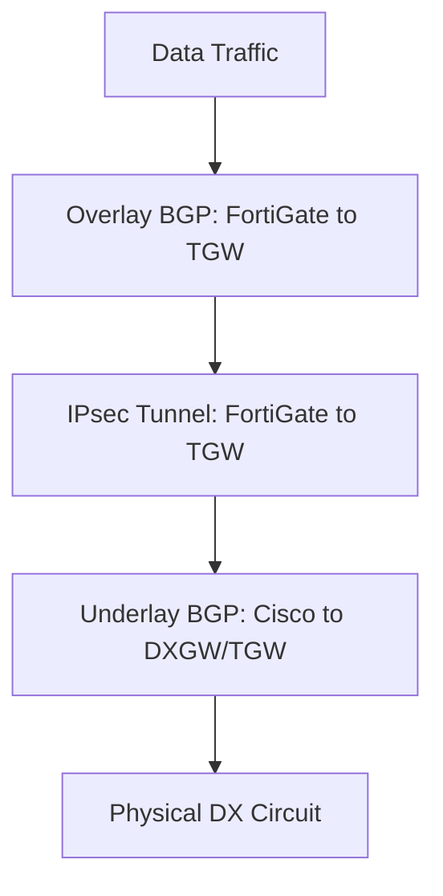

# BGP Stack Analysis: VPN Overlay over DX Transit VIF

In this architecture, the FortiGate establishes an IPsec VPN to the AWS TGW using
the public or private IP learned via the Cisco's Direct Connect BGP session. This
creates a "Protocol Stack."

---

## 1. The Protocol Stack Layers

---

## 2. Timer Hierarchy (The "Waterfall" Principle)

To ensure stability, the **Overlay** should generally be slightly less sensitive
than the **Underlay**, or they should be perfectly synchronized if using BFD.

| Layer | Component | Recommended Setting | Detection Time |
| :--- | :--- | :--- | :--- |
| **Underlay** | Cisco DX BFD | 300ms x 3 | **900ms** |
| **Overlay** | FortiGate VPN BFD | 300ms x 3 | **900ms** |
| **Safety Net** | IPsec DPD | 10s (On-Idle) | ~30s |
| **Protocol** | BGP Hold Timer | 30s (AWS Default) | 30s - 90s |

---

## 3. Key Considerations for the "Stack"

### A. BFD Echo Mode (Cisco Specific)

On the Cisco IOS-XE Underlay, you **must disable BFD Echo** if the BFD packets are
traversing a service provider network that doesn't support looping back those packets.

- **Why:** BFD Echo sends packets with the source and destination as the Cisco's
    own IP. Over Direct Connect, this often fails.
- **Config:** `no bfd echo` on the interface/template.

### B. The "Double Overhead" MTU Trap

- **Underlay (DX):** Supports MTU 9001 (Jumbo).
- **Overlay (VPN):** Supports MTU 1500 (standard) but effectively 1427-1446 after
    IPsec headers.
- **The Conflict:** If the FortiGate tries to send a Jumbo frame inside the IPsec
    tunnel, the tunnel will encapsulate it and send it to the Cisco. Even if the
    Cisco supports MTU 9001, the **AWS VPN Endpoint** only accepts 1500.
- **Resolution:** You **MUST** clamp MSS at the FortiGate level to ~1379, regardless
    of the DX's Jumbo frame capability.

### C. BGP Next-Hop Tracking (NHT)

On the FortiGate, ensure BGP is aware of the underlay interface state.

- If the Cisco loses the DX path, the route to the AWS VPN endpoint on the FortiGate
    should ideally disappear.
- Use `set link-down-failover enable` on the FortiGate BGP neighbor to ensure that
    if the tunnel interface goes down (triggered by BFD), BGP doesn't wait for its
    30s hold timer.

### D. Graceful Restart Coordination

Enable **Graceful Restart** on both the Cisco (Underlay) and the FortiGate (Overlay).

- If the Underlay flaps for 1 second, Graceful Restart on the Cisco keeps the VPN
    endpoint IP reachable.
- If the Overlay flaps, Graceful Restart on the FortiGate keeps the VPC traffic
    flowing.
- Without this, a sub-second DX blip triggers a "Cold Start" for the entire routing
    table.

---

## 4. Failure Scenario Analysis

### Scenario: Direct Connect Fiber Cut

1. **T+900ms:** Cisco BFD detects DX failure. Cisco switches to Secondary DX.
2. **Impact on VPN:** The IPsec tunnel might see a momentary packet loss during
    the Cisco's 900ms failover.
3. **Outcome A (Stable):** FortiGate VPN BFD (900ms) sees 1-2 missed packets but
    stays "Up" because the Underlay recovered in time. **No BGP churn.**
4. **Outcome B (Flap):** If Underlay recovery takes >900ms, the FortiGate VPN BFD
    fails. The tunnel drops and re-establishes over the secondary DX. **BGP re-convergence
    occurs.**

---

## 5. Summary Checklist

- [ ] Underlay BFD (Cisco) set to 300ms x 3.
- [ ] Overlay BFD (FortiGate) set to 300ms x 3.
- [ ] BGP Graceful Restart enabled on **all** peers.
- [ ] MSS Clamping set to 1379 on FortiGate VTIs.
- [ ] BFD Echo disabled on Cisco DX interfaces.
