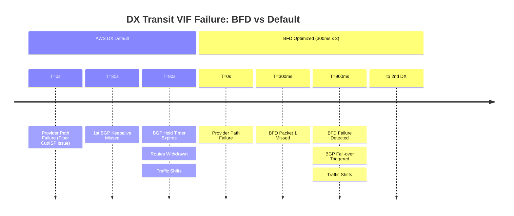

# Cisco IOS-XE: BGP over AWS Transit VIF (Direct Connect)

This document outlines the recommended settings for a Cisco IOS-XE switch/router
connecting to an AWS Transit Gateway (TGW) via a Transit VIF. This setup assumes
a pair of Direct Connects for high availability and ECMP capability.

---

## 1. Failure Detection Timeline (Underlay Failure)

AWS Direct Connect BGP default hold time is **90 seconds**. BFD reduces this to
sub-second levels, which is vital for high-bandwidth 10G/100G circuits.



---

## 2. Cisco IOS-XE Configuration

### A. BFD Template (AWS Optimized)

AWS requires a minimum 300ms interval for BFD on Direct Connect.

```ios
bfd-template single-hop AWS-DX-BFD
 interval min-tx 300 min-rx 300 multiplier 3
!
```

### B. Interface Configuration (Transit VIF)

Transit VIFs use 802.1Q tags. Ensure the MTU is set to 9001 if you intend to use
Jumbo Frames (supported natively on DX).

```ios
interface GigabitEthernet1.100
 description TO-AWS-DX-PRIMARY
 encapsulation dot1Q 100
 ip address 169.254.x.1 255.255.255.252
 ip mtu 9001
 bfd template AWS-DX-BFD
!
```

### C. BGP Configuration (Dual DX with ECMP)

To leverage both Direct Connects simultaneously, enable `maximum-paths`.

```ios
router bgp 65000
 bgp log-neighbor-changes
 ! Enable ECMP across the two DX paths
 address-family ipv4
  maximum-paths 2
 exit-address-family
 !
 neighbor 169.254.x.2 remote-as 64512
 neighbor 169.254.x.2 description AWS-TGW-PRIMARY
 neighbor 169.254.x.2 fall-over bfd
 neighbor 169.254.x.2 timers 30 90
 neighbor 169.254.x.2 activate
 !
 neighbor 169.254.y.2 remote-as 64512
 neighbor 169.254.y.2 description AWS-TGW-SECONDARY
 neighbor 169.254.y.2 fall-over bfd
 neighbor 169.254.y.2 timers 30 90
 neighbor 169.254.y.2 activate
!
```

---

## 3. Comparison Summary

| Metric | AWS DX Default | Cisco Optimized + BFD |
| :--- | :--- | :--- |
| **BGP Timers** | 30s Keepalive / 90s Hold | 30s Keepalive / 90s Hold |
| **Detection Time** | ~90 Seconds | **< 1 Second** (900ms) |
| **Underlay Support** | 802.1Q Transit VIF | 802.1Q Transit VIF |
| **MTU Support** | 1500 | **9001 (Jumbo Frames)** |
| **Load Balancing** | Failover only | **ECMP (Active/Active)** |

---

## 4. Key Principles for Transit VIFs

### A. Jumbo Frames (MTU 9001)

Unlike VPN attachments (limited to 1427-1446), Transit VIFs support up to 9001 bytes.
Ensure the entire path from your internal switch to the Cisco router and the DX
provider supports Jumbo Frames to avoid fragmentation.

### B. AS-Path Prepending & Communities

If you prefer an **Active/Passive** setup instead of ECMP:

- Use **AS-Path Prepending** on the secondary DX to influence AWS inbound traffic.
- Use **Local Preference** on the Cisco side to influence outbound traffic.
- AWS supports communities (e.g., `7224:7100` for Low, `7224:7300` for High preference)
    to control how AWS sees your routes.

### C. BFD over Transit VIF

On a Transit VIF, BGP is peering with the AWS Transit Gateway (via the DXGW). BFD
is negotiated directly between your Cisco device and the AWS endpoint. This is the
only way to detect a failure if the physical DX cross-connect is healthy but the
routing logic in the provider's cloud is broken.

### D. BGP Deterministic MED

If you are receiving the same routes from multiple DX locations, ensure `bgp deterministic-med`
is enabled to ensure a consistent path selection process.

---

## 5. Verification Commands

| Command | Purpose |
| :--- | :--- |
| `show bfd neighbors` | Verify 300ms/300ms and "Up" status |
| `show ip bgp summary` | Check neighbor status and prefixes received |
| `show ip route 10.0.0.0` | Verify if both DX paths are in the routing table (ECMP) |
| `show ip interface GigabitEthernet1.100` | Verify MTU and BFD template application |
