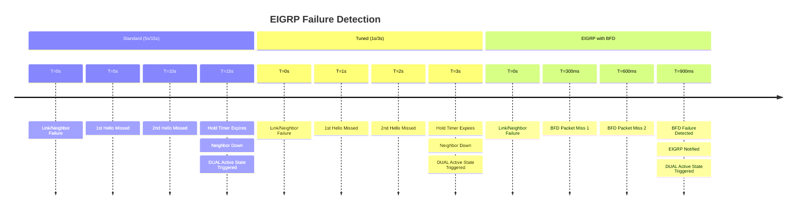
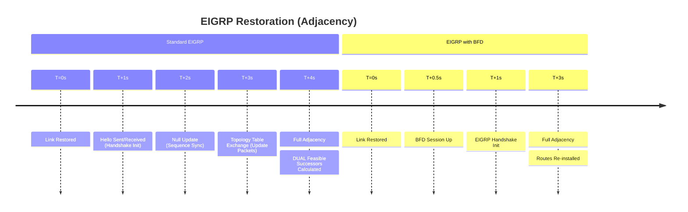

# EIGRP Convergence: Standard vs. Tuned vs. BFD

This document compares EIGRP convergence behavior. EIGRP is known for being one
of the fastest IGP protocols due to its Diffusing Update Algorithm (DUAL), but its
initial failure detection still relies on Hello/Hold timers unless BFD is utilized.

---

## 1. Failure Detection Timeline (Neighbor Down)

EIGRP uses "Hello" packets to maintain adjacency and a "Hold Timer" to declare a
neighbor down.

---

## 2. Restoration Timeline (Neighbor Up)

EIGRP restoration involves a 3-way handshake and the exchange of the full topology
table via Update packets.

---

## 3. Comparison Summary

| Metric | Standard EIGRP | Tuned EIGRP | EIGRP + BFD |
| :--- | :--- | :--- | :--- |
| **Hello / Hold** | 5s / 15s | 1s / 3s | 5s / 15s (Backup) |
| **Detection Time** | ~15 Seconds | ~3 Seconds | < 1 Second |
| **CPU Impact** | Low | Medium-High | Low (Offloaded) |
| **Stability** | High | Moderate | High |
| **Recovery Logic** | DUAL Query | DUAL Query | Immediate DUAL Trigger |

### Key Principles

#### 1. DUAL and the "Active" State

When EIGRP loses a route and has no **Feasible Successor** (backup route) in its
topology table, it goes into "Active" state and sends Queries to neighbors. BFD
speeds up the transition to this state by removing the neighbor immediately.

#### 2. The 1s/3s "Aggressive" Limit

While OSPF can be tuned to sub-second "minimal" hellos, EIGRP typically bottoms
out at 1-second Hellos and a 3-second Hold timer. Going faster than this without
BFD significantly risks "stuck-in-active" (SIA) issues if the CPU is busy.

#### 3. BFD Offloading

BFD is particularly effective for EIGRP because it allows the protocol to maintain
high-stability timers (5/15) while still reacting to physical failures at sub-second
speeds.

---

### Engineering Guidance

- **Use BFD** as the primary detection mechanism for all Core and Distribution links.
- **Tuned Timers (1s/3s)** are acceptable for branch offices or lower-speed links
    where sub-second convergence isn't a requirement.
- **Feasible Successors:** Ensure your design provides EIGRP with feasible successors;
    BFD detects the failure faster, but DUAL needs a backup path to achieve "instant"
    convergence.
