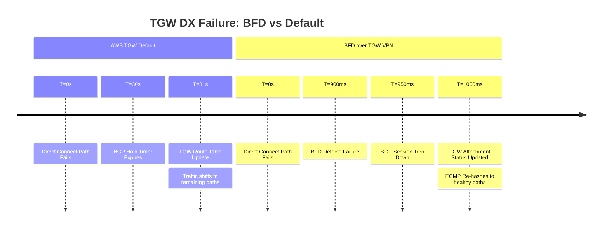

# FortiGate: BGP over AWS Transit Gateway (DX Underlay)

Using a Transit Gateway (TGW) allows for multi-tunnel ECMP, increasing aggregate
VPN throughput beyond 1.25 Gbps. In this architecture, BFD acts as the health-check
mechanism for the TGW's VPN attachments.

---

## 1. Failure Detection Timeline (Underlay Failure)

AWS TGW VPN endpoints support BFD with a 300ms interval. This is critical when using
ECMP, as it prevents "black-holing" 50% of your traffic if one of two tunnels fails.



---

## 2. FortiOS CLI Configuration (TGW Optimized)

### A. Phase 1 Interface (VTI)

```fortios
config vpn ipsec phase1-interface
    edit "AWS_TGW_VPN_01"
        set interface "port1"  # DX Port/VLAN
        set bfd enable
        set dpd-sort-interval 10
        # Ensure NPU offload is enabled for BFD
        set npu-offload enable
    next
end
```

### B. BGP with ECMP & BFD

TGW usually requires a private ASN (e.g., 64512). Enable `ebgp-multipath` to take
advantage of TGW ECMP.

```fortios
config router bgp
    set as 65000
    set ebgp-multipath enable
    config neighbor
        edit "169.254.x.x"
            set remote-as 64512
            set bfd enable
            set capability-graceful-restart enable
            set link-down-failover enable
            # Match AWS TGW Timers
            set timers-holdtime 30
            set timers-keepalive 10
        next
    end
end
```

### C. System BFD Settings

```fortios
config system bfd
    config neighbor
        edit "169.254.x.x"
            set min-rx 300
            set min-tx 300
            set multiplier 3
        next
    end
end
```

---

## 3. Transit Gateway Specific Principles

### A. The ECMP Factor

By default, a TGW VPN connection provides two tunnels. With `ECMP` enabled on the
TGW and `ebgp-multipath` on the FortiGate, you can send traffic over both simultaneously.
BFD ensures that if a provider hop in your Direct Connect path fails, the TGW is
notified in <1s to pull that specific tunnel out of the ECMP group.

### B. MTU & MSS Clamping

TGW has a maximum MTU of **8500** for VPC attachments but **1500** (effectively
1427 after IPsec) for VPN.

- **Recommendation:** Clamp MSS to **1379** on the FortiGate VTI to avoid fragmentation.

### C. Graceful Restart on TGW

AWS TGW periodically undergoes maintenance. Enabling `graceful-restart` on the FortiGate
ensures that the TGW keeps the routes in its route table even if the BGP process
on the AWS side restarts briefly.

### D. Multi-Region / Multi-Account

If the TGW is in a different account or region (via TGW Peering), BFD over the VPN
is the only way to detect end-to-end path health, as the Direct Connect "physical"
status is too far removed from the actual routing logic.

---

## 4. Verification & Troubleshooting

| Command | Purpose |
| :--- | :--- |
| `get router info bfd neighbor` | Confirm 300ms negotiation |
| `get router info bgp summary` | Ensure ECMP (multipath) is active |
| `diagnose vpn tunnel list` | Check if NPU is offloading the BFD traffic |
