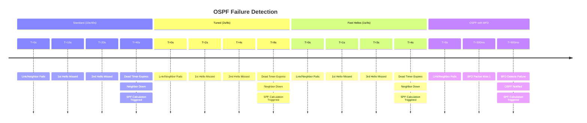
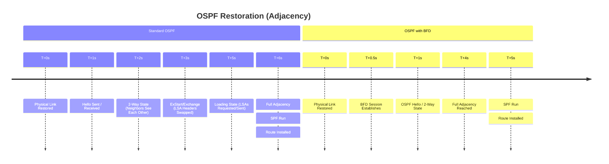

# OSPF Convergence: Standard vs. Tuned vs. Fast Hellos vs. BFD

This document outlines the operational principles of Open Shortest Path First (OSPF)
convergence. It compares how failure detection and route calculation differ across
various timer configurations and BFD integration.

---

## 1. Failure Detection Timeline (Neighbor Down)

OSPF detects failure when it stops receiving "Hello" packets. By default, OSPF is
faster than BGP, but still relies on a "Dead Timer" that can lead to significant
traffic loss.

---

## 2. Restoration Timeline (Neighbor Up)

Unlike BGP, which requires a TCP handshake, OSPF restoration is driven by the exchange
of Link State Advertisements (LSAs).

---

## 3. Comparison Summary

| Metric | Standard OSPF | Tuned Timers | Fast Hellos | OSPF + BFD |
| ----- | ----- | ----- | ----- | ----- |
| **Hello / Dead** | 10s / 40s | 2s / 8s | 1s / 4s | 10s / 40s (Backup) |
| **Detection Time** | ~40 Seconds | ~8 Seconds | ~4 Seconds | < 1 Second |
| **CPU Impact** | Low | Low-Medium | **High** | Low (Offloaded) |
| **Stability** | Very High | High | Moderate | High |
| **SPF Trigger** | After Dead Timer | After Dead Timer | After Dead Timer | Immediate (via BFD) |

### Key Principles

#### 1. The Dead Timer Problem

In standard OSPF, a router waits 4 times the Hello interval before declaring a neighbor
dead. On a 10Gbps link, 40 seconds of failure results in **400 Gigabits of dropped
data**.

#### 2. Tuned Timers vs. Fast Hellos

- **Tuned Timers (e.g., 2s/8s):** This is the "sweet spot" for many legacy networks.
It reduces the detection time from 40s to 8s without significantly stressing the
CPU.
- **Fast Hellos (Sub-second/4s):** Setting OSPF to sub-second hellos forces the
CPU to process hellos constantly. If the CPU hits 100%, it may miss a hello, causing
a "False Positive" adjacency drop.

#### 3. BFD (The Efficient Watchdog)

BFD provides the sub-second detection of Fast Hellos but is offloaded to the forwarding
plane. It acts as an external trigger for OSPF. When BFD fails, it tells OSPF "the
link is gone," allowing OSPF to bypass its 40-second wait and run SPF immediately.

---

### Engineering Guidance

- **Use BFD** whenever the hardware supports it. It is the only way to achieve sub-second
convergence safely.
- **Tuned Timers (2s/8s)** are a safe compromise for networks where BFD is not available.
- **LSA Throttling:** Pair BFD with tuned LSA generation timers for true "carrier-grade"
convergence.
