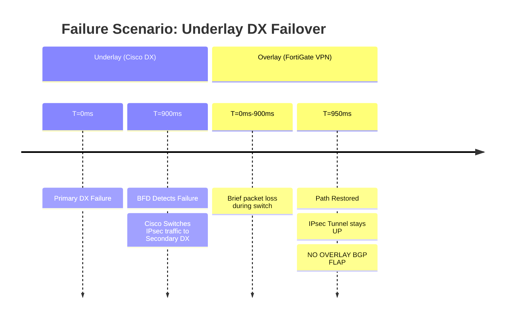
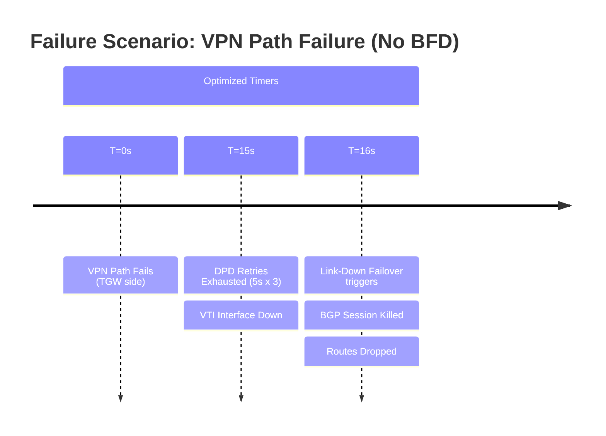

# BGP Stack Analysis: VPN Overlay over DX Transit VIF

## 1. Overview & Principles

This architecture utilizes a layered protocol approach to provide encrypted, high-bandwidth
connectivity to AWS. The Cisco IOS-XE handles the physical path (Direct Connect),
while the FortiGate manages the security layer (IPsec).

### The "Protocol Stack"

The design consists of a recursive routing model:

- **Data Plane:** Traffic is encapsulated in an IPsec tunnel.
- **Overlay BGP:** FortiGate to TGW sessions running inside the tunnel.
- **Underlay BGP:** Cisco to AWS Transit VIF sessions carrying the IPsec transport.

### Deterministic Failover Logic

Since AWS **does not support BFD over VPN**, we must rely on a hierarchy of timers:

- **Underlay (Cisco):** Uses BFD (300ms x 3) to ensure that if a DX fiber cut occurs,
    the transport path shifts in <1s.
- **Overlay (FortiGate):** Uses aggressive Dead Peer Detection (DPD) and BGP Next-Hop
    Tracking. By linking BGP to the VTI status via `link-down-failover`, we ensure
    that routes are withdrawn the moment the tunnel path is declared dead by DPD,
    rather than waiting for the BGP hold-timer.

## 2. Detection & Restoration Timelines

### Underlay Failure (DX Fiber Cut)



### Overlay Failure (Silent Path Loss)



## 3. Configuration Snippets (Optimized for EDC4-PFW-01A)

### A. Cisco IOS-XE (Underlay - Modern Address-Family)

```ios
bfd-template single-hop AWS-DX-BFD
 interval min-tx 300 min-rx 300 multiplier 3
 no bfd echo
!
router bgp 65000
 neighbor 169.254.x.2 remote-as 64512
 neighbor 169.254.x.2 fall-over bfd
 !
 address-family ipv4 unicast
  neighbor 169.254.x.2 activate
  neighbor 169.254.x.2 send-community
  neighbor 169.254.x.2 route-map RM-DX-PRIMARY-IN in
  neighbor 169.254.x.2 route-map RM-DX-PRIMARY-OUT out
 exit-address-family
!
```

### B. FortiGate Overlay (Phase 1 & BGP Neighbors)

Removed BFD (unsupported) and implemented aggressive DPD/BGP timers based on your
`EDC4-PFW-01A` config.

```fortios
config vpn ipsec phase1-interface
    edit "vpn-071eda31a-0"
        set interface "bond0.601"
        set npu-offload enable # Critical for offloading encryption/jitter
        set dpd on-idle
        set dpd-retryinterval 5
        set dpd-retrycount 3
        set proposal aes256-sha256
        set dhgrp 19
        set remote-gw 10.200.3.62
    next
end

config router bgp
    set graceful-restart enable
    set graceful-restart-time 120 # Standardized for AWS maintenance
    config neighbor
        edit "169.254.157.253"
            set description "PRIMARY-TGW-TUNNEL"
            set link-down-failover enable # Trigger withdrawal on VTI down
            set timers-keepalive 10
            set timers-holdtime 30
            set capability-graceful-restart enable
            set route-map-in "INBOUND-AWS-PRI"
            set route-map-out "OUTBOUND-AWS-PRI"
        next
    end
end
```

## 4. Comparison Summary

| Metric | Default Settings | Optimized BGP Stack |
| :--- | :--- | :--- |
| **Underlay Detection** | 180 Seconds | **900ms (BFD)** |
| **Overlay Detection** | 180 Seconds | **15 - 30 Seconds (DPD/BGP)** |
| **BGP Link Reaction** | Passive | **Active (Link-Down Failover)** |
| **Security Standard** | None | **AES-256 / DH-21** |
| **NPU Offload** | Disabled | **Enabled (Encryption acceleration)** |

## 5. Verification & Troubleshooting

| Command | Purpose |
| :--- | :--- |
| `show bfd neighbors` | Verify Cisco Underlay BFD session health. |
| `get router info bgp neighbors 169.254.y.y` | Confirm "Holdtime: 30, Keepalive: 10" and failover status. |
| `diagnose vpn tunnel list name vpn-071eda31a-0` | Monitor DPD retry counters. |
| `get router info bgp neighbors` | Verify Community tagging (7224:7300) for path steering. |
| `diagnose sniffer packet any 'port 179' 4` | Verify 10s BGP keepalives on the wire. |
