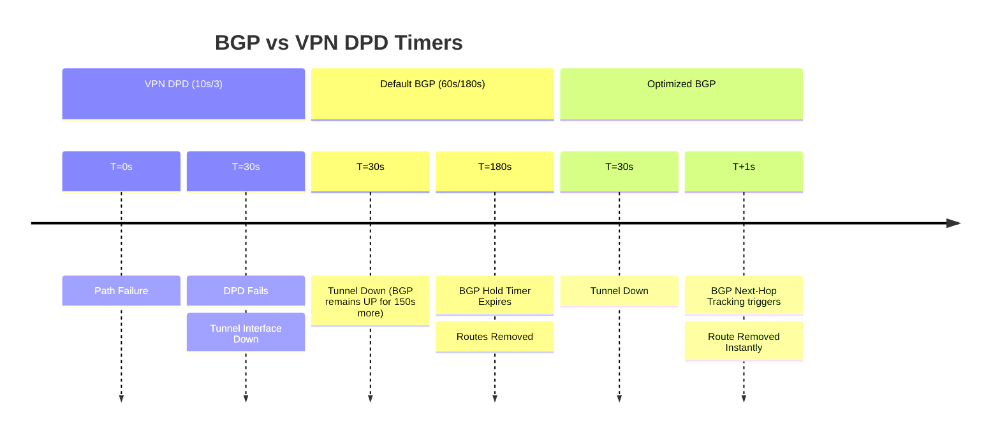

# BGP over VPN: Convergence and Resilience Guide

## 1. Overview & Principles

When running BGP over encrypted tunnels, the interaction between IPsec Dead Peer
Detection (DPD) and BGP timers is critical.

### Key Principles for VPN Resilience

- **The "BGP > DPD" Rule:** Your BGP Hold Timer should always be longer than your
    VPN DPD Timeout to avoid flapping during minor tunnel hiccups. (Optimal: BGP
    Hold = 1.5x DPD).
- **Graceful Restart:** Essential for surviving tunnel re-keys. Traffic continues
    to flow while the control plane session re-establishes.
- **Next-Hop Tracking (NHT):** Uses `fall-over` to monitor the Tunnel interface
    state, allowing BGP to drop instantly if the line protocol goes down.

## 2. Detection Timelines (Mermaid)



## 3. Configuration Snippets

```ios
interface Tunnel1
 ip address 10.255.255.1 255.255.255.252
 tunnel source GigabitEthernet1
 keepalive 10 3
!
router bgp 65001
 neighbor 10.255.255.2 remote-as 65002
 bgp graceful-restart
 neighbor 10.255.255.2 fall-over
 neighbor 10.255.255.2 timers 20 60
!
```

## 4. Comparison Summary

| Feature | Default Settings | With VPN Optimization |
| :--- | :--- | :--- |
| **Detection Speed** | ~180 Seconds | **~30 Seconds (DPD Bound)** |
| **Re-key Impact** | Session potentially drops | **Graceful Restart maintains traffic** |
| **Failover Trigger** | Timer expiration | **Interface Fall-over** |
| **Convergence** | Slow | **Fast (Next-Hop Tracking)** |

## 5. Verification & Troubleshooting

| Command | Purpose |
| :--- | :--- |
| `show crypto isakmp sa` | Check VPN Tunnel Phase 1 status. |
| `show ip bgp neighbors &#124; inc Graceful` | Verify Graceful Restart negotiation. |
| `show ip bgp neighbors &#124; inc fall-over` | Confirm interface tracking is active. |
