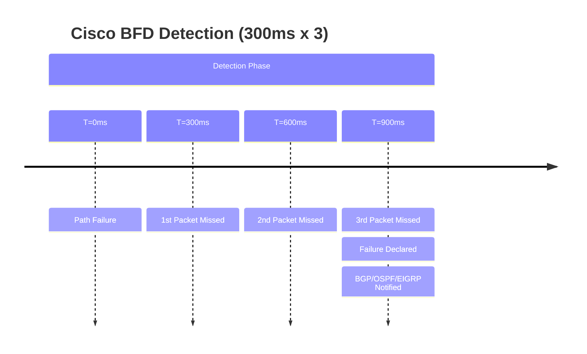

# Cisco IOS-XE: Optimized BFD Configuration Guide

## 1. Overview & Principles

Bidirectional Forwarding Detection (BFD) is a low-overhead, short-duration method
to detect path failures between adjacent forwarding engines. This guide uses the
**BFD Template** approach, which is the modern standard for Cisco IOS-XE.

### The BFD Template Advantage

Unlike older interface-specific commands, templates allow you to define a single
policy (timers, multiplier, and echo mode) and apply it globally across protocols.
This ensures consistency and simplifies large-scale troubleshooting.

## 2. Detection Timelines (Heartbeat)



## 3. Configuration Snippets

### A. Global BFD Template

```ios
bfd-template single-hop OPTIMIZED-BFD
 interval min-tx 300 min-rx 300 multiplier 3
```

### B. Protocol Integration

```ios
router bgp 65001
 neighbor 10.1.1.2 fall-over bfd
!
router ospf 1
 bfd all-interfaces
!
router eigrp CORE
 address-family ipv4 unicast autonomous-system 100
  af-interface default
   bfd
```

## 4. Comparison Summary

| Metric | Default Settings | Optimized BFD |
| :--- | :--- | :--- |
| **BGP Detection** | 180 Seconds | **~900ms** |
| **OSPF Detection** | 40 Seconds | **~900ms** |
| **CPU Impact** | Low | **Low (Offloaded to ASIC)** |
| **Mechanism** | Keepalive Timers | **Fast Heartbeats** |

## 5. Verification & Troubleshooting

| Command | Purpose |
| :--- | :--- |
| `show bfd neighbors` | Verify the active heartbeats and their intervals. |
| `show ip bgp neighbors &#124; inc BFD` | Check if a BGP neighbor is registered. |
| `show ip ospf interface` | Confirm OSPF BFD is enabled on the interface. |
| `debug bfd event` | Monitor BFD session transitions in real-time. |
