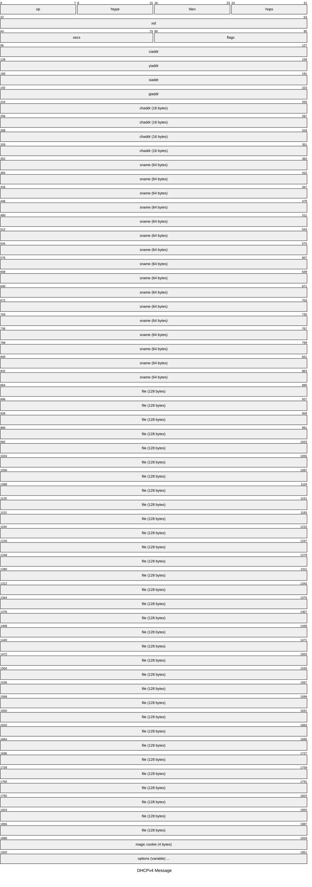
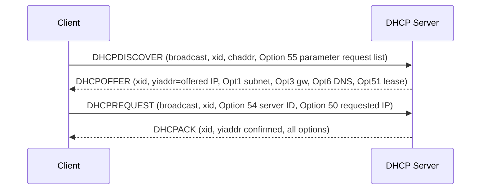
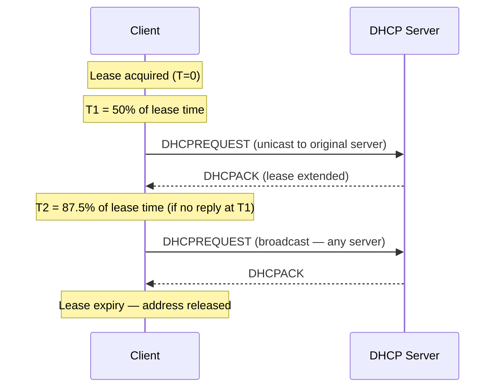

# DHCP — Dynamic Host Configuration Protocol

DHCP (RFC 2131) automates the assignment of IP addresses and network configuration
parameters to hosts. A client broadcasts a discovery message; a server offers an
address lease; the client requests the offered address; the server acknowledges.
DHCP uses a lease model — addresses are allocated for a finite time and must be
renewed. DHCPv6 (RFC 8415) provides equivalent functionality for IPv6, though SLAAC
is an alternative for IPv6 address assignment.

## Quick Reference

| Property | Value |
| --- | --- |
| **OSI Layer** | Layer 7 — Application |
| **RFC** | RFC 2131 (DHCPv4), RFC 8415 (DHCPv6) |
| **Wireshark Filter** | `bootp` (DHCPv4), `dhcpv6` (DHCPv6) |
| **UDP Ports (v4)** | `67` (server), `68` (client) |
| **UDP Ports (v6)** | `546` (client), `547` (server) |

---

## DHCPv4 Message Format



| Field | Size | Description |
| --- | --- | --- |
| **op** | 1 byte | `1` = BOOTREQUEST (client → server), `2` = BOOTREPLY (server → client). |
| **htype** | 1 byte | Hardware type: `1` = Ethernet. |
| **hlen** | 1 byte | Hardware address length: `6` bytes for Ethernet MAC. |
| **hops** | 1 byte | Relay agent hop count, incremented by each DHCP relay. |
| **xid** | 4 bytes | Transaction ID — random 32-bit value matching a request to its reply. |
| **secs** | 2 bytes | Seconds elapsed since the client began address acquisition. |
| **flags** | 2 bytes | Bit 15 = Broadcast flag: client requests the server reply via broadcast. |
| **ciaddr** | 4 bytes | Client IP address. Only set if the client already has a valid lease to maintain. |
| **yiaddr** | 4 bytes | "Your" IP address — the address being offered or confirmed. |
| **siaddr** | 4 bytes | IP address of the next server in the boot sequence. |
| **giaddr** | 4 bytes | Gateway IP. Set by the DHCP relay agent; tells the server which subnet to allocate from. |
| **chaddr** | 16 bytes | Client hardware address (MAC occupies the first 6 bytes). |
| **sname** | 64 bytes | Optional server hostname. |
| **file** | 128 bytes | Boot file name (used by PXE). |
| **options** | Variable | TLV-encoded options, preceded by magic cookie `0x63825363`. Option 53 carries the DHCP message type. |

---

## DHCP Message Types (Option 53)

| Value | Type | Description |
| --- | --- | --- |
| 1 | DHCPDISCOVER | Client broadcasts to locate servers. |
| 2 | DHCPOFFER | Server offers an address lease. |
| 3 | DHCPREQUEST | Client requests offered address or renews a lease. |
| 4 | DHCPDECLINE | Client rejects an offered address (e.g. duplicate detected). |
| 5 | DHCPACK | Server confirms the address assignment. |
| 6 | DHCPNAK | Server denies a REQUEST (address unavailable or lease invalid). |
| 7 | DHCPRELEASE | Client releases its address back to the pool. |
| 8 | DHCPINFORM | Client already has an address; requests configuration options only. |

---

## DORA Exchange (Normal Lease Acquisition)



DISCOVER and REQUEST are sent as broadcasts (src `0.0.0.0`, dst `255.255.255.255`)
so all servers on the segment receive them. The client selects one OFFER by echoing
the chosen server's IP in Option 54.

---

## Lease Renewal Timeline



---

## Common DHCP Options

| Option | Name | Description |
| --- | --- | --- |
| 1 | Subnet Mask | e.g. `255.255.255.0` |
| 3 | Router | Default gateway IP(s). |
| 6 | DNS Servers | Up to 8 DNS server IPs. |
| 12 | Hostname | Client's hostname. |
| 15 | Domain Name | DNS domain suffix. |
| 28 | Broadcast Address | Subnet broadcast address. |
| 42 | NTP Servers | NTP server IPs. |
| 43 | Vendor-Specific | Used by PXE boot, VoIP phones, etc. |
| 51 | IP Address Lease Time | Lease duration in seconds. |
| 53 | DHCP Message Type | See table above. |
| 54 | Server Identifier | Server's IP; used in REQUEST and DECLINE to identify selected server. |
| 55 | Parameter Request List | Client lists options it wants the server to return. |
| 58 | Renewal (T1) Time | Time until unicast renewal attempt. Default: 50% of lease time. |
| 59 | Rebinding (T2) Time | Time until broadcast rebind attempt. Default: 87.5% of lease time. |
| 60 | Vendor Class Identifier | Client device class string (e.g. `PXEClient`). |
| 61 | Client Identifier | Unique client ID; typically `0x01` + MAC address. |
| 82 | Relay Agent Information | Added by relay agents: sub-option 1 = Circuit-ID, sub-option 2 = Remote-ID. |
| 121 | Classless Static Route | RFC 3442 classless static routes (preferred over Option 33). |

---

## DHCP Relay (IP Helper)

When the client and server are on different subnets, a DHCP relay agent — typically
the client-facing router or Layer 3 switch — intercepts broadcast DISCOVER and REQUEST
messages and forwards them as unicast to the configured server. The relay sets the
`giaddr` field to its own interface IP, which tells the server which subnet to
allocate from.

**Cisco IOS-XE** — applied to the client-facing interface:

```ios

interface GigabitEthernet0/1
 ip helper-address 10.0.1.50
```

Multiple `ip helper-address` statements forward to multiple DHCP servers.

---

## Notes

- DHCP starvation: an attacker requests leases using spoofed MAC addresses to exhaust

  the pool. Mitigate with DHCP snooping (`ip dhcp snooping`) on access switches,
  which rate-limits requests and validates bindings on untrusted ports.

- DHCP snooping builds a binding table (MAC → IP → VLAN → port) consumed by Dynamic

  ARP Inspection (DAI) and IP Source Guard.

- DHCPv6 modes are controlled by RA flags: **M** (Managed) — stateful DHCPv6 assigns

  address and options; **O** (Other) — stateless DHCPv6 provides options only; SLAAC
  assigns the address. Neither flag set means SLAAC only.

- Option 82 (Relay Agent Information) is stripped by the DHCP server before the reply

  reaches the client. It allows servers to apply per-circuit policies (e.g. assign
  addresses from a specific pool based on Circuit-ID).
