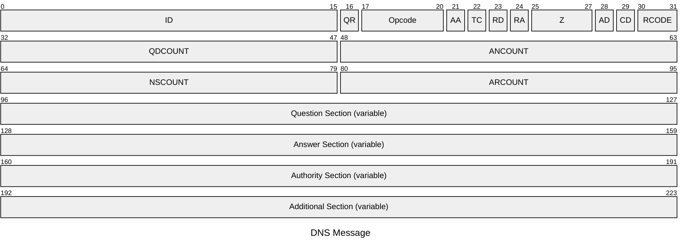
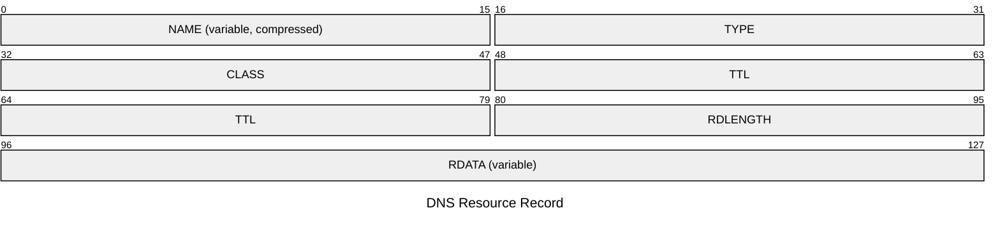
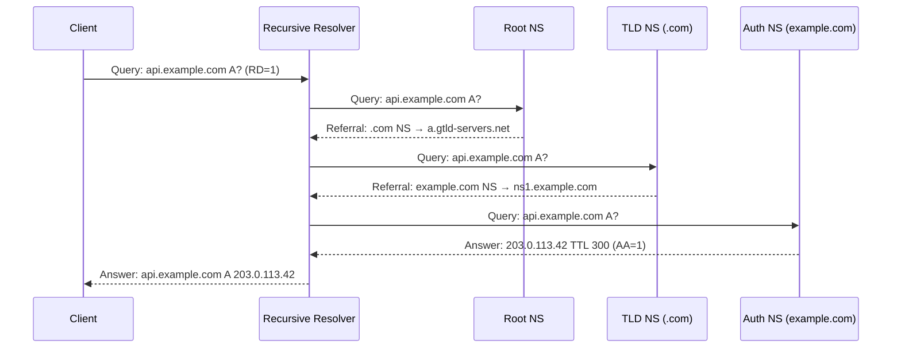

# DNS

The Domain Name System is the distributed hierarchical naming system that translates
human-readable domain names into IP addresses (and vice versa). DNS uses a client-server
model with recursive and authoritative resolvers. DNS runs over UDP port 53 for standard
queries and responses; TCP port 53 is used for zone transfers and responses exceeding
512 bytes (or 4096 bytes with EDNS0). DNSSEC (RFC 4033–4035) adds cryptographic
authentication.

## Quick Reference

| Property | Value |
| --- | --- |
| **OSI Layer** | Layer 7 — Application |
| **TCP/IP Layer** | Application |
| **RFC** | RFC 1034 (concepts), RFC 1035 (implementation), RFC 4033–4035 (DNSSEC) |
| **Wireshark Filter** | `dns` |
| **UDP Port** | `53` |
| **TCP Port** | `53` (zone transfers, large responses) |

---

## Message Format

All DNS messages — queries and responses — share the same format.



### Header Fields

| Field | Bits | Description |
| --- | --- | --- |
| **ID** | 16 | Transaction ID. Set by the client; copied unchanged in the response to match replies to requests. |
| **QR** | 1 | `0` = Query, `1` = Response. |
| **Opcode** | 4 | `0` QUERY (standard), `1` IQUERY (inverse, obsolete), `2` STATUS, `4` NOTIFY, `5` UPDATE (RFC 2136). |
| **AA** | 1 | Authoritative Answer — set when the responding server is authoritative for the queried zone. |
| **TC** | 1 | Truncated — message exceeds the maximum size. Client should retry over TCP. |
| **RD** | 1 | Recursion Desired — client requests recursive resolution. |
| **RA** | 1 | Recursion Available — set in responses if the server supports recursive queries. |
| **Z** | 1 | Reserved. Must be `0`. |
| **AD** | 1 | Authentic Data (DNSSEC) — all data in the response has been verified as authentic. |
| **CD** | 1 | Checking Disabled (DNSSEC) — disables signature validation by the resolver. |
| **RCODE** | 4 | Response code. See table below. |
| **QDCOUNT** | 16 | Number of entries in the Question section. |
| **ANCOUNT** | 16 | Number of resource records in the Answer section. |
| **NSCOUNT** | 16 | Number of resource records in the Authority section. |
| **ARCOUNT** | 16 | Number of resource records in the Additional section. |

### Response Codes (RCODE)

| Code | Name | Description |
| --- | --- | --- |
| `0` | NOERROR | No error. |
| `1` | FORMERR | Format error — the server could not interpret the query. |
| `2` | SERVFAIL | Server failure — the server could not process the query. |
| `3` | NXDOMAIN | Non-existent domain — the domain does not exist. |
| `4` | NOTIMP | Not implemented — the server does not support the requested operation. |
| `5` | REFUSED | Refused — the server refuses to perform the operation (policy). |
| `8` | NOTAUTH | Not authoritative for the zone (RFC 2136 dynamic updates). |

---

## Question Section

Each question entry has three fields.

| Field | Description |
| --- | --- |
| **QNAME** | Domain name encoded as a sequence of labels. Each label is a length byte followed by ASCII characters. Terminated by a zero-length label. |
| **QTYPE** | Type of record requested. See record types below. |
| **QCLASS** | Class. `1` = IN (Internet). Practically always `IN`. |

**Label encoding example** — `api.example.com`:

```text

\x03 a p i \x07 e x a m p l e \x03 c o m \x00
```

---

## Resource Record Format

Answer, Authority, and Additional section entries are Resource Records (RRs).



| Field | Bits | Description |
| --- | --- | --- |
| **NAME** | Variable | Owner name of the record. May use message compression (pointer to earlier occurrence). |
| **TYPE** | 16 | Record type. |
| **CLASS** | 16 | `1` = IN (Internet). |
| **TTL** | 32 | Time to live in seconds. Clients may cache the record for this duration. |
| **RDLENGTH** | 16 | Length in bytes of the RDATA field. |
| **RDATA** | Variable | Record-type-specific data. |

### Name Compression

DNS uses pointer compression to avoid repeating labels. A pointer is two bytes where
the top two bits are `11`, and the remaining 14 bits are the byte offset within the
message where the remainder of the name can be found.

```text

Pointer: 1 1 x x x x x x  x x x x x x x x
         ↑                 ↑
         Indicates pointer  14-bit offset
```

---

## Common Record Types

| Type | Value | Description |
| --- | --- | --- |
| `A` | `1` | IPv4 address. RDATA = 4-byte address. |
| `NS` | `2` | Authoritative name server for a zone. RDATA = domain name. |
| `CNAME` | `5` | Canonical name (alias). RDATA = target domain name. |
| `SOA` | `6` | Start of Authority. Contains zone serial, refresh/retry/expire timers. |
| `PTR` | `12` | Pointer for reverse DNS lookups (`in-addr.arpa`). |
| `MX` | `15` | Mail exchanger. RDATA = 16-bit preference + domain name. |
| `TXT` | `16` | Free-form text. Used for SPF, DKIM, DMARC, domain verification. |
| `AAAA` | `28` | IPv6 address. RDATA = 16-byte address. |
| `SRV` | `33` | Service location. RDATA = priority, weight, port, target. |
| `OPT` | `41` | EDNS0 pseudo-record (not a real DNS record type). Carried in Additional section. |
| `DS` | `43` | Delegation Signer (DNSSEC). Links parent and child zone keys. |
| `RRSIG` | `46` | Resource Record Signature (DNSSEC). |
| `NSEC` | `47` | Next Secure (DNSSEC). Authenticated denial of existence. |
| `DNSKEY` | `48` | Public key (DNSSEC). |
| `NSEC3` | `50` | Hashed NSEC to prevent zone enumeration. |
| `HTTPS` | `65` | HTTPS service binding (SVCB). Replaces A/AAAA + SRV for HTTPS. |

---

## Resolution Process



---

## EDNS0 (RFC 6891)

EDNS0 extends DNS beyond the original 512-byte UDP limit and adds capability flags.
An OPT pseudo-RR is added to the Additional section.

| OPT Field | Description |
| --- | --- |
| **UDP payload size** | Maximum UDP response size the client can receive (typically 4096). |
| **Extended RCODE** | Upper 8 bits of the RCODE (combined with the 4-bit header RCODE). |
| **Version** | EDNS version. Must be `0`. |
| **DO bit** | DNSSEC OK — client understands DNSSEC records. |

---

## Notes

- **Negative caching** (RFC 2308): `NXDOMAIN` and `NODATA` responses are cached for

  the duration specified in the SOA `minimum` field. Avoids repeated queries for
  non-existent names.

- **DNS over TLS (DoT)** (RFC 7858) encrypts DNS traffic over TCP/853.

  **DNS over HTTPS (DoH)** (RFC 8484) carries DNS messages as HTTP/2 POST or GET
  requests to a well-known URI over TCP/443.

- **Split-horizon DNS**: Different responses served to internal vs external clients,

  typically using view configuration in BIND.

- **TTL 0** effectively bypasses caching; used for records that must always reflect

  the current state (e.g. health-checked load balancers). Overuse causes excessive
  resolver load.

- **Zone transfers**: AXFR (full) and IXFR (incremental, RFC 1995) use TCP/53. Should

  be restricted to authorised secondary name servers.
