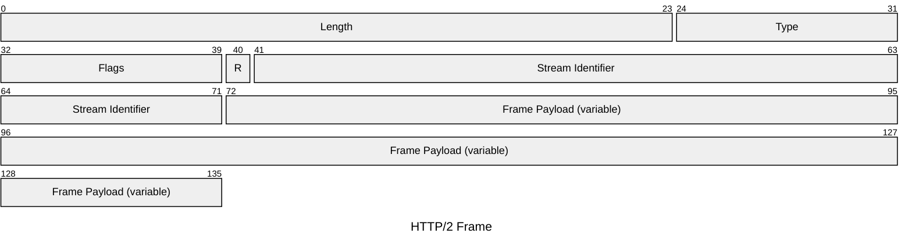

# HTTP & HTTPS

The Hypertext Transfer Protocol is the foundation of data exchange on the web.
HTTP/1.1 is a text-based request-response protocol over TCP. HTTP/2 introduces
binary framing and multiplexing over the same TCP connection. HTTP/3 replaces TCP
with QUIC (UDP-based) to eliminate head-of-line blocking. HTTPS is HTTP over a
TLS-encrypted connection.

## Quick Reference

| Property | Value |
| --- | --- |
| **OSI Layer** | Layer 7 — Application |
| **TCP/IP Layer** | Application |
| **RFC** | RFC 9110 (semantics), RFC 9112 (HTTP/1.1), RFC 9113 (HTTP/2), RFC 9114 (HTTP/3) |
| **Wireshark Filter** | `http` (plain), `tls` (HTTPS) |
| **TCP Port** | `80` (HTTP), `443` (HTTPS / HTTP/2 / HTTP/3) |
| **UDP Port** | `443` (HTTP/3 over QUIC) |

---

## HTTP/1.1 — Request Format

HTTP/1.1 messages are plain text, one request per TCP connection (or persistent with
`Connection: keep-alive`).

```text
METHOD /path HTTP/1.1\r\n
Host: example.com\r\n
Header-Name: value\r\n
\r\n
[optional body]
```

**Example GET request:**

```text

GET /api/status HTTP/1.1
Host: example.com
Accept: application/json
Connection: keep-alive
```

**Example POST request:**

```text

POST /api/data HTTP/1.1
Host: example.com
Content-Type: application/json
Content-Length: 27

{"key": "value", "n": 42}
```

### Request Line Fields

| Field | Description |
| --- | --- |
| **Method** | Action to perform. See common methods below. |
| **Request-URI** | Path and optional query string (e.g. `/search?q=ospf`). |
| **HTTP-Version** | Protocol version (`HTTP/1.1`). |

### Common Methods

| Method | Description |
| --- | --- |
| `GET` | Retrieve a resource. No body. Idempotent. |
| `POST` | Submit data to a resource. Creates or triggers an action. |
| `PUT` | Replace a resource entirely. Idempotent. |
| `PATCH` | Partially update a resource. |
| `DELETE` | Delete a resource. Idempotent. |
| `HEAD` | Like GET but returns headers only — no body. |
| `OPTIONS` | Describe the communication options for the target resource (used by CORS). |

---

## HTTP/1.1 — Response Format

```text

HTTP/1.1 STATUS_CODE Reason Phrase\r\n
Header-Name: value\r\n
\r\n
[optional body]
```

**Example response:**

```text

HTTP/1.1 200 OK
Content-Type: application/json
Content-Length: 42
Cache-Control: no-store

{"status": "ok", "uptime": 12345678}
```

### Common Status Codes

| Code | Class | Meaning |
| --- | --- | --- |
| `200` | Success | OK — request succeeded. |
| `201` | Success | Created — resource created (POST/PUT). |
| `204` | Success | No Content — success with no response body. |
| `301` | Redirect | Moved Permanently — use the new URI. |
| `302` | Redirect | Found — temporary redirect. |
| `304` | Redirect | Not Modified — cached response is still valid. |
| `400` | Client error | Bad Request — malformed syntax. |
| `401` | Client error | Unauthorized — authentication required. |
| `403` | Client error | Forbidden — authenticated but not authorised. |
| `404` | Client error | Not Found. |
| `429` | Client error | Too Many Requests — rate limited. |
| `500` | Server error | Internal Server Error. |
| `502` | Server error | Bad Gateway — upstream error. |
| `503` | Server error | Service Unavailable — overloaded or down. |

---

## HTTP/2 — Binary Frame

HTTP/2 replaces the text format with a binary framing layer. Multiple streams are
multiplexed over a single TCP connection, each identified by a stream ID.



| Field | Bits | Description |
| --- | --- | --- |
| **Length** | 24 | Length of the frame payload in bytes. Maximum negotiated via `SETTINGS_MAX_FRAME_SIZE` (default 16,384). |
| **Type** | 8 | Frame type. `0x0` DATA, `0x1` HEADERS, `0x2` PRIORITY, `0x3` RST_STREAM, `0x4` SETTINGS, `0x6` PING, `0x7` GOAWAY, `0x8` WINDOW_UPDATE. |
| **Flags** | 8 | Type-specific. Common: `0x1` END_STREAM, `0x4` END_HEADERS, `0x8` PADDED, `0x20` PRIORITY. |
| **R** | 1 | Reserved. Must be `0`. |
| **Stream Identifier** | 31 | Stream ID. `0` = connection-level control frames. Client-initiated streams use odd IDs; server-initiated use even. |
| **Frame Payload** | Variable | Frame-type specific content. |

---

## HTTP/3 — QUIC

HTTP/3 (RFC 9114) runs over QUIC (RFC 9000) on UDP port 443. Key differences from
HTTP/2:

| Feature | HTTP/2 (TCP) | HTTP/3 (QUIC/UDP) |
| --- | --- | --- |
| Transport | TCP | QUIC over UDP |
| Head-of-line blocking | Yes (TCP level) | No (per-stream) |
| Connection setup | TCP + TLS (2–3 RTT) | 0-RTT or 1-RTT |
| Stream multiplexing | Yes | Yes (improved) |
| Connection migration | No | Yes (connection ID survives IP change) |

---

## HTTPS and TLS

HTTPS is HTTP carried over a TLS session. TLS handles:

- **Confidentiality** — AES-256-GCM, ChaCha20-Poly1305
- **Integrity** — AEAD cipher includes authentication
- **Authentication** — X.509 certificate verifies server identity

TLS 1.3 (RFC 8446) completes the handshake in 1-RTT (or 0-RTT for resumption),
down from TLS 1.2's 2-RTT. The `ALPN` extension in the TLS ClientHello negotiates
the application protocol (`h2` for HTTP/2, `h3` for HTTP/3).

## Notes

- **HTTP/1.1 pipelining** (sending multiple requests without waiting for responses)
  was theoretically supported but poorly implemented; HTTP/2 multiplexing is the
  correct solution.

- **HSTS** (HTTP Strict Transport Security, RFC 6797) instructs browsers to always
  use HTTPS for a domain, preventing downgrade attacks.

- **CORS** (Cross-Origin Resource Sharing) uses the `Origin`,
`Access-Control-Allow-Origin`,

`Access-Control-Allow-Origin`,

  and preflight `OPTIONS` requests to control cross-origin access from browsers.
