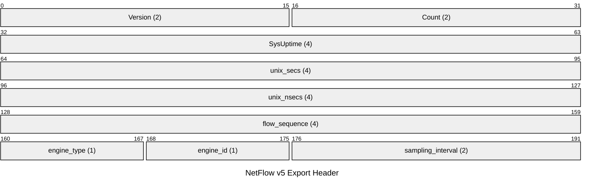
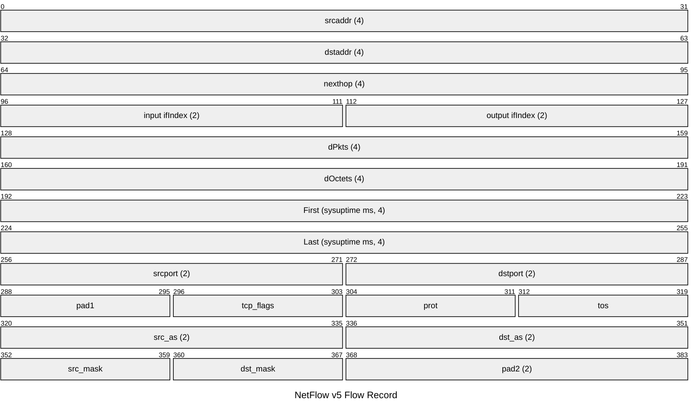

# NetFlow and IPFIX — Flow Export Protocols

NetFlow (Cisco proprietary) exports IP flow records from a router or switch to a
collector for traffic analysis, capacity planning, security monitoring, and billing.
IPFIX (IP Flow Information Export, RFC 7011) is the IETF standardisation of NetFlow
v9. A flow is defined by a 5-tuple: source IP, destination IP, source port,
destination port, IP protocol. NetFlow v9 and IPFIX use templates to define record
formats dynamically; NetFlow v5 uses a fixed 48-byte record format.

## Quick Reference

| Property | Value |
| --- | --- |
| **OSI Layer** | Layer 7 — Application |
| **RFC** | RFC 3954 (NetFlow v9), RFC 7011 (IPFIX) |
| **Wireshark Filter** | `cflow` |
| **Transport** | UDP (collector port configurable; typically `2055`) |

---

## NetFlow v5

NetFlow v5 exports fixed-format 48-byte flow records. Each UDP datagram carries a
24-byte header followed by up to 30 flow records.

### v5 Export Header (24 bytes)



| Field | Size | Description |
| --- | --- | --- |
| **Version** | 2 bytes | `5` for NetFlow v5. |
| **Count** | 2 bytes | Number of flow records in this packet. |
| **SysUptime** | 4 bytes | Milliseconds since the exporter last booted. |
| **unix_secs** | 4 bytes | Current UTC time in seconds since epoch. |
| **unix_nsecs** | 4 bytes | Residual nanoseconds. |
| **flow_sequence** | 4 bytes | Sequence number of the first record. Gaps indicate dropped records. |
| **engine_type** | 1 byte | Type of flow-switching engine. |
| **engine_id** | 1 byte | Slot number of the flow-switching engine. |
| **sampling_interval** | 2 bytes | Bits 14–15: sampling mode. Bits 0–13: sampling interval value. |

### v5 Flow Record (48 bytes)



---

## NetFlow v9 / IPFIX Structure

NetFlow v9 and IPFIX use a template-based model. Collectors must receive and cache
templates before they can decode data records. All records are grouped into FlowSets
within a single UDP packet.

```text

UDP Packet
└── Packet Header
    ├── Template FlowSet (FlowSet ID = 0)
    │   └── Template Record (defines field types and lengths for a Template ID)
    ├── Options Template FlowSet (FlowSet ID = 1)
    │   └── Options Template Record (metadata about the exporting process)
    └── Data FlowSet (FlowSet ID ≥ 256, matches a Template ID)
        └── Flow Records (one or more, packed to FlowSet length)
```

---

## Common IPFIX Information Elements

| IE ID | Name | Description |
| --- | --- | --- |
| 1 | octetDeltaCount | Bytes in the flow. |
| 2 | packetDeltaCount | Packets in the flow. |
| 4 | protocolIdentifier | IP protocol number (6=TCP, 17=UDP, 1=ICMP, etc.). |
| 6 | tcpControlBits | TCP flags (SYN, ACK, FIN, RST, etc.). |
| 7 | sourceTransportPort | Source port. |
| 8 | sourceIPv4Address | Source IPv4 address. |
| 9 | sourceIPv4PrefixLength | Source prefix length. |
| 10 | ingressInterface | SNMP ifIndex of the ingress interface. |
| 11 | destinationTransportPort | Destination port. |
| 12 | destinationIPv4Address | Destination IPv4 address. |
| 13 | destinationIPv4PrefixLength | Destination prefix length. |
| 14 | egressInterface | SNMP ifIndex of the egress interface. |
| 17 | bgpSourceAsNumber | BGP source AS number. |
| 18 | bgpDestinationAsNumber | BGP destination AS number. |
| 61 | flowDirection | `0` = Ingress, `1` = Egress. |
| 152 | flowStartMilliseconds | Flow start timestamp (ms since epoch). |
| 153 | flowEndMilliseconds | Flow end timestamp (ms since epoch). |

---

## Cisco IOS-XE Flexible NetFlow Configuration

```ios

! Define which fields to match and collect
flow record NETFLOW-RECORD
 match ipv4 source address
 match ipv4 destination address
 match transport source-port
 match transport destination-port
 match ip protocol
 collect counter bytes
 collect counter packets
 collect timestamp sys-uptime first
 collect timestamp sys-uptime last
!
! Define the export destination
flow exporter NETFLOW-EXPORT
 destination 10.0.1.200
 source Loopback0
 transport udp 2055
 export-protocol netflow-v9
!
! Combine record and exporter into a monitor
flow monitor NETFLOW-MONITOR
 record NETFLOW-RECORD
 exporter NETFLOW-EXPORT
 cache timeout active 60
 cache timeout inactive 15
!
! Apply to interfaces
interface GigabitEthernet0/0
 ip flow monitor NETFLOW-MONITOR input
 ip flow monitor NETFLOW-MONITOR output
```

---

## Notes

- **Sampling**: on high-speed interfaces, exporting every packet is impractical.

  Sampled NetFlow exports 1-in-N packets (e.g. 1:1000). The collector must apply the
  sampling rate when estimating traffic volumes.

- **Active timeout** (default 30–60 s): long-running flows (e.g. TCP sessions) are

  exported periodically even if the flow has not ended.

- **Inactive timeout** (default 15 s): idle flows are exported when no packets have

  been seen for this duration.

- IPFIX is preferred over NetFlow v5 for new deployments: template-based, supports

  IPv6, variable-length fields, and is IETF-standardised.

- Common collectors: Elastic Stack (Logstash IPFIX/NetFlow plugin), ntopng, Kentik,

  SolarWinds NTA, Cisco Secure Network Analytics (formerly Stealthwatch).

- **sFlow** (RFC 3176) is a distinct sampling protocol used primarily on Arista,

  Juniper, and other non-Cisco switches. It samples raw packet headers at the data
  plane rather than exporting flow records, making it more suitable for visibility
  on high-speed interfaces without dedicated flow hardware.
