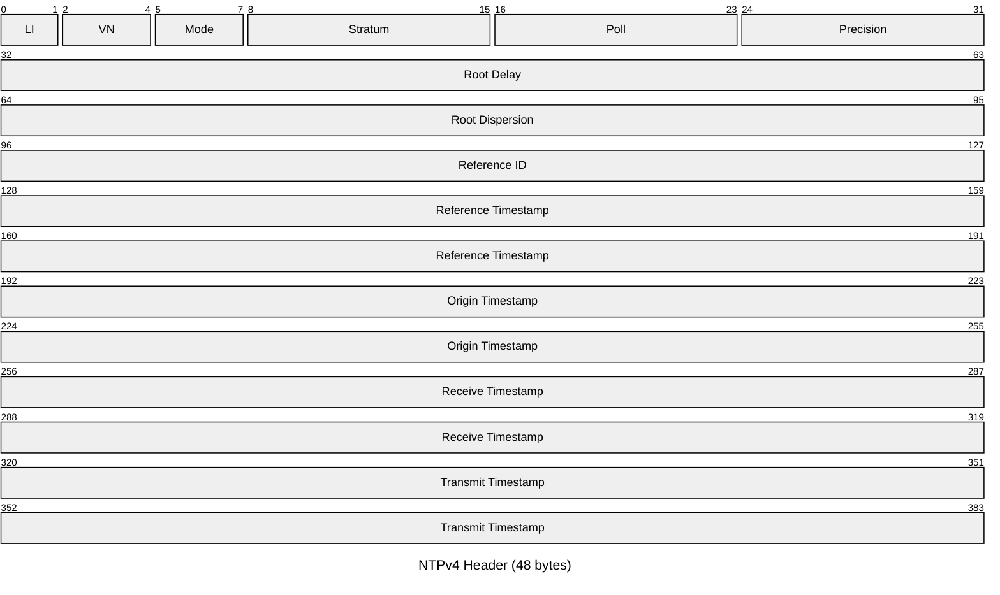

# NTP — Network Time Protocol

The Network Time Protocol (RFC 5905) synchronises clocks across a network using a
hierarchical client/server model. NTPv4 is the current standard. Clients poll one or
more servers and apply a clock-filtering and selection algorithm to estimate the time
offset and round-trip delay, then slew or step the local clock accordingly. NTP is
carried over UDP port 123.

## Quick Reference

| Property | Value |
| --- | --- |
| **OSI Layer** | Layer 7 — Application |
| **TCP/IP Layer** | Application |
| **Standard** | RFC 5905 (NTPv4), RFC 5906 (Autokey), RFC 8915 (NTS) |
| **Wireshark Filter** | `ntp` |
| **UDP Port** | `123` |
| **IPv4 Multicast** | `224.0.1.1` |
| **Packet size** | 48 bytes (header only); up to 68 bytes with MAC |

---

## Packet Header

All NTP messages use the same 48-byte header structure. Optional extension fields
and a MAC trailer may follow for authenticated NTP.



| Field | Bits | Description |
| --- | --- | --- |
| **LI** | 2 | Leap Indicator. `0` = no warning, `1` = last minute has 61 seconds, `2` = last minute has 59 seconds, `3` = clock unsynchronised. |
| **VN** | 3 | Version Number. `4` for NTPv4. |
| **Mode** | 3 | Association mode. See table below. |
| **Stratum** | 8 | Clock stratum. `0` = unspecified (Kiss-o'-Death), `1` = primary reference, `2`–`15` = secondary. `16` = unsynchronised. |
| **Poll** | 8 | Maximum interval between successive messages, as a signed power of 2 in seconds. Range: `4` (16s) to `17` (131072s). |
| **Precision** | 8 | Precision of the system clock, as a signed power of 2 in seconds. E.g. `-20` ≈ 1 µs. |
| **Root Delay** | 32 | Total round-trip delay to the reference clock, in NTP short format (16-bit seconds + 16-bit fraction). |
| **Root Dispersion** | 32 | Total dispersion to the reference clock, in NTP short format. |
| **Reference ID** | 32 | Identity of the reference source. For stratum 1: a 4-character ASCII string (`GPS\0`, `PPS\0`, `LOCL`, etc.). For stratum 2+: the IPv4 address of the upstream server (or first 32 bits of the MD5 hash of the IPv6 address). |
| **Reference Timestamp** | 64 | Time at which the local clock was last set or corrected, in NTP timestamp format. |
| **Origin Timestamp** | 64 | Time at which the request departed the client, in NTP timestamp format (t1). Set by the server from the client's Transmit Timestamp. |
| **Receive Timestamp** | 64 | Time at which the request arrived at the server (t2). |
| **Transmit Timestamp** | 64 | Time at which the reply departed the server (t3), or the client's send time when sent as a request. |

---

## Mode Values

| Value | Mode | Direction |
| --- | --- | --- |
| `0` | Reserved | — |
| `1` | Symmetric Active | Client → server (wants symmetric association) |
| `2` | Symmetric Passive | Server response to symmetric active |
| `3` | Client | Standard poll request |
| `4` | Server | Standard poll response |
| `5` | Broadcast | Server → all clients (one-way) |
| `6` | NTP Control Message | Management (RFC 1305 legacy) |
| `7` | Private / Reserved | Implementation-defined |

---

## NTP Timestamp Format

NTP uses a 64-bit fixed-point timestamp: 32 bits of seconds since **1 January 1900
00:00:00 UTC** and 32 bits of sub-second fraction.

```text

 0                   1                   2                   3
 0 1 2 3 4 5 6 7 8 9 0 1 2 3 4 5 6 7 8 9 0 1 2 3 4 5 6 7 8 9 0 1
+-+-+-+-+-+-+-+-+-+-+-+-+-+-+-+-+-+-+-+-+-+-+-+-+-+-+-+-+-+-+-+-+
|                          Seconds                              |
+-+-+-+-+-+-+-+-+-+-+-+-+-+-+-+-+-+-+-+-+-+-+-+-+-+-+-+-+-+-+-+-+
|                     Seconds Fraction                          |
+-+-+-+-+-+-+-+-+-+-+-+-+-+-+-+-+-+-+-+-+-+-+-+-+-+-+-+-+-+-+-+-+
```

Resolution is approximately 232 picoseconds. The 32-bit seconds field rolls over
roughly every 136 years (next rollover: 7 February 2036).

---

## Extension Fields (NTPv4)

Extension fields follow the 48-byte header and precede the optional MAC. Each field
is 32-bit aligned.

| Offset | Size | Field | Description |
| --- | --- | --- | --- |
| +0 | 16 bits | Field Type | Identifies the extension type (e.g. NTS Cookie = `0x0204`). |
| +2 | 16 bits | Length | Total length of this field in bytes, including the type and length fields. |
| +4 | variable | Value | Field-specific content, padded to a 4-byte boundary. |

---

## Authentication

### Legacy MD5 / SHA-1 (Symmetric Key — RFC 5905)

A 4-byte Key ID followed by a 16-byte MD5 or 20-byte SHA-1 digest is appended after
the 48-byte header (no extension fields). Widely supported but provides only integrity,
not confidentiality.

### NTS — Network Time Security (RFC 8915)

NTS uses TLS 1.3 for key exchange (NTS-KE over TCP port `4460`) and AEAD
(AES-128-SIV) for per-packet authentication via extension fields. NTS provides
authenticated and replay-protected NTP without a pre-shared key.

| NTS Extension Field | Type | Purpose |
| --- | --- | --- |
| Unique Identifier | `0x0104` | Per-packet nonce; prevents replay. |
| NTS Cookie | `0x0204` | Server-issued opaque cookie; carries session key material. |
| NTS Cookie Placeholder | `0x0304` | Reserves space for cookie renewal. |
| NTS Authenticator and EEF | `0x0404` | AEAD authentication tag and encrypted extension fields. |

---

## Stratum Hierarchy

| Stratum | Description |
| --- | --- |
| `0` | Reference clock (GPS, atomic, GNSS) — not reachable over the network |
| `1` | Primary time server — directly connected to stratum 0 |
| `2` | Synchronised to a stratum 1 server |
| `3`–`15` | Each hop adds one stratum |
| `16` | Unsynchronised / unreachable |

---

## Notes

- **Kiss-o'-Death (KoD):** A packet with Stratum `0` is a KoD packet. The Reference
  ID contains a 4-character ASCII code (e.g. `RATE`, `DENY`, `RSTR`) instructing the
  client to stop polling or reduce its rate.

- **Poll interval back-off:** NTP clients increase the poll interval exponentially
  (up to the server-configured maximum) when the clock is stable and the server is
  reliable. This reduces server load on large networks.

- **chrony** (`chronyd`) is the recommended NTP implementation on modern Linux
  (default on RHEL/Debian). It converges faster than `ntpd` after gaps and handles
  intermittent connectivity well.

- **NTPsec** is a hardened fork of the reference `ntpd` with NTS support and reduced
  attack surface.

- **Comparison with PTP**: see [NTP vs PTP](../theory/ntp_vs_ptp.md).
