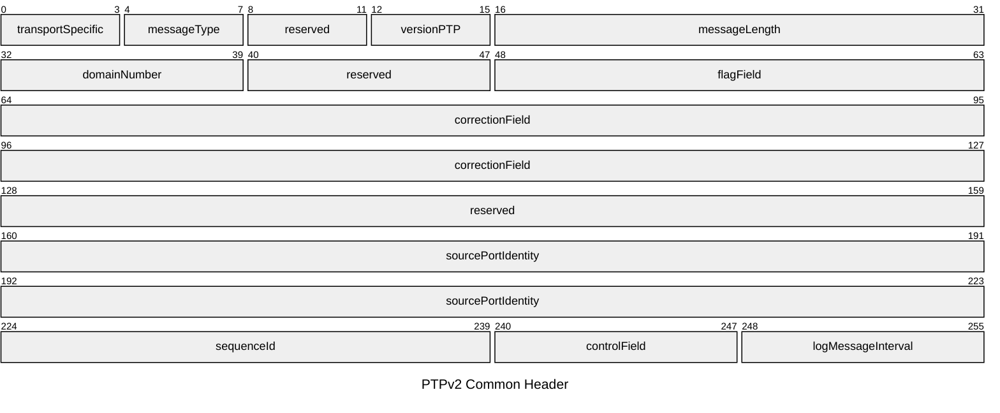
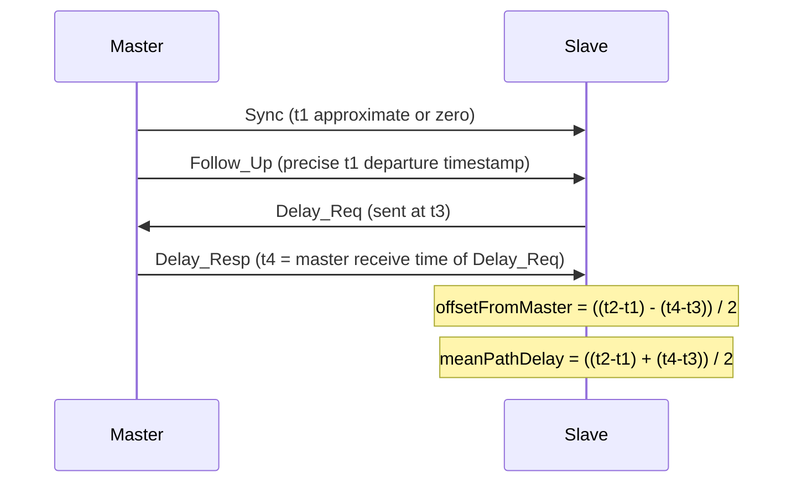

# PTP — Precision Time Protocol

The Precision Time Protocol (IEEE 1588) synchronises clocks across a network to
sub-microsecond accuracy. PTPv2 (IEEE 1588-2008) is the current standard; PTPv2.1
(IEEE 1588-2019) adds enhancements for profile management and security. PTP uses a
master/slave hierarchy: a Grandmaster Clock distributes time to Ordinary Clocks via
Boundary Clocks and Transparent Clocks. PTP messages are carried over UDP or directly
over Ethernet (Layer 2 multicast).

## Quick Reference

| Property | Value |
| --- | --- |
| **OSI Layer** | Layer 7 — Application (UDP transport) / Layer 2 (Ethernet transport) |
| **TCP/IP Layer** | Application |
| **Standard** | IEEE 1588-2008 (PTPv2), IEEE 1588-2019 (PTPv2.1) |
| **Wireshark Filter** | `ptp` |
| **UDP Port** | `319` (event messages), `320` (general messages) |
| **Ethernet EtherType** | `0x88F7` (PTP over Ethernet Layer 2) |
| **IPv4 Multicast** | `224.0.1.129` (primary), `224.0.0.107` (peer-delay) |
| **IPv6 Multicast** | `FF0E::181` (primary), `FF02::6B` (peer-delay) |

---

## Common Header

All PTP messages share a 34-byte common header.

| Field | Bits | Description |
| --- | --- | --- |
| **transportSpecific** | 4 | Profile-specific. `0` for IEEE 1588 default profile. |
| **messageType** | 4 | Message type. See table below. |
| **reserved** | 4 | Must be `0`. |
| **versionPTP** | 4 | PTP version. `2` for PTPv2. |
| **messageLength** | 16 | Total length of the PTP message in bytes including the header. |
| **domainNumber** | 8 | PTP domain. Clocks only synchronise within the same domain. Default: `0`. |
| **reserved** | 8 | Must be `0`. |
| **flagField** | 16 | Bit flags: `twoStepFlag`, `unicastFlag`, `profileSpecific1`, `profileSpecific2`, `leap61`, `leap59`, `currentUtcOffsetValid`, `ptpTimescale`, `timeTraceable`, `frequencyTraceable`. |
| **correctionField** | 64 | Correction in nanoseconds × 2¹⁶. Used by Transparent Clocks to accumulate residence and link delay. |
| **reserved** | 32 | Must be `0`. |
| **sourcePortIdentity** | 80 | Unique identity of the sending port: 64-bit `clockIdentity` (EUI-64) + 16-bit `portNumber`. |
| **sequenceId** | 16 | Incremented for each new message of a given type from a port. Used to match requests with responses. |
| **controlField** | 8 | Legacy field from PTPv1. `0` Sync, `1` Delay_Req, `2` Follow_Up, `3` Delay_Resp, `4` Management, `5` all others. |
| **logMessageInterval** | 8 | Log base-2 of the mean message interval in seconds. `0x7F` = message sent once (not periodic). |

---

## Message Types

| Type | Value | Port | Description |
| --- | --- | --- | --- |
| Sync | `0x0` | `319` | Sent by master. Carries timestamp (one-step) or triggers Follow_Up (two-step). |
| Delay_Req | `0x1` | `319` | Sent by slave to master to measure path delay (E2E mechanism). |
| Pdelay_Req | `0x2` | `319` | Peer delay request (P2P mechanism). |
| Pdelay_Resp | `0x3` | `319` | Response to Pdelay_Req. |
| Follow_Up | `0x8` | `320` | Two-step only. Carries precise `t1` timestamp of the Sync departure. |
| Delay_Resp | `0x9` | `320` | Master's response to Delay_Req carrying `t4` timestamp. |
| Pdelay_Resp_Follow_Up | `0xA` | `320` | Two-step peer delay response follow-up. |
| Announce | `0xB` | `320` | Advertises clock quality for BMCA elections. Sent only by masters. |
| Signaling | `0xC` | `320` | Negotiates unicast message rates and other per-session parameters. |
| Management | `0xD` | `320` | Configuration and monitoring. |

---

## Sync / Follow_Up — Two-Step Exchange

In a **one-step** clock the Sync message carries the precise departure timestamp
directly (hardware-assisted). No Follow_Up is sent. The `twoStepFlag` in the
flagField distinguishes the two modes.

---

## Clock Types

| Clock Type | Description |
| --- | --- |
| **Grandmaster Clock** | Top of the PTP hierarchy. Provides the reference time for the domain. Selected by BMCA. |
| **Ordinary Clock** | Has a single PTP port. Acts as either a master (Grandmaster) or a slave. |
| **Boundary Clock** | Multiple PTP ports. Terminates PTP on the slave side and acts as master to downstream clocks. Corrects for internal processing delay. |
| **Transparent Clock** | Forwards PTP messages without terminating them. Updates the `correctionField` to account for residence time (End-to-End TC) or residence time + link delay (Peer-to-Peer TC). Does not participate in BMCA. |

---

## Best Master Clock Algorithm (BMCA)

The BMCA runs on every PTP port when Announce messages are received and selects the
best master automatically. Clocks are compared in the following priority order:

| Priority | Field | Notes |
| --- | --- | --- |
| 1 | **priority1** | Manually configured (0–255). Lower wins. Default: `128`. |
| 2 | **clockClass** | Indicates traceability. `6` = GPS-locked, `7` = holdover. Lower wins. |
| 3 | **clockAccuracy** | Enumeration of accuracy range (e.g. `0x20` = < 25 ns). Lower wins. |
| 4 | **offsetScaledLogVariance** | Allan deviation — clock stability. Lower wins. |
| 5 | **priority2** | Secondary manual tie-breaker (0–255). Lower wins. |
| 6 | **clockIdentity** | EUI-64 of the clock. Lower wins. Fully deterministic tiebreaker. |

---

## Delay Mechanisms

| Mechanism | Description |
| --- | --- |
| **End-to-End (E2E)** | Slave sends Delay_Req to master; master replies with Delay_Resp. Measures the full path delay between slave and master. Default mode. |
| **Peer-to-Peer (P2P)** | Each port measures delay to its immediate neighbour using Pdelay_Req / Pdelay_Resp / Pdelay_Resp_Follow_Up. Transparent Clocks can include link delays in the correctionField. More accurate on multi-hop paths. |

E2E and P2P must not be mixed on the same network segment.

---

## Notes

- **Hardware timestamping** is essential for sub-microsecond accuracy. Software
  timestamping introduces jitter from OS scheduling and is suitable only for
  microsecond-class requirements.

- **PTP profiles** define a consistent set of options for specific industries.
  Common profiles: IEEE 1588 Default, ITU-T G.8275.1 (telecom full on-path
  support), ITU-T G.8275.2 (telecom partial on-path support), AES67 (audio), SMPTE
  ST 2059-2 (broadcast video).

- **linuxptp** (`ptp4l` / `phc2sys`) is the standard open-source PTPv2
  implementation on Linux.

- **Comparison with NTP**: see [NTP vs PTP](../theory/ntp_vs_ptp.md).
