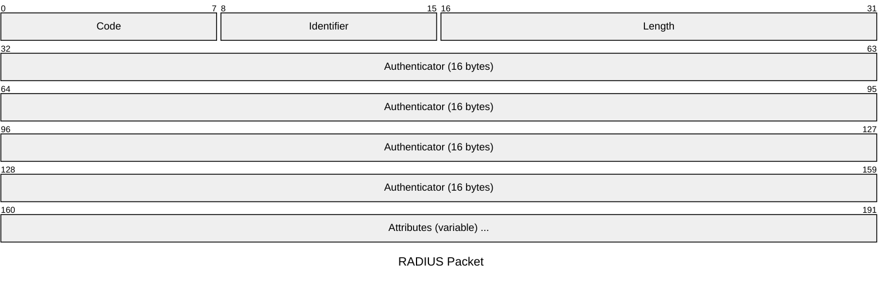
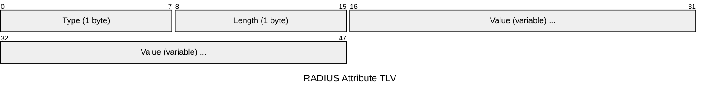
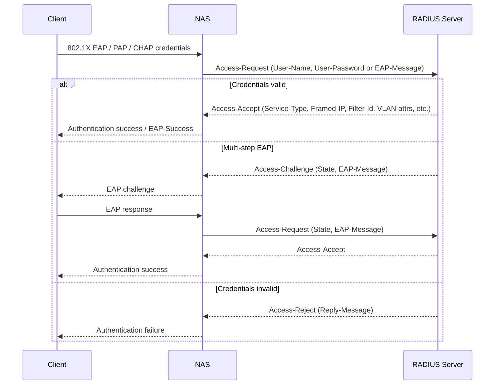
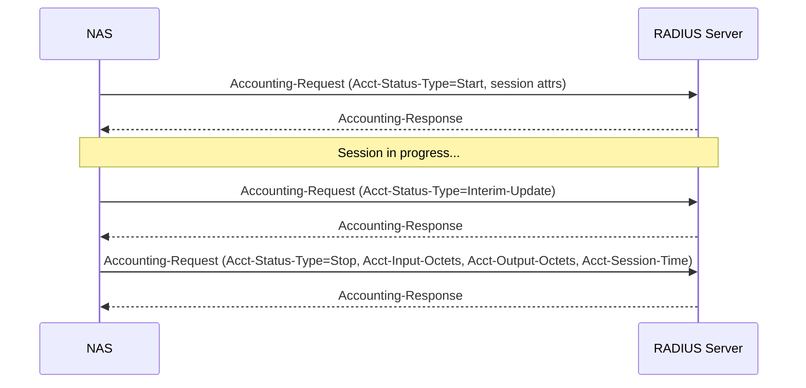

# RADIUS — Remote Authentication Dial-In User Service

RADIUS (RFC 2865) provides centralised Authentication, Authorisation, and Accounting
(AAA) for network access. It uses a client/server model: network devices (NAS —
Network Access Server) send access requests to a RADIUS server, which validates
credentials and returns a policy decision. RADIUS carries user attributes in a
Type-Length-Value (TLV) format. Authentication and authorisation are combined in a
single exchange; accounting is handled separately (RFC 2866).

## Quick Reference

| Property | Value |
| --- | --- |
| **OSI Layer** | Layer 7 — Application |
| **RFC** | RFC 2865 (Authentication/Authorisation), RFC 2866 (Accounting), RFC 5176 (CoA) |
| **Wireshark Filter** | `radius` |
| **UDP Ports** | `1812` (auth/authz, legacy `1645`), `1813` (accounting, legacy `1646`), `3799` (CoA) |

---

## Packet Format

| Field | Size | Description |
| --- | --- | --- |
| **Code** | 1 byte | Message type — see table below. |
| **Identifier** | 1 byte | Matches requests to responses (0–255). Reused only after a response is received. |
| **Length** | 2 bytes | Total packet length including header and all attributes. |
| **Authenticator** | 16 bytes | In Access-Request: random value. In responses: MD5(Code + ID + Length + RequestAuth + Attributes + SharedSecret). Used for integrity verification. |
| **Attributes** | Variable | TLV-encoded list of user and policy attributes. |

---

## Code Values

| Code | Name | Direction |
| --- | --- | --- |
| 1 | Access-Request | NAS → Server |
| 2 | Access-Accept | Server → NAS |
| 3 | Access-Reject | Server → NAS |
| 4 | Accounting-Request | NAS → Server |
| 5 | Accounting-Response | Server → NAS |
| 11 | Access-Challenge | Server → NAS |
| 12 | Status-Server | NAS → Server |
| 13 | Status-Client | Server → NAS |
| 40 | Disconnect-Request (CoA) | Server → NAS |
| 41 | Disconnect-ACK (CoA) | NAS → Server |
| 42 | Disconnect-NAK (CoA) | NAS → Server |
| 43 | CoA-Request | Server → NAS |
| 44 | CoA-ACK | NAS → Server |
| 45 | CoA-NAK | NAS → Server |

---

## Attribute Format (TLV)

Length includes the Type and Length bytes themselves (minimum value: 2).

---

## Common Attributes

| Type | Attribute | Direction | Description |
| --- | --- | --- | --- |
| 1 | User-Name | Request | Username or identity being authenticated. |
| 2 | User-Password | Request | Password obfuscated with MD5 XOR and the shared secret. |
| 4 | NAS-IP-Address | Request | IP address of the NAS sending the request. |
| 5 | NAS-Port | Request | Physical port number on the NAS. |
| 6 | Service-Type | Accept | Type of service: Framed, Login, Administrative, etc. |
| 7 | Framed-Protocol | Accept | PPP, SLIP, etc. |
| 8 | Framed-IP-Address | Accept | IP address to assign to the user session. |
| 11 | Filter-Id | Accept | ACL name to apply to the session. |
| 18 | Reply-Message | Accept/Reject | Human-readable message to display to the user. |
| 24 | State | Challenge | Opaque value carried between Access-Challenge and the subsequent Access-Request. |
| 25 | Class | Accept | Opaque value echoed back by the NAS in Accounting-Request. |
| 26 | Vendor-Specific (VSA) | Any | Vendor-specific extensions. Format: Vendor-ID (4 bytes) + sub-attributes. |
| 27 | Session-Timeout | Accept | Maximum session duration in seconds. |
| 31 | Calling-Station-Id | Request | MAC address or phone number of the client. |
| 32 | NAS-Identifier | Request | NAS device identifier string. |
| 64 | Tunnel-Type | Accept | Tunnel type: VLAN (13), L2TP, etc. |
| 65 | Tunnel-Medium-Type | Accept | Medium: 802 (6) for 802.1X VLAN assignment. |
| 81 | Tunnel-Private-Group-Id | Accept | VLAN ID for 802.1X dynamic VLAN assignment. |

---

## Authentication Exchange

---

## Accounting Flow

---

## Change of Authorisation (CoA — RFC 5176)

CoA allows the RADIUS server to push policy changes to the NAS mid-session without
waiting for re-authentication. The NAS listens on UDP port 3799.

| CoA Message | Description |
| --- | --- |
| Disconnect-Request | Terminates a session immediately. |
| CoA-Request | Modifies session attributes (VLAN reassignment, ACL change, etc.). |

---

## Notes

- Password obfuscation uses MD5 XOR — not proper encryption. RADIUS traffic should

  be protected by IPsec or confined to a dedicated out-of-band management network.

- RADIUS+TLS (RadSec, RFC 6614) wraps RADIUS in TLS over TCP port 2083 for encrypted

  transport and mutual authentication.

- VSAs (Type 26) carry vendor-specific attributes. Cisco uses Vendor-ID 9
(`cisco-av-pair`

(`cisco-av-pair`

  for privilege level, ACL assignment, etc.); Fortinet uses Vendor-ID 12356.

- 802.1X network access uses RADIUS with EAP tunnelled inside the RADIUS exchange

  (EAP-TLS, PEAP, EAP-TTLS). The NAS acts as the EAP authenticator; the RADIUS
  server is the EAP authentication server.

- Cisco IOS-XE basic RADIUS config: `aaa new-model` then

  `aaa authentication login default group radius local`.
