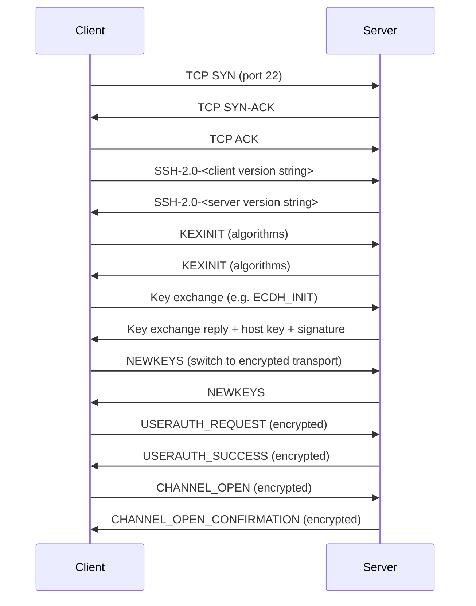
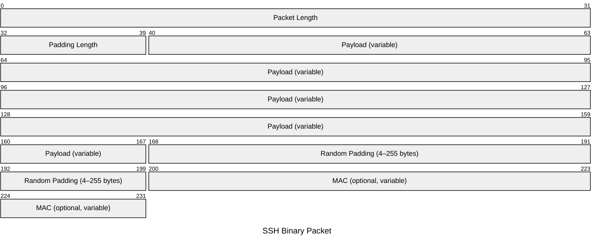

# SSH

The Secure Shell protocol provides encrypted remote access, command execution, and
tunnelling over an insecure network. SSH is a layered protocol: a transport layer
handles encryption and host authentication; an authentication layer verifies the
user; a connection layer multiplexes logical channels over a single TCP connection.

## Quick Reference

| Property | Value |
| --- | --- |
| **OSI Layer** | Layer 7 — Application |
| **TCP/IP Layer** | Application |
| **RFC** | RFC 4251 (architecture), RFC 4252 (auth), RFC 4253 (transport), RFC 4254 (connection) |
| **Wireshark Filter** | `ssh` |
| **TCP Port** | `22` |

## Connection Sequence

## Binary Packet Protocol (RFC 4253)

All SSH data after the version string exchange is sent as binary packets:

## Binary Packet Fields

| Field | Size | Description |
| --- | --- | --- |
| **Packet Length** | 32 bits | Length of the packet in bytes, not including the MAC or the length field itself. |
| **Padding Length** | 8 bits | Length of the random padding in bytes. Minimum 4; ensures total packet length is a multiple of the cipher block size. |
| **Payload** | Variable | The SSH message. Compressed if compression is negotiated. |
| **Random Padding** | 4–255 bytes | Random bytes appended to align the packet and obscure payload length. |
| **MAC** | Variable | Message Authentication Code computed over the sequence number and the unencrypted packet. Size depends on negotiated MAC algorithm. |

## SSH Message Types

The first byte of each payload identifies the message type:

| Type | Name | Description |
| --- | --- | --- |
| `1` | DISCONNECT | Gracefully terminate the connection. Includes reason code and description. |
| `2` | IGNORE | No-op, used to prevent traffic analysis. |
| `20` | KEXINIT | Lists supported algorithms for key exchange, encryption, MAC, and compression. |
| `21` | NEWKEYS | Signals that the sender is switching to the newly negotiated keys. |
| `50` | USERAUTH_REQUEST | User authentication attempt (password, publickey, keyboard-interactive). |
| `51` | USERAUTH_FAILURE | Authentication failed. Lists remaining methods. |
| `52` | USERAUTH_SUCCESS | Authentication succeeded. |
| `90` | CHANNEL_OPEN | Request to open a logical channel (session, forwarded-tcpip, etc.). |
| `91` | CHANNEL_OPEN_CONFIRMATION | Channel accepted. |
| `92` | CHANNEL_OPEN_FAILURE | Channel rejected. |
| `94` | CHANNEL_DATA | Data on a channel (terminal I/O, forwarded traffic). |
| `96` | CHANNEL_EOF | No more data will be sent on this channel. |
| `97` | CHANNEL_CLOSE | Channel closed. |
| `98` | CHANNEL_REQUEST | Channel-specific requests (shell, exec, pty-req, env). |

## Notes

- **Host key verification** is the SSH equivalent of certificate validation. On first

  connection the client stores the server's public key fingerprint (TOFU — Trust On
  First Use). Subsequent connections fail if the key changes, preventing MITM attacks.

- **Public key authentication** is preferred over passwords. The server holds the

  user's public key; the client proves possession of the private key by signing a
  challenge. The private key never leaves the client.

- **Agent forwarding** (`-A`) allows a remote session to use the client's local SSH

  agent for onward authentication — useful for jump hosts but increases attack surface.

- **Port forwarding** (local `-L`, remote `-R`, dynamic `-D`) creates encrypted

  tunnels through the SSH connection. Dynamic forwarding creates a SOCKS proxy.

- **OpenSSH** is the de-facto implementation. Key exchange algorithms in modern use:

  `curve25519-sha256`, `ecdh-sha2-nistp256`. Cipher: `chacha20-poly1305`,
  `aes256-gcm`. MAC: `hmac-sha2-256` or implicit with AEAD ciphers.
