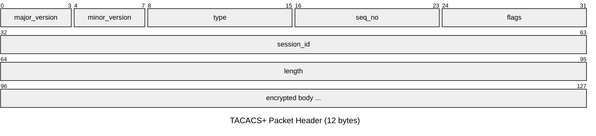
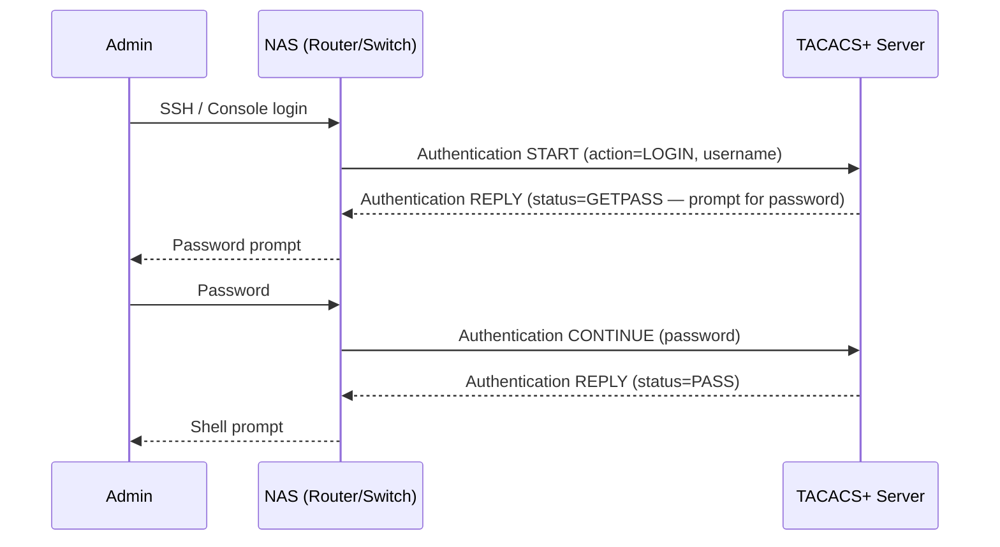
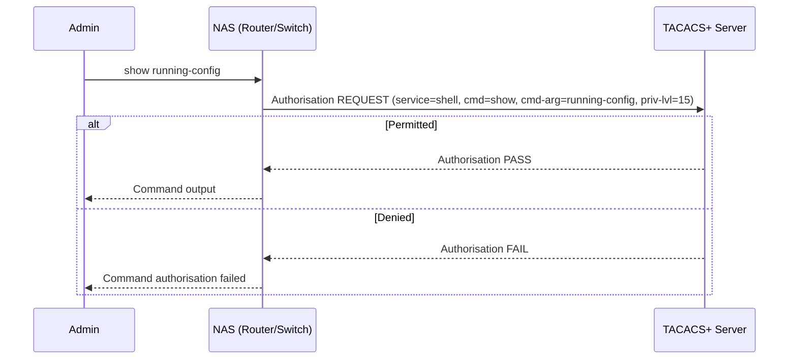

# TACACS+ — Terminal Access Controller Access-Control System Plus

TACACS+ (described in draft-grant-tacacs, de facto standard) provides centralised AAA
for network device management. Unlike RADIUS, TACACS+ uses TCP (port 49), separates
authentication, authorisation, and accounting into distinct exchanges, and encrypts the
entire payload rather than just the password. It is the preferred AAA protocol for
managing network device CLI access in Cisco environments.

## Quick Reference

| Property | Value |
| --- | --- |
| **OSI Layer** | Layer 7 — Application |
| **Reference** | draft-grant-tacacs (informational); Cisco proprietary |
| **Wireshark Filter** | `tacacs` |
| **TCP Port** | `49` |

---

## Packet Header



| Field | Size | Description |
| --- | --- | --- |
| **major_version** | 4 bits | `0xC` (12) for TACACS+. |
| **minor_version** | 4 bits | `0x0` default; `0x1` for some extensions. |
| **type** | 1 byte | `0x01` = Authentication, `0x02` = Authorisation, `0x03` = Accounting. |
| **seq_no** | 1 byte | Sequence number within the session. Starts at 1; client uses odd numbers, server uses even. Prevents replay within a session. |
| **flags** | 1 byte | `0x04` = Unencrypted (cleartext body); `0x01` = Single Connection (multiplex sessions on one TCP connection). |
| **session_id** | 4 bytes | Random 32-bit value identifying the AAA session. |
| **length** | 4 bytes | Length of the body (not including the 12-byte header). |
| **body** | Variable | XOR-encrypted with an MD5-based pad: MD5(session_id + key + version + seq_no). |

---

## TACACS+ vs RADIUS

| Property | TACACS+ | RADIUS |
| --- | --- | --- |
| **Transport** | TCP 49 | UDP 1812 / 1813 |
| **Encryption** | Entire body | Password field only |
| **AAA separation** | Authentication, Authorisation, Accounting are separate exchanges | Authentication and Authorisation combined |
| **Protocol ownership** | Cisco proprietary | IETF standard (RFC 2865) |
| **Primary use** | Device management (CLI) | Network access (802.1X, VPN, dial) |
| **Command authorisation** | Per-command (`cmd` attribute) | Not natively supported |
| **Vendor-specific attributes** | Less needed (full separation) | VSA Type 26 |

---

## Authentication Flow (Login)



---

## Authorisation Flow (Per-Command)



---

## Accounting

Accounting records (Start, Stop, Watchdog/Interim-Update) are sent for each exec
session and, optionally, for each command. The accounting body carries attributes
including `task_id`, `start_time`, `stop_time`, `elapsed_time`, and `cmd`.

---

## Cisco IOS-XE Configuration

```ios
aaa new-model
aaa authentication login default group tacacs+ local
aaa authorization exec default group tacacs+ local
aaa authorization commands 15 default group tacacs+ local if-authenticated
aaa accounting exec default start-stop group tacacs+
aaa accounting commands 15 default start-stop group tacacs+
!
tacacs server TACACS-PRIMARY
 address ipv4 10.0.1.100
 key 7 <encrypted-key>
 timeout 5
!
ip tacacs source-interface Loopback0
```

---

## Notes

- TACACS+ encrypts the entire body using an MD5-based XOR pad. This is not strong by
  modern cryptographic standards. Run TACACS+ only on a dedicated management network
  or over IPsec.
- Per-command authorisation (`aaa authorization commands 15`) provides granular
  control: operators can be restricted to `show` commands while admins receive
  unrestricted access.
- Always configure a local fallback (`... group tacacs+ local`). If the TACACS+
  server is unreachable, the local username/password database prevents a complete
  lockout.
- Cisco ISE and Cisco Secure ACS are common TACACS+ server implementations.
  Open-source alternatives: `tac_plus` (Shrubbery Networks), `tac_plus-ng`.
- The `single-connection` flag (`0x01`) allows multiple AAA sessions to be
  multiplexed on a single TCP connection, reducing connection setup overhead on
  busy devices.
