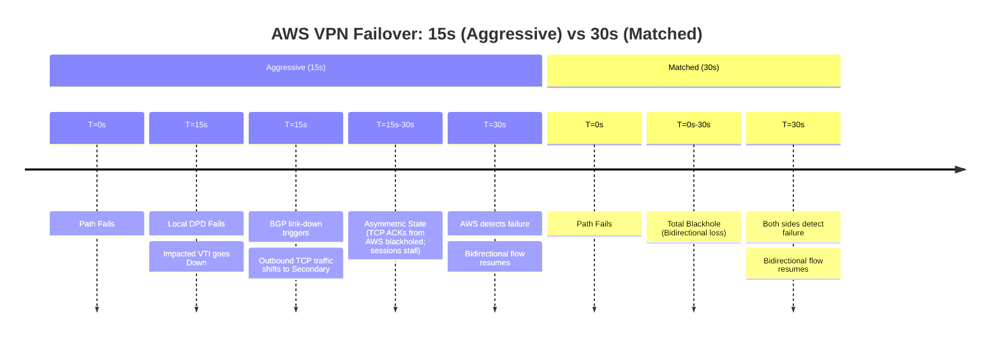

# BGP over VPN: FortiGate to AWS ECMP Optimization Guide

## 1. Overview & Principles

In a Dual-VTI environment with **ebgp-multipath** enabled, the FortiGate installs
multiple equal-cost paths into the routing table. This allows for per-flow load
balancing (ECMP) across both VPN tunnels.

### The "BGP > DPD" Safety Rule

To prevent routing instability, your **BGP Hold Timer** must be greater than your
**Total DPD Detection Time**. If BGP expires before DPD, the session will flap before
the interface is even marked down.

### Graceful Restart Timers

- **graceful-restart-time (120s):** How long to wait for the peer to re-establish

    the TCP session.

- **graceful-stalepath-time (120s):** How long to keep "stale" routes in the FIB

    while waiting for resync.

## 2. Detection Timelines

AWS has a fixed 30-second DPD/BGP detection floor. For synchronous TCP traffic,
this creates a specific recovery pattern.



## 3. Inbound Flow Integrity & Session State

Because the FortiGate is a stateful firewall, simply having a valid route is not
enough. The following security mechanisms must be tuned for ECMP:

### A. Reverse Path Forwarding (RPF) and Zones

The firewall checks if the inbound interface matches the routing table's path back
to the source.

- **The "Zone" Advantage:** By placing both VTIs in the same **Zone**, the FortiGate

    considers a packet "valid" regardless of which tunnel it arrives on, provided
    both are members of the same logical zone.

- **Loose RPF:** Even with Zones, `set src-check loose` is recommended in the VTI

    interface settings to ensure maximum compatibility with AWS hashing variations.

### B. TCP Asymmetry (The "Stateful" Trap)

If a TCP flow is asymmetric (Outbound on VTI-1, Inbound on VTI-2), the FortiGate
will drop return traffic as an invalid state unless they are in the same zone.

## 4. Configuration Snippets (FortiGate)

### A. Zone Configuration

```fortios

config system zone
    edit "ZONE_AWS_VPN"
        set interface "vpn-071eda31a-0" "vpn-071eda31a-1"
    next
end
```

### B. Defining Routing Objects (Prefix & AS-Path Lists)

```fortios

config router prefix-list
    edit "DEFAULT-ROUTE"
        config rule
            edit 1
                set prefix 0.0.0.0 0.0.0.0
            next
        end
    next
    edit "LOCAL-PREFIXES"
        config rule
            edit 1
                set prefix 10.201.0.0 255.255.224.0
                set le 32
            next
        end
    next
end

config router aspath-list
    edit "DC-AS-LIST"
        config rule
            edit 1
                set action deny
                set regexp "_651[0-9]{2}$"
            next
            edit 2
                set action permit
                set regexp ".*"
            next
        end
    next
end
```

### C. BGP: Multipath & Neighbor Configuration

```fortios

config router bgp
    set as 65100
    set router-id 10.201.0.1
    set ebgp-multipath enable
    set graceful-restart enable
    set graceful-restart-time 120
    set graceful-stalepath-time 120

    config network
        edit 1
            set prefix 10.201.0.0 255.255.224.0
        next
    end

    config neighbor
        edit "169.254.x.1" # Tunnel A
            set capability-graceful-restart enable
            set soft-reconfiguration enable
            set link-down-failover enable
            set timers-keepalive 10
            set timers-holdtime 30
            set route-map-in "INBOUND-AWS-PRI"
            set route-map-out "OUTBOUND-AWS-PRI"
        next
        edit "169.254.x.5" # Tunnel B
            set capability-graceful-restart enable
            set soft-reconfiguration enable
            set link-down-failover enable
            set timers-keepalive 10
            set timers-holdtime 30
            set route-map-in "INBOUND-AWS-SEC"
            set route-map-out "OUTBOUND-AWS-SEC"
        next
    end
end
```

## 5. Key Best Practices

### A. BGP Table vs. Routing Table (ECMP Logic)

It is normal for the BGP Table (`get router info bgp network`) to designate only
one path as "Best" (`*>`). BGP requires a single winner for protocol advertisement.
However, if attributes are tied and `ebgp-multipath` is enabled, the **Routing Table**
will install both paths as active forwarding entries.

### B. Link-Down Failover

The most aggressive failover mechanism available. It ensures that the moment Phase
1 DPD (15s) declares the tunnel dead, BGP is purged.

### C. Origin-Based Filtering (DC-AS-LIST)

The regex `_651[0-9]{2}$` ensures we block routes originating from the target range
(65100-65199).

## 6. Verification & Troubleshooting

| Command | Purpose |
| :--- | :--- |
| **`get router info routing-table database`** | **Primary Verification:** Confirm both VTI interfaces are installed for the same prefix. |
| `get router info bgp network` | Check BGP attributes; ensure tie-breakers (Router-ID/IP) are the only difference. |
| `get system session list` | View active sessions and verify Zone membership/hashing. |
| `diagnose sniffer packet any 'port 4500' 4` | Verify traffic is actively flowing through both tunnel interfaces. |
