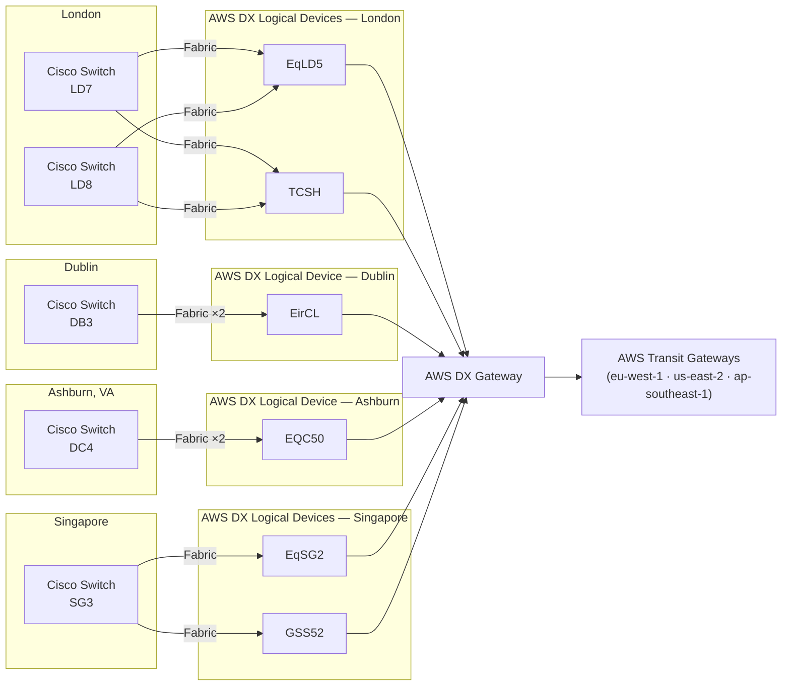
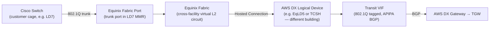

# Equinix Fabric + Hosted Direct Connect to AWS

Checkout.com connects to AWS Direct Connect through Equinix Fabric rather than a
traditional direct physical cross-connect. Cisco switches co-located in Equinix IBX
datacenters (LD7, LD8, DB3, DC4, SG3) originate virtual Layer 2 connections through
Equinix Fabric to **AWS Direct Connect Logical Devices** — the AWS-managed DX endpoints
registered in the Equinix Fabric service catalogue. The DX connections are
**Hosted Connections** — provisioned by Equinix as an AWS Direct Connect Partner —
rather than Dedicated Connections ordered directly from AWS. Each site has two Hosted
Connections for redundancy, giving 10 DX connections in total across the estate.

This document covers the full connection path from customer switch through Equinix Fabric
to the DX Logical Device and into AWS, including the cross-facility Fabric hops where the
DX Logical Device is in a different building from the customer switch. BGP tuning and the
IPsec overlay (FortiGate) are covered in [BGP Stack (Flagship)](bgp_stack_vpn_over_dx.md).

---

## At a Glance

| Attribute | Hosted (Equinix Fabric) | Dedicated (Direct AWS) |
| --- | --- | --- |
| **Provisioned by** | Equinix (DX Partner) | Customer directly |
| **Physical cross-connect** | Managed by Equinix — no LOA-CFA | Customer submits LOA-CFA to facility |
| **Speed options** | 50 Mbps – 10 Gbps | 1 / 10 / 100 Gbps |
| **VIFs per connection** | 1 (fixed) | Multiple |
| **Ordering path** | Equinix Fabric Portal → AWS Console (accept) | AWS Console → facility cross-connect |
| **Lead time** | Minutes to hours | 3–15 business days |
| **DX endpoint location** | AWS DX Logical Device (may be in different facility) | Customer router co-located with DX router |

---

## Architecture Overview



### Site Inventory

| IBX | City | AWS Region | Role |
| --- | --- | --- | --- |
| **LD7** | London, UK | eu-west-1 | EU primary |
| **LD8** | London, UK | eu-west-1 | EU secondary (separate building) |
| **DB3** | Dublin, Ireland | eu-west-1 | EU tertiary |
| **DC4** | Ashburn, Virginia | us-east-2 | US East |
| **SG3** | Singapore | ap-southeast-1 | APAC |

LD7, LD8, and DB3 all attach to eu-west-1, giving three independent DX entry points into
the same AWS region — two from separate London buildings and one from Dublin. DC4 and
SG3 serve their own regions independently and are not fallbacks for each other or for
the EU sites.

**Note on VIF types:** LD8, DB3, DC4, and SG3 use **Transit VIFs** (private traffic via
DX Gateway → TGW). LD7 uses **Public VIFs** (AWS public endpoints, public IP addressing)
— it serves a different traffic class and is not a fallback for LD8's Transit VIF paths.

---

## DX Logical Device Connection Map

Each customer switch has two Hosted Connections. The DX Logical Device is the AWS-managed
endpoint in the Equinix Fabric catalogue — in every case it is in a **different facility**
from the customer switch, with Equinix Fabric providing the cross-facility L2 transport.

A DX Logical Device is a **shared endpoint**: multiple Fabric connections can terminate at
the same physical device instance. The full identifier includes a unique suffix. Where two
connections share the same instance, a device failure takes both down simultaneously —
LD7 and LD8 secondaries both terminate at `TCSH-1gb2cmmjxgr6d`. Their primaries use
different EqLD5 instances and are independent.

| Customer Switch | Connection | AWS Circuit ID | DX Logical Device (full name) | Physical Site | Shared with |
| --- | --- | --- | --- | --- | --- |
| **LD7** | Primary | dxcon-ffw945v6 | `EqLD5-3tt2gow409qk1` | Equinix LD5 | — (independent instance) |
| **LD7** | Secondary | dxcon-ffkyk9mz | `TCSH-1gb2cmmjxgr6d` | Digital Realty LHR20 | LD8 secondary |
| **LD8** | Primary | dxcon-fg9y6jqj | `EqLD5-gec0af2s33wc` | Equinix LD5 | — (independent instance) |
| **LD8** | Secondary | dxcon-fh3aim3s | `TCSH-1gb2cmmjxgr6d` | Digital Realty LHR20 | LD7 secondary |
| **DB3** | Primary | dxcon-fh4z1zgb | `EirCL-e48lmuo3cmr5` | Clonshaugh | — |
| **DB3** | Secondary | dxcon-ffxlp7mp | `EirCL-3teqryfjkqcpp` | Clonshaugh | — |
| **DC4** | Primary | dxcon-ffxk0xbn | `EQC50-3bgok38eqk2gm` | Equinix CH2 | — |
| **DC4** | Secondary | dxcon-fgdj8y3p | `EQC50-2xe6k2yblgjun` | Equinix CH2 | — |
| **SG3** | Primary | dxcon-fgbvwb96 | `EqSG2-2wiqo6oyejazb` | Equinix SG2 | — |
| **SG3** | Secondary | dxcon-fh3hboxw | `GSS52-nnpntkfsyrmj` | Global Switch Singapore | — |

### Redundancy Levels by Site

| Site | Switch Diversity | DX Device Diversity | Paths surviving any single failure |
| --- | --- | --- | --- |
| **London** | Yes (LD7 + LD8) | Primary: independent instances; Secondary: shared TCSH | 3 of 4 (TCSH failure takes both secondaries; all other single failures take 1 path) |
| **Dublin** | No | Yes (two distinct EirCL instances) | 1 of 2 (either circuit failure) |
| **Ashburn** | No | Yes (two distinct EQC50 instances) | 1 of 2 (either circuit failure) |
| **Singapore** | No | Yes (EqSG2 ≠ GSS52) | 1 of 2 (either device failure) |

London has three independent failure axes: LD7 switch, LD8 switch, and the shared TCSH
instance. A TCSH failure takes both secondaries simultaneously (2 paths lost); any other
single failure takes only 1 path. Dublin, Ashburn, and Singapore all have distinct device
instances per connection — any single circuit or device failure leaves one path active;
only a switch failure drops both paths at those sites.

---

## How Equinix Fabric Carries the Cross-Facility Connection

The customer switch and the AWS DX Logical Device are never in the same building. Equinix
Fabric provides the L2 transport between them as a virtual circuit — the Cisco switch sees
only a trunk port; the Fabric hop to the DX facility is transparent.



For sites where the DX Logical Device is in a third-party facility (TCSH, EirCL, GSS52),
Equinix Fabric extends beyond its own buildings via its Network Edge and partner
interconnection agreements. The customer configuration is identical in all cases — the
cross-facility routing is fully abstracted by the Fabric platform.

---

## Provisioning a Hosted DX Connection

### Step 1 — Create the Fabric Connection (Equinix side)

1. Log in to **Equinix Fabric Portal** (fabric.equinix.com).
1. Navigate to **Create Connection → Cloud Providers → AWS Direct Connect**.
1. Select:
    - **Origin**: the Fabric port attached to the Cisco switch in the source IBX
    - **Destination location**: the AWS Direct Connect location for the target metro
      (e.g. London, Dublin, Ashburn, Singapore) — the specific DX Logical Device
      instance is assigned by the platform, not chosen by the customer
    - **Bandwidth**: size to match expected throughput (50 Mbps – 10 Gbps)
    - **Connection name**: use a descriptive name that includes the IBX
      (e.g. `aws-dx-ld7-primary`)
1. Submit — Equinix provisions the virtual circuit and notifies AWS. The assigned DX
   Logical Device (e.g. `TCSH-1gb2cmmjxgr6d`) is visible in the connection details
   once provisioning completes.

### Step 2 — Accept the Hosted Connection (AWS side)

1. In the AWS Console, navigate to **Direct Connect → Connections**.
1. A new connection in **"Ordering"** state will appear with owner set to Equinix.
1. Select it and click **Accept** — the connection transitions to **"Available"** once the
   Equinix circuit is fully provisioned (typically minutes to a few hours).

### Step 3 — Create the Virtual Interface

1. From the connection, select **Create Virtual Interface**.
1. Choose **Transit VIF** (recommended for multi-VPC access via TGW).
1. Provide:
    - **VIF name**: descriptive, include site and DX device (e.g. `transit-vif-ld7-eqld5`)
    - **VLAN**: the 802.1Q VLAN ID that will be tagged on the Cisco subinterface
    - **Customer ASN**: the BGP ASN of the Cisco switch at this site
    - **Amazon-side ASN**: 64512 (DX Gateway ASN; must differ from the TGW ASN)
    - **BGP auth key**: MD5 key for the BGP session
    - **IP addressing**: use APIPA (169.254.x.x/30) to avoid consuming routable space
1. Once created, note the **Amazon-side BGP peer IP** — this is the neighbor address for
   the Cisco switch.

### Step 4 — Associate the DX Gateway with a TGW

If not already done (shared across all DX connections):

1. Navigate to **Direct Connect → Direct Connect Gateways**.
1. Associate the DX Gateway with each TGW in the required AWS regions.
1. Specify the VPC CIDRs that each TGW should advertise back to on-premises.

---

## Cisco Switch Configuration

Each IBX switch has two trunk subinterfaces — one per Hosted Connection — each with its
own VIF VLAN and APIPA address.

### Interface Configuration

```ios
! Trunk port connecting to Equinix Fabric (single port carries both connections)
interface GigabitEthernet0/1
 description Equinix-Fabric-Port
 no ip address
 no shutdown
!
! Subinterface — connection to DX Logical Device A (e.g. EqLD5)
interface GigabitEthernet0/1.101
 description AWS-DX-EQLD5-PRIMARY
 encapsulation dot1Q 101
 ip vrf forwarding AWS
 ip address 169.254.101.2 255.255.255.252
 no shutdown
!
! Subinterface — connection to DX Logical Device B (e.g. TCSH)
interface GigabitEthernet0/1.102
 description AWS-DX-TCSH-SECONDARY
 encapsulation dot1Q 102
 ip vrf forwarding AWS
 ip address 169.254.102.2 255.255.255.252
 no shutdown
```

### BGP Configuration

```ios
router bgp 65001
 bgp router-id <loopback-ip>
 bgp log-neighbor-changes
 !
 address-family ipv4 vrf AWS
  ! Connection A — DX Logical Device A (e.g. EqLD5)
  neighbor 169.254.101.1 remote-as 64512
  neighbor 169.254.101.1 description AWS-DX-EQLD5
  neighbor 169.254.101.1 password <bgp-auth-key>
  neighbor 169.254.101.1 fall-over bfd
  neighbor 169.254.101.1 activate
  neighbor 169.254.101.1 soft-reconfiguration inbound
  neighbor 169.254.101.1 route-map RM-DX-A-IN in
  !
  ! Connection B — DX Logical Device B (e.g. TCSH)
  neighbor 169.254.102.1 remote-as 64512
  neighbor 169.254.102.1 description AWS-DX-TCSH
  neighbor 169.254.102.1 password <bgp-auth-key>
  neighbor 169.254.102.1 fall-over bfd
  neighbor 169.254.102.1 activate
  neighbor 169.254.102.1 soft-reconfiguration inbound
  neighbor 169.254.102.1 route-map RM-DX-B-IN in
  !
  ! Advertise the IPsec transport subnet — do NOT advertise a default route
  network 203.0.113.0 mask 255.255.255.0
 exit-address-family
!
bfd-template single-hop AWS-DX-BFD
 interval min-tx 300 min-rx 300 multiplier 3
 no bfd echo
```

### Per-Site Connection Reference

Values sourced from NetBox. The DX device VLAN is assigned by Equinix Fabric; the switch
VLAN is the customer-side SVI. Where NetBox does not yet have a DX device VLAN populated
(`—`), retrieve it from the Equinix Fabric Portal connection details.

#### LD7 — Public VIFs (CKONS01-LD7)

LD7 uses Public VIFs rather than Transit VIFs. Public VIFs connect to AWS public
endpoints (not VPC/TGW traffic) and use public IP addressing rather than RFC 1918 or
APIPA. This is architecturally distinct from the other four sites.

| Connection | VIF ID | DX Logical Device | DX VLAN | Switch VLAN | Customer IP | AWS IP |
| --- | --- | --- | --- | --- | --- | --- |
| Primary | dxvif-fg3wqdld | `EqLD5-3tt2gow409qk1` | 304 | 1102 | 149.5.70.217/29 | 149.5.70.220/29 |
| Secondary | dxvif-fgmojvp5 | `TCSH-1gb2cmmjxgr6d` | 306 | 2002 | 149.5.70.225/29 | 149.5.70.228/29 |

#### LD8 — Transit VIFs (ELD8-NSW-01A)

| Connection | VIF ID | DX Logical Device | DX VLAN | Switch VLAN | Customer IP | AWS IP |
| --- | --- | --- | --- | --- | --- | --- |
| Primary | dxvif-fgutaqs8 | `EqLD5-gec0af2s33wc` | 329 | 1101 | 10.206.17.1/29 | 10.206.17.2/29 |
| Secondary | dxvif-fg15jb43 | `TCSH-1gb2cmmjxgr6d` | 325 | 2101 | 10.206.18.1/29 | 10.206.18.2/29 |

#### DB3 — Transit VIFs (EDB3-NSW-01A)

| Connection | VIF ID | DX Logical Device | DX VLAN | Switch VLAN | Customer IP | AWS IP |
| --- | --- | --- | --- | --- | --- | --- |
| Primary | dxvif-fg747jcn | `EirCL-e48lmuo3cmr5` | 329 | 1101 | 10.206.45.1/29 | 10.206.45.2/29 |
| Secondary | dxvif-ffgiijk1 | `EirCL-3teqryfjkqcpp` | 320 | 2101 | 10.206.46.1/29 | 10.206.46.2/29 |

#### DC4 — Transit VIFs (EDC4-NSW-01A)

| Connection | VIF ID | DX Logical Device | DX VLAN | Switch VLAN | Customer IP | AWS IP |
| --- | --- | --- | --- | --- | --- | --- |
| Primary | dxvif-ffwckc1c | `EQC50-3bgok38eqk2gm` | 349 | 1101 | 10.203.17.4/29 | 10.203.17.1/29 |
| Secondary | dxvif-ffx4h1t8 | `EQC50-2xe6k2yblgjun` | 316 | 2101 | 10.203.18.4/29 | 10.203.18.1/29 |

#### SG3 — Transit VIFs (ESG3-NSW-01A)

| Connection | VIF ID | DX Logical Device | DX VLAN | Switch VLAN | Customer IP | AWS IP |
| --- | --- | --- | --- | --- | --- | --- |
| Primary | dxvif-ffjgqq5n | `EqSG2-2wiqo6oyejazb` | 330 | 1101 | 10.202.17.1/29 | 10.202.17.2/29 |
| Secondary | dxvif-fhdv85h1 | `GSS52-nnpntkfsyrmj` | 320 | 2101 | 10.202.18.1/29 | 10.202.18.2/29 |

---

## Redundancy Design

### London — Four-Path Active/Standby

London has four DX paths across two switches (LD7, LD8). The primaries use independent
EqLD5 instances (`EqLD5-3tt2gow409qk1` for LD7, `EqLD5-gec0af2s33wc` for LD8). The
secondaries both terminate at the same TCSH instance (`TCSH-1gb2cmmjxgr6d`) — a TCSH
failure takes both secondaries simultaneously.

BGP Local Preference controls switch preference:

```ios
! LD7 connections — preferred (Local Preference 200)
route-map RM-DX-LD7-IN permit 10
 set local-preference 200
!
! LD8 connections — backup (Local Preference 100)
route-map RM-DX-LD8-IN permit 10
 set local-preference 100
```

Within each switch, both DX device paths (EqLD5 and TCSH) are treated equally — BFD
withdraws whichever loses its session first. The failure matrix:

| Failed component | Paths lost | Surviving paths |
| --- | --- | --- |
| LD7 switch | LD7→EqLD5-3tt2gow, LD7→TCSH | LD8→EqLD5-gec0af, LD8→TCSH |
| LD8 switch | LD8→EqLD5-gec0af, LD8→TCSH | LD7→EqLD5-3tt2gow, LD7→TCSH |
| EqLD5-3tt2gow (LD7 primary) | LD7→EqLD5 only | LD7→TCSH, LD8→EqLD5, LD8→TCSH |
| EqLD5-gec0af (LD8 primary) | LD8→EqLD5 only | LD7→EqLD5, LD7→TCSH, LD8→TCSH |
| TCSH-1gb2cmmj (shared) | LD7→TCSH, LD8→TCSH | LD7→EqLD5, LD8→EqLD5 |
| LD7 switch + TCSH | 3 paths | LD8→EqLD5 only |

Switch failures and individual EqLD5 failures each take 1 path; only a TCSH failure takes
2. BFD detects underlay loss within 900 ms (300 ms × 3). LD8 routes are already installed
at lower Local Preference, so switch failover requires no BGP reconvergence on the
FortiGate overlay.

### Dublin (DB3)

DB3 carries two Hosted Connections to eu-west-1, terminating at two distinct EirCL
instances (`EirCL-e48lmuo3cmr5` primary, `EirCL-3teqryfjkqcpp` secondary) at Clonshaugh.
Each circuit uses an independent device endpoint — a single EirCL device failure leaves
one path active. Together with LD7 and LD8, this gives eu-west-1 three independent DX
entry points. If the DB3 switch fails, the LD7 and LD8 paths to eu-west-1 remain active.

### Ashburn (DC4)

DC4 carries two Hosted Connections to us-east-2, terminating at two distinct EQC50
instances (`EQC50-3bgok38eqk2gm` primary, `EQC50-2xe6k2yblgjun` secondary) at Equinix
CH2. Each circuit uses an independent device endpoint — a single EQC50 device failure
leaves one path active. If the DC4 switch fails, both us-east-2 DX paths go down. DC4
serves us-east-2 independently; it is not a backup for any other site.

### Singapore (SG3)

SG3 carries two Hosted Connections to ap-southeast-1, terminating at `EqSG2-23036jbncx8ss`
(Equinix SG2) and `GSS52-nnpntkfsyrmj` (Global Switch Singapore) — two different devices
at two different facilities. A failure of either device leaves one connection active. If
the SG3 switch itself fails, both APAC DX paths go down.

### VPN Cold Standby

If all DX connections at a regional site go down (e.g. SG3 switch failure), FortiGate
VPN over the internet provides a cold standby for APAC traffic. This path carries
AS-path prepending to ensure it is never preferred while any DX path is available.

---

## Hosted Connection Constraints

| Constraint | Detail |
| --- | --- |
| **One VIF per connection** | A Hosted Connection supports exactly one VIF; with two connections per site, each carries its own Transit VIF |
| **Bandwidth cap** | Maximum 10 Gbps per Hosted Connection via Equinix Fabric |
| **No LOA-CFA** | Equinix manages the physical circuit to the DX Logical Device; AWS Console shows owner as Equinix |
| **Equinix billing** | Equinix charges for the Fabric port and virtual connection; AWS charges DX port-hours and data transfer |
| **Accepting the connection** | Must accept in AWS Console within 90 days or Equinix cancels the provisioned circuit |
| **BFD minimum interval** | AWS enforces 300 ms minimum on Transit VIFs — do not configure faster timers |

---

## Verification

**Equinix Fabric Portal:**

- Each connection shows state: **Active**
- Verify the correct DX Logical Device is shown as the remote endpoint for each connection

**AWS Console:**

- Direct Connect → Connections: 10 connections in state **Available** (2 per site)
- Virtual Interfaces: each VIF state **Available**, BGP status **Up**

**Cisco switch (per site):**

```ios
! Confirm both subinterfaces are up
show interfaces GigabitEthernet0/1.101
show interfaces GigabitEthernet0/1.102

! Confirm both BGP sessions are established
show bgp vpnv4 unicast vrf AWS summary

! Check routes received from AWS on each session
show bgp vpnv4 unicast vrf AWS neighbors 169.254.101.1 received-routes
show bgp vpnv4 unicast vrf AWS neighbors 169.254.102.1 received-routes

! Confirm on-premises prefixes are being sent to AWS
show bgp vpnv4 unicast vrf AWS neighbors 169.254.101.1 advertised-routes

! Check BFD sessions — expect one per active DX connection
show bfd neighbors
```

---

## Notes / Gotchas

- **DX Logical Device assignment is automatic**: When ordering through Equinix Fabric
  you select the AWS DX location (metro/facility), not a specific device instance. The
  platform assigns the Logical Device and its full identifier is visible in the connection
  details after provisioning. Multiple connections ordered to the same location may land
  on the same device instance — LD7 secondary and LD8 secondary both terminated at
  `TCSH-1gb2cmmjxgr6d`. The LD7 and LD8 primaries landed on different EqLD5 instances
  (`EqLD5-3tt2gow409qk1` and `EqLD5-gec0af2s33wc` respectively), giving true independence
  there. You cannot predict or control which instance is assigned at order time.

- **TCSH and GSS52 are third-party facilities**: Equinix Fabric extends connectivity to
  non-Equinix buildings (Telecity Slough and Global Switch Singapore) via partner
  interconnection. The provisioning process is identical, but Equinix SLAs may differ for
  cross-partner circuits — check the Fabric connection details for the applicable SLA tier.

- **Equinix Fabric performs VLAN translation**: The switch-side VLAN and the AWS DX
  device VLAN are different (e.g. switch VLAN 1101 maps to DX device VLAN 329 for LD8
  primary). Equinix Fabric remaps the VLAN transparently inside the fabric. The Cisco
  switch only needs to use the switch VLAN from the per-site reference table — it does
  not need to match the AWS-assigned DX VLAN.

- **Hosted Connection ≠ Dedicated Connection in the Console**: The connection owner shows
  as Equinix, not your AWS account. This is expected — do not attempt to modify physical
  connection attributes.

- **BFD requires no echo mode**: AWS DX does not support BFD echo frames. Always
  configure `no bfd echo` on the BFD template applied to DX neighbors.

- **DB3 and DC4 each use two distinct device instances**: DB3 primaries and secondaries
  use `EirCL-e48lmuo3cmr5` and `EirCL-3teqryfjkqcpp` respectively; DC4 uses
  `EQC50-3bgok38eqk2gm` and `EQC50-2xe6k2yblgjun`. Both sites have independent device
  endpoints per connection, so a single device failure leaves one path active at each site.

- **NetBox is the source of truth for VIF/VLAN/IP data**: All values in the per-site
  reference tables are sourced from NetBox. Automating the sync of this data from AWS
  into NetBox is tracked as a future task — until then, verify against the AWS Console
  (Direct Connect → Virtual Interfaces) after any VIF changes.

- **LD7 Public VIF vs Transit VIF**: LD7's connections use Public VIFs and public IP
  addressing (`149.5.70.x`). Do not attempt to use LD7 as a fallback for Transit VIF
  traffic — Public VIFs do not have access to private VPC resources or TGW attachments.

---

## See Also

- [BGP Stack (Flagship) — VPN Overlay over DX](bgp_stack_vpn_over_dx.md)
- [AWS Direct Connect Setup — General](aws_direct_connect_setup.md)
- [BGP over VPN Optimization](bgp_vpn_optimization.md)
- [Equinix Fabric Concepts](../equinix/equinix_fabric_concepts.md)
- [Cisco to Equinix FCR](../equinix/cisco_to_equinix_fcr.md)
- [BFD Best Practices](../operations/bfd_best_practices.md)
