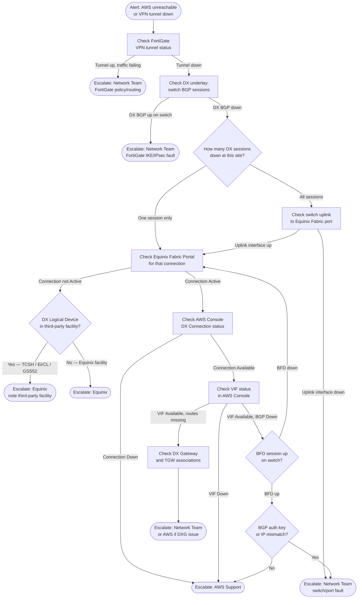

# Equinix Fabric + Hosted DX — NOC Troubleshooting SOP

Step-by-step guide for NOC/OC engineers to diagnose and escalate AWS connectivity
issues across the Equinix Fabric Hosted DX estate (LD7, LD8, DB3, DC4, SG3). The full
path has two layers: a **FortiGate IPsec VPN overlay** running on top of the **DX
underlay** (Cisco switch BGP → Equinix Fabric → AWS). Both layers must be healthy for
traffic to flow. Covers fault isolation across the three responsible parties: Network
Team, Equinix, and AWS.

For connection IDs, VIF IDs, VLANs, and IP addresses see
[Equinix Fabric + Hosted DX](equinix_fabric_shared_dx.md).

---

## At a Glance

| Symptom | Likely Fault Domain | Go to |
| --- | --- | --- |
| Cannot reach AWS resources / VPN tunnel down | FortiGate VPN or DX underlay | [Step 2](#step-2-check-fortigate-vpn) |
| VPN tunnel up but traffic not passing | FortiGate policy or routing | [Step 2](#step-2-check-fortigate-vpn) |
| VPN tunnel down, DX BGP also down | DX underlay fault | [Step 3](#step-3-check-the-switch) |
| VPN tunnel down, DX BGP up | FortiGate issue | [Network Team escalation](#network-team) |
| All DX BGP sessions down at one site | Switch or Fabric uplink | [Step 3](#step-3-check-the-switch) |
| Single DX BGP session down, others up | Equinix Fabric connection or DX device | [Step 4](#step-4-check-equinix-fabric-portal) |
| DX BGP sessions up but routes missing | VIF or DX Gateway config | [Step 5](#step-5-check-aws-console) |
| BGP flapping intermittently | BFD underlay instability | [Step 3](#step-3-check-the-switch) |
| LD7 issue only | Public VIF path — different fault domain | [LD7 note](#ld7-public-vif-paths) |

---

## Fault Isolation Flow



---

## Step 1: Establish Scope

Before doing anything else, determine the blast radius.

**Questions to answer:**

- Which site(s) are affected — LD8, DB3, DC4, SG3? (LD7 is a separate Public VIF path —
  see [LD7 note](#ld7-public-vif-paths))
- Is traffic to AWS fully down or degraded (some paths still up)?
- Is this affecting all regions or just one (eu-west-1, us-east-2, ap-southeast-1)?
- When did it start — correlates with any change window?

**Expected normal state:** Each site has two active BGP sessions (one per Transit VIF).
London (LD8) has two sessions preferred; LD7 carries Public VIF traffic separately.

---

## Step 2: Check FortiGate VPN

The FortiGate IPsec VPN runs over the DX connection as the overlay. Check this first —
if the VPN is down but the DX underlay is healthy, the fault is with FortiGate
(Network Team). If both are down, investigate the DX underlay in the steps below.

### Tunnel Status

```fortios
get vpn ipsec tunnel summary
```

Expected: all DX-bound tunnels in `up` state with non-zero bytes in/out. A tunnel
showing `down` or `0/0` traffic while others are healthy indicates a path-specific
fault.

For detail on a specific tunnel:

```fortios
diagnose vpn tunnel list name <tunnel-name>
```

### IKE Phase 1 Status

```fortios
diagnose vpn ike gateway list
```

If Phase 1 is not established, the tunnel cannot come up regardless of the DX state.
A Phase 1 failure with the DX underlay healthy points to an IKE config issue (PSK,
proposal mismatch, peer IP) — escalate to Network Team.

### BGP over VPN

```fortios
get router info bgp summary
```

If the VPN tunnel is up but BGP over it is down, check BGP peer IPs and auth keys
against the VPN peer configuration — Network Team issue.

### VPN up but traffic not passing

```fortios
diagnose sys session list
diagnose debug flow filter addr <destination-ip>
diagnose debug flow show console enable
diagnose debug enable
```

If sessions exist but traffic is dropped, check FortiGate firewall policies — Network
Team issue.

---

## Step 3: Check the Switch

Log in to the affected site's switch (see hostnames below) and run the following checks.

| Site | Switch |
| --- | --- |
| LD7 | CKONS01-LD7 |
| LD8 | ELD8-NSW-01A |
| DB3 | EDB3-NSW-01A |
| DC4 | EDC4-NSW-01A |
| SG3 | ESG3-NSW-01A |

### BGP Session Status

```ios
show bgp vpnv4 unicast vrf AWS summary
```

Expected output: both neighbors in `Established` state with non-zero prefixes received.
If a neighbor shows `Idle` or `Active`, BGP is not up on that path.

### BFD Session Status

```ios
show bfd neighbors
```

Expected: one BFD session per active DX connection, state `Up`. A BFD session down
without the interface being down indicates underlay packet loss between the switch and
the DX Logical Device — escalate to Equinix.

### Interface Status

```ios
show interfaces GigabitEthernet0/1.101
show interfaces GigabitEthernet0/1.102
```

Replace with the actual subinterface numbers for the site (see VIF reference in the
[main DX document](equinix_fabric_shared_dx.md)). Both subinterfaces should be
`line protocol is up`.

If a subinterface is down — check the parent interface and the Equinix Fabric port
status. This is either a switch-side fault (Network Team) or a Fabric port fault
(Equinix).

### Route Table

```ios
show bgp vpnv4 unicast vrf AWS neighbors <aws-ip> received-routes
```

Use the AWS IP from the per-site reference table. If the BGP session is up but no
routes are received, the fault is likely AWS-side (VIF, DX Gateway, or TGW
association).

---

## Step 4: Check Equinix Fabric Portal

URL: fabric.equinix.com — log in with Equinix customer credentials.

Navigate to **Connections** and locate the affected connection by CID (from the
[main DX document](equinix_fabric_shared_dx.md)).

| Expected state | Action |
| --- | --- |
| **Active** | Fabric is healthy — proceed to [Step 5](#step-5-check-aws-console) |
| **Down** | Raise with Equinix — see [Equinix escalation](#equinix) |
| **Provisioning / Pending** | Recent change in progress — wait or check change records |
| **Deleted** | Connection has been removed — escalate to Network Team immediately |

**Note on third-party facilities:** TCSH (Digital Realty LHR20), EirCL (Clonshaugh),
and GSS52 (Global Switch Singapore) are not Equinix-owned buildings. If the affected
connection terminates at one of these, Equinix must engage the third-party facility
operator. State this explicitly when raising the ticket.

---

## Step 5: Check AWS Console

Navigate to **Direct Connect → Connections** in the AWS Console (eu-west-1, us-east-2,
or ap-southeast-1 depending on the affected site).

### DX Connection Status

Locate the connection by Connection ID (`dxcon-xxx`).

| State | Meaning | Action |
| --- | --- | --- |
| **Available** | Physical connection healthy | Check VIF status below |
| **Down** | Physical layer fault | Raise with AWS Support |
| **Ordering / Requested** | Not yet provisioned | Raise with Network Team |

### VIF Status

Navigate to **Direct Connect → Virtual Interfaces** and locate the VIF by ID
(`dxvif-xxx`).

| State | Meaning | Action |
| --- | --- | --- |
| **Available, BGP Up** | Healthy | Check DX Gateway and TGW associations |
| **Available, BGP Down** | BGP session not established | Check switch config — auth key, peer IP, VLAN |
| **Down** | VIF fault | Raise with AWS Support |
| **Confirming / Pending** | Recent change in progress | Wait or check change records |

If BGP shows Down in the AWS Console but the switch also shows the session as not
Established, verify:

1. The BGP peer IP on the switch matches the Amazon-side IP in the VIF configuration
1. The BGP auth (MD5) key matches exactly
1. The switch VLAN matches the VIF VLAN (not the DX device VLAN — see
   [VLAN translation note](equinix_fabric_shared_dx.md#notes--gotchas))

---

## Step 6: Determine Fault Domain and Escalate

### Network Team

**Escalate when:**

- FortiGate VPN tunnel down with DX underlay healthy (IKE/IPsec fault)
- BGP over VPN down with tunnel up (BGP peer IP or auth key mismatch)
- FortiGate firewall policy blocking traffic over VPN
- Switch interface or subinterface is down
- DX BGP session down due to config mismatch (peer IP, auth key, VLAN)
- BFD misconfigured or timers incorrect
- Routes not being advertised from the switch
- DX Gateway or TGW association missing

**Information to provide:**

- For VPN faults: FortiGate hostname, tunnel name, output of `get vpn ipsec tunnel
  summary` and `diagnose vpn ike gateway list`, time of failure
- For DX faults: site and switch hostname, affected subinterface(s) and BGP neighbor
  IPs, output of `show bgp vpnv4 unicast vrf AWS summary` and `show bfd neighbors`
- Any recent changes

### Equinix

**Escalate when:**

- Fabric connection is not Active in the Equinix Fabric Portal
- BFD session down but switch interface up (underlay packet loss)
- Physical port issues in the Equinix MMR

**Information to provide:**

- Connection CID (e.g. `710157-LD8-CX-PRI-01`) and Fabric connection ID
- Site name (LD7, LD8, DB3, DC4, SG3)
- DX Logical Device name (e.g. `TCSH-1gb2cmmjxgr6d`) and its physical facility
- If the DX Logical Device is at TCSH, EirCL, or GSS52 — state this explicitly as it
  requires Equinix to engage a third-party facility
- Time of failure and Fabric connection state observed

**Raise via:** Equinix customer portal or Equinix support line (P1 for full site loss).

### AWS Support

**Escalate when:**

- DX connection state is Down in the AWS Console
- VIF state is Down in the AWS Console
- BGP is down on the AWS side with no switch-side or Fabric-side fault found

**Information to provide:**

- AWS Connection ID (`dxcon-xxx`)
- VIF ID (`dxvif-xxx`)
- AWS Account ID and region
- DX connection state and VIF state as seen in the Console
- Time of failure
- Confirmation that Equinix Fabric connection is Active (rules out Equinix fault)

**Raise via:** AWS Support console — use **Technical** support case, service
**AWS Direct Connect**, severity **Production system impaired** (or **Business
critical** for full outage).

---

## LD7 Public VIF Paths

LD7 uses **Public VIFs** — these connect to AWS public endpoints, not private VPC or
TGW traffic. An LD7 outage does not affect Transit VIF traffic (LD8, DB3, DC4, SG3).

The diagnosis steps are the same, but:

- BGP peer IPs are public addresses (`149.5.70.x`) — not RFC 1918
- A fault here affects access to AWS public services, not VPC workloads
- LD7 is **not** a fallback for LD8 Transit VIF paths

---

## Redundancy Reference

If one path is down, confirm the remaining path is carrying traffic before escalating
as P1. Use the redundancy model from the
[main DX document](equinix_fabric_shared_dx.md#redundancy-design) to determine expected
surviving paths.

| Scenario | Surviving paths | Traffic impact |
| --- | --- | --- |
| LD8 switch failure | LD7 Public VIFs only for London | Transit VIF traffic reroutes via DB3 |
| TCSH device failure | LD7 primary + LD8 primary (EqLD5) | Both secondaries lost simultaneously |
| DB3 switch failure | LD8 paths to eu-west-1 remain | No eu-west-1 impact if LD8 healthy |
| DC4 switch failure | None for us-east-2 | Full us-east-2 DX outage |
| SG3 switch failure | None for ap-southeast-1 | Full APAC DX outage — VPN cold standby activates |

---

## See Also

- [Equinix Fabric + Hosted DX — Architecture & Reference](equinix_fabric_shared_dx.md)
- [BGP Stack (Flagship) — VPN Overlay over DX](bgp_stack_vpn_over_dx.md)
- [BGP Troubleshooting](../operations/bgp_troubleshooting.md)
- [BFD Best Practices](../operations/bfd_best_practices.md)
- [IPsec VPN Troubleshooting](../operations/ipsec_vpn_troubleshooting.md)
