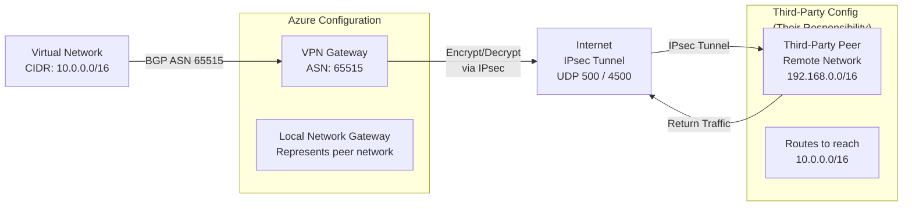

# Azure: Third-Party VPN Configuration Guide

Complete reference for establishing IPsec VPN connectivity from Azure Virtual Network to external
third-party networks without Azure ExpressRoute. Uses Azure VPN Gateway and Azure-managed IPsec
tunnels with dynamic BGP routing or static routes.

For IPsec fundamentals see [IPsec & IKE](../theory/ipsec.md). For Azure ExpressRoute (higher
throughput alternative) see [Azure ExpressRoute Setup](azure_expressroute_setup.md). For
troubleshooting see [IPsec VPN Troubleshooting](../operations/ipsec_vpn_troubleshooting.md).

---

## 1. Overview

### When to Use Azure Site-to-Site VPN

Azure VPN is appropriate when:

- ExpressRoute not available in your region
- Lower bandwidth requirement (up to 10 Gbps on Gateway SKUs)
- Cost-sensitive (consumption-based pricing)
- Third-party peer is external; no shared dedicated circuit
- Quick provisioning needed (minutes vs weeks for ER)

### Limitations vs ExpressRoute

| Aspect | VPN | ExpressRoute |
| --- | --- | --- |
| **Bandwidth** | Up to 10 Gbps (HighPerformance SKU) | 50 Mbps, 100 Mbps, 200 Mbps, 500 Mbps, 1 Gbps, 10 Gbps |
| **Latency** | Internet (variable, 30-100ms) | Dedicated (consistent, <20ms) |
| **SLA** | Best effort | 99.95% SLA |
| **Throughput** | Limited by Internet | Guaranteed |
| **Cost** | Lower ($0.05/hour + data) | Higher (circuit + port fees) |
| **Setup** | Minutes | Weeks (carrier provisioning) |

---

## 2. Architecture



---

## 3. Configuration

### A. Create VPN Gateway

Azure Portal:

1. Virtual Networks → select your VNet

1. Gateways → VPN Gateway → Create

1. Name: `third-party-vpn-gw`

1. SKU: `VpnGw1` (basic, suitable for third-party VPN)

1. Create

Via Azure CLI:

```bash
# Create gateway subnet (if not already present)
az network vnet subnet create \

  --name GatewaySubnet \
  --address-prefix 10.0.255.0/24 \
  --vnet-name my-vnet \
  --resource-group my-rg

# Create VPN Gateway
az network vnet-gateway create \

  --name third-party-vpn-gw \
  --public-ip-address vpn-pip \
  --resource-group my-rg \
  --vnet my-vnet \
  --gateway-type Vpn \
  --vpn-type RouteBased \
  --sku VpnGw1 \
  --asn 65515
```

### B. Create Local Network Gateway

Represents the third-party network and peer IP.

Azure Portal:

1. Virtual Networks → Local Network Gateways → Create

1. Name: `third-party-lng`

1. Public IP Address: `203.0.113.5` (third-party peer public IP)

1. Address Spaces: `192.168.0.0/16` (third-party network)

1. BGP Settings: Enable BGP → ASN: `65100` (agree with third party)

1. Create

Via Azure CLI:

```bash
az network local-gateway create \

  --name third-party-lng \
  --location eastus \
  --resource-group my-rg \
  --gateway-ip-address 203.0.113.5 \
  --address-prefixes 192.168.0.0/16 \
  --asn 65100 \
  --bgp-peering-address 192.168.0.1
```

### C. Create VPN Connection

Azure Portal:

1. VPN Gateway → Connections → Add

1. Connection Type: `Site-to-Site (IPsec)`

1. Local Network Gateway: `third-party-lng`

1. Shared Key (PSK): generate or provide (must match third party's PSK)

1. Create

Via Azure CLI:

```bash
# Generate pre-shared key
PSK=$(openssl rand -base64 32)

az network vpn-connection create \

  --name third-party-vpn-conn \
  --resource-group my-rg \
  --vnet-gateway-name third-party-vpn-gw \
  --local-gateway2-name third-party-lng \
  --connection-type IPsec \
  --shared-key "$PSK"

echo "PSK: $PSK"
```

**Important:** Share the PSK and gateway public IP with the third party.

### D. Configure BGP Peering (Dynamic Routing)

If using dynamic routing (recommended):

Azure Portal:

1. VPN Gateway → Configuration

1. Autonomous System Number (ASN): `65515` (default)

1. BGP Peering Address: `169.254.21.1` (Azure-assigned internal address)

1. Save

Via Azure CLI:

```bash
az network vnet-gateway update \

  --name third-party-vpn-gw \
  --resource-group my-rg \
  --set 'bgpSettings.asn=65515' \
  --set 'bgpSettings.bgpPeeringAddress=169.254.21.1'
```

The third party configures their BGP peer on `169.254.21.1` (Azure side) and exchanges routes via
BGP.

### E. Static Routes (If BGP Not Used)

If the third party cannot support BGP:

Azure Portal:

1. Route Tables → select your route table

1. Routes → Add

1. Address Prefix: `192.168.0.0/16` (third-party network)

1. Next Hop Type: `Virtual Network Gateway`

1. Save

Via Azure CLI:

```bash
az network route-table route create \

  --resource-group my-rg \
  --route-table-name my-routes \
  --name to-third-party \
  --address-prefix 192.168.0.0/16 \
  --next-hop-type VirtualNetworkGateway
```

### F. Third-Party Configuration (Cisco Example)

On the third-party Cisco router, match Azure VPN Gateway IKEv2 proposal:

```ios
! Azure VPN Gateway uses IKEv2 with specific parameters

crypto ikev2 proposal AZURE-PROPOSAL
  encryption aes-cbc-256
  integrity sha256
  dh-group 14

crypto ikev2 policy AZURE-POLICY
  proposal AZURE-PROPOSAL

crypto ikev2 keyring AZURE-KEYRING
  peer <AZURE-VGW-PUBLIC-IP>
    pre-shared-key <PSK>

crypto ipsec transform-set AZURE-TS esp-aes 256 esp-sha256-hmac
  mode tunnel

crypto ipsec profile AZURE-PROFILE
  set transform-set AZURE-TS
  set pfs group14

interface Tunnel1
  ip address 169.254.21.2 255.255.255.252
  tunnel source 203.0.113.5
  tunnel destination <AZURE-VGW-PUBLIC-IP>
  tunnel mode ipsec ipv4
  tunnel protection ipsec profile AZURE-PROFILE

router bgp 65100
  bgp router-id 203.0.113.5
  neighbor 169.254.21.1 remote-as 65515
  address-family ipv4
    network 192.168.0.0 mask 255.255.0.0
    neighbor 169.254.21.1 activate
```

---

## 4. Comparison Summary

| Feature | Azure VPN | Azure ExpressRoute | Choice |
| --- | --- | --- | --- |
| **Bandwidth** | Up to 10 Gbps | 50 Mbps - 10 Gbps | ER for dedicated, VPN for shared |
| **Latency** | Internet (variable) | Dedicated (consistent) | ER for predictable latency |
| **Cost** | Consumption-based | Monthly circuit | VPN for flexible, ER for permanent |
| **Setup** | Minutes | Weeks | VPN for speed |
| **BGP Support** | Yes | Yes | Both support dynamic routing |
| **Failover** | Can combine VPN+ER | Primary | VPN as backup to ER |

---

## 5. Verification & Troubleshooting

### Check VPN Gateway Status

```bash
az network vnet-gateway show \

  --name third-party-vpn-gw \
  --resource-group my-rg
```

### Check Connection Status

```bash
az network vpn-connection show \

  --name third-party-vpn-conn \
  --resource-group my-rg \
  --query 'connectionStatus'
```

Connection should show: `Connected`.

### Check BGP Routes Learned

```bash
az network vnet-gateway list-learned-routes \

  --name third-party-vpn-gw \
  --resource-group my-rg
```

Third-party routes (e.g., 192.168.0.0/16) should appear here once BGP neighbor establishes.

### Check Route Table

```bash
az network route-table route show-effective \

  --resource-group my-rg \
  --name my-routes \
  --vm-name my-vm \
  --nic-name my-nic
```

Routes to third-party network should show VPN Gateway as next hop.

---

## Common Issues

| Issue | Cause | Fix |
| --- | --- | --- |
| **Connection: Disconnected** | PSK mismatch or peer not online | Verify PSK matches; check peer config |
| **BGP neighbor down** | ASN or peering IP mismatch | Verify BGP ASN and peering IPs match |
| **Tunnel up, no traffic** | UDR or NSG blocking | Check route tables and network security groups |
| **High latency** | Internet routing; ISP path | Normal for VPN; use ExpressRoute for lower latency |

---

## Next Steps

- [IPsec & IKE](../theory/ipsec.md) — Protocol fundamentals
- [IPsec VPN Troubleshooting](../operations/ipsec_vpn_troubleshooting.md) — Detailed diagnostics
- [Azure ExpressRoute Setup](azure_expressroute_setup.md) — Higher performance alternative
