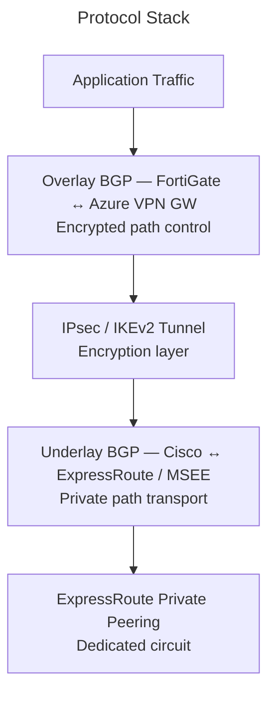
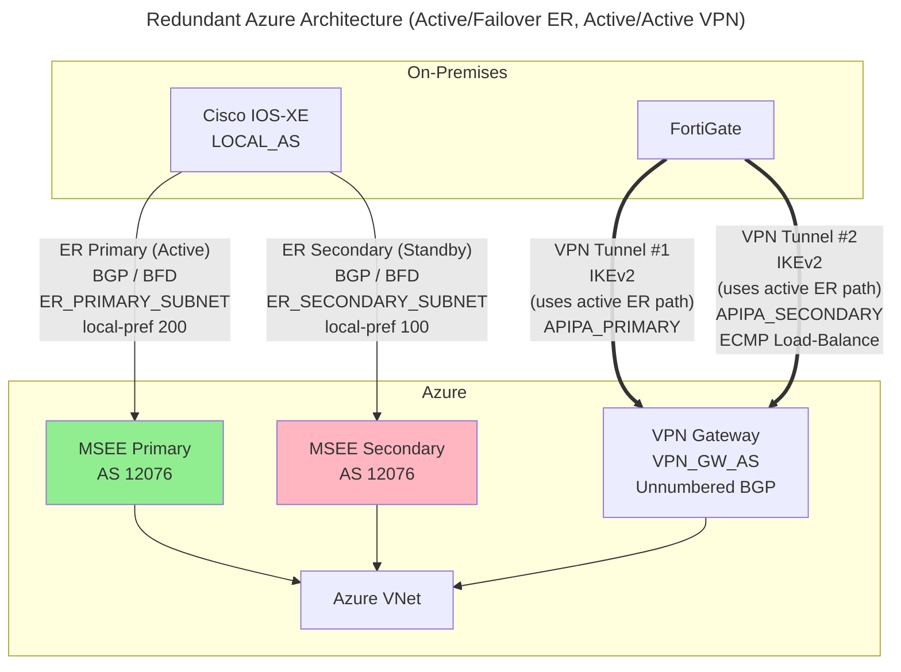
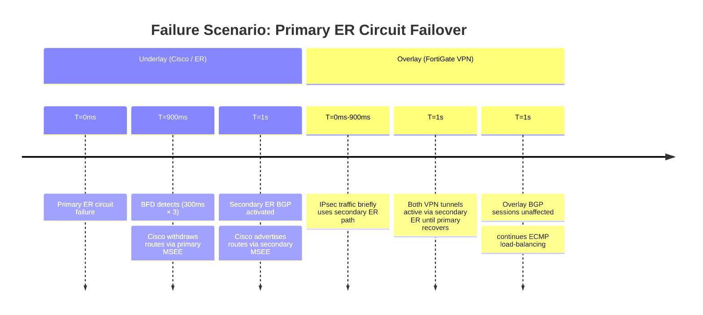
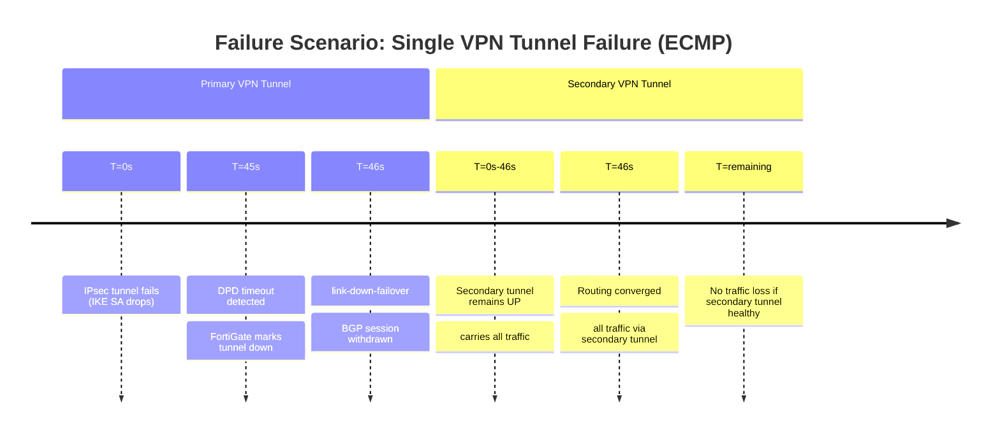

# BGP Stack Analysis: VPN Overlay over ExpressRoute

## 1. Overview & Principles

This architecture uses a layered protocol approach to provide **encrypted**,
high-bandwidth connectivity to Azure. ExpressRoute is a private dedicated circuit
— it is **not encrypted by default**. A VPN overlay (IPsec/IKEv2) running inside the
ExpressRoute path provides confidentiality while preserving the latency and bandwidth
advantages of the dedicated link.

### The Protocol Stack



- **Underlay BGP:** Cisco IOS-XE peers with the Microsoft Enterprise Edge (MSEE)
  router over the ExpressRoute private peering. Microsoft's ASN is `12076`.

- **IPsec Tunnel:** FortiGate terminates IKEv2 tunnels to the Azure VPN Gateway
  using private IPs reachable via the ExpressRoute underlay. The VPN Gateway must
  be configured to use **private IP addressing** on the connection.

- **Overlay BGP:** FortiGate and Azure VPN Gateway peer BGP inside the IPsec tunnel,
  exchanging VNet and on-premises prefixes with encryption end-to-end.

### Key Differences from AWS DX

| Property | AWS Direct Connect + TGW | Azure ExpressRoute + VPN GW |
| --- | --- | --- |
| Microsoft/Amazon ASN | `64512` | `12076` (MSEE) |
| BFD support over VPN | Not supported | Not supported |
| BFD on private peering | Supported | Supported (since 2021) |
| Default route preference | DX > VPN | ExpressRoute > VPN |
| Encryption on private link | Not provided | Not provided (VPN overlay required) |
| Active-active VPN GW | Yes (TGW) | Yes (active-active mode) |

---

## 2. Architecture



### Address Planning

| Segment | Example Range | Notes |
| --- | --- | --- |
| **ExpressRoute (Underlay)** | | |
| ER private peering (primary) | `ER_PRIMARY_SUBNET` (e.g., `10.0.0.0/30`) | Customer side: `.1`, MSEE: `.2` |
| ER private peering (secondary) | `ER_SECONDARY_SUBNET` (e.g., `10.0.0.4/30`) | Customer side: `.5`, MSEE: `.6` |
| **VPN (Overlay — FortiGate to Azure)** | | |
| Primary VPN tunnel | `VPN_GW_PRIMARY_IP` (e.g., `172.16.0.2`) | IPsec target; via primary ER circuit |
| Secondary VPN tunnel | `VPN_GW_SECONDARY_IP` (e.g., `172.16.0.6`) | IPsec target; via secondary ER circuit |
| Primary BGP peer — FortiGate | `APIPA_PRIMARY` (e.g., `169.254.21.2`) | APIPA, unnumbered on Azure side |
| Secondary BGP peer — FortiGate | `APIPA_SECONDARY` (e.g., `169.254.22.2`) | APIPA, unnumbered on Azure side |
| **Routing** | | |
| On-premises prefix | `10.0.0.0/8` | Advertised via underlay (ER) and overlay (VPN) |
| Azure VNet | `10.100.0.0/16` | Advertised by Azure VPN GW over both BGP sessions |

---

## 3. Detection & Restoration Timelines

### Underlay Failure (ExpressRoute Primary Circuit Down)

With redundant ER circuits, the primary fails and BFD detects it rapidly:



### Overlay Failure (VPN Tunnel Down — Active/Active ECMP)

With active/active VPN tunnels, one tunnel failure triggers failover while the other
remains active:



**Note:** With active/active ECMP, traffic loss is minimized because the secondary tunnel
can carry full traffic load while the primary recovers. The underlay failure (ER primary
down) affects path selection but not BGP session stability.

---

## 4. Configuration

### A. Cisco IOS-XE — ExpressRoute Underlay BGP

```ios

! BFD template for ExpressRoute private peering
bfd-template single-hop ER-MSEE-BFD
 interval min-tx 300 min-rx 300 multiplier 3
 no bfd echo
!
router bgp LOCAL_AS
 bgp router-id 10.0.0.1
 bgp log-neighbor-changes
 !
 address-family ipv4 vrf Azure
  ! Primary MSEE peer (Microsoft AS 12076) — preferred
  neighbor MSEE_PRIMARY_IP remote-as 12076
  neighbor MSEE_PRIMARY_IP description ER-PRIMARY-MSEE
  neighbor MSEE_PRIMARY_IP fall-over bfd
  neighbor MSEE_PRIMARY_IP password 7 <MD5-KEY>
  neighbor MSEE_PRIMARY_IP activate
  neighbor MSEE_PRIMARY_IP route-map RM-ER-PRIMARY-IN in
  neighbor MSEE_PRIMARY_IP route-map RM-ER-PRIMARY-OUT out
  neighbor MSEE_PRIMARY_IP send-community both
  !
  ! Secondary MSEE peer (standby) — lower pref, AS-path prepend
  neighbor MSEE_SECONDARY_IP remote-as 12076
  neighbor MSEE_SECONDARY_IP description ER-SECONDARY-MSEE
  neighbor MSEE_SECONDARY_IP fall-over bfd
  neighbor MSEE_SECONDARY_IP password 7 <MD5-KEY>
  neighbor MSEE_SECONDARY_IP activate
  neighbor MSEE_SECONDARY_IP route-map RM-ER-SECONDARY-IN in
  neighbor MSEE_SECONDARY_IP route-map RM-ER-SECONDARY-OUT out
  neighbor MSEE_SECONDARY_IP send-community both
 exit-address-family
!
! Inbound route-maps: differentiate primary (preferred) from secondary (standby)
! Primary MSEE: higher local-pref (200) = preferred path
route-map RM-ER-PRIMARY-IN permit 10
 match ip address prefix-list PFX-AZURE-VNETS
 set local-preference 200
!
! Secondary MSEE: lower local-pref (150)
! Makes secondary less preferred until primary fails
route-map RM-ER-SECONDARY-IN permit 10
 match ip address prefix-list PFX-AZURE-VNETS
 set local-preference 150
!
! Outbound route-maps: differentiate primary (preferred) from secondary (standby)
! Primary MSEE: no prepending = preferred path
route-map RM-ER-PRIMARY-OUT permit 10
 match ip address prefix-list PFX-ONPREM-SUMMARY
!
! Secondary MSEE: prepend AS twice (150)
route-map RM-ER-SECONDARY-OUT permit 10
 match ip address prefix-list PFX-ONPREM-SUMMARY
 set as-path prepend LOCAL_AS LOCAL_AS
!
ip prefix-list PFX-AZURE-VNETS permit 10.100.0.0/16 le 24
ip prefix-list PFX-ONPREM-SUMMARY permit 10.0.0.0/8
```

> VRF `AZURE` must be defined and the ExpressRoute interface assigned to it before this
> config is applied. See the [VRF-Lite config guide](../cisco/cisco_vrf_config.md) for
> VRF definitions and FortiGate subinterface requirements.

### B. FortiGate — IPsec Phase 1 (IKEv2 to Azure VPN Gateway)

> **DPD Tuning:** Configuration uses `dpd on-idle` with 5s retry interval and 3
> retries (~15s failure detection). For faster BGP convergence, consider `dpd on-demand`
> (aggressive) or reduce `dpd-retryinterval` to 3s (~9s timeout). Monitor CPU impact on
> FortiGate with aggressive DPD and multiple tunnels. BGP link-down-failover (~45s) is the
> primary mechanism; DPD is secondary.

```fortios

config vpn ipsec phase1-interface
    edit "azure-vpn-primary"
        set interface "port1"
        set ike-version 2
        set keylife 28800
        set peertype any
        set net-device disable
        set proposal aes256-sha256
        set dhgrp 2
        set remote-gw VPN_GW_PRIMARY_IP          # Azure VPN GW private IP via primary ER
        set psksecret <PRE-SHARED-KEY-PRIMARY>
        set dpd on-idle
        set dpd-retryinterval 5
        set dpd-retrycount 3
        set npu-offload enable
    next
    edit "azure-vpn-secondary"
        set interface "port1"
        set ike-version 2
        set keylife 28800
        set peertype any
        set net-device disable
        set proposal aes256-sha256
        set dhgrp 2
set remote-gw VPN_GW_SECONDARY_IP        # Azure VPN GW private IP via secondary ER
        set psksecret <PRE-SHARED-KEY-SECONDARY>
        set dpd on-idle
        set dpd-retryinterval 5
        set dpd-retrycount 3
        set npu-offload enable
    next
end

config vpn ipsec phase2-interface
    edit "azure-vpn-primary-p2"
        set phase1name "azure-vpn-primary"
        set proposal aes256-sha256
        set pfs enable
        set dhgrp 2
        set keylifeseconds 3600
    next
    edit "azure-vpn-secondary-p2"
        set phase1name "azure-vpn-secondary"
        set proposal aes256-sha256
        set pfs enable
        set dhgrp 2
        set keylifeseconds 3600
    next
end
```

### C. FortiGate — Overlay BGP to Azure VPN Gateway

> **Note on Azure unnumbered BGP:** Azure VPN Gateway uses unnumbered interfaces for
> BGP peering. FortiGate configures APIPA addresses locally, but Azure does not expose a
> matching peer IP. This requires **eBGP multihop** to peer across encrypted tunnels.
> APIPA addresses are used internally by FortiGate's BGP stack; connectivity relies on
> the IPsec tunnel itself.

```fortios

config system interface
    edit "azure-vpn-primary"
        set ip APIPA_PRIMARY 255.255.255.255
        set allowaccess ping
    next
    edit "azure-vpn-secondary"
        set ip APIPA_SECONDARY 255.255.255.255
        set allowaccess ping
    next
end

config router bgp
    set as LOCAL_AS
    set router-id 10.0.0.2
    set graceful-restart enable
    set graceful-restart-time 120
    set graceful-stalepath-time 120

    config neighbor
        edit "169.254.21.1"
            set description "AZURE-VPN-GW-PRIMARY"
            set remote-as VPN_GW_AS
            set ebgp-multihop enable
            set ebgp-multihop-ttl 255
            set link-down-failover enable
            set soft-reconfiguration enable
            set capability-graceful-restart enable
            set timers-keepalive 60
            set timers-holdtime 180
            set route-map-in "RM-AZURE-OVERLAY-IN"
            set route-map-out "RM-AZURE-OVERLAY-OUT"
        next
        edit "169.254.22.1"
            set description "AZURE-VPN-GW-SECONDARY"
            set remote-as VPN_GW_AS
            set ebgp-multihop enable
            set ebgp-multihop-ttl 255
            set link-down-failover enable
            set soft-reconfiguration enable
            set capability-graceful-restart enable
            set timers-keepalive 60
            set timers-holdtime 180
            set route-map-in "RM-AZURE-OVERLAY-IN"
            set route-map-out "RM-AZURE-OVERLAY-OUT"
        next
    end

    config network
        edit 1
            set prefix 10.0.0.0 255.0.0.0
        next
    end
end
```

---

## 5. Path Preference & ECMP Load-Balancing

With redundant ExpressRoute and redundant VPN tunnels, path selection involves:

### Underlay: ER Primary Preferred (Active/Failover)

ExpressRoute carries prefixes from MSEE. Primary ER is preferred; secondary activates on
failover. Control preference using **connection weight** on the Azure side and **local-preference**
on the on-premises side.

| Path | Azure Control | On-Premises Control |
| --- | --- | --- |
| ExpressRoute primary | Primary connection weight (higher) | `local-preference 200` |
| ExpressRoute secondary | Secondary connection weight (lower) | `local-preference 200` |
| VPN (backup) | Backup weight (if configured) | `local-preference 100` |

### Overlay: VPN Active/Active (ECMP)

FortiGate load-balances traffic across both VPN tunnels using ECMP. Both BGP sessions
are active and receive the same Azure VNet routes. Configure route redistribution with
equal cost metrics:

```fortios

! Both overlay BGP neighbors should have identical metrics to enable ECMP
config router bgp
    config redistribute "connected"
        set status enable
    next
    config redistribute "static"
        set status enable
    next
end

! Verify ECMP is active: routes should show both next-hops with equal cost
! get router info routing-table 10.100.0.0
```

**Result:** Traffic to Azure VNet is split across both VPN tunnels. If one tunnel fails,
the secondary carries full load until the primary recovers.

---

## 6. Comparison Summary

| Metric | Default | Optimized Redundant Stack |
| --- | --- | --- |
| **ER redundancy** | Single circuit (no failover) | **Dual circuits, active/failover** |
| **VPN redundancy** | Single tunnel (no failover) | **Dual tunnels, active/active ECMP** |
| **Underlay detection** | 180s (BGP, no BFD) | **900ms (BFD 300ms × 3 on both ER)** |
| **Overlay detection** | 180s (BGP) | **~45s (DPD + link-down-failover both VPN)** |
| **BGP link reaction** | Passive (hold-timer) | **Active (link-down-failover)** |
| **Load-balancing** | N/A | **ECMP across both VPN tunnels** |
| **Encryption** | None (ER unencrypted) | **AES-256-GCM / IKEv2 on both tunnels** |
| **NPU offload** | Disabled | **Enabled** |
| **Graceful restart** | Disabled | **Enabled (120s)** |
| **BGP peer addressing** | Assumed APIPA paired | **Unnumbered on Azure, APIPA on FortiGate** |

> **Note:** BFD detects physical path failure in ~900ms, but Microsoft states full
> traffic switchover between ER circuits can take ~1 minute. BGP timers on ER are
> negotiable (MSEE accepts 3s keepalive / 10s hold). Microsoft recommends BFD over
> aggressive BGP timers, as low timers are process-intensive and destabilizing.
> With active/active VPN, one tunnel failure does not cause traffic loss if the peer
> tunnel is healthy.

---

## 7. Verification & Troubleshooting

### Cisco — Underlay (ExpressRoute) Verification

| Command | Purpose |
| --- | --- |
| `show bfd neighbors` | Verify BFD on both primary and secondary MSEE peers |
| `show bgp vpnv4 unicast vrf Azure summary` | BGP neighbor state (both MSEE peers should be up) |
| `show bgp vpnv4 unicast vrf Azure neighbors MSEE_PRIMARY_IP` | Confirm primary ER BGP state, keepalive/hold timers |
| `show bgp vpnv4 unicast vrf Azure neighbors MSEE_SECONDARY_IP` | Confirm secondary ER BGP state (standby until failover) |
| `show ip route vrf Azure 10.100.0.0` | Verify Azure VNet reachable and which MSEE peer carries it |
| `show ip bgp vpnv4 unicast vrf Azure 10.100.0.0/16` | Verify route source and next-hop MSEE |

### FortiGate — Overlay (VPN) Verification

| Command | Purpose |
| --- | --- |
| `get router info bgp neighbors 169.254.21.1` | Primary VPN BGP session state, timers, routes received |
| `get router info bgp neighbors 169.254.22.1` | Secondary VPN BGP session state (ECMP peer) |
| `diagnose vpn tunnel list name azure-vpn-primary` | Primary IKEv2 SA, DPD counters, tunnel status |
| `diagnose vpn tunnel list name azure-vpn-secondary` | Secondary IKEv2 SA, DPD counters, tunnel status |
| `get router info routing-table 10.100.0.0` | Confirm overlay routes installed with both next-hops (ECMP) |
| `diagnose sniffer packet any 'port 179' 4` | BGP keepalive verification on both sessions |
| `get router info routing-table vrf all` | Verify routing table has entries via both VPN tunnels |

### Troubleshooting Asymmetric Redundancy

**If primary ER is down, secondary should activate:**

- Cisco: `show bfd neighbors` should show secondary peer up
- Cisco: `show bgp vpnv4 unicast vrf Azure neighbors MSEE_SECONDARY_IP` —
  should show **Established**

- FortiGate: Both VPN tunnels should route traffic via secondary ER circuit

**If one VPN tunnel is down, the other should carry traffic:**

- FortiGate: `get router info bgp neighbors 169.254.21.1` and `...169.254.22.1`
  — one UP, one DOWN

- FortiGate: `get router info routing-table 10.100.0.0` should show single
  next-hop (failed tunnel removed from ECMP)

- Check tunnel status: `diagnose vpn tunnel list` — one SA should be missing

**If both ER circuits are down:**

- Cisco: `show bgp vpnv4 unicast vrf Azure summary` — both MSEE peers **Down**
- FortiGate: VPN tunnels continue via static ER routes (if configured) or fail
  if no underlay path exists
