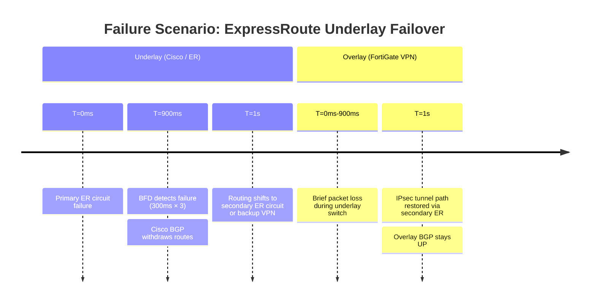
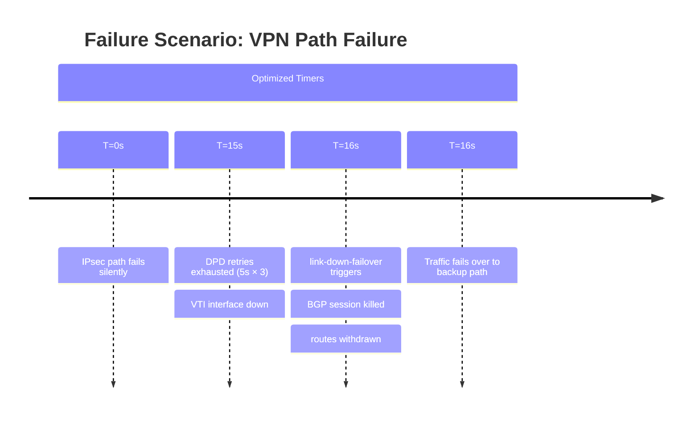

# BGP Stack Analysis: VPN Overlay over ExpressRoute

## 1. Overview & Principles

This architecture uses a layered protocol approach to provide **encrypted**,
high-bandwidth connectivity to Azure. ExpressRoute is a private dedicated circuit
— it is **not encrypted by default**. A VPN overlay (IPsec/IKEv2) running inside the
ExpressRoute path provides confidentiality while preserving the latency and bandwidth
advantages of the dedicated link.

### The Protocol Stack

```text
┌─────────────────────────────────────────────┐
│  Application Traffic                        │
├─────────────────────────────────────────────┤
│  Overlay BGP (FortiGate ↔ Azure VPN GW)     │  ← Encrypted path control
├─────────────────────────────────────────────┤
│  IPsec / IKEv2 Tunnel                       │  ← Encryption layer
├─────────────────────────────────────────────┤
│  Underlay BGP (Cisco ↔ ExpressRoute / MSEE) │  ← Private path transport
├─────────────────────────────────────────────┤
│  ExpressRoute Private Peering               │  ← Dedicated circuit
└─────────────────────────────────────────────┘
```

- **Underlay BGP:** Cisco IOS-XE peers with the Microsoft Enterprise Edge (MSEE)
  router over the ExpressRoute private peering. Microsoft's ASN is `12076`.
- **IPsec Tunnel:** FortiGate terminates IKEv2 tunnels to the Azure VPN Gateway
  using private IPs reachable via the ExpressRoute underlay. The VPN Gateway must
  be configured to use **private IP addressing** on the connection.
- **Overlay BGP:** FortiGate and Azure VPN Gateway peer BGP inside the IPsec tunnel,
  exchanging VNet and on-premises prefixes with encryption end-to-end.

### Key Differences from AWS DX

| Property | AWS Direct Connect + TGW | Azure ExpressRoute + VPN GW |
| --- | --- | --- |
| Microsoft/Amazon ASN | `64512` | `12076` (MSEE) |
| BFD support over VPN | Not supported | Not supported |
| BFD on private peering | Supported | Supported (since 2021) |
| Default route preference | DX > VPN | ExpressRoute > VPN |
| Encryption on private link | Not provided | Not provided (VPN overlay required) |
| Active-active VPN GW | Yes (TGW) | Yes (active-active mode) |

---

## 2. Architecture

```text
On-Premises                     Azure
──────────                     ──────
Cisco IOS-XE                   MSEE (AS 12076)
  └─ BGP (AS 65000)  ◄──ER──►  ExpressRoute Circuit
       │                              │
       │ (Private peering             │
       │  172.16.0.0/30)              │
       │                        Azure VNet
  FortiGate                          │
    └─ IPsec/IKEv2   ◄──ER──►  VPN Gateway (AS 65515)
         └─ BGP (AS 65000)      (Private IP mode)
```

### Address Planning

| Segment | Example Range | Notes |
| --- | --- | --- |
| ExpressRoute private peering (primary) | `172.16.0.0/30` | `/30` — customer allocates |
| ExpressRoute private peering (secondary) | `172.16.0.4/30` | Second MSEE for redundancy |
| VPN BGP peer — on-prem side | `169.254.21.2` | APIPA range (`169.254.21.0/24`) |
| VPN BGP peer — Azure side | `169.254.21.1` | Assigned on VPN GW connection |
| On-premises prefix | `10.0.0.0/8` | Advertised via both paths |
| Azure VNet | `10.100.0.0/16` | Advertised by VPN GW overlay BGP |

---

## 3. Detection & Restoration Timelines

### Underlay Failure (ExpressRoute Circuit Down)



### Overlay Failure (Silent Path Loss — No BFD on VPN)



---

## 4. Configuration

### A. Cisco IOS-XE — ExpressRoute Underlay BGP

```ios
! BFD template for ExpressRoute private peering
bfd-template single-hop ER-MSEE-BFD
 interval min-tx 300 min-rx 300 multiplier 3
 no bfd echo
!
router bgp 65000
 bgp router-id 10.0.0.1
 bgp log-neighbor-changes
 !
 ! Primary MSEE peer (Microsoft AS 12076)
 neighbor 172.16.0.2 remote-as 12076
 neighbor 172.16.0.2 description ER-PRIMARY-MSEE
 neighbor 172.16.0.2 fall-over bfd
 neighbor 172.16.0.2 password 7 <MD5-KEY>
 !
 address-family ipv4 unicast
  neighbor 172.16.0.2 activate
  neighbor 172.16.0.2 route-map RM-ER-IN in
  neighbor 172.16.0.2 route-map RM-ER-OUT out
  neighbor 172.16.0.2 send-community both
 exit-address-family
!
! Inbound: accept Azure VNet prefixes, set local-pref for path preference
route-map RM-ER-IN permit 10
 match ip address prefix-list PFX-AZURE-VNETS
 set local-preference 200
!
! Outbound: advertise on-premises summary only
route-map RM-ER-OUT permit 10
 match ip address prefix-list PFX-ONPREM-SUMMARY
!
ip prefix-list PFX-AZURE-VNETS permit 10.100.0.0/16 le 24
ip prefix-list PFX-ONPREM-SUMMARY permit 10.0.0.0/8
```

### B. FortiGate — IPsec Phase 1 (IKEv2 to Azure VPN Gateway)

```fortios
config vpn ipsec phase1-interface
    edit "azure-vpn-primary"
        set interface "port1"
        set ike-version 2
        set keylife 28800
        set peertype any
        set net-device disable
        set proposal aes256-sha256
        set dhgrp 2
        set remote-gw 172.16.0.2          # Azure VPN GW private IP via ER
        set psksecret <PRE-SHARED-KEY>
        set dpd on-idle
        set dpd-retryinterval 5
        set dpd-retrycount 3
        set npu-offload enable
    next
end

config vpn ipsec phase2-interface
    edit "azure-vpn-primary-p2"
        set phase1name "azure-vpn-primary"
        set proposal aes256-sha256
        set pfs enable
        set dhgrp 2
        set keylifeseconds 3600
    next
end
```

### C. FortiGate — Overlay BGP to Azure VPN Gateway

```fortios
config system interface
    edit "azure-vpn-primary"
        set ip 169.254.21.2 255.255.255.255
        set remote-ip 169.254.21.1 255.255.255.255
        set allowaccess ping
    next
end

config router bgp
    set as 65000
    set router-id 10.0.0.2
    set graceful-restart enable
    set graceful-restart-time 120
    set graceful-stalepath-time 120

    config neighbor
        edit "169.254.21.1"
            set description "AZURE-VPN-GW-PRIMARY"
            set remote-as 65515
            set link-down-failover enable
            set soft-reconfiguration enable
            set capability-graceful-restart enable
            set timers-keepalive 10
            set timers-holdtime 30
            set route-map-in "RM-AZURE-OVERLAY-IN"
            set route-map-out "RM-AZURE-OVERLAY-OUT"
        next
    end

    config network
        edit 1
            set prefix 10.0.0.0 255.0.0.0
        next
    end
end
```

---

## 5. Path Preference

ExpressRoute carries prefixes from MSEE. If a VPN backup path exists, Azure prefers
ExpressRoute by default. Control preference using **connection weight** on the Azure
side and **local-preference** on the on-premises side.

| Path | Azure Control | On-Premises Control |
| --- | --- | --- |
| ExpressRoute primary | Connection weight (higher = preferred) | `local-preference 200` on ER BGP |
| VPN backup | Default lower weight | `local-preference 100` on VPN BGP |
| AS-path prepend inbound | Not supported on ER private peering | Use connection weight instead |

---

## 6. Comparison Summary

| Metric | Default | Optimized BGP Stack |
| --- | --- | --- |
| **Underlay detection** | 90s (BGP hold-timer) | **900ms (BFD on ER private peering)** |
| **Overlay detection** | 90s | **15s (DPD 5s × 3 + link-down-failover)** |
| **BGP link reaction** | Passive (hold-timer) | **Active (link-down-failover)** |
| **Encryption** | None (ExpressRoute unencrypted) | **AES-256-GCM / IKEv2** |
| **NPU offload** | Disabled | **Enabled** |
| **Graceful restart** | Disabled | **Enabled (120s)** |

---

## 7. Verification & Troubleshooting

| Command | Platform | Purpose |
| --- | --- | --- |
| `show bfd neighbors` | Cisco | Verify BFD on MSEE peering |
| `show bgp neighbors 172.16.0.2` | Cisco | Confirm ER underlay BGP state |
| `show ip route 10.100.0.0` | Cisco | Verify Azure VNet reachable via ER |
| `get router info bgp neighbors 169.254.21.1` | FortiGate | Overlay BGP state and timers |
| `diagnose vpn tunnel list name azure-vpn-primary` | FortiGate | IKEv2 SA and DPD counters |
| `diagnose sniffer packet any 'port 179' 4` | FortiGate | BGP keepalive verification |
| `get router info routing-table 10.100.0.0` | FortiGate | Confirm overlay route installed |
