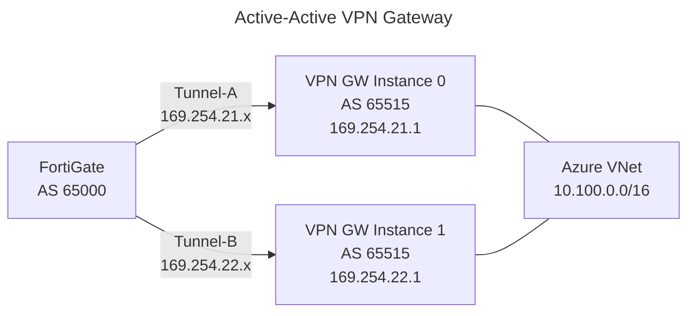
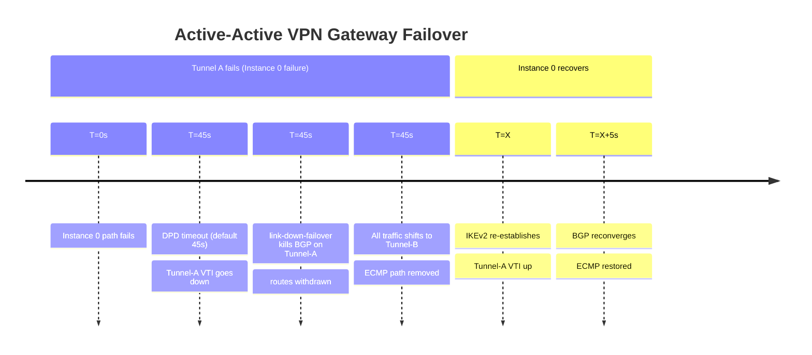

# BGP over VPN: Active-Active Azure VPN Gateway Optimization

## 1. Overview & Principles

An active-active Azure VPN Gateway deploys two gateway instances, each with its own
public IP and BGP peering address. This provides redundancy at the gateway level and
enables ECMP load balancing across both IPsec tunnels when combined with

**ebgp-multipath** on the FortiGate.

### Why Active-Active

In the default active-standby mode, a gateway instance failure triggers a failover of
60–90 seconds. In active-active mode both instances are live simultaneously — an
instance failure causes only a brief reconvergence on the surviving tunnel, with no
standby promotion delay.

### The BGP > DPD Safety Rule

Azure VPN Gateway uses **fixed BGP timers** — keepalive 60 seconds, hold timer 180
seconds — and these cannot be changed on the Azure side. On-premises devices must be
configured to match. The safety rule still applies:

```text
BGP Hold Timer (180s) >> DPD timeout (default 45s, tunable to 9s minimum)
```

A BGP hold-timer lower than the DPD detection time causes BGP to expire and withdraw
routes before the tunnel is marked down — resulting in a double reconvergence event.
With Azure's fixed 180s hold timer and a DPD timeout of 45s or less, this is not a
risk at default settings.

---

## 2. Active-Active VPN Gateway Architecture



Both tunnels traverse the ExpressRoute underlay (private IP mode on the VPN Gateway
connection). Azure advertises VNet prefixes from both gateway instances; the FortiGate
installs both as ECMP paths.

### APIPA BGP Addressing (Custom BGP IP)

Active-active gateways use APIPA addresses (`169.254.21.0/24` – `169.254.22.0/24`)
for BGP peering. These must be explicitly configured on the Azure gateway connection
and matched in the FortiGate interface configuration.

| Instance | Azure BGP IP | FortiGate Tunnel IP |
| --- | --- | --- |
| Instance 0 | `169.254.21.1` | `169.254.21.2` |
| Instance 1 | `169.254.22.1` | `169.254.22.2` |

---

## 3. Detection Timelines



---

## 4. Configuration

### A. FortiGate — Dual Tunnel (Active-Active)

```fortios

! Tunnel A — Instance 0
config vpn ipsec phase1-interface
    edit "azure-aa-tunnel-a"
        set interface "port1"
        set ike-version 2
        set keylife 28800
        set proposal aes256-sha256
        set dhgrp 2
        set remote-gw 172.16.0.2          # Instance 0 private IP via ER
        set psksecret <PRE-SHARED-KEY-A>
        set dpd on-idle
        set dpd-retryinterval 5
        set dpd-retrycount 3
        set npu-offload enable
    next
    ! Tunnel B — Instance 1
    edit "azure-aa-tunnel-b"
        set interface "port1"
        set ike-version 2
        set keylife 28800
        set proposal aes256-sha256
        set dhgrp 2
        set remote-gw 172.16.0.6          # Instance 1 private IP via ER
        set psksecret <PRE-SHARED-KEY-B>
        set dpd on-idle
        set dpd-retryinterval 5
        set dpd-retrycount 3
        set npu-offload enable
    next
end
```

### B. FortiGate — Tunnel Interfaces and Zone

```fortios

config system interface
    edit "azure-aa-tunnel-a"
        set ip 169.254.21.2 255.255.255.255
        set remote-ip 169.254.21.1 255.255.255.255
        set allowaccess ping
    next
    edit "azure-aa-tunnel-b"
        set ip 169.254.22.2 255.255.255.255
        set remote-ip 169.254.22.1 255.255.255.255
        set allowaccess ping
    next
end

! Zone groups both VTIs for stateful asymmetric traffic handling
config system zone
    edit "ZONE_AZURE_VPN"
        set interface "azure-aa-tunnel-a" "azure-aa-tunnel-b"
    next
end
```

### C. FortiGate — BGP ECMP

```fortios

config router bgp
    set as 65000
    set router-id 10.0.0.2
    set ebgp-multipath enable
    set graceful-restart enable
    set graceful-restart-time 120
    set graceful-stalepath-time 120

    config neighbor
        edit "169.254.21.1"
            set description "AZURE-VPN-GW-INSTANCE-0"
            set remote-as 65515
            set link-down-failover enable
            set soft-reconfiguration enable
            set capability-graceful-restart enable
            set timers-keepalive 60
            set timers-holdtime 180
            set route-map-in "RM-AZURE-IN"
            set route-map-out "RM-AZURE-OUT"
        next
        edit "169.254.22.1"
            set description "AZURE-VPN-GW-INSTANCE-1"
            set remote-as 65515
            set link-down-failover enable
            set soft-reconfiguration enable
            set capability-graceful-restart enable
            set timers-keepalive 60
            set timers-holdtime 180
            set route-map-in "RM-AZURE-IN"
            set route-map-out "RM-AZURE-OUT"
        next
    end

    config network
        edit 1
            set prefix 10.0.0.0 255.0.0.0
        next
    end
end
```

---

## 5. Key Best Practices

### A. ECMP in the Routing Table vs. BGP Table

`ebgp-multipath` installs both tunnel paths as equal-cost forwarding entries in the
routing table. The BGP table still elects a single best path for advertisement, but
both paths are active for local forwarding. Verify with:

```fortios

get router info routing-table database
! Expect two entries for the same Azure prefix, one per tunnel
```

### B. Reverse Path Forwarding and Zones

Azure may return traffic asymmetrically via either gateway instance. Without zone
grouping, the FortiGate state table invalidates return packets on the unexpected
interface. Placing both VTIs in `ZONE_AZURE_VPN` resolves this.

### C. Loose RPF on Tunnel Interfaces

```fortios

config system interface
    edit "azure-aa-tunnel-a"
        set src-check loose
    next
    edit "azure-aa-tunnel-b"
        set src-check loose
    next
end
```

### D. Connection Weight (Azure Side)

If active-active is not desired and one tunnel should be preferred, set a higher

**connection weight** on the preferred tunnel in the Azure portal or via CLI. This
is the Azure equivalent of Local Preference for VPN paths.

---

## 6. Verification & Troubleshooting

| Command | Platform | Purpose |
| --- | --- | --- |
| `get router info routing-table database` | FortiGate | Confirm both tunnel paths installed for Azure prefix |
| `get router info bgp network` | FortiGate | Check BGP attributes; both paths should differ only by Router-ID/IP |
| `diagnose vpn tunnel list` | FortiGate | Verify both IKEv2 SAs are active |
| `get system session list` | FortiGate | Confirm zone membership and active sessions |
| `diagnose sniffer packet any 'port 4500' 4` | FortiGate | Confirm traffic flowing over both tunnels |
| `show bgp neighbors 172.16.0.2` | Cisco | Underlay ER BGP state |
