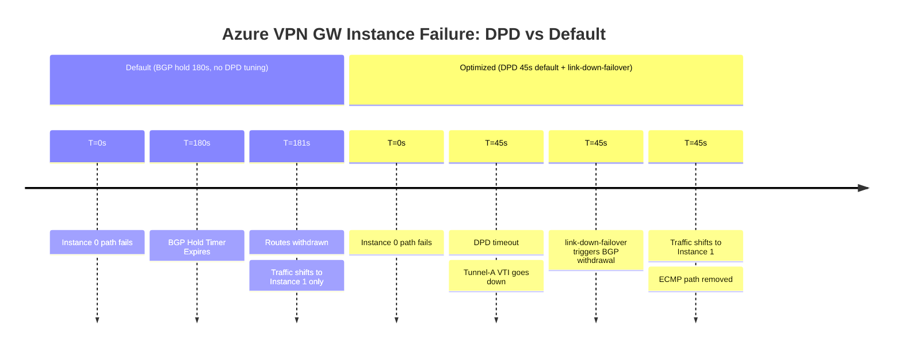

# FortiGate: BGP over Azure VPN Gateway (Active-Active ECMP)

An active-active Azure VPN Gateway deploys two gateway instances simultaneously.
Combined with `ebgp-multipath` on the FortiGate, both IPsec tunnels carry traffic
in parallel. BFD is not supported on the VPN overlay; DPD with `link-down-failover`
provides sub-30-second failure detection per tunnel.

---

## 1. Failure Detection Timeline (Gateway Instance Failure)

Azure VPN Gateway uses **fixed BGP timers** — keepalive 60s, hold 180s — which
cannot be changed on the Azure side. FortiGate must be configured to match (60s/180s).
DPD is configured locally on FortiGate; Azure's default DPD timeout is 45 seconds
(configurable 9–3600s). The BGP hold-timer (180s) comfortably exceeds the DPD
timeout, so double reconvergence is not a risk at these settings.



---

## 2. FortiGate CLI Configuration (Active-Active)

### A. Phase 1 — Dual Tunnel to Gateway Instances

Azure VPN Gateway in active-active mode exposes two private IP endpoints reachable
via ExpressRoute private peering. Each FortiGate tunnel connects to one instance.

```fortios
config vpn ipsec phase1-interface
    edit "azure-aa-tunnel-a"
        set interface "port1"
        set ike-version 2
        set keylife 28800
        set proposal aes256-sha256
        set dhgrp 2
        set remote-gw 172.16.0.2          # Instance 0 private IP via ExpressRoute
        set psksecret <PRE-SHARED-KEY-A>
        set dpd on-idle
        set dpd-retryinterval 5
        set dpd-retrycount 3
        set npu-offload enable
    next
    edit "azure-aa-tunnel-b"
        set interface "port1"
        set ike-version 2
        set keylife 28800
        set proposal aes256-sha256
        set dhgrp 2
        set remote-gw 172.16.0.6          # Instance 1 private IP via ExpressRoute
        set psksecret <PRE-SHARED-KEY-B>
        set dpd on-idle
        set dpd-retryinterval 5
        set dpd-retrycount 3
        set npu-offload enable
    next
end
```

### B. BGP with ECMP & Link-Down Failover

Azure VPN Gateway default ASN is `65515`. Enable `ebgp-multipath` to install
both tunnel paths as equal-cost forwarding entries.

```fortios
config router bgp
    set as 65000
    set ebgp-multipath enable
    set graceful-restart enable
    set graceful-restart-time 120
    set graceful-stalepath-time 120

    config neighbor
        edit "169.254.21.1"
            set description "AZURE-VPN-GW-INSTANCE-0"
            set remote-as 65515
            set bfd disable                   # BFD not supported on VPN overlay
            set link-down-failover enable
            set soft-reconfiguration enable
            set capability-graceful-restart enable
            # Azure fixed timers: keepalive 60s, hold 180s — must match on FortiGate
            set timers-keepalive 60
            set timers-holdtime 180
        next
        edit "169.254.22.1"
            set description "AZURE-VPN-GW-INSTANCE-1"
            set remote-as 65515
            set bfd disable
            set link-down-failover enable
            set soft-reconfiguration enable
            set capability-graceful-restart enable
            set timers-keepalive 60
            set timers-holdtime 180
        next
    end

    config network
        edit 1
            set prefix 10.0.0.0 255.0.0.0
        next
    end
end
```

---

## 3. Azure-Specific Principles

### A. APIPA BGP Addressing

Active-active gateways use APIPA addresses for BGP peering. These must be
explicitly configured on each Azure VPN connection under **Custom BGP IP** and
matched on the FortiGate tunnel interface:

| Instance | Azure BGP IP | FortiGate Tunnel IP |
| --- | --- | --- |
| Instance 0 | `169.254.21.1` | `169.254.21.2` |
| Instance 1 | `169.254.22.1` | `169.254.22.2` |

```fortios
config system interface
    edit "azure-aa-tunnel-a"
        set ip 169.254.21.2 255.255.255.255
        set remote-ip 169.254.21.1 255.255.255.255
        set allowaccess ping
        set src-check loose
    next
    edit "azure-aa-tunnel-b"
        set ip 169.254.22.2 255.255.255.255
        set remote-ip 169.254.22.1 255.255.255.255
        set allowaccess ping
        set src-check loose
    next
end

config system zone
    edit "ZONE_AZURE_VPN"
        set interface "azure-aa-tunnel-a" "azure-aa-tunnel-b"
    next
end
```

### B. Asymmetric Return Traffic and Zone Grouping

Azure may return traffic via either gateway instance regardless of which tunnel
was used outbound. Without zone grouping, the FortiGate state table rejects
return packets arriving on the unexpected interface. Grouping both VTIs in
`ZONE_AZURE_VPN` and enabling loose RPF resolves this.

### C. No BFD on the VPN Overlay

Azure VPN Gateway does not support BFD on IPsec VPN connections. Detection relies
entirely on DPD. BFD is available only on the ExpressRoute underlay (Cisco IOS-XE
to MSEE) — see the [BGP Stack flagship guide](bgp_stack_vpn_over_expressroute.md)
for Cisco underlay BFD configuration.

### D. MTU and MSS Clamping

ExpressRoute private peering MTU is 1500. IPsec overhead (ESP + IKEv2) reduces
the effective payload. Clamp MSS on the FortiGate VTI interfaces:

```fortios
config system interface
    edit "azure-aa-tunnel-a"
        set mtu-override enable
        set mtu 1500
    next
end
```

Recommended MSS clamp value: **1350 bytes** to account for IPsec + IP + TCP headers.

---

## 4. Verification & Troubleshooting

| Command | Purpose |
| :--- | :--- |
| `get router info bgp summary` | Confirm both BGP peers established and ECMP active |
| `get router info routing-table database` | Expect two entries for the Azure VNet prefix (one per tunnel) |
| `diagnose vpn tunnel list` | Verify both IKEv2 SAs are active and NPU offloaded |
| `get system session list` | Confirm sessions in `ZONE_AZURE_VPN` |
| `diagnose sniffer packet any 'port 4500' 4` | Confirm ESP traffic flowing over both tunnels |
