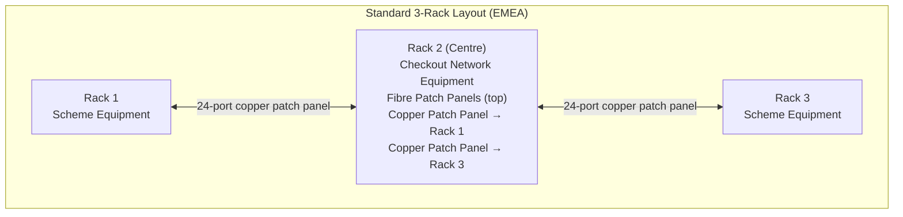
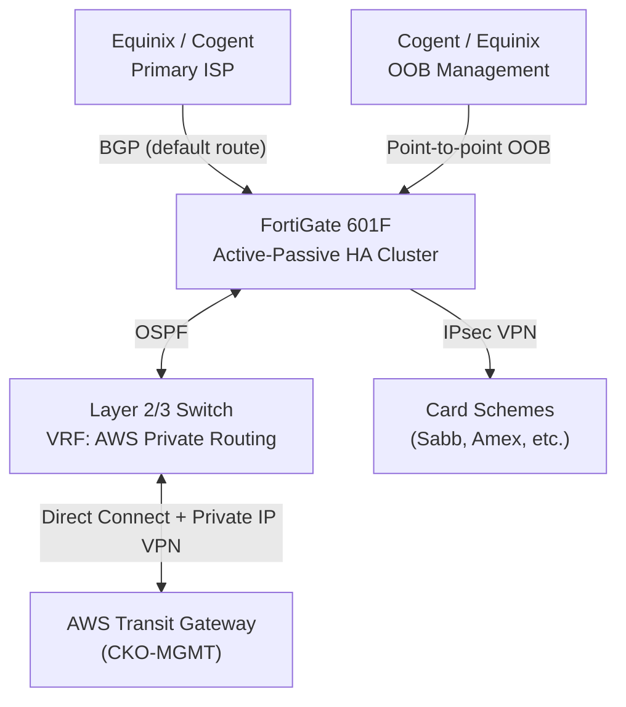

# Datacenter Physical Architecture

Standard architecture for Checkout-managed datacenters. This document covers physical
co-location design, rack configuration, internet connectivity strategy, and network
infrastructure design. NetBox is the authoritative source of truth for all site-specific
details (rack IDs, IP assignments, device inventory).

---

## Datacenter Provider

Equinix is the primary datacenter provider across all Checkout-managed sites. Selection
criteria: global presence, high uptime, and direct low-latency connectivity to AWS, Azure,
and Google Cloud via Equinix Fabric and the Cloud Exchange (ECX).

---

## Regional ISP Strategy

Internet connectivity roles are reversed between regions to spread risk across providers.

| Region | Primary Internet | Out-of-Band Management |
| --- | --- | --- |
| EMEA | Equinix (2× redundant BGP) | Cogent Communications (point-to-point) |
| APAC | Cogent Communications (2× redundant BGP) | Equinix (point-to-point) |
| North America | Cogent Communications (2× redundant BGP) | Equinix (point-to-point) |

**Primary internet:** Two redundant connections with BGP peering to learn default routes
and advertise provider-assigned IP ranges. Dynamic routing allows real-time failover
between links.

**Out-of-band management:** Point-to-point connections without BGP, isolated from data
plane traffic. Provides independent management access during primary network outages.

---

## Physical Co-location Design

### Rack Configuration

**Three-rack layout (EMEA standard):**

- Centre rack houses all Checkout network equipment
- Flanking racks (1 and 3) are dedicated to scheme equipment
- Fibre patch panels at the top of each rack terminate ISP circuits and Equinix Fabric
  cross-connects
- Two 24-port copper patch panels in the centre rack connect to each adjacent rack
  one-to-one, using pre-assigned switch ports — eliminates manual patching directly into
  switches

**Two-rack layout (reduced footprint):**

Where only two racks are available, a split-rack design is used. The racks are
interconnected via 24-port copper patch panels with ports aligned one-to-one. Pre-assigned
switch port allocation maintains the same standardised build approach.

### Cabling

- **Fibre:** Cross-site and inter-site connections; ISP handoffs; Equinix Fabric
  cross-connects
- **Copper:** Internal inter-rack connections via patch panels

See [Cabling & Rack Standards](cabling-standards.md) for cable colour coding.

---

## Network Infrastructure

### FortiGate Firewalls

**FortiGate 601F** firewalls run in active-passive HA clusters at all datacenter sites.
See [High Availability Standards](ha-standards.md) for HA configuration.

**OSPF** is used between the FortiGate HA cluster and the datacenter switch. The switch
maintains a dedicated VRF for AWS private routing, keeping AWS traffic segregated from
the general routing table.

**Switch stacking** reduces spanning tree complexity and simplifies management by
presenting multiple physical switches as a single logical device.

### Card Scheme Connectivity

On-premises card providers (schemes physically present in the datacenter) are assigned
dedicated VLAN IDs and subnets. The FortiGate provides the gateway for these VLANs as
bonded sub-interfaces with VLAN tagging. This ensures clear Layer 2 segmentation between
scheme traffic and Checkout network traffic.

Card schemes not physically present (e.g. Sabb, Amex) are connected via IPsec VPN
tunnels. IP ranges advertised via BGP from the ISP are allocated to these tunnels.

### ISP BGP and IP Allocation

BGP sessions to ISPs serve two purposes:

1. Learn default routes for outbound internet traffic
1. Advertise provider-assigned public IP ranges used for IPsec VPN tunnel endpoints and
   cloud provider connectivity

---

## AWS Integration

### Architecture

AWS connectivity uses a combination of Direct Connect and AWS Private IP VPN:

- **Direct Connect (DX):** Dedicated circuit from the datacenter to AWS, providing
  consistent low-latency throughput. A Transit Virtual Interface (Transit VIF) is
  provisioned on the DX circuit.
- **Direct Connect Gateway:** Acts as a centralised hub connecting the Transit VIF to
  multiple VPCs and the AWS Transit Gateway.
- **AWS Transit Gateway (CKO-MGMT):** Aggregates routes from attached VPCs and advertises
  them to the datacenter via BGP.

### AWS Private IP VPN

IPsec VPN tunnels to AWS use private IP addresses over the Direct Connect circuit rather
than public internet endpoints. This keeps all AWS-bound traffic on the private DX path,
avoiding the public internet entirely.

Traffic from AWS card scheme services to the datacenter is routed through the IPsec VPN
over the dedicated DX circuit.

See [AWS Direct Connect Setup](../aws/aws_direct_connect_setup.md) and
[FortiGate to TGW VPN](../aws/fortigate_bgp_vpn_bfd.md) for configuration details.

---

## Source of Truth

**NetBox** is the authoritative inventory for all site-specific information:

- Rack IDs and U-position assignments per site
- Device inventory and hardware models
- IP address management (IPAM)
- Cable and patching records
- VLAN and prefix assignments

Always consult NetBox before making physical or IP addressing changes at a site.

---

## Related Standards

- [Cabling & Rack Standards](cabling-standards.md) — Cable colour coding
- [Equinix Port Standards](equinix-port-standards.md) — Equinix Fabric port configuration
- [Connectivity Standards](connectivity-standards.md) — ISP and cloud connectivity design
- [High Availability](ha-standards.md) — FortiGate HA cluster configuration
- [Naming Conventions](naming-conventions.md) — Device and interface naming
- [Equipment Standards](equipment-standards.md) — Hardware selection standards
- [AWS Direct Connect Setup](../aws/aws_direct_connect_setup.md)
- [FortiGate to TGW VPN](../aws/fortigate_bgp_vpn_bfd.md)
