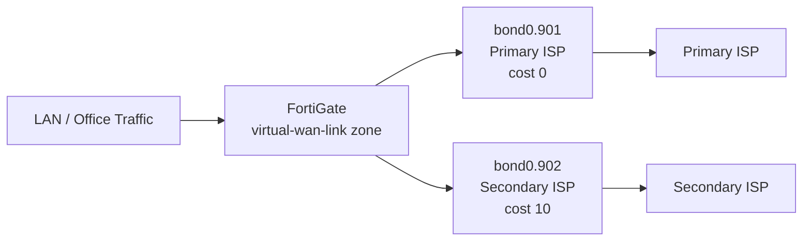

# SD-WAN Standards

FortiGate SD-WAN configuration for Checkout offices with dual ISP links. All office FortiGates
use two bonded subinterfaces (`bond0.901` and `bond0.902`) as SD-WAN members for primary and
secondary WAN redundancy.

---

## Architecture



Both members belong to the `virtual-wan-link` zone. The `Default_SD-WAN` rule routes all traffic
to the lowest-cost member currently meeting the `Default_DNS` SLA targets. If the primary ISP
fails SLA checks, traffic shifts automatically to the secondary.

---

## Zone and Members

| Parameter | Value | Notes |
| --- | --- | --- |
| Zone | `virtual-wan-link` | Default SD-WAN zone name |
| Member 1 | `bond0.901` | Primary ISP — cost 0 (default) |
| Member 2 | `bond0.902` | Secondary ISP — cost 10 |
| Load Balance Mode | `weight-based` | Global fallback when no rule matches |
| Gateway | Per ISP documentation | Configured per site |

**Zone and global settings:**

```fortios
config system sdwan
    set status enable
    set load-balance-mode weight-based
    config zone
        edit "virtual-wan-link"
        next
    end
end
```

**Members:**

```fortios
config system sdwan
    config members
        edit 1
            set interface "bond0.901"
            set gateway <PRIMARY_ISP_GATEWAY>
        next
        edit 2
            set interface "bond0.902"
            set gateway <SECONDARY_ISP_GATEWAY>
            set cost 10
        next
    end
end
```

Member 1 (bond0.901) uses cost 0 (FortiOS default — not explicitly set). Member 2 (bond0.902) is
assigned cost 10, making it the standby path when both members meet SLA.

---

## Performance SLA

A single DNS-based health check (`Default_DNS`) monitors all SD-WAN members using the FortiGate's
configured system DNS servers. No separate probe target IP is required.

| Parameter | Value | Notes |
| --- | --- | --- |
| Name | `Default_DNS` | Single probe covering all members |
| Protocol | DNS | Probes system DNS servers |
| Participants | All members | Both bond0.901 and bond0.902 |
| Check Interval | 1000 ms | |
| Probe Timeout | 1000 ms | |
| Failures before inactive | 5 | Member marked failed after 5 consecutive misses |
| Restore link after | 10 checks | Member recovered after 10 consecutive successes |
| Latency threshold | 250 ms | |
| Jitter threshold | 50 ms | |
| Packet loss threshold | 5% | |

```fortios
config system sdwan
    config health-check
        edit "Default_DNS"
            set system-dns enable
            set interval 1000
            set probe-timeout 1000
            set failtime 5
            set recoverytime 10
            set members 0
            config sla
                edit 1
                    set latency-threshold 250
                    set jitter-threshold 50
                    set packetloss-threshold 5
                next
            end
        next
    end
end
```

`set members 0` applies the probe to all SD-WAN members. `set system-dns enable` uses the DNS
servers from `config system dns` as probe targets.

---

## SD-WAN Rule

A single catch-all rule (`Default_SD-WAN`) routes all outbound traffic via the lowest-cost member
currently meeting `Default_DNS` SLA target 1.

| Parameter | Value | Notes |
| --- | --- | --- |
| Name | `Default_SD-WAN` | Catch-all for all outbound traffic |
| Mode | Lowest Cost (SLA) | `mode sla` — lowest cost among SLA-passing members |
| Destination | All | |
| Required SLA target | Default_DNS #1 | Member must pass SLA target 1 to be eligible |
| Priority members | 1, 2 | bond0.901 preferred when tied on cost |
| Zone | `virtual-wan-link` | |

```fortios
config system sdwan
    config service
        edit 1
            set name "Default_SD-WAN"
            set mode sla
            set dst "all"
            config sla
                edit "Default_DNS"
                    set id 1
                next
            end
            set priority-members 1 2
            set priority-zone "virtual-wan-link"
        next
    end
end
```

**Failover behaviour:** If bond0.901 fails the Default_DNS SLA (5 consecutive probe failures),
traffic shifts to bond0.902. When bond0.901 recovers (10 consecutive probe successes), it
reclaims traffic because it has the lower cost (0 vs 10).

---

## Verification

```fortios
! SLA probe status — latency, jitter, and packet loss per member
diagnose sys sdwan health-check

! SD-WAN member state and active session counts
diagnose sys sdwan member

! Which SD-WAN rule matched for active sessions
diagnose sys sdwan service

! Historical SLA performance log
diagnose sys sdwan intf-sla-log

! Full SD-WAN configuration summary
get system sdwan
```

---

## Related Standards

- [Equipment Configuration](equipment-config.md) — Base FortiGate interface and VLAN setup
- [High Availability](ha-standards.md) — FortiGate HA cluster configuration
- [Interface Configuration Standards](interface-standards.md) — bond0 and subinterface naming
- [BFD Standards](bfd-standards.md) — Sub-second link failure detection
