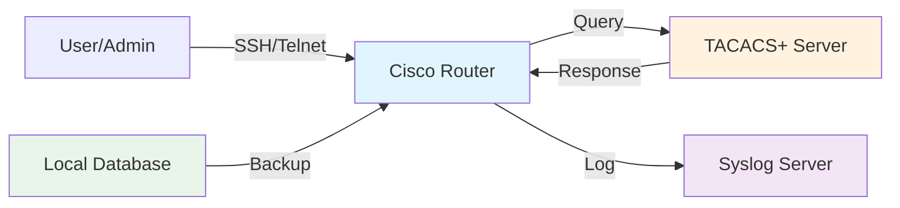

# Cisco IOS-XE AAA Configuration Guide

## 1. Overview

AAA (Authentication, Authorization, and Accounting) controls who can access network devices, what they
can do, and what actions are logged. Cisco IOS-XE supports local users and remote authentication
servers (TACACS+, RADIUS, LDAP).

**Key Functions:**

- **Authentication:** Verify user identity (username/password or certificate)
- **Authorization:** Control which commands users can execute (privilege levels)
- **Accounting:** Log user actions for audit and compliance

## 2. Architecture



**Typical Flow:**

1. User connects (SSH/console)
2. Router queries TACACS+/RADIUS server for credentials
3. Server validates and returns authorization level
4. Router logs the session to syslog server
5. If server unreachable, fall back to local database

## 3. Local Authentication

### Basic Local User Setup

```ios
aaa new-model
aaa authentication login default local
aaa authentication enable default enable

username admin privilege 15 secret ADMIN_PASSWORD
username operator privilege 5 secret OPERATOR_PASSWORD
username guest privilege 1 secret GUEST_PASSWORD
```

**Privilege Levels:**

- **0** = Logout
- **1** = User mode (limited read-only)
- **5** = Operator mode (reload, shutdown allowed)
- **15** = Enable mode (full access)

### Define Custom Privilege Levels

```ios
privilege exec level 8 configure terminal
privilege exec level 8 show running-config
privilege interface level 8 shutdown

username poweruser privilege 8 secret POWERUSER_PASSWORD
```

Creates privilege level 8 with selective commands:

- Can configure and view config
- Can shutdown interfaces
- Cannot change core settings

### Local Database with Console/VTY Separation

```ios
aaa authentication login CONSOLE-AUTH local
aaa authentication login REMOTE-AUTH tacacs+ local

line console 0
  login authentication CONSOLE-AUTH
  exec-timeout 0 0

line vty 0 4
  login authentication REMOTE-AUTH
  exec-timeout 10 0
  transport input ssh
```

## 4. TACACS+ Server Integration

### TACACS+ Configuration

```ios
aaa new-model
aaa authentication login default group tacacs+ local
aaa authentication enable default group tacacs+ enable
aaa authorization exec default group tacacs+ local
aaa authorization commands 15 default group tacacs+ local
aaa accounting exec default start-stop group tacacs+
aaa accounting commands 15 default start-stop group tacacs+

tacacs server TAC-SERVER-1
  address ipv4 192.0.2.10
  key SHARED_SECRET_123
  timeout 10
  port 49

tacacs server TAC-SERVER-2
  address ipv4 192.0.2.11
  key SHARED_SECRET_123
  timeout 10

ip tacacs source-interface Loopback0
```

**Key Settings:**

- **group tacacs+ local:** Try TACACS+, fall back to local
- **timeout 10:** Wait 10 seconds before failover
- **source-interface Loopback0:** Use loopback for consistent source IP
- **port 49:** Standard TACACS+ port

### TACACS+ Server Reachability

For server reachability checks:

```ios
tacacs server TAC-SERVER-1
  address ipv4 192.0.2.10
  key SHARED_SECRET_123
  single-connection
  timeout 5
end

ip route 192.0.2.0 255.255.255.0 192.168.1.1
! Ensure TACACS+ server is reachable
```

## 5. RADIUS Server Integration

### RADIUS Configuration

```ios
aaa new-model
aaa authentication login default group radius local
aaa authentication enable default group radius enable
aaa authorization exec default group radius local
aaa accounting exec default start-stop group radius

radius server RAD-SERVER-1
  address ipv4 192.0.2.20
  key RADIUS_SHARED_SECRET
  timeout 5
  retransmit 3

ip radius source-interface Loopback0
```

**RADIUS vs TACACS+:**

| Feature | TACACS+ | RADIUS |
| --- | --- | --- |
| Port | 49/TCP | 1812-1813/UDP |
| Encryption | All traffic | Password only |
| Authorization | Per-command | Per-user |
| Recommended | Enterprise | ISPs, Cloud |

## 6. LDAP Integration

### LDAP Configuration (Active Directory)

```ios
aaa new-model
aaa authentication login default group ldap local
aaa authorization exec default group ldap local

aaa group server ldap LDAP-AD
  server name ad.example.com
  server port 389
  conf-parser autoenable

ldap attribute-map example
  attribute sAMAccountName username
  attribute memberOf groupMembership

username admin privilege 15 secret LOCAL_FALLBACK
```

**LDAP Benefits:**

- Centralized user management (Active Directory)
- Group-based authorization
- No separate identity server needed

## 7. Authorization Models

### Command Authorization (Per-Command Access Control)

```ios
aaa authorization commands 0 default local
aaa authorization commands 1 default local
aaa authorization commands 5 default group tacacs+ local
aaa authorization commands 15 default group tacacs+ local
```

User privilege 5 can run level 0, 1, and 5 commands but NOT level 15 commands.

### Exec Authorization (Session Type Control)

```ios
aaa authorization exec default group tacacs+ local
```

TACACS+ server can control:

- Whether user gets shell access
- Initial privilege level
- Command restrictions

### Network Authorization (VPN/IP Access)

```ios
aaa authorization network default group radius local
```

Used for VPN clients; RADIUS server specifies allowed resources.

## 8. Accounting (Logging)

### Accounting Methods

```ios
! Log exec sessions (login, logout, privilege change)
aaa accounting exec default start-stop group tacacs+

! Log all commands at privilege 15
aaa accounting commands 15 default start-stop group tacacs+

! Log system events (reboot, config changes)
aaa accounting system default start-stop group tacacs+

! Log connection attempts (SSH, telnet)
aaa accounting connection default start-stop group tacacs+
```

**Accounting Types:**

- **start-stop:** Log when user logs in and logs out
- **stop-only:** Log only logout (less data)
- **none:** No accounting

## 9. Session Timeout

### Idle Timeout Configuration

```ios
line vty 0 4
  exec-timeout 10 30
  ! 10 minutes 30 seconds idle before disconnect
end

line console 0
  exec-timeout 0 0
  ! No timeout for console (use only for out-of-band access)
end

line aux 0
  exec-timeout 5 0
  ! 5 minutes for auxiliary ports
end
```

### Absolute Timeout

```ios
line vty 0 4
  absolute-timeout 480
  ! Disconnect after 480 minutes (8 hours) regardless of activity
end
```

## 10. Enable Password vs Secret

```ios
! Insecure (plaintext visible in config)
enable password MY_PASSWORD

! Secure (MD5 hashed)
enable secret MY_PASSWORD

! More secure (SCRYPT hashed)
enable secret algorithm-type scrypt MY_PASSWORD
```

Always use `secret` with `algorithm-type scrypt` for new configs.

## 11. Multi-Server Failover

### Multiple TACACS+ Servers with Failover

```ios
aaa new-model
aaa authentication login default group TACACS-SERVERS local
aaa authorization exec default group TACACS-SERVERS local
aaa accounting exec default start-stop group TACACS-SERVERS

aaa group server tacacs+ TACACS-SERVERS
  server 192.0.2.10
  server 192.0.2.11
  server 192.0.2.12
  ip tacacs source-interface Loopback0
  timeout 10
  key SHARED_SECRET
```

Router tries servers in order: 192.0.2.10 → 192.0.2.11 → 192.0.2.12 → local fallback.

## 12. Troubleshooting

### Debug AAA Authentication

```ios
debug aaa authentication
! Shows username/password verification attempts

debug aaa authorization
! Shows command authorization checks

debug tacacs
! Shows TACACS+ protocol messages

undebug all
! Disable all debugging
```

### Common Issues

#### Issue: Users can't log in

```ios
! Check authentication method order
show aaa methods

! Verify server reachability
ping 192.0.2.10

! Check if local fallback is enabled
show aaa servers

! Verify credentials
show running-config | include username
```

#### Issue: Users log in but can't run commands

```ios
! Check authorization is configured
show aaa authorization

! Verify privilege level
show privilege

! Check command authorization on server
debug aaa authorization
```

#### Issue: Server not responding

```ios
! Increase timeout
tacacs server TAC-SERVER-1
  timeout 15

! Or use connection pooling
aaa group server tacacs+ TACACS-SERVERS
  single-connection
  ! Reuse TCP connection to reduce latency
end
```

## 13. Best Practices

✅ **Do:**

- Use TACACS+ for centralized user management
- Configure fallback to local users for server outages
- Log all accounting to syslog server
- Use `enable secret` with scrypt hashing
- Separate authentication methods per line (console vs VTY)
- Require SSH only on VTY lines (no telnet)
- Use privilege levels to limit operator access

❌ **Don't:**

- Store plaintext passwords in config
- Use enable password (use enable secret)
- Allow telnet (use SSH only)
- Have single authentication server without fallback
- Use default privilege 15 for all users
- Enable AAA on console without local fallback

## 14. Examples

### Example 1: Small Network (Local Only)

```ios
aaa new-model
aaa authentication login default local
aaa authentication enable default enable

username admin privilege 15 secret AdminPass123!
username operator privilege 5 secret OperatorPass456!

line console 0
  login authentication default
  exec-timeout 5 0

line vty 0 4
  login authentication default
  exec-timeout 10 0
  transport input ssh
```

### Example 2: Enterprise (TACACS+ with Fallback)

```ios
aaa new-model
aaa authentication login default group TACACS-SERVERS local
aaa authorization exec default group TACACS-SERVERS local
aaa accounting exec default start-stop group TACACS-SERVERS

aaa group server tacacs+ TACACS-SERVERS
  server 10.0.0.100
  server 10.0.0.101
  ip tacacs source-interface Loopback0
  timeout 5

tacacs server TAC-PRIMARY
  address ipv4 10.0.0.100
  key EnterpriseSecret123!

tacacs server TAC-SECONDARY
  address ipv4 10.0.0.101
  key EnterpriseSecret123!

username fallback privilege 15 secret FallbackPass123!

line vty 0 4
  login authentication default
  exec-timeout 15 0
  transport input ssh
```

### Example 3: Mixed RADIUS + Local

```ios
aaa new-model
aaa authentication login RADIUS-AUTH group radius local
aaa authentication login LOCAL-AUTH local

radius server RADIUS-MAIN
  address ipv4 10.0.1.50
  key RadiusSecret456!
  timeout 5

line vty 0 4
  login authentication RADIUS-AUTH
  transport input ssh

line console 0
  login authentication LOCAL-AUTH
```

## 15. Verification Commands

```ios
show aaa methods
! Display current AAA method lists

show aaa servers
! Show configured servers and status

show tacacs
! TACACS+ server statistics

show radius
! RADIUS server statistics

show users
! Currently logged-in users and privilege levels

show running-config | include aaa
! Display all AAA configurations
```

## Next Steps

- Implement syslog logging (see [Syslog configuration guide](cisco_syslog_config.md))
- Configure SNMP for monitoring (see [SNMP configuration guide](cisco_snmp_config.md))
- Review minimal AAA template (see [AAA minimal](./aaa-minimal.md))
