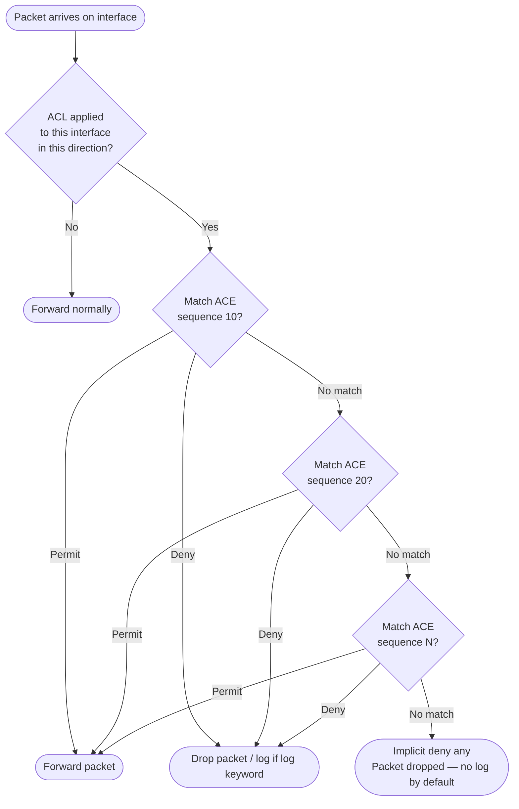

# Cisco IOS-XE: Access Control List (ACL) Configuration

ACLs are ordered lists of permit and deny statements evaluated top-to-bottom against
packet
header fields. They are used for traffic filtering on interfaces, VTY access control,
NAT
source matching, route-map classification, QoS marking, and VPN interesting-traffic
definitions. Every ACL has an implicit `deny any` at the end — traffic that matches no
explicit statement is dropped silently.

Related guides: [Cisco NAT Configuration](cisco_nat_config.md) and
[Cisco QoS Configuration](cisco_qos_config.md).

---

## 1. Overview & Principles

- **Evaluation order:** IOS-XE evaluates ACE (access control entries) from the lowest
  sequence number to the highest and stops at the first match. Entry order is critical —
  a broad permit before a specific deny will render the deny unreachable.

- **Implicit deny:** All ACLs end with an invisible `deny any` (or `deny ip any any` for
  extended). Traffic that does not match any explicit entry is dropped. Add an explicit
  `deny any log` as the last entry to generate log messages for dropped traffic.

- **Standard vs extended:** Standard ACLs match source IP only and are evaluated
quickly.

quickly.

  Extended ACLs match source/destination IP, protocol, and source/destination ports.

- **Placement:** Place standard ACLs close to the destination (they cannot specify the

destination, so applying them near the source may block traffic that should be permitted
  elsewhere). Place extended ACLs as close to the source as possible to drop unwanted
traffic early — inbound ACLs are more efficient than outbound because packets are
dropped
  before a routing decision is made.

- **Stateless:** ACLs are stateless. Return traffic must be explicitly permitted unless
  reflexive ACLs or Zone-Based Firewall is used.

---

## 2. ACL Processing Flow



---

## 3. Configuration

### A. Standard ACLs

Standard ACLs match on source IP address only. Numbered standard ACLs use ranges 1–99 and
1300–1999. Named standard ACLs are preferred — they are easier to identify and support
sequence-number editing.

Typical uses: VTY access control, NAT source matching, OSPF route filtering.

```ios

ip access-list standard ACL-MGMT-ACCESS
 10 permit 10.0.0.0 0.0.0.255        ! Management subnet
 20 permit 10.255.255.0 0.0.0.255    ! NOC subnet
 30 deny any log                     ! Explicit deny with logging — replaces implicit deny
!
! Numbered equivalent (functionally identical, harder to manage)
access-list 10 permit 10.0.0.0 0.0.0.255
access-list 10 permit 10.255.255.0 0.0.0.255
access-list 10 deny any log
```

### B. Extended ACLs

Extended ACLs match source and destination IP, protocol (IP, TCP, UDP, ICMP), and
source or destination port numbers. Numbered extended ACLs use ranges 100–199 and
2000–2699.

```ios

ip access-list extended ACL-INTERNET-IN
 10 permit tcp any host 203.0.113.10 eq 443    ! HTTPS to published web server
 20 permit tcp any host 203.0.113.10 eq 80     ! HTTP to published web server
 30 permit tcp any host 203.0.113.10 eq 25     ! SMTP inbound
 40 permit icmp any any echo-reply             ! Return ICMP — allow ping replies inbound
 50 permit icmp any any unreachable            ! Path MTU discovery and error messages
 60 deny ip any any log                        ! Explicit deny with logging
!
! Match on source port range — e.g., allow established TCP return traffic
ip access-list extended ACL-LAN-OUT
 10 permit tcp 10.0.0.0 0.0.255.255 any established  ! Established TCP (ACK or RST set)
 20 permit udp 10.0.0.0 0.0.255.255 any eq 53        ! DNS queries outbound
 30 permit udp 10.0.0.0 0.0.255.255 any eq 123       ! NTP
 40 permit icmp 10.0.0.0 0.0.255.255 any echo        ! Allow ping outbound
 50 deny ip any any log
```

### C. Named ACLs

Named ACLs (both standard and extended) use human-readable names instead of numbers.
They support all the same match criteria as numbered ACLs and additionally allow
individual lines to be removed and inserted by sequence number without deleting and
re-entering the entire ACL.

```ios

! Named standard ACL
ip access-list standard ACL-VPN-SOURCES
 10 permit 10.10.0.0 0.0.255.255
 20 permit 172.16.0.0 0.0.255.255
!
! Named extended ACL
ip access-list extended ACL-DMZACCESS
 10 permit tcp 10.0.10.0 0.0.0.255 10.0.50.0 0.0.0.255 eq 443
 20 permit tcp 10.0.10.0 0.0.0.255 10.0.50.0 0.0.0.255 eq 22
 30 deny ip any any log
```

### D. Sequence Numbers and Editing

Named ACLs support in-place editing using sequence numbers. Entries can be removed by
sequence number and new entries inserted between existing ones without rewriting the ACL.

```ios

! View current ACL with sequence numbers
! show ip access-lists ACL-INTERNET-IN

! Remove a specific entry by sequence number
ip access-list extended ACL-INTERNET-IN
 no 30                               ! Removes ACE at sequence 30

! Insert a new entry between sequences 20 and 40
ip access-list extended ACL-INTERNET-IN
 25 permit tcp any host 203.0.113.10 eq 587   ! SMTP submission — inserted at sequence 25

! Resequence an ACL (reset starting number and increment)
! Useful after many insertions leave gaps or compressed sequences
ip access-list resequence ACL-INTERNET-IN 10 10  ! Start at 10, increment by 10
```

### E. Applying ACLs to Interfaces

ACLs are applied to interfaces in a direction — `in` processes traffic arriving on the
interface, `out` processes traffic leaving. Only one ACL per direction per protocol
(IPv4/IPv6) can be applied to an interface at a time.

Inbound ACLs are more efficient because packets are dropped before a routing lookup is
performed. Apply inbound ACLs on the interface closest to the traffic source.

```ios

interface GigabitEthernet0/0
 description ISP uplink
 ip access-group ACL-INTERNET-IN in   ! Filter inbound traffic from internet
 ip access-group ACL-INTERNET-OUT out ! Filter outbound traffic to internet
!
interface GigabitEthernet0/1
 description LAN
 ip access-group ACL-LAN-OUT out      ! Filter traffic being delivered to the LAN
!
! Remove an ACL from an interface
interface GigabitEthernet0/0
 no ip access-group ACL-INTERNET-IN in
```

### F. VTY Access Control

Restricting VTY (Telnet/SSH) access with an ACL is a baseline hardening requirement.
The `access-class` command applies a standard ACL to VTY lines — only traffic matching
the permit entries can establish a management session.

```ios

ip access-list standard ACL-VTY
 10 permit 10.0.0.0 0.0.255.255      ! Management and NOC subnets
 20 permit 10.255.255.0 0.0.0.255
 30 deny any log                     ! Log blocked management attempts
!
line vty 0 4
 access-class ACL-VTY in             ! Apply inbound — restricts who can connect
 transport input ssh                 ! SSH only; no Telnet
!
line vty 5 15
 access-class ACL-VTY in
 transport input ssh
```

### G. Time-Based ACLs

Time-based ACLs activate or deactivate entries based on a defined time range. Requires
accurate NTP synchronisation on the device — incorrect clock state will cause the policy
to apply at the wrong time.

```ios

! Define a time range
time-range BUSINESS-HOURS
 periodic weekdays 08:00 to 18:00    ! Monday–Friday 08:00–18:00
!
time-range WEEKEND
 periodic weekend 00:00 to 23:59     ! All day Saturday and Sunday
!
! Reference time range in an ACL entry
ip access-list extended ACL-GUEST-INTERNET
 10 permit ip 10.100.0.0 0.0.0.255 any time-range BUSINESS-HOURS
 20 deny ip any any log
!
! Verify time range state (active/inactive)
! show time-range
```

### H. Reflexive ACLs

Reflexive ACLs provide basic stateful return-traffic matching without a full firewall.
An outbound ACL uses the `reflect` keyword to create a temporary, dynamic entry that
permits matching return traffic. The dynamic entry is referenced in the inbound ACL with
`evaluate` and expires when the session ends.

Reflexive ACLs support TCP, UDP, and ICMP. For modern IOS-XE deployments, Zone-Based
Firewall (ZBF) or CBAC is preferred — reflexive ACLs do not handle complex protocols such
as FTP or SIP that embed address information in the payload.

```ios

! Outbound ACL — initiates reflexive entries for outbound sessions
ip access-list extended ACL-OUT-REFLECT
 10 permit tcp 10.0.0.0 0.0.255.255 any reflect REFLECT-TCP
 20 permit udp 10.0.0.0 0.0.255.255 any reflect REFLECT-UDP
 30 permit icmp 10.0.0.0 0.0.255.255 any reflect REFLECT-ICMP
!
! Inbound ACL — evaluates dynamic reflexive entries for return traffic
ip access-list extended ACL-IN-EVALUATE
 10 evaluate REFLECT-TCP             ! Permit return TCP matching reflexive entries
 20 evaluate REFLECT-UDP
 30 evaluate REFLECT-ICMP
 40 deny ip any any log
!
! Apply to interface
interface GigabitEthernet0/0
 ip access-group ACL-OUT-REFLECT out
 ip access-group ACL-IN-EVALUATE in
!
! Reflexive entry timeout (default 300s for TCP, 300s for UDP)
ip reflexive-list timeout 120
```

### I. Object Groups

Object groups (IOS-XE 15.0+) allow network addresses and services to be defined once and
referenced in multiple ACL entries. This significantly reduces ACL line count in environments
with many hosts or services that share the same policy.

```ios

! Network object group — list of hosts or subnets
object-group network OBJ-WEB-SERVERS
 host 10.0.50.10
 host 10.0.50.11
 10.0.50.0 255.255.255.0             ! Subnet notation also supported
!
object-group network OBJ-MGMT-STATIONS
 host 10.0.0.100
 10.0.0.0 255.255.255.0
!
! Service object group — list of protocols and ports
object-group service OBJ-WEB-PORTS
 tcp eq 80
 tcp eq 443
 tcp eq 8080
!
! Use object groups in an ACL entry — one line covers all combinations
ip access-list extended ACL-TO-WEB
 10 permit object-group OBJ-WEB-PORTS object-group OBJ-MGMT-STATIONS object-group OBJ-WEB-SERVERS
 20 deny ip any any log
```

---

## 4. Comparison Summary

| ACL type | Match criteria | Typical use | Line editing | Stateful |
| :--- | :--- | :--- | :--- | :--- |
| **Standard (numbered)** | Source IP only | Legacy NAT source lists, simple route filters | No — must delete and re-enter | No |
| **Standard (named)** | Source IP only | VTY access control, NAT ACLs, OSPF distribute-list | Yes — sequence numbers | No |
| **Extended (named)** | Src/dst IP, protocol, src/dst port, DSCP, ToS | Interface filtering, QoS classification, VPN interesting traffic | Yes — sequence numbers | No |
| **Reflexive** | Session state via reflect &#124; evaluate | Basic stateful return-traffic permit without a firewall | Limited | Yes — session-based dynamic entries |

---

## 5. Verification & Troubleshooting

| Command | Purpose |
| :--- | :--- |
| `show ip access-lists` | All ACLs with sequence numbers and per-entry hit counts |
| `show ip access-lists ACL-NAME` | Detail for a specific ACL — hit counts show which entries are matching |
| `show running-config &#124; section ip access-list` | All ACL definitions in running config |
| `show interfaces GigabitEthernet0/0 &#124; include access list` | Confirm which ACLs are applied to an interface |
| `show ip interface GigabitEthernet0/0` | Shows inbound and outbound ACL name per interface |
| `clear ip access-list counters` | Reset all hit counters — useful before testing a new policy |
| `clear ip access-list counters ACL-NAME` | Reset hit counters on a specific ACL only |
| `show time-range` | Time range status — shows whether each range is currently active or inactive |
| `show ip reflexive-list` | Dynamic reflexive entries — source, destination, protocol, remaining timeout |
| `show object-group` | All defined object groups and their members |
| `debug ip packet ACL-NAME detail` | Per-packet debug filtered by ACL — high CPU impact; restrict to a test host |
