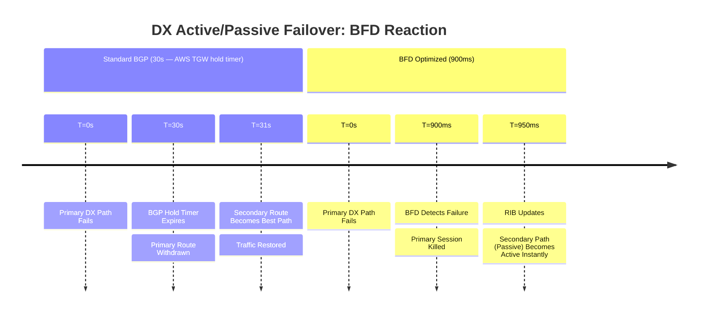

# Cisco IOS-XE: Active/Passive BGP over AWS Transit VIF

This document outlines the recommended settings for an Active/Passive failover design
between a Cisco IOS-XE router and an AWS Transit Gateway (TGW). This is preferred
over ECMP when you need deterministic traffic flow or want to avoid out-of-order
packets.

---

## 1. Failure Detection Timeline (Path Failover)

Even in an Active/Passive setup, BFD is required. Without it, the router would continue
to prefer the "Primary" path for up to 30 seconds after a failure, resulting in
a complete outage during that window. AWS TGW BGP timers are fixed at 10s keepalive /
30s hold — the Cisco session negotiates to these values regardless of local timer
config.



---

## 2. Cisco IOS-XE Configuration

### A. BFD Template (Same as ECMP)

```ios

bfd-template single-hop AWS-DX-BFD
 interval min-tx 300 min-rx 300 multiplier 3
!
```

### B. Influence Outbound Traffic (Local Preference)

We set a higher Local Preference for routes received on the Primary DX.

```ios

route-map RM-AWS-PRIMARY-IN permit 10
 set local-preference 200
!
route-map RM-AWS-SECONDARY-IN permit 10
 set local-preference 100
!
```

### C. Influence Inbound Traffic (AS-Path Prepending)

We prepend our own AS multiple times when advertising to the Secondary DX to make
it less attractive to AWS.

```ios

route-map RM-AWS-SECONDARY-OUT permit 10
 set as-path prepend 65000 65000 65000
!
```

### D. BGP Neighbor Configuration

Note the removal of `maximum-paths` to ensure only one route is installed in the
RIB.

```ios

router bgp 65000
 bgp log-neighbor-changes
 !
 neighbor 169.254.x.2 remote-as 64512
 neighbor 169.254.x.2 description AWS-TGW-PRIMARY
 neighbor 169.254.x.2 fall-over bfd
 neighbor 169.254.x.2 route-map RM-AWS-PRIMARY-IN in
 neighbor 169.254.x.2 timers 10 30
 neighbor 169.254.x.2 activate
 !
 neighbor 169.254.y.2 remote-as 64512
 neighbor 169.254.y.2 description AWS-TGW-SECONDARY
 neighbor 169.254.y.2 fall-over bfd
 neighbor 169.254.y.2 route-map RM-AWS-SECONDARY-IN in
 neighbor 169.254.y.2 route-map RM-AWS-SECONDARY-OUT out
 neighbor 169.254.y.2 timers 30 90
 neighbor 169.254.y.2 activate
!
```

---

## 3. Comparison Summary

| Metric | Active/Active (ECMP) | Active/Passive (Failover) |
| :--- | :--- | :--- |
| **Throughput** | Combined Bandwidth | Single Path Bandwidth |
| **Outbound Control** | Hashing (Equal) | Local Preference (Specific) |
| **Inbound Control** | Hashing (Equal) | AS-Path Prepending |
| **Switchover Speed** | ~900ms | ~900ms |
| **Traffic Path** | Non-deterministic | **Deterministic** |

---

## 4. Key Principles for Active/Passive Failover

### A. Symmetry is Goal #1

If traffic goes out the Primary DX but AWS sends it back via the Secondary DX (Asymmetric
Routing), you may experience issues with stateful firewalls.

- Use **Local Pref** to pick the "Exit".
- Use **AS-Path Prepending** to pick the "Entrance".

### B. AWS Community Alternative

Instead of AS-Path Prepending, you can use AWS BGP Communities to tell the TGW how
to prioritize your routes:

- `7224:7300` = High Preference (Use for Primary)
- `7224:7100` = Low Preference (Use for Secondary)

### C. BFD is Mandatory for Both

A common mistake is thinking Active/Passive doesn't need fast timers. If BFD isn't
used, your "Primary" path remains "the best" in the BGP table for 90 seconds after
it actually fails, causing a long outage while the router waits for the TCP session
to time out.

---

## 5. Verification Commands

| Command | Purpose |
| :--- | :--- |
| `show ip bgp 10.0.0.0` | Verify only one path is marked as `>` (Best) |
| `show ip bgp neighbors &#124; inc local-preference` | Verify the learned preference values |
| `show ip bgp neighbors 169.254.y.2 advertised-routes` | Confirm AS-Path prepending is active on Secondary |
| `show bfd neighbors` | Ensure detection is still active on both paths |
