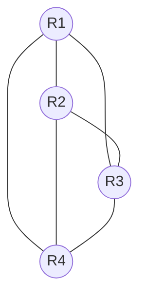
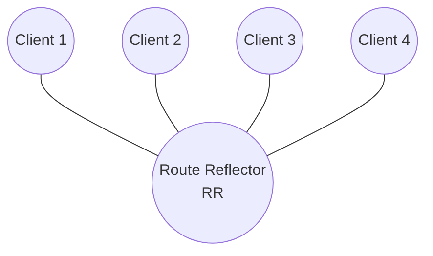
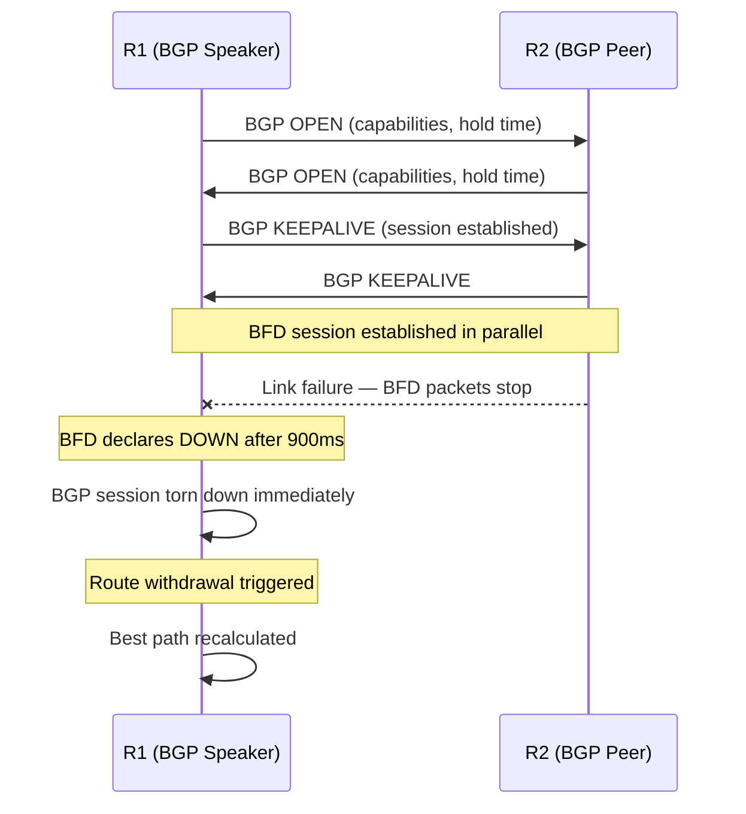

# Cisco IOS-XE: BGP and iBGP Design Guide

BGP (Border Gateway Protocol, RFC 4271) is the inter-domain routing protocol of the
internet.
It is a path-vector protocol that uses TCP (port 179) for session transport and
exchanges
reachability information as UPDATE messages carrying NLRI and path attributes. This
guide
covers BGP configuration for both eBGP (external peering) and iBGP (internal peering) on
IOS-XE, including route reflectors, next-hop-self, and the key design constraints that
make
iBGP different from eBGP.

For the theory behind these differences see [eBGP vs iBGP](../theory/ebgp_vs_ibgp.md); for
BGP path attributes see [BGP Path Selection](../reference/bgp_path_selection.md).

---

## 1. Overview & Principles

- **eBGP (External BGP):** Peers in different Autonomous Systems. TTL defaults to 1
(direct

(direct

link assumed). The AS number of the advertising router is prepended to AS_PATH on every
  eBGP advertisement. NEXT_HOP is set to the advertising router's interface IP.

- **iBGP (Internal BGP):** Peers within the same AS. TTL is 255 — multihop is implicit
and

and

  no `ebgp-multihop` statement is needed. iBGP does **not** prepend the local AS to
  AS_PATH and does **not** modify NEXT_HOP. This means iBGP peers must be able to reach
  the eBGP next-hop via the IGP, or `next-hop-self` must be configured.

- **iBGP split horizon:** A route learned from one iBGP peer is never re-advertised to

another iBGP peer. This rule prevents routing loops inside the AS but requires every
iBGP
speaker to hear every route from a peer that does originate it — leading to the
full-mesh
  requirement.

- **iBGP full mesh:** Every iBGP speaker must have a direct session to every other iBGP

speaker: n(n-1)/2 sessions. At 10 routers this is 45 sessions; at 50 routers it is 1225.
  This does not scale.

- **Route Reflectors (RR):** An RR relaxes split horizon for its clients — it reflects

routes received from a client to all other clients and to non-client iBGP peers. Clients
  need no special configuration and have no knowledge that they are behind an RR. This
  reduces session count to n (one session per client to the RR).

- **next-hop-self:** When a PE router receives a prefix from an eBGP peer, the NEXT_HOP

attribute is the eBGP peer's IP. Other iBGP routers typically cannot resolve that
external
IP via the IGP. `next-hop-self` on the PE rewrites NEXT_HOP to the PE's loopback, which
  all iBGP peers can reach via OSPF/IS-IS.

---

## 2. Architecture Diagrams

### iBGP Full Mesh — Does Not Scale Beyond ~6 Routers



4 routers require 6 sessions: n(n-1)/2 = 4 × 3 / 2 = 6. At 8 routers this becomes 28
sessions. Each session consumes memory and CPU for BGP keepalives, UPDATE processing, and
table maintenance.

### Route Reflector Design — Recommended



4 clients require 4 sessions total. The RR reflects routes between clients, eliminating
the need for any client-to-client sessions. Scaling is linear — adding a 5th client adds
one session to the RR, not four new client-to-client sessions.

---

## 3. Configuration

### A. Basic eBGP Peering

Explicit `router-id` prevents RID changes if a loopback is removed. `log-neighbor-changes`
is low-overhead and essential for diagnosing session flaps. Always apply inbound and outbound
route-maps on eBGP sessions — accepting or advertising without policy is a production risk.

```ios

router bgp 65000
 bgp router-id 10.255.255.1
 bgp log-neighbor-changes
 !
 neighbor 203.0.113.2 remote-as 65001
 neighbor 203.0.113.2 description ISP-UPSTREAM
 neighbor 203.0.113.2 password 7 <key>
 !
 address-family ipv4 unicast
  neighbor 203.0.113.2 activate
  neighbor 203.0.113.2 send-community both        ! Send standard and extended communities
  neighbor 203.0.113.2 route-map RM-EBGP-IN in
  neighbor 203.0.113.2 route-map RM-EBGP-OUT out
  network 10.0.0.0 mask 255.255.0.0               ! Advertise own prefix (must exist in RIB)
 exit-address-family
```

### B. iBGP Peering (Loopback-to-Loopback)

iBGP sessions should always use loopback addresses as the source and destination. A loopback
remains reachable as long as any path to the router exists — physical interface failures
do not tear down the BGP session if an alternate path is available via the IGP.

`update-source Loopback0` makes IOS-XE use the loopback as the TCP source IP for the BGP
session. `next-hop-self` rewrites the NEXT_HOP attribute on all advertised prefixes to the
local loopback, allowing iBGP peers to resolve the next-hop via the IGP rather than
requiring a route to the external peer's IP.

```ios

router bgp 65000
 bgp router-id 10.255.255.2
 bgp log-neighbor-changes
 !
 neighbor 10.255.255.3 remote-as 65000
 neighbor 10.255.255.3 description IBGP-PEER-R3
 neighbor 10.255.255.3 update-source Loopback0    ! Use loopback as TCP source
 !
 address-family ipv4 unicast
  neighbor 10.255.255.3 activate
  neighbor 10.255.255.3 next-hop-self             ! Rewrite eBGP next-hop to own loopback
  neighbor 10.255.255.3 send-community both
 exit-address-family
```

### C. Route Reflector Configuration

RR clients require no special configuration — they peer with the RR as a standard iBGP
session. Only the RR needs `route-reflector-client` statements. For loop prevention, the
RR adds the ORIGINATOR_ID attribute (set to the originating router's RID) and the
CLUSTER_LIST attribute (set to the RR's cluster-id) on every reflected route. A router
that receives a route with its own RID in ORIGINATOR_ID or its own cluster-id in
CLUSTER_LIST silently discards it.

```ios

! On the Route Reflector
router bgp 65000
 bgp router-id 10.255.255.10
 bgp cluster-id 1                               ! Identifies this RR cluster for loop prevention
 bgp log-neighbor-changes
 !
 neighbor 10.255.255.1 remote-as 65000
 neighbor 10.255.255.1 description RR-CLIENT-R1
 neighbor 10.255.255.1 update-source Loopback0
 neighbor 10.255.255.2 remote-as 65000
 neighbor 10.255.255.2 description RR-CLIENT-R2
 neighbor 10.255.255.2 update-source Loopback0
 neighbor 10.255.255.3 remote-as 65000
 neighbor 10.255.255.3 description RR-CLIENT-R3
 neighbor 10.255.255.3 update-source Loopback0
 !
 address-family ipv4 unicast
  neighbor 10.255.255.1 activate
  neighbor 10.255.255.1 route-reflector-client   ! Designate as RR client
  neighbor 10.255.255.1 next-hop-self
  neighbor 10.255.255.2 activate
  neighbor 10.255.255.2 route-reflector-client
  neighbor 10.255.255.2 next-hop-self
  neighbor 10.255.255.3 activate
  neighbor 10.255.255.3 route-reflector-client
  neighbor 10.255.255.3 next-hop-self
 exit-address-family
```

**Redundant RR pair:** Deploy two RRs with the same `bgp cluster-id`. Clients peer with
both RRs. Because both share the same cluster-id, neither will re-reflect routes that
already carry that cluster-id in their CLUSTER_LIST — preventing duplicate propagation.
Clients receive full table from both RRs and select best path normally.

### D. eBGP Multihop (Loopback Peering Across Multiple Hops)

By default, IOS-XE sends eBGP packets with TTL=1. If the eBGP peer is reachable only via
a loopback (one additional hop) or there are intermediate devices (firewall, load balancer)
in the peering path, `ebgp-multihop` raises the TTL. Use the lowest value that covers the
actual hop count.

```ios

router bgp 65000
 neighbor 10.255.255.5 remote-as 65002
 neighbor 10.255.255.5 description EBGP-MULTIHOP-PEER
 neighbor 10.255.255.5 ebgp-multihop 2           ! TTL=2 — peer is 1 routed hop away via loopback
 neighbor 10.255.255.5 update-source Loopback0
```

### E. BGP Timers

BGP uses keepalives (one-third of holdtime by default) and a holdtime to detect session
failures. The default 60/180 holdtime is slow for production networks; 10/30 is a common
operational tuning. BFD is preferred for fast failure detection — see Section F. Per-neighbor
timers override the global default.

```ios

router bgp 65000
 timers bgp 10 30                                ! Global: keepalive 10s, holdtime 30s
 !
 ! Per-neighbor override
 neighbor 10.255.255.3 timers 10 30
 neighbor 203.0.113.2 timers 60 180              ! Longer timers for less critical eBGP session
```

### F. BFD Integration

BFD decouples failure detection from BGP keepalive timers, delivering sub-second detection
without aggressive BGP timer tuning. `fall-over bfd` instructs BGP to immediately bring
down the session when BFD declares the path down.

```ios

router bgp 65000
 neighbor 10.255.255.3 fall-over bfd             ! iBGP peer with BFD
 neighbor 203.0.113.2 fall-over bfd              ! eBGP peer with BFD
!
bfd-template single-hop BGP-BFD
 interval min-tx 300 min-rx 300 multiplier 3     ! ~900ms detection
```



### G. Route Filtering and Policy

Prefix lists are more efficient than access lists for BGP filtering because they use
patricia-trie lookup rather than linear matching. Always apply both inbound and outbound
policy on eBGP sessions.

```ios

! Prefix list — accept only default route from eBGP peer
ip prefix-list PFX-ISP-IN seq 5 permit 0.0.0.0/0
ip prefix-list PFX-ISP-IN seq 10 deny 0.0.0.0/0 le 32  ! Deny everything else

! Set local-preference on inbound to influence exit selection within the AS
route-map RM-EBGP-IN permit 10
 match ip address prefix-list PFX-ISP-IN
 set local-preference 200

! AS-path prepending on outbound — make this path look longer to depreference
route-map RM-EBGP-OUT permit 10
 set as-path prepend 65000 65000               ! Prepend own AS twice
```

### H. Graceful Restart

BGP Graceful Restart (RFC 4724) allows a restarting router to retain its forwarding entries
during a BGP restart while signalling peers to preserve routes marked as stale. This
prevents a traffic black-hole during planned restarts (e.g. software upgrades).

```ios

router bgp 65000
 bgp graceful-restart                           ! Advertise GR capability to all peers
 bgp graceful-restart restart-time 120          ! How long peers wait before purging stale routes
 bgp graceful-restart stalepath-time 360        ! How long stale routes are kept after restart
```

### I. BGP Maximum-Paths (ECMP)

By default, BGP installs only one best path in the RIB. `maximum-paths` allows multiple
equal-cost paths to be installed for load balancing. `bgp bestpath as-path multipath-relax`
is required for eBGP ECMP when paths traverse different ASes (different AS_PATH lengths
would otherwise prevent equal-cost selection).

```ios

router bgp 65000
 address-family ipv4 unicast
  maximum-paths 8                               ! eBGP ECMP across up to 8 equal paths
  maximum-paths ibgp 8                          ! iBGP ECMP
  bgp bestpath as-path multipath-relax          ! Allow eBGP ECMP with different AS_PATH lengths
 exit-address-family
```

---

## 4. Comparison Summary

| Scenario | Sessions Required | Complexity | Notes |
| :--- | :--- | :--- | :--- |
| **4-router full mesh iBGP** | 6 | Low | Manageable at small scale |
| **8-router full mesh iBGP** | 28 | High | Operationally unmanageable |
| **16-router full mesh iBGP** | 120 | Very high | Not recommended |
| **8-router with 1 RR** | 8 | Low | All clients peer only with RR |
| **8-router with 2 RRs (redundant)** | 16 | Medium | Clients peer with both RRs; same cluster-id |
| **16-router with 2 RRs (redundant)** | 32 | Medium | Linear scaling — each new router adds 2 sessions |

---

## 5. Verification & Troubleshooting

| Command | Purpose |
| :--- | :--- |
| `show bgp summary` | All peers, state machine state, uptime, and prefixes received |
| `show bgp neighbors <ip>` | Full session detail: state, timers, capabilities, GR, BFD, message counters |
| `show bgp neighbors <ip> advertised-routes` | Prefixes currently being sent to this peer |
| `show bgp neighbors <ip> received-routes` | All prefixes received (requires `neighbor <ip> soft-reconfiguration inbound`) |
| `show bgp neighbors <ip> routes` | Received prefixes that passed inbound policy and are in the BGP table |
| `show bgp ipv4 unicast` | Full BGP table with all attributes and best-path markers |
| `show bgp ipv4 unicast <prefix>` | Best path and all paths for a specific prefix — shows attribute comparison |
| `show bgp ipv4 unicast summary` | Condensed peer table including AS, MsgRcvd, MsgSent, Up/Down, State/PfxRcd |
| `show bgp ipv4 unicast regexp _65001_` | Filter BGP table by AS_PATH regular expression |
| `show ip bgp neighbors <ip> &#124; include BFD` | Confirm BFD is registered for this BGP session |
| `clear ip bgp <ip> soft` | Trigger soft reset (re-sends UPDATE without tearing down session) |
| `debug ip bgp <ip> updates` | BGP UPDATE messages sent and received for a specific peer |
| `debug ip bgp events` | BGP session state transitions and event processing |
