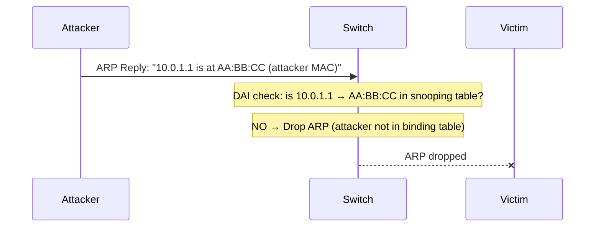
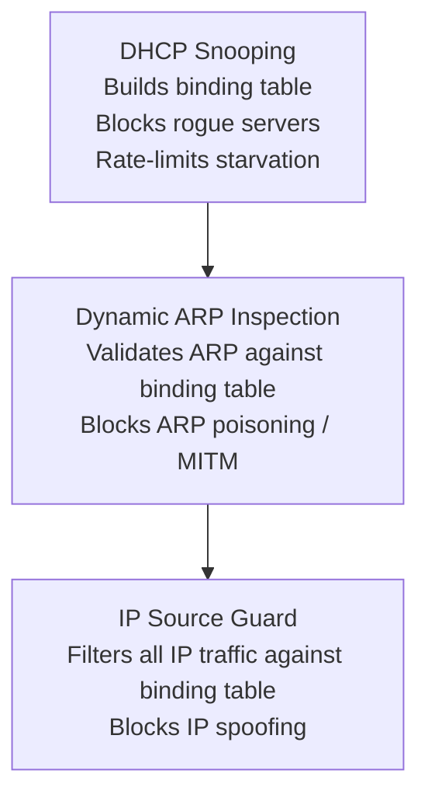

# Cisco IOS-XE: DHCP Server, Relay, and Snooping

This guide covers practical IOS-XE configuration for DHCP server, DHCP relay, and
the DHCP security stack — Snooping, Dynamic ARP Inspection (DAI), and IP Source Guard.
For the DHCP packet format and DORA exchange see [DHCP](../application/dhcp.md).

---

## 1. DHCP Server

IOS-XE can act as a DHCP server for directly connected subnets or for relayed
requests from remote subnets.

### A. Basic Pool Configuration

```ios
! Exclude addresses reserved for routers, printers, servers etc.
ip dhcp excluded-address 10.0.1.1 10.0.1.20

ip dhcp pool LAN-VLAN10
 network 10.0.1.0 255.255.255.0
 default-router 10.0.1.1
 dns-server 8.8.8.8 8.8.4.4
 domain-name corp.example.com
 lease 1 0 0                       ! 1 day, 0 hours, 0 minutes
```

Multiple pools can coexist. The server matches an incoming request to a pool by
comparing the `giaddr` (relay agent IP) or the receiving interface IP against the
pool's `network` statement.

### B. Static Bindings (Reserved Addresses)

Reserve a specific IP for a device by binding its MAC address:

```ios

ip dhcp pool HOST-PRINTER-01
 host 10.0.1.50 255.255.255.0
 client-identifier 0100.1122.3344.55   ! 01 prefix + MAC in hex
 default-router 10.0.1.1
```

Alternatively, use hardware-address format:

```ios

ip dhcp pool HOST-PRINTER-02
 host 10.0.1.51 255.255.255.0
 hardware-address 00:11:22:33:44:66
 default-router 10.0.1.1
```

### C. DHCP Options

Common per-pool options:

```ios

ip dhcp pool LAN-VLAN10
 network 10.0.1.0 255.255.255.0
 default-router 10.0.1.1
 dns-server 10.0.0.53
 ntp-server 10.0.0.123                 ! Option 42
 option 43 ascii "TFTP:10.0.0.100"    ! Option 43: vendor-specific (e.g. VoIP phones)
 option 66 ascii "10.0.0.100"          ! Option 66: TFTP server name (PXE boot)
 option 67 ascii "pxelinux.0"          ! Option 67: boot filename
```

### D. Verification

```ios

show ip dhcp pool                      ! Pool names, address ranges, utilisation
show ip dhcp binding                   ! Active leases: IP, MAC, expiry, type
show ip dhcp conflict                  ! IPs in conflict (declined by clients)
show ip dhcp server statistics         ! Message counts (discovers, offers, requests, acks)
clear ip dhcp binding *                ! Remove all active leases (use with caution)
clear ip dhcp conflict *               ! Clear conflict table
```

---

## 2. DHCP Relay (IP Helper-Address)

When the DHCP server is on a different subnet from the clients, the default gateway
router (or Layer 3 switch) must relay DHCP broadcasts to the server as unicast.

```ios

interface Vlan10
 ip address 10.0.1.1 255.255.255.0
 ip helper-address 10.0.0.100          ! DHCP server address
```

`ip helper-address` forwards UDP broadcasts for the following ports by default:
DHCP (67/68), TFTP (69), DNS (53), Time (37), NetBIOS (137/138), TACACS (49), and
IEN-116 Name Service (42). Only DHCP is needed in most environments; disable the
rest:

```ios

no ip forward-protocol udp 69         ! TFTP
no ip forward-protocol udp 53         ! DNS
no ip forward-protocol udp 37         ! Time
no ip forward-protocol udp 137        ! NetBIOS-NS
no ip forward-protocol udp 138        ! NetBIOS-DGM
no ip forward-protocol udp 49         ! TACACS
```

### Multiple DHCP Servers (Redundancy)

Specify multiple `ip helper-address` entries to forward requests to both servers:

```ios

interface Vlan10
 ip helper-address 10.0.0.100         ! Primary DHCP server
 ip helper-address 10.0.0.101         ! Secondary DHCP server
```

Both servers receive every DISCOVER. They should be configured with non-overlapping
address pools to avoid conflicts.

---

## 3. DHCP Snooping

DHCP snooping prevents rogue DHCP servers and DHCP starvation attacks by validating
DHCP messages on a per-port basis.

### The Problem

On an unprotected switch, any device can:

- **Rogue server:** Respond to DHCP Discovers with malicious offers (wrong gateway,

  DNS server pointing to an attacker — effectively a man-in-the-middle).

- **Starvation attack:** Send thousands of DHCP Discovers with spoofed source MACs,

  exhausting the server's address pool so legitimate devices cannot get an address.

### Trusted vs Untrusted Ports

DHCP snooping categorises every switch port as either **trusted** or **untrusted**:

| Port type | Trusted | Untrusted |
| --- | --- | --- |
| Uplinks to routers/distribution | ✓ | |
| Ports toward DHCP servers | ✓ | |
| Access ports toward end hosts | | ✓ |
| Ports toward unknown devices | | ✓ |

On untrusted ports, the switch:

- Drops any DHCP **server** messages (OFFER, ACK, NAK) — only servers should send these
- Validates that the source MAC in the Ethernet frame matches the `chaddr` field in

  the DHCP packet (anti-spoofing)

- Rate-limits DHCP packets to prevent starvation

The switch also builds a **DHCP snooping binding table**: for every successful ACK on
an untrusted port, it records `MAC → IP → VLAN → port → lease expiry`. This table is
used by DAI and IP Source Guard.

### Configuration

```ios

! Enable globally
ip dhcp snooping
ip dhcp snooping vlan 10,20,30         ! Enable per VLAN (not global by default)

! Trust uplinks and server-facing ports only
interface GigabitEthernet1/0/1         ! Uplink to distribution
 ip dhcp snooping trust

interface GigabitEthernet1/0/2         ! Port toward DHCP server
 ip dhcp snooping trust

! Rate-limit on untrusted access ports (packets per second)
interface range GigabitEthernet1/0/10 - 48
 ip dhcp snooping limit rate 15        ! Drop if > 15 DHCP packets/sec per port
```

> **Option 82 (Relay Agent Information):** IOS-XE inserts Option 82 into DHCP packets
> forwarded by untrusted ports. Some DHCP servers reject packets with Option 82 unless
> configured to accept it. If clients are failing to get addresses, check:
>
> ```ios
> no ip dhcp snooping information option   ! Disable Option 82 insertion
> ```

### Binding Table Persistence

The binding table is lost on reload by default. Persist it to flash or a TFTP server:

```ios

ip dhcp snooping database flash:dhcp-snooping-db.txt
ip dhcp snooping database write-delay 60   ! Write every 60 seconds
```

### Verification

```ios

show ip dhcp snooping                      ! Global status, trusted ports, option 82 state
show ip dhcp snooping binding              ! Binding table: MAC, IP, VLAN, interface, expiry
show ip dhcp snooping statistics           ! Forwarded/dropped message counts per reason
```

---

## 4. Dynamic ARP Inspection (DAI)

DAI uses the DHCP snooping binding table to validate ARP packets. Without DAI, any
host can send gratuitous ARPs claiming any IP address — poisoning the ARP cache of
other hosts and enabling man-in-the-middle attacks.

DAI intercepts ARP Requests and Replies on untrusted ports and checks the sender IP +
sender MAC against the snooping binding table. If the combination is not in the table,
the ARP is dropped.



### Configuration

DHCP snooping must be enabled before DAI:

```ios

! DAI requires snooping to be enabled first
ip dhcp snooping
ip dhcp snooping vlan 10,20,30

! Enable DAI per VLAN
ip arp inspection vlan 10,20,30

! Trust uplinks (same ports trusted for snooping)
interface GigabitEthernet1/0/1
 ip arp inspection trust

! Rate-limit ARP on untrusted ports (default 100 pps)
interface range GigabitEthernet1/0/10 - 48
 ip arp inspection limit rate 100

! Optional: validate additional ARP fields
ip arp inspection validate src-mac dst-mac ip
```

`ip arp inspection validate` options:

- `src-mac`: Ethernet source MAC must match ARP sender MAC
- `dst-mac`: Ethernet destination MAC must match ARP target MAC (for replies)
- `ip`: Drop ARPs with invalid IPs (0.0.0.0, 255.255.255.255, multicast)

### Static ARP Bindings (for devices with static IPs)

Devices with statically configured IPs have no DHCP snooping entry. Add them via
an ARP ACL:

```ios

arp access-list STATIC-DEVICES
 permit ip host 10.0.1.50 mac host 00:11:22:33:44:55
 permit ip host 10.0.1.51 mac host 00:11:22:33:44:66

ip arp inspection filter STATIC-DEVICES vlan 10
```

### Verification

```ios

show ip arp inspection                     ! Global DAI status, trusted ports
show ip arp inspection vlan 10             ! Per-VLAN forwarded/dropped ARP counts
show ip arp inspection statistics          ! Detailed drop reasons
```

---

## 5. IP Source Guard

IP Source Guard extends snooping to the data plane: it filters all IP traffic (not
just ARP and DHCP) on untrusted ports using the binding table. Only packets with a
source IP matching the binding table entry for that port are forwarded; all other IP
traffic is dropped.

This prevents IP spoofing — a host cannot send traffic claiming to be from another
IP address even if ARP inspection is satisfied.

```ios

! Enable on untrusted access ports
interface range GigabitEthernet1/0/10 - 48
 ip verify source                          ! Filter by IP only
 ! ip verify source port-security         ! Filter by IP + MAC (stricter)
```

For devices with static IPs, add a static binding:

```ios

ip source binding 001122334455 vlan 10 10.0.1.50 interface GigabitEthernet1/0/20
```

### Verification

```ios

show ip verify source                      ! IP Source Guard bindings per interface
show ip source binding                     ! All static and dynamic bindings
```

---

## 6. The Security Stack Together

DHCP Snooping, DAI, and IP Source Guard are designed to work as a layered stack.
Each builds on the previous layer's binding table:



Deploy in this order:

1. Enable DHCP snooping and verify the binding table is populating correctly
2. Enable DAI and confirm legitimate ARP traffic is passing
3. Enable IP Source Guard last — it is the most disruptive if misconfigured

---

## 7. Complete Example

A 48-port access switch serving VLAN 10 (users) and VLAN 20 (printers), with uplinks
to a distribution switch and a DHCP server on VLAN 99:

```ios

! DHCP Snooping
ip dhcp snooping
ip dhcp snooping vlan 10,20
no ip dhcp snooping information option    ! Disable Option 82 if server doesn't accept it

! DAI
ip arp inspection vlan 10,20
ip arp inspection validate src-mac dst-mac ip

! Uplink — trusted for both snooping and DAI
interface GigabitEthernet1/0/1
 description Uplink to Distribution
 ip dhcp snooping trust
 ip arp inspection trust

! DHCP server port — trusted
interface GigabitEthernet1/0/2
 description DHCP Server
 ip dhcp snooping trust
 ip arp inspection trust

! Access ports — untrusted, rate-limited, source guard enabled
interface range GigabitEthernet1/0/10 - 48
 switchport mode access
 ip dhcp snooping limit rate 15
 ip arp inspection limit rate 100
 ip verify source

! Persist binding table across reloads
ip dhcp snooping database flash:snooping-db.txt
ip dhcp snooping database write-delay 60
```

---

## 8. Verification Summary

| Command | Purpose |
| :--- | :--- |
| `show ip dhcp snooping` | Global snooping status and trusted port list |
| `show ip dhcp snooping binding` | Active binding table (MAC / IP / VLAN / port) |
| `show ip dhcp snooping statistics` | Dropped packet counts and reasons |
| `show ip arp inspection` | DAI status and trusted ports |
| `show ip arp inspection statistics vlan <id>` | ARP forwarded/dropped per VLAN |
| `show ip verify source` | IP Source Guard bindings per interface |
| `show ip dhcp conflict` | IPs declined by clients (probe-detected conflicts) |
| `show ip dhcp binding` | All active DHCP server leases |
