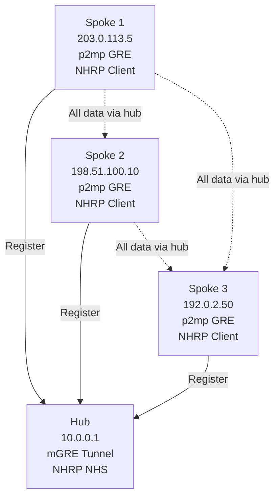
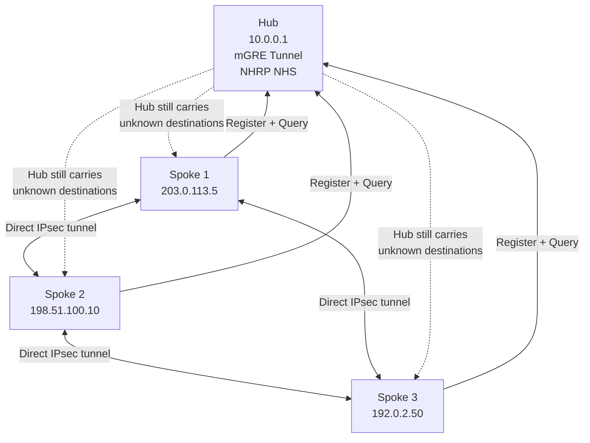

# Cisco DMVPN Configuration Guide

Complete reference for deploying DMVPN (Dynamic Multipoint VPN) on Cisco IOS-XE routers covering
hub and spoke tunnel setup, NHRP registration and resolution, IPsec encryption, EIGRP routing,
and dual-hub redundancy for sub-second failover.

For DMVPN theory see [DMVPN Fundamentals](../theory/dmvpn.md). For IPsec details see [IPsec &
IKE](../theory/ipsec.md).

---

## 1. Overview

This guide covers:

- **DMVPN Phases 1, 2, 3**: Hub-and-spoke (Phase 1) through dynamic spoke-to-spoke (Phase 3)
- **Hub Configuration**: mGRE tunnel interface, NHRP NHS (Next Hop Server), IPsec profile
- **Spoke Configuration**: Point-to-multipoint GRE tunnel, NHRP registration/resolution, IPsec
- **EIGRP Over DMVPN**: Split-horizon handling per phase, summarization strategies
- **Dual-Hub Redundancy**: Two-hub failover with NHRP multi-NHS and routing metrics
- **Verification & Troubleshooting**: show/debug commands for tunnel, NHRP, and routing state

---

## 2. Architecture Diagrams

### Phase 1: Hub-and-Spoke (All Traffic Via Hub)



### Phase 2/3: Dynamic Spoke-to-Spoke (Direct Tunnels)



---

## 3. Configuration

### A. Hub Tunnel Interface (mGRE, NHRP NHS)

```ios
configure terminal

interface Tunnel0
  description "DMVPN Hub - Phase 1/2/3"
  ! mGRE tunnel accepts packets from any source
  tunnel mode gre multipoint
  tunnel source 10.0.0.1
  tunnel key 100
  ! IP address for tunnel (routing will use this)
  ip address 10.2.0.1 255.255.255.0
  ! NHRP: Hub is the Next Hop Server (NHS)
  ip nhrp network-id 100
  ip nhrp authentication DMVPN_KEY
  ! Enable NHRP on this interface
  ip nhrp redirect
  ! NHRP shortcut for Phase 2/3 (allows direct spoke-to-spoke)
  ! Phase 1: Do NOT use 'ip nhrp redirect' (keeps traffic on hub)
  ! Phase 2: Use 'ip nhrp redirect' (hub sends NHRP redirects)
  ! Phase 3: Use 'ip nhrp redirect' (hub monitors and proactively sends shortcuts)
  !
  ! QoS and MTU
  ip mtu 1400
  ip tcp adjust-mss 1360
  ! Disable split-horizon for Phase 3 EIGRP
  ! (Phase 1/2 keep split-horizon enabled by default)
  no ip split-horizon eigrp 100

  ! IPsec encryption (applied via tunnel protection profile)
  tunnel protection ipsec profile DMVPN-PROFILE

  no shutdown

end
```

### B. Spoke Tunnel Interface (p2mp GRE, NHRP Client)

```ios
configure terminal

interface Tunnel0
  description "DMVPN Spoke - registers with hub"
  ! Point-to-multipoint GRE (points to hub)
  tunnel mode gre ip multipoint
  tunnel source 203.0.113.5           ! Spoke's own public IP
  tunnel destination 10.0.0.1         ! Hub's tunnel source IP
  tunnel key 100
  ip address 10.2.0.2 255.255.255.0   ! Unique tunnel IP for this spoke
  ! NHRP: This spoke registers with hub
  ip nhrp network-id 100
  ip nhrp authentication DMVPN_KEY
  ! Register this spoke's tunnel IP and NBMA (physical) IP with hub
  ip nhrp registration no-auth
  ! NHS: Designate hub as the Next Hop Server
  ip nhrp nhs 10.0.0.1 nbma 10.0.0.1
  ! Phase 2/3: Allow shortcut tunnels to other spokes
  ip nhrp shortcut
  !
  ! QoS and MTU
  ip mtu 1400
  ip tcp adjust-mss 1360
  !
  tunnel protection ipsec profile DMVPN-PROFILE

  no shutdown

end
```

### C. IPsec Profile (IKEv2 + AES-256-GCM)

```ios
configure terminal

! IKEv2 Proposal
crypto ikev2 proposal DMVPN-PROPOSAL
  encryption aes-cbc-256
  integrity sha256
  dh-group 14

! IKEv2 Policy
crypto ikev2 policy DMVPN-POLICY
  proposal DMVPN-PROPOSAL

! IKEv2 Keyring (for pre-shared-key authentication)
crypto ikev2 keyring DMVPN-KEYRING
  peer 0.0.0.0 0.0.0.0
    pre-shared-key DMVPN_IKEV2_KEY

! IKEv2 Profile
crypto ikev2 profile DMVPN-IKE-PROFILE
  match fvrf any
  match identity remote address 0.0.0.0
  authentication remote pre-share
  authentication local pre-share
  keyring DMVPN-KEYRING
  lifetime 3600
  dpd 10 3 on

! IPsec Transform Set (encryption + integrity)
crypto ipsec transform-set DMVPN-TS esp-aes 256 esp-sha256-hmac
  mode transport

! IPsec Profile (applied to tunnel interface)
crypto ipsec profile DMVPN-PROFILE
  set transform-set DMVPN-TS
  set pfs group14
  set ikev2-profile DMVPN-IKE-PROFILE
  set security-association lifetime seconds 3600 kilobytes 512000

! Apply profile to tunnel interface
interface Tunnel0
  tunnel protection ipsec profile DMVPN-PROFILE

end
```

### D. EIGRP Over DMVPN (Phase 1 and Phase 2)

```ios
configure terminal

! EIGRP configuration for hub
router eigrp 100
  network 10.2.0.0 0.0.0.255         ! DMVPN tunnel network
  network 10.0.0.0 0.0.0.255         ! Hub local subnets

  address-family ipv4 unicast
    autonomous-system 100
    ! For Phase 1/2: Split-horizon is ENABLED by default (good)
    ! Hub will block EIGRP advertisements FROM spokes TO other spokes
    ! This forces all spoke-to-spoke traffic to remain on hub

    ! Summarize local networks; advertise single aggregate to spokes
    aggregate-address 10.0.0.0 255.255.0.0

  exit-address-family

end
```

**Spoke EIGRP Config:**

```ios
configure terminal

router eigrp 100
  network 10.2.0.0 0.0.0.255         ! Tunnel interface
  network 10.1.0.0 0.0.0.255         ! Spoke local subnets

  address-family ipv4 unicast
    autonomous-system 100

  exit-address-family

end
```

### E. Phase 3 Configuration (Hub-Initiated Shortcuts + No Split-Horizon)

For Phase 3, the hub must proactively send NHRP shortcuts and disable split-horizon in EIGRP.

**Hub Phase 3 Tunnel Interface:**

```ios
interface Tunnel0
  ! Already configured as mGRE
  ! Add Phase 3 features:
  !
  ! Hub proactively sends shortcuts when it sees spoke-to-spoke traffic
  ip nhrp redirect
  ip nhrp advertise 600           ! Advertise every 10 minutes
  !
  ! Disable split-horizon so EIGRP advertisements flow between spokes
  no ip split-horizon eigrp 100
  !
  tunnel protection ipsec profile DMVPN-PROFILE

end
```

**Spoke Phase 3 Tunnel Interface:**

```ios
interface Tunnel0
  ! Already configured as p2mp GRE
  ! Add Phase 3 features:
  ip nhrp shortcut
  ip nhrp shortcut-target

end
```

**Hub EIGRP Phase 3:**

```ios
router eigrp 100
  ! Disable split-horizon on hub
  ! (splits routes learned from spokes back to spokes)
  no split-horizon eigrp 100

  ! Now spokes can learn remote networks directly from other spokes

end
```

### F. Dual-Hub Configuration (Redundancy)

Each spoke connects to two hubs, each with its own NHRP network-id. Spokes register with both and
query both for address resolution.

**Hub 1 Config:**

```ios
configure terminal

interface Tunnel0
  tunnel source 10.0.0.1
  tunnel mode gre multipoint
  tunnel key 100
  ip address 10.2.0.1 255.255.255.0
  ! Hub 1 operates as NHS
  ip nhrp network-id 100
  ip nhrp authentication DMVPN_KEY
  ip nhrp redirect
  ! Advertise Hub 1 routes to spokes with good metric
  tunnel protection ipsec profile DMVPN-PROFILE

end

router eigrp 100
  network 10.2.0.0 0.0.0.255
  ! Advertise hub local subnets and route to Hub 2 with good metric
  ! (makes Hub 1 preferred)

end
```

**Hub 2 Config:**

```ios
configure terminal

interface Tunnel0
  tunnel source 10.0.0.2
  tunnel mode gre multipoint
  tunnel key 100
  ip address 10.2.0.1 255.255.255.0  ! Same tunnel IP (SIP) as Hub 1
  ! Hub 2 also operates as NHS
  ip nhrp network-id 100
  ip nhrp authentication DMVPN_KEY
  ip nhrp redirect
  tunnel protection ipsec profile DMVPN-PROFILE

end

router eigrp 100
  network 10.2.0.0 0.0.0.255
  ! Advertise hub local subnets with worse metric
  ! (makes Hub 2 backup)

end
```

**Spoke Dual-Hub Config:**

```ios
interface Tunnel0
  tunnel mode gre ip multipoint
  tunnel source 203.0.113.5
  tunnel destination 10.0.0.1         ! Primary hub IP (will change to hub being used)
  tunnel key 100
  ip address 10.2.0.2 255.255.255.0
  !
  ! Register with BOTH hubs
  ip nhrp network-id 100
  ip nhrp authentication DMVPN_KEY
  ! NHS 1: Primary
  ip nhrp nhs 10.0.0.1 nbma 10.0.0.1
  ! NHS 2: Secondary
  ip nhrp nhs 10.0.0.2 nbma 10.0.0.2
  ! Allow shortcut to other spokes
  ip nhrp shortcut
  !
  tunnel protection ipsec profile DMVPN-PROFILE

end

router eigrp 100
  network 10.2.0.0 0.0.0.255
  network 10.1.0.0 0.0.0.255
  ! Use EIGRP AD + metrics to prefer Hub 1; Hub 2 is backup

end
```

When Hub 1 fails, the spoke's routing protocol (EIGRP/BGP) converges to Hub 2 within seconds.
NHRP queries are still sent to Hub 2; existing IPsec tunnels to other spokes are unaffected
(they remain up).

---

## 4. Phase Comparison Summary

| Feature | Phase 1 | Phase 2 | Phase 3 |
| --- | --- | --- | --- |
| **Tunnel Configuration** | mGRE hub, p2mp spokes | mGRE hub, p2mp spokes | mGRE hub, p2mp spokes |
| **NHRP Registration** | Yes | Yes | Yes |
| **Spoke-to-Spoke Tunnels** | No (always via hub) | Yes (after NHRP redirect) | Yes (hub-initiated shortcut) |
| **Hub `ip nhrp redirect`** | No | Yes | Yes |
| **Hub Split-Horizon EIGRP** | Enabled (default) | Enabled (default) | Disabled (`no split-horizon`) |
| **Spoke `ip nhrp shortcut`** | No | Yes | Yes |
| **Scalability** | ~20 spokes | ~50 spokes | 100+ spokes |
| **Deployment** | Small offices | Medium branches | Large enterprise |
| **Route Summarization** | Supported | Problematic | Fully supported |

---

## 5. Verification & Troubleshooting

### Verify Tunnel Status

```text
show interface tunnel 0
! Status: up/up indicates GRE tunnel active

show crypto ipsec sa
! Status: active SAs indicate IPsec is protecting tunnel traffic
! Verify: transform-set, encryption algorithm, lifetime
```

### Verify NHRP Registration (Hub Perspective)

```text
show ip nhrp
! Output: Lists all registered spokes
! Example:
!   10.2.0.2/32 via 203.0.113.5  (Spoke 1)
!   10.2.0.3/32 via 198.51.100.10 (Spoke 2)
!   10.2.0.4/32 via 192.0.2.50    (Spoke 3)

show ip nhrp cache
! Detailed NHRP cache entries with registration times
```

### Verify NHRP Registration (Spoke Perspective)

```text
show ip nhrp nhs
! Output: Shows NHS (hub) configured
! Example:
!   NHS: 10.0.0.1 (primary)
!   Status: Registered

show ip nhrp summary
! Registration status to all configured NHS servers
```

### Verify NHRP Resolution (Spoke-to-Spoke Discovery)

```text
debug ip nhrp
! Real-time NHRP resolution requests/replies
! Troubleshoot: If spokes fail to resolve, check:
!   - Firewall rules (UDP 500, 4500 for IPsec)
!   - NHRP authentication mismatch
!   - Hub NHRP NHS configuration

! Stop debug after 30 seconds
undebug all
```

### Verify EIGRP Neighbors

```text
show ip eigrp neighbors
! Should list hub and (in Phase 2/3) other spokes
! Example output:
!   H Address        Interface Hold Uptime  SRTT   RTO  Q Seq
!     0 10.2.0.1     Tu0      13  01:23:45 45 ms  270  0 123
!     1 10.2.0.3     Tu0      12  00:45:30 120ms  720  0 456
```

### Verify IPsec SAs (Crypto)

```text
show crypto ipsec sa peer [IP]
! Shows SAs to specific peer (or all if no IP given)
! Verify: Packets encrypted/decrypted, no errors

show crypto session brief
! Summary of all IPsec sessions
! Status should be UP for all spokes
```

### Verify BGP/EIGRP Routes

```text
show ip route eigrp
! EIGRP-learned routes and next-hop
! Example:
!   D 10.1.0.0/24 via 10.2.0.1 (110/2570432) [Hub route]
!   D 10.3.0.0/24 via 10.2.0.3 (110/2841856) [Direct from Spoke 2]

show ip bgp summary
! BGP neighbor status (if using BGP instead of EIGRP)
```

### Troubleshoot Spoke-to-Spoke Tunnel Formation (Phase 2/3)

```text
! On Spoke 1, trigger traffic to Spoke 2
ping 10.1.1.1 -c 5 source 10.2.0.2

! Check if direct IPsec tunnel was created
show crypto ipsec sa | include peer
! Should see a new SA with Spoke 2's IP (not just hub)

! If tunnel not forming:
!   - Verify NHRP resolution: debug ip nhrp
!   - Check crypto profile applied
!   - Verify NAT-T disabled (if no NAT in path) or enabled (if NAT present)
```

### Verify MTU and Path Discovery

```text
! MTU on tunnel should be less than physical link
show interface tunnel0 | include MTU
! Verify: MTU 1400 (or configured value)

! Check for ICMP DF fragmentation issues
ping 10.1.1.1 -df -s 1400
! Should not fragment if MTU set correctly
```

---

## Next Steps

- [DMVPN Fundamentals](../theory/dmvpn.md) — Phase details, NHRP protocol, routing strategies
- [IPsec & IKE](../theory/ipsec.md) — Encryption, key derivation, NAT-T
- [EIGRP Config](cisco_eigrp_config.md) — Advanced EIGRP features for DMVPN
