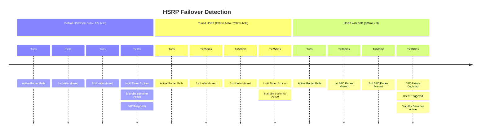

# Cisco IOS-XE: HSRP and VRRP Configuration

HSRP (Hot Standby Router Protocol, Cisco proprietary) and VRRP (Virtual Router
Redundancy
Protocol, RFC 5798) provide default gateway redundancy by presenting a virtual IP
address
shared between two or more routers. One router is Active/Master and forwards traffic;
standby routers monitor the active router and take over on failure. HSRP is Cisco-only;
VRRP is vendor-neutral and the recommended choice for multi-vendor environments.

---

## 1. Overview & Principles

Both protocols present a virtual IP (VIP) and virtual MAC address to hosts as their
default
gateway, use hello messages to detect peer failure, and elect an Active/Master router
based
on priority (higher wins; IP address as tiebreaker).

Preemption behaviour differs: in HSRP it is disabled by default (a recovered
higher-priority router will not reclaim Active unless preempt is configured); in VRRP it
is enabled by default.

| Property | HSRP v2 | VRRP v3 |
| --- | --- | --- |
| **Standard** | Cisco proprietary | RFC 5798 |
| **Transport** | UDP 1985, multicast 224.0.0.102 | IP protocol 112, multicast 224.0.0.18 |
| **Hello interval** | 3 s default | 1 s default |
| **Hold time** | 10 s default | 3 × hello = 3 s default |
| **Virtual MAC** | 0000.0C9F.F`<group>` | 0000.5E00.01`<group>` (IANA standard) |
| **IPv6 support** | HSRPv2 | VRRPv3 (RFC 5798) |
| **Preemption default** | Disabled | Enabled |
| **States** | Initial → Learn → Listen → Speak → Standby → Active | Init → Backup → Master |
| **Max groups per interface** | 255 (HSRPv2) | 255 |

---

## 2. Detection Timelines



---

## 3. Configuration

### A. HSRP v2

```ios

interface GigabitEthernet0/1
 ip address 10.0.1.2 255.255.255.0
 standby version 2
 standby 1 ip 10.0.1.1                      ! Virtual IP — hosts use this as default gateway
 standby 1 priority 110                      ! Higher than default 100; this router is preferred Active
 standby 1 preempt delay minimum 30          ! Preempt, but wait 30s for routing protocols to converge
 standby 1 authentication md5 key-string <KEY>
 standby 1 timers msec 250 msec 750          ! 250ms hello, 750ms hold
 standby 1 track 10 decrement 20             ! If track object 10 fails, lower priority by 20
!
! IP SLA to track upstream reachability
ip sla 10
 icmp-echo 8.8.8.8 source-interface GigabitEthernet0/0
 frequency 5
ip sla schedule 10 life forever start-time now
!
track 10 ip sla 10 reachability
```

### B. VRRP v3

```ios

interface GigabitEthernet0/1
 ip address 10.0.1.2 255.255.255.0
 vrrp 1 address-family ipv4
  address 10.0.1.1 primary             ! Virtual IP
  priority 110
  preempt delay minimum 30
  timers advertise msec 250
  authentication text <KEY>            ! Note: text auth is weak; prefer IPsec in production
 exit-vrrp
```

### C. BFD Integration (HSRP)

```ios

interface GigabitEthernet0/1
 standby 1 bfd
!
bfd-template single-hop GATEWAY-BFD
 interval min-tx 300 min-rx 300 multiplier 3
```

### D. HSRP Object Tracking for Uplink Failure

Track the upstream interface: if it goes down, reduce the HSRP priority so the standby
router (which still has a healthy uplink) takes over.

```ios

track 1 interface GigabitEthernet0/0 line-protocol
!
interface GigabitEthernet0/1
 standby 1 track 1 decrement 20     ! Priority drops from 110 to 90 → standby (priority 100) wins
```

### E. HSRP for IPv6 (HSRPv2)

```ios

interface GigabitEthernet0/1
 ipv6 address 2001:db8:1::2/64
 standby version 2
 standby 1 ipv6 autoconfig           ! VIP derived from virtual MAC via EUI-64
 standby 1 priority 110
 standby 1 preempt
```

---

## 4. Comparison Summary

| Metric | Default HSRP | Tuned HSRP (250ms/750ms) | HSRP + BFD |
| --- | --- | --- | --- |
| **Failure detection** | 10 s | 750 ms | ~900 ms |
| **Gateway switchover** | ~10–11 s | ~1 s | ~1 s |
| **Configuration complexity** | Minimal | Minimal | BFD template required |
| **Preemption** | Disabled by default | Disabled by default | Disabled by default |
| **Multi-vendor** | Cisco only | Cisco only | Cisco only |

For multi-vendor environments, replace HSRP with VRRP v3 — identical behaviour,
standard virtual MAC, and supported on all major platforms.

---

## 5. Verification & Troubleshooting

| Command | Purpose |
| --- | --- |
| `show standby brief` | HSRP group state, VIP, active and standby router addresses |
| `show standby` | Detailed timers, preempt state, tracking objects, and hello counts |
| `show vrrp brief` | VRRP group state and current role (Master/Backup) |
| `show vrrp` | Detailed VRRP configuration, timers, and advertisement counts |
| `show track` | IP SLA and interface tracking object state and transitions |
| `debug standby events` | HSRP state machine transitions in real time |
| `debug standby packets` | Raw HSRP hello and coup/resign messages |
