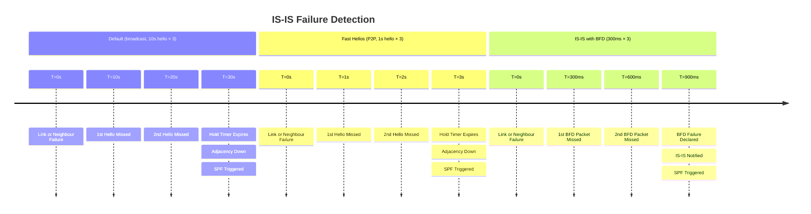

# Cisco IOS-XE: IS-IS Configuration Guide

IS-IS (Intermediate System to Intermediate System, ISO 10589 / RFC 1195) is a link-state
IGP that runs directly over Layer 2, not over IP. It uses a hierarchical two-level
structure: Level 1 (intra-area) and Level 2 (inter-area backbone). IS-IS is the
preferred
IGP for service provider backbones and large-scale datacentre underlay networks. This
guide
covers IOS-XE configuration for IS-IS with IPv4 and IPv6, including BFD integration.

---

## 1. Overview & Principles

- IS-IS adjacencies form at Layer 2 — `ip router isis` on an interface enables IS-IS; a

NET (Network Entity Title / NSAP) identifies the router globally within the IS-IS
domain.

- **NET format:** `<AFI>.<Area-ID>.<System-ID>.<SEL>` — e.g.,

  `49.0001.1921.6800.0001.00` where `49` = private-use AFI, `0001` = area 1,
  `1921.6800.0001` = router system ID (192.168.0.1 encoded as 6 hex bytes), `00` = SEL
  (always 00 for routers).

- L1 adjacencies form only with same-area routers; L2 adjacencies form between any

  L2-capable routers regardless of area.

- IS-IS for IPv6 (RFC 5308) adds IPv6 TLVs to the same process; Multi-Topology IS-IS

(MT-ISIS, RFC 5120) runs separate topologies for IPv4 and IPv6 within the same instance.

- BFD integrates natively with IS-IS (`bfd all-interfaces` or per-interface) for

  sub-second failure detection.

---

## 2. Detection Timelines



---

## 3. Configuration

### A. Basic IS-IS Configuration (IPv4 + IPv6)

```ios

router isis UNDERLAY
 net 49.0001.1921.6800.0001.00
 is-type level-2-only              ! Backbone router — only L2 adjacencies
 metric-style wide                  ! Enable 24-bit metrics (required for TE; recommended always)
 log-adjacency-changes
 !
 address-family ipv6 unicast
  multi-topology                    ! Separate IPv4 and IPv6 topologies (MT-ISIS)
 exit-address-family
!
interface GigabitEthernet0/0
 ip router isis UNDERLAY
 ipv6 router isis UNDERLAY
 isis circuit-type level-2-only
 isis metric 10
 isis ipv6 metric 10
 isis network point-to-point        ! P2P on Ethernet links (avoids DIS election; recommended)
 no shutdown
!
! Loopback — advertise prefix without forming adjacencies
interface Loopback0
 ip address 192.168.0.1 255.255.255.255
 ip router isis UNDERLAY
!
router isis UNDERLAY
 passive-interface Loopback0
```

### B. BFD Integration

```ios

router isis UNDERLAY
 bfd all-interfaces                 ! Enable BFD on all IS-IS interfaces
!
! Per-interface BFD (alternative to bfd all-interfaces)
interface GigabitEthernet0/0
 isis bfd
!
! BFD timer template
bfd-template single-hop ISIS-BFD
 interval min-tx 300 min-rx 300 multiplier 3
```

### C. Authentication (HMAC-MD5)

```ios

key chain ISIS-AUTH
 key 1
  key-string <password>
  cryptographic-algorithm hmac-md5
!
router isis UNDERLAY
 authentication mode md5 level-2
 authentication key-chain ISIS-AUTH level-2
```

### D. Fast Hellos (P2P Links, No BFD)

```ios

interface GigabitEthernet0/0
 isis hello-interval 1 level-2
 isis hello-multiplier 3 level-2    ! Hold time = 1s × 3 = 3s
```

### E. Route Redistribution

```ios

! Redistribute IS-IS into OSPF (hybrid network)
router ospf 1
 redistribute isis UNDERLAY level-2 subnets route-map RM-ISIS-TO-OSPF
!
! Redistribute OSPF into IS-IS
router isis UNDERLAY
 redistribute ospf 1 route-map RM-OSPF-TO-ISIS
```

### F. Route Leaking (L2 into L1)

By default, L2 routes are not leaked into L1 areas. Use redistribution to inject specific
prefixes downward:

```ios

router isis UNDERLAY
 redistribute isis ip level-2 into level-1 route-map RM-L2-TO-L1
```

---

## 4. IS-IS Level Design

| Design | Use Case | Configuration |
| --- | --- | --- |
| **L2-only** | SP backbone, all routers in one area | `is-type level-2-only` everywhere |
| **L1/L2** | Large AS with area hierarchy | L1 in access areas, L1/L2 at boundary routers, L2 between areas |
| **L1-only** | Small access area, simplified | `is-type level-1-only` with an L1/L2 router as the area's uplink |

- L1 routers default-route toward the nearest L1/L2 router (ATT bit set in L1 LSP).
- L1/L2 routers maintain two separate link-state databases (one per level).
- L2 routers exchange topology information across the entire backbone regardless of area.

---

## 5. Verification & Troubleshooting

| Command | Purpose |
| --- | --- |
| `show isis neighbors` | Adjacency state, system ID, circuit type (L1/L2), interface, hold time |
| `show isis database` | Link-state database — all LSPs and their sequence numbers |
| `show isis database detail` | Full LSP contents including TLVs and prefixes |
| `show isis topology` | SPF-computed next-hops per destination |
| `show ip route isis` | IS-IS routes installed in the IPv4 routing table |
| `show ipv6 route isis` | IS-IS routes installed in the IPv6 routing table |
| `show bfd neighbors` | BFD session state for IS-IS peers |
| `debug isis adj-packets` | Hello and adjacency formation events |
| `debug isis spf-events` | SPF calculation triggers and timing |
