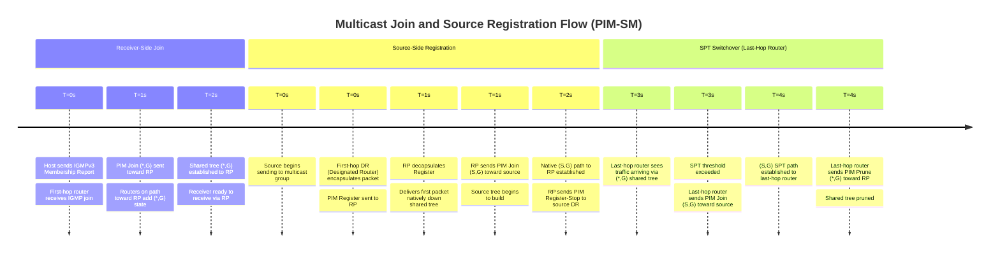

# Cisco IOS-XE: Multicast (PIM & IGMP) Configuration

IP multicast delivers a single stream to multiple receivers without the sender needing
to know or address each one individually. The router network replicates the stream only
at points where paths diverge — not at the source. This is far more efficient than
multiple unicast streams when the receiver count is large or unknown. Two protocol
layers are required: **IGMP** (hosts signal group membership to the directly attached
router) and **PIM** (routers build and maintain distribution trees across the network).
See [IP Multicast](../theory/multicast.md) for protocol theory and tree mechanics.

---

## 1. Overview & Principles

- **IGMP (Internet Group Management Protocol):** Runs between a host and its first-hop
  router. IGMPv2 supports any-source joins (`224.x.x.x`). IGMPv3 adds source-specific
  joins, which is required for PIM-SSM.

- **PIM (Protocol Independent Multicast):** Runs between routers. PIM is independent of
  the unicast routing protocol — it uses the unicast RIB only for RPF (Reverse Path
  Forwarding) checks. PIM-SM (Sparse Mode) is the standard production deployment.

- **Rendezvous Point (RP):** In PIM-SM, the RP is the root of the shared distribution
  tree. Sources register to the RP; receivers join toward the RP. The RP must be
  reachable by all routers in the PIM domain.

- **Shared tree vs. Shortest Path Tree:** PIM-SM initially uses the RP-rooted shared
  tree `(*,G)`. The first-hop router can trigger a switchover to the source-rooted
  Shortest Path Tree (SPT) `(S,G)` for lower latency once traffic is flowing.

- **RPF check:** Before accepting a multicast packet on an interface, the router checks
  that the interface is the one it would use to reach the source (or RP, for shared tree
  traffic). Packets failing the RPF check are discarded to prevent loops.

- **PIM-SSM:** Source-Specific Multicast eliminates the RP entirely. Receivers join
  `(S,G)` directly, requiring IGMPv3. Uses the 232.0.0.0/8 address range by default.

- **IGMP Snooping:** A Layer 2 switch feature that inspects IGMP messages to avoid
  flooding multicast traffic to all ports in a VLAN — only ports with active receivers
  receive the stream.

---

## 2. Detection Timelines



---

## 3. Configuration

### A. Enable Multicast Routing Globally

Multicast routing must be enabled globally before any PIM or IGMP configuration takes
effect on interfaces.

```ios

ip multicast-routing distributed           ! Enable multicast forwarding on all interfaces
!
! 'distributed' uses distributed CEF for multicast — required on most IOS-XE platforms.
! On platforms without distributed CEF, use 'ip multicast-routing' (no keyword).
```

### B. IGMP on Access Interfaces

Enable IGMP on interfaces that face receivers. IGMPv3 is preferred because it supports
source-specific membership reports, which are required for PIM-SSM.

```ios

interface GigabitEthernet0/1
 description ACCESS-SEGMENT-RECEIVERS
 ip pim sparse-mode                        ! PIM must also be enabled on the interface
 ip igmp version 3                         ! Prefer v3 for SSM support
 !
 ! Tune IGMP timers if needed (defaults are usually sufficient)
 ip igmp query-interval 60                 ! How often the DR sends IGMP Queries (default 60s)
 ip igmp query-max-response-time 10        ! Maximum response time in queries (default 10s)
 ip igmp last-member-query-interval 1000   ! Milliseconds — fast leave detection
!
! Static IGMP group join (useful for testing or permanent receivers such as a monitoring host)
interface GigabitEthernet0/1
 ip igmp static-group 239.1.1.1
```

### C. PIM-SM with Static RP

Static RP is the simplest deployment — all routers are manually configured with the
same RP address. It is suitable for small, stable networks where RP redundancy is not
required.

```ios

! Enable PIM sparse-mode on every interface that participates in multicast routing.
! This includes transit interfaces, not just receiver-facing interfaces.
interface GigabitEthernet0/0
 description CORE-TRANSIT
 ip pim sparse-mode
!
interface GigabitEthernet0/1
 description ACCESS-SEGMENT-RECEIVERS
 ip pim sparse-mode
!
interface Loopback0
 description RP-LOOPBACK
 ip pim sparse-mode
!
! Configure the RP address globally — must match on all routers in the domain
ip pim rp-address 192.168.0.254            ! Loopback of the designated RP router
!
! Limit the RP to specific multicast groups using an ACL (optional but recommended)
ip access-list standard ACL-MULTICAST-GROUPS
 permit 239.0.0.0 0.255.255.255            ! Permit all site-local multicast
!
ip pim rp-address 192.168.0.254 ACL-MULTICAST-GROUPS
```

### D. PIM-SM with Auto-RP

Auto-RP is a Cisco proprietary mechanism that dynamically announces RP information.
One router acts as the RP candidate and announces itself; another (or the same)
router acts as the Mapping Agent and distributes the RP-to-group mapping to all
routers in the domain.

```ios

! --- On the RP router ---
interface Loopback0
 ip address 192.168.0.254 255.255.255.255
 ip pim sparse-mode
!
! Announce this router as RP candidate for all groups (224/4)
ip pim send-rp-announce Loopback0 scope 16
!
! --- On the Mapping Agent (may be the same router or a separate one) ---
ip pim send-rp-discovery Loopback0 scope 16
!
! --- On ALL routers in the domain ---
! Auto-RP announcements use 224.0.1.39 and 224.0.1.40, which are dense-mode groups.
! In a sparse-mode-only domain, enable the autorp listener to handle these groups.
ip pim autorp listener
!
! Alternatively, configure sparse-dense mode on interfaces (legacy approach — avoid on new designs)
! interface GigabitEthernet0/0
!  ip pim sparse-dense-mode
```

### E. PIM-SM with BSR (Preferred Standard)

Bootstrap Router (BSR, RFC 5059) is the standards-based RP election mechanism and is
preferred over Auto-RP for new deployments. BSR distributes RP candidate information
using PIM bootstrap messages.

```ios

! --- On BSR candidate router(s) ---
! Priority: higher value = more preferred (default 0)
ip pim bsr-candidate Loopback0 32 priority 10
!                    ^source   ^hash-mask-len
! Hash mask length 32 assigns each group to exactly one RP (no load distribution).
! Use a shorter mask (e.g., 24) to distribute groups across multiple RPs.
!
! --- On RP candidate router(s) ---
ip pim rp-candidate Loopback0 priority 0   ! Lower priority value = more preferred
!
! Limit the RP candidacy to specific groups
ip access-list standard ACL-PIM-GROUPS
 permit 239.0.0.0 0.255.255.255
!
ip pim rp-candidate Loopback0 group-list ACL-PIM-GROUPS priority 0
```

### F. PIM-SSM (Source-Specific Multicast)

PIM-SSM removes the RP requirement entirely. Receivers must use IGMPv3 to specify both
the group and the source address. IOS-XE maps the 232.0.0.0/8 range to SSM by default.

```ios

! Enable SSM for the default 232.0.0.0/8 range
ip pim ssm default
!
! Enable SSM for a custom range defined by an ACL
ip access-list standard ACL-SSM-RANGE
 permit 239.100.0.0 0.0.255.255           ! Custom SSM range for this domain
!
ip pim ssm range ACL-SSM-RANGE
!
! Ensure all receiver-facing interfaces run IGMPv3 (required for SSM joins)
interface GigabitEthernet0/1
 ip igmp version 3
 ip pim sparse-mode
!
! No RP configuration is needed or used for SSM groups.
! Hosts join using (S,G) syntax: receivers must know the source address in advance.
```

### G. IGMP Snooping on Switches

IGMP snooping is enabled by default on IOS-XE switches. It constrains multicast
forwarding at Layer 2 so that frames are only sent to ports where interested receivers
have been detected. Without snooping, multicast floods like broadcast within the VLAN.

```ios

! IGMP snooping is on by default — confirm and fine-tune per VLAN
ip igmp snooping                           ! Global enable (default)
ip igmp snooping vlan 100                  ! Enable on a specific VLAN
!
! IGMP Querier — required when no PIM router is present in the VLAN
! (The querier sends IGMP Queries to prompt hosts to report their memberships)
ip igmp snooping querier                   ! Enable querier globally
ip igmp snooping vlan 100 querier          ! Enable querier on VLAN 100
ip igmp snooping querier address 10.0.0.1  ! Source address for querier messages
!
! Configure querier query interval
ip igmp snooping querier query-interval 60
!
! Static mrouter port — force a port to be treated as a multicast router port
! (useful when the PIM router is not sending PIM Hellos on this segment)
ip igmp snooping vlan 100 mrouter interface GigabitEthernet1/0/48
!
! Disable fast leave for a specific VLAN if multiple receivers share one port (hub/switch)
no ip igmp snooping vlan 100 immediate-leave
```

### H. Static Multicast Routes for Asymmetric RPF

When the unicast routing path to a multicast source differs from the path that multicast
traffic arrives on, RPF checks fail and traffic is dropped. A static mroute overrides the
unicast RPF lookup for a specific source or source range.

```ios

! Force RPF check for source 10.100.0.0/24 to use GigabitEthernet0/2
! instead of the unicast routing table entry
ip mroute 10.100.0.0 255.255.255.0 GigabitEthernet0/2
!
! Alternative: RPF toward a specific next-hop address
ip mroute 10.100.0.0 255.255.255.0 10.0.0.1
!
! Static mroute for RP reachability (useful when RP is in a different unicast domain)
ip mroute 192.168.0.254 255.255.255.255 10.0.0.1
```

### I. SPT Threshold Tuning

By default, the last-hop router switches from the shared tree `(*,G)` to the shortest
path tree `(S,G)` as soon as the first packet arrives from a source. In very large
multicast deployments with many (S,G) states, this creates significant state overhead.
Setting `spt-threshold infinity` keeps all traffic on the shared tree and prevents SPT
switchover.

```ios

! Prevent SPT switchover — all traffic remains on the RP-rooted shared tree
! Use in large-scale deployments where (S,G) state proliferation is a concern
ip pim spt-threshold infinity
!
! Apply SPT threshold to specific groups only (recommended over global infinity)
ip access-list standard ACL-NO-SPT
 permit 239.0.0.0 0.255.255.255
!
ip pim spt-threshold infinity group-list ACL-NO-SPT
!
! Default behavior (SPT switchover on first packet) — re-enable per-group
ip pim spt-threshold 0                     ! 0 kbps = switch on first packet (default)
```

---

## 4. Comparison Summary

| Attribute | PIM-SM | PIM-SSM | PIM-DM |
| --- | --- | --- | --- |
| **RP Required** | Yes | No | No |
| **Address Range** | 224.0.0.0 – 239.255.255.255 (excluding link-local) | 232.0.0.0/8 (default) | 224.0.0.0 – 239.255.255.255 |
| **IGMP Version** | IGMPv2 or v3 | IGMPv3 required | IGMPv2 or v3 |
| **Receiver Model** | Any-source: receiver joins group, RP resolves sources | Source-specific: receiver specifies source in join | Any-source: flood-and-prune across all interfaces |
| **Tree Type** | Shared tree (*,G) then optional SPT (S,G) switchover | Source tree (S,G) only — no shared tree | Source tree (S,G) via flood-and-prune |
| **Scalability** | High — sparse deployment, state controlled by RP | Highest — no RP, minimal state, no shared tree overhead | Low — floods all interfaces first, high state and bandwidth overhead |
| **Typical Use Case** | Enterprise, SP, any-source video distribution | IPTV, financial data feeds, any known-source application | Small lab or legacy environments only |

---

## 5. Verification & Troubleshooting

| Command | Purpose |
| --- | --- |
| `show ip igmp groups` | Groups with active IGMP membership on each interface, version, and last reporter |
| `show ip igmp interface` | IGMP version, querier address, and query/timer state per interface |
| `show ip pim neighbor` | PIM adjacencies: neighbor address, interface, uptime, DR priority, hold time |
| `show ip pim interface` | PIM mode, DR state, neighbour count, and hello interval per interface |
| `show ip mroute` | Multicast routing table — (S,G) and (*,G) entries with RPF interface and OIL |
| `show ip mroute summary` | Count of active (S,G) and (*,G) entries — useful for state scale assessment |
| `show ip pim rp mapping` | RP-to-group mappings learned via Auto-RP, BSR, or static config |
| `show ip pim bsr-router` | Current BSR address, priority, and hash mask (BSR deployments) |
| `show ip igmp snooping` | Global IGMP snooping status and querier state |
| `show ip igmp snooping groups` | Layer 2 multicast group-to-port mappings per VLAN |
| `show ip igmp snooping mrouter` | Detected multicast router ports per VLAN |
| `mtrace <source> <group>` | Trace multicast path from source to receiver, including RPF hops and drop points |
| `debug ip pim` | PIM hello, join/prune, and register events — use with caution in production |
