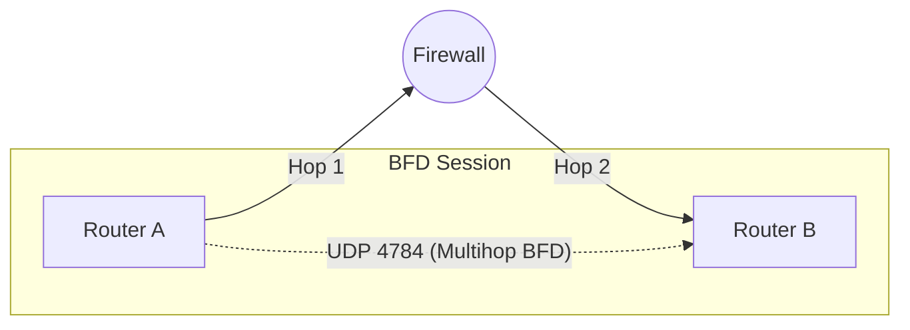

# Cisco IOS-XE: Multihop BFD Configuration

While standard BFD is designed for directly connected neighbors, **Multihop BFD**
is required when BGP sessions are established over Loopback interfaces or across
an intermediate network (like a firewall or a provider cloud) where the neighbors
are not on the same subnet.

---

## 1. Multihop Topology & Detection

Standard BGP Multihop relies on the TCP connection timeout. If an intermediate link
fails, the BGP neighbors may stay "Established" for 180 seconds despite the path
being broken.



### Detection Timeline Comparison

- **BGP Multihop (Default):** ~180 Seconds (Hold Timer).
- **BGP Multihop + BFD:** **< 1.5 Seconds** (e.g., 500ms x 3).

---

## 2. Cisco IOS-XE Configuration

Multihop BFD requires a **BFD Template** and a **BFD Map** to define the source
and destination for the unicast heartbeats.

### A. Multihop BFD Template

Note the use of `multi-hop` instead of `single-hop`.

```ios

bfd-template multi-hop MH-BFD-TEMPLATE
 interval min-tx 500 min-rx 500 multiplier 3
```

### B. BFD Map Configuration

The BFD Map binds the template to the specific source and destination IPs used for
the BGP peering.

```ios

! Syntax: bfd-map   template
bfd-map 10.255.255.2 10.255.255.1 template MH-BFD-TEMPLATE
```

### C. BGP Integration

Enable BFD on the multihop neighbor.

```ios

router bgp 65000
 neighbor 10.255.255.2 remote-as 65001
 neighbor 10.255.255.2 update-source Loopback0
 neighbor 10.255.255.2 ebgp-multihop 2
 neighbor 10.255.255.2 fall-over bfd multihop
```

---

## 3. Comparison Summary

| Metric | Single-hop BFD | Multihop BFD |
| :--- | :--- | :--- |
| **UDP Port** | 3784 | **4784** |
| **TTL Value** | 255 (Strict check) | Variable (Supports routing) |
| **Addressing** | Link-Local / Connected | **Globally Routable** |
| **Configuration** | Interface-based | **BFD Map-based** |
| **Use Case** | Physical link health | **Path health across cloud/FW** |

---

## 4. Key Principles & Requirements

### A. Routing Reachability

For Multihop BFD to initialize, there **must** already be a route in the RIB (Static,
OSPF, etc.) to the destination IP. BFD will not start if the destination is unreachable.

### B. CEF (Cisco Express Forwarding)

Multihop BFD relies heavily on CEF. Ensure `ip cef` is enabled globally. On most
modern IOS-XE platforms, this is on by default and cannot be disabled.

### C. Firewall/ACL Considerations

If there is a firewall between the neighbors, you must permit the following:

- **Protocol:** UDP
- **Port:** 4784 (Control) and 4785 (Echo - if used)
- **Note:** Many firewalls inspect BFD; ensure they are not dropping these low-latency

    packets.

---

## 5. Verification Commands

| Command | Purpose |
| :--- | :--- |
| `show bfd neighbors multihop` | View active multihop sessions and timers. |
| `show bfd neighbors details` | See the specific source/destination IPs and template mapping. |
| `show ip bgp neighbors &#124; inc BFD` | Confirm BGP has registered with the multihop BFD process. |
| `debug bfd auth` | (If using MD5) Debug authentication mismatches. |
