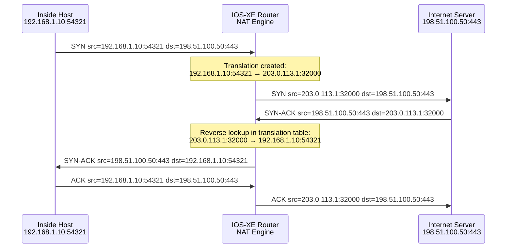

# Cisco IOS-XE: NAT Configuration

NAT (Network Address Translation) rewrites IP address fields — and for PAT, port
fields — as packets cross the boundary between inside and outside interfaces. IOS-XE
maintains a translation table that maps inside local addresses to inside global
addresses
and ensures return traffic is matched and forwarded correctly back to the originating
host.

For protocol background see [Network Address Translation (NAT)](../theory/nat.md).

---

## 1. Overview & Principles

- **Inside local:** The IP address assigned to a host on the inside network (RFC 1918
space

space

  in most deployments).

- **Inside global:** The translated address seen on the outside (public) network — the
address

address

  the outside world sees as the source.

- **Outside local / outside global:** Addresses of the remote (outside) host as seen
  from the inside and outside respectively. For standard internet NAT these are usually
  the same.

- **Interface designation:** Every interface participating in NAT must be marked `ip nat

inside` or `ip nat outside`. A packet is only translated if it enters on an inside
interface
and exits on an outside interface (or vice versa). Missing designations are the most
common
  cause of NAT not working.

- **Translation order:** IOS-XE evaluates static NAT entries first, then dynamic NAT
pools,

pools,

  then PAT overload, and finally policy NAT route-maps. Static entries take precedence.

- **NAT and routing:** The router applies NAT after the routing decision for outbound
traffic

traffic

  and before the routing decision for inbound traffic. Ensure the post-NAT address is
  reachable via the routing table.

---

## 2. PAT Translation Flow



---

## 3. Configuration

### A. Interface Designation

Every interface that participates in NAT must be designated before any translation statements
take effect. NAT will silently fail if interfaces are not correctly labelled.

```ios

interface GigabitEthernet0/0
 description Uplink to ISP
 ip address 203.0.113.1 255.255.255.252
 ip nat outside                       ! Traffic exiting here is translated outbound
 no shutdown
!
interface GigabitEthernet0/1
 description LAN inside
 ip address 192.168.1.1 255.255.255.0
 ip nat inside                        ! Traffic entering here triggers translation
 no shutdown
!
! Multiple inside interfaces are supported — each must be individually designated
interface GigabitEthernet0/2
 description Guest LAN inside
 ip address 192.168.100.1 255.255.255.0
 ip nat inside
 no shutdown
```

### B. Static NAT

Static NAT creates a permanent, one-to-one mapping between an inside local and an
inside global address. The mapping is bidirectional — inbound connections to the global
address are automatically forwarded to the inside local address without an ACL or
additional config.

```ios

! One-to-one static NAT
ip nat inside source static 192.168.1.10 203.0.113.10

! Static port forwarding (DNAT) — map a specific protocol and port
! Inbound TCP 443 to public IP is forwarded to internal web server
ip nat inside source static tcp 192.168.1.10 443 203.0.113.10 443

! RDP forwarding to internal host on a different external port
ip nat inside source static tcp 192.168.1.20 3389 203.0.113.10 33890

! UDP forwarding — e.g., DNS server
ip nat inside source static udp 192.168.1.53 53 203.0.113.10 53
```

### C. Dynamic NAT with Address Pool

Dynamic NAT allocates a public address from a pool for each unique inside host. When
the pool is exhausted, new sessions are denied — unlike PAT, dynamic NAT does not
multiplex ports. Suitable when a block of public IPs is available and port sharing is
not desired.

```ios

! Define ACL to identify inside addresses eligible for translation
ip access-list standard ACL-NAT-INSIDE
 permit 192.168.1.0 0.0.0.255
 permit 192.168.2.0 0.0.0.255
!
! Define the pool of public addresses
ip nat pool PUBLIC-POOL 203.0.113.20 203.0.113.30 netmask 255.255.255.0
!
! Bind ACL to pool
ip nat inside source list ACL-NAT-INSIDE pool PUBLIC-POOL
!
! Optional: rotate through pool addresses rather than exhausting in sequence
! ip nat pool PUBLIC-POOL 203.0.113.20 203.0.113.30 netmask 255.255.255.0 type rotary
```

### D. PAT (NAT Overload) — Internet Breakout

PAT maps many inside hosts to a single outside IP address by multiplexing TCP/UDP port
numbers. This is the standard internet breakout configuration for sites with a single public
IP. The `overload` keyword enables port translation.

```ios

! ACL defines which inside addresses are eligible for PAT
ip access-list standard ACL-PAT-INSIDE
 permit 192.168.0.0 0.0.255.255       ! Covers all 192.168.x.x subnets
!
! PAT using the outside interface IP — no pool required
! Useful when the ISP assigns a dynamic address via DHCP
ip nat inside source list ACL-PAT-INSIDE interface GigabitEthernet0/0 overload
!
! PAT using a specific public IP (interface has multiple IPs or pool of one address)
ip nat pool PAT-POOL 203.0.113.1 203.0.113.1 netmask 255.255.255.252
ip nat inside source list ACL-PAT-INSIDE pool PAT-POOL overload
```

### E. Policy NAT (Route-Map Based)

Policy NAT evaluates a route-map to determine both whether to translate and what to
translate to. This allows different inside subnets to use different outside addresses,
or restricts translation to traffic destined for specific networks — essential when a
site has multiple ISP connections with separate public IP ranges.

```ios

! Example: VLAN 10 uses ISP-A, VLAN 20 uses ISP-B

! ACLs to match each source subnet
ip access-list standard ACL-VLAN10
 permit 10.0.10.0 0.0.0.255
!
ip access-list standard ACL-VLAN20
 permit 10.0.20.0 0.0.0.255
!
! Route-maps that match source and — optionally — destination
route-map RM-NAT-ISP-A permit 10
 match ip address ACL-VLAN10          ! Only translate VLAN 10 traffic
!
route-map RM-NAT-ISP-B permit 10
 match ip address ACL-VLAN20          ! Only translate VLAN 20 traffic
!
! Bind each route-map to its respective outside interface
ip nat inside source route-map RM-NAT-ISP-A interface GigabitEthernet0/0 overload
ip nat inside source route-map RM-NAT-ISP-B interface GigabitEthernet0/1 overload
```

### F. NAT64

NAT64 translates IPv6 packets from inside hosts to IPv4 addresses on the outside, enabling
IPv6-only clients to reach IPv4 internet resources. Requires IOS-XE 15.2 or later and the
`ipv6 unicast-routing` global command.

```ios

ipv6 unicast-routing
!
! Stateless NAT64 prefix — maps IPv6 source to an embedded IPv4 address
nat64 prefix stateless 2001:DB8:0:1::/96
!
! Stateful NAT64 — maps many IPv6 sources to a single IPv4 pool
nat64 v6v4 source list ACL-IPV6-INSIDE pool NAT64-POOL overload
nat64 v4v6 source static 203.0.113.10 2001:DB8:0:1::CB00:710A
```

### G. NAT and IPsec

When a VPN router sits behind another NAT device, IKE and IPsec encapsulation is
handled by NAT-T (NAT Traversal, UDP 4500) automatically. However, if this router is
the NAT device and has a VPN peer behind it, a static NAT entry maps the peer's private
address to a routable public address so IKE can be initiated from the outside.

```ios

! Static NAT for a VPN peer behind this router
! Must be configured before IKE negotiations begin
ip nat inside source static 192.168.1.254 203.0.113.50
!
! Ensure IPsec interesting traffic ACL references the post-NAT address
! The crypto map peer address must match the post-NAT (public) address
!
! NAT exemption — exclude VPN traffic from PAT using a route-map
ip access-list extended ACL-NO-NAT
 permit ip 192.168.1.0 0.0.0.255 10.200.0.0 0.0.0.255  ! VPN interesting traffic
!
route-map RM-NO-NAT permit 10
 match ip address ACL-NO-NAT
!
! The route-map is referenced in the NAT statement to exclude matched traffic
! ip nat inside source route-map RM-PAT ... overload
! Traffic matched by ACL-NO-NAT will not be translated
```

### H. Translation Table Management

The NAT translation table is maintained in memory. Large deployments may require tuning
timeouts and maximum entry limits to avoid table exhaustion. Use `clear` commands with care
— clearing active translations drops established sessions.

```ios

! Per-protocol translation timeouts (seconds)
ip nat translation timeout 300          ! General UDP timeout (default 300s)
ip nat translation tcp-timeout 86400    ! TCP established session timeout (default 24h)
ip nat translation udp-timeout 300      ! UDP timeout
ip nat translation finrst-timeout 60    ! TCP FIN/RST — tear down on close
ip nat translation syn-timeout 60       ! Half-open TCP (SYN only, no SYN-ACK)
ip nat translation icmp-timeout 60      ! ICMP translations
!
! Limit total translation entries to prevent memory exhaustion
ip nat translation max-entries 10000
!
! Per-host limit — prevent a single host from consuming all entries
ip nat translation max-entries host 192.168.1.10 500
!
! Clear translation table
clear ip nat translation *              ! All dynamic entries — drops active sessions
clear ip nat translation inside 192.168.1.10 outside 203.0.113.1  ! Single entry
```

---

## 4. Comparison Summary

| Method | Port translation | Sessions supported | Typical deployment |
| :--- | :--- | :--- | :--- |
| **Static NAT** | No (address only) &#124; optional per-port DNAT | One-to-one | Inbound server publishing, VPN peer mapping |
| **Dynamic NAT** | No | One public IP per session (pool size limit) | Corporate networks with a block of public IPs |
| **PAT (overload)** | Yes — multiplexes thousands of sessions on one IP | ~64 000 per public IP (port space) | Internet breakout from branch or home office |
| **Policy NAT** | Yes (when combined with overload) | Same as PAT per interface | Dual-ISP sites, selective translation by source or destination |

---

## 5. Verification & Troubleshooting

| Command | Purpose |
| :--- | :--- |
| `show ip nat translations` | Active translation table — inside local/global and outside local/global addresses |
| `show ip nat translations verbose` | Adds protocol, port, age, and flags to each entry |
| `show ip nat translations total` | Count of active translations |
| `show ip nat statistics` | Hit/miss counts, active translations, expired entries, and misses by type |
| `show ip nat translations pro tcp` | Filter translation table by protocol |
| `show running-config &#124; include ip nat` | All NAT statements in the running config |
| `debug ip nat` | Real-time translation events — high CPU impact on busy devices; use with ACL filter |
| `debug ip nat detailed` | Full packet detail per translation event — restrict to a single host ACL |
| `clear ip nat translation *` | Flush all dynamic translations — use only during maintenance |
| `show ip interface GigabitEthernet0/0` | Confirm `ip nat inside` or `ip nat outside` designation is applied |
