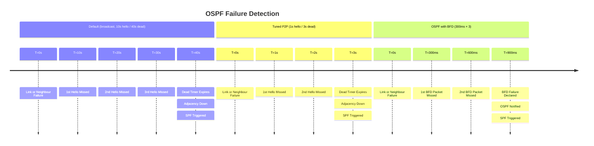

# Cisco IOS-XE: OSPF Configuration Guide

OSPF (Open Shortest Path First, RFC 2328) is a link-state IGP that uses Dijkstra's SPF
algorithm to compute loop-free paths. All routers in an area maintain an identical Link
State Database (LSDB); SPF runs locally on each router to compute the best next-hop for
every prefix. This guide covers OSPFv2 (IPv4) configuration on IOS-XE, including area
design, timers, authentication, BFD integration, and redistribution.

For protocol comparison see [OSPF vs IS-IS](../theory/ospf_vs_isis.md) and
[EIGRP vs OSPF vs RIP](../theory/igp_comparison.md).

---

## 1. Overview & Principles

- **Router ID (RID):** OSPF selects the highest IP address on an active loopback interface,
  or the highest physical interface IP if no loopbacks exist. Always set it explicitly with
  `router-id` — automatic selection is non-deterministic and changes on interface failure.
- **Area 0 (backbone):** All non-backbone areas must connect to area 0, either directly
  or via a virtual link. Traffic between two non-backbone areas always transits area 0.
- **LSA types:**

  | LSA | Name | Scope | Generated by |
  | :--- | :--- | :--- | :--- |
  | **Type 1** | Router LSA | Within area | Every OSPF router |
  | **Type 2** | Network LSA | Within area | DR on broadcast segments |
  | **Type 3** | Summary LSA | Throughout OSPF domain | ABR (inter-area routes) |
  | **Type 4** | ASBR Summary LSA | Throughout OSPF domain | ABR (points to ASBR) |
  | **Type 5** | AS External LSA | Throughout OSPF domain | ASBR (redistributed routes) |
  | **Type 7** | NSSA External LSA | Within NSSA only | ASBR inside an NSSA; ABR converts to Type 5 |

- **DR/BDR election:** On broadcast (Ethernet) segments, OSPF elects a Designated
  Router and Backup DR to reduce adjacency count. All routers form full adjacencies only
  with the DR and BDR; they use multicast 224.0.0.6 to reach DR/BDR and 224.0.0.5 for
  all OSPF routers. Election is based on priority (highest wins; default 1); a priority
  of 0 prevents a router from becoming DR or BDR. Election is non-preemptive — the
  current DR holds its role until it fails regardless of a higher-priority router
  joining later.
- **Cost calculation:** `cost = reference-bandwidth / interface-bandwidth`. The default
  reference-bandwidth is 100 Mbps, which gives every link faster than 100 Mbps a cost
  of 1 — unusable in 1GbE/10GbE environments. Always raise it to 10000 (10 Gbps) or
  higher on all routers in the domain, consistently.
- **SPF throttle timers:** OSPF delays SPF execution after a topology change to avoid CPU
  spikes during flapping. The three parameters are: initial delay, minimum hold (backoff
  floor), and maximum hold (backoff ceiling). After each SPF run, the hold doubles up to
  the maximum before resetting.

---

## 2. Detection Timelines



---

## 3. Configuration

### A. Basic OSPF (Single Area)

```ios
router ospf 1
 router-id 10.255.255.1               ! Explicit RID — do not rely on automatic selection
 auto-cost reference-bandwidth 10000  ! Match fastest link (10 Gbps); apply on ALL routers
 log-adjacency-changes detail
 passive-interface default            ! Suppress hellos on all interfaces by default
 no passive-interface GigabitEthernet0/0  ! Explicitly enable on routing interfaces
!
interface GigabitEthernet0/0
 ip ospf 1 area 0                     ! Interface-level command (preferred over network stmt)
 ip ospf cost 10
 ip ospf hello-interval 1             ! Fast hellos on P2P links
 ip ospf dead-interval 3              ! Dead = 3 × hello minimum; must match on both ends
 ip ospf network point-to-point       ! P2P — disables DR/BDR election on Ethernet
!
! Loopback — advertise prefix without forming adjacencies
interface Loopback0
 ip address 10.255.255.1 255.255.255.255
 ip ospf 1 area 0
```

### B. Multi-Area OSPF with ABR

An ABR has interfaces in at least two areas and maintains separate LSDBs per area.
Area 1 here is a stub area connected to the backbone via the ABR. Summarisation is
configured on the ABR to reduce Type 3 LSA flooding into area 0.

```ios
! ABR configuration
router ospf 1
 router-id 10.255.255.2
 auto-cost reference-bandwidth 10000
 area 1 range 10.1.0.0 255.255.0.0   ! Summarise area 1 prefixes at ABR — suppresses detail Type 3s
 area 1 stub                          ! Stub area: blocks Type 5 LSAs; injects default route
 passive-interface default
 no passive-interface GigabitEthernet0/0   ! Toward area 0
 no passive-interface GigabitEthernet0/1   ! Toward area 1
!
interface GigabitEthernet0/0
 ip ospf 1 area 0
 ip ospf network point-to-point
!
interface GigabitEthernet0/1
 ip ospf 1 area 1
 ip ospf network point-to-point

! Internal area 1 router — must also declare stub
router ospf 1
 router-id 10.255.255.3
 auto-cost reference-bandwidth 10000
 area 1 stub                          ! Must match ABR; no Type 5 LSAs; uses default route
```

### C. Area Types

| Area Type | LSAs Blocked | Default Route | Configuration |
| :--- | :--- | :--- | :--- |
| **Backbone (area 0)** | None | Not injected | Standard — no special config |
| **Stub** | Type 5 (external) | Injected by ABR | `area 1 stub` on all routers in area |
| **Totally Stubby** | Type 3 + Type 5 | Injected by ABR | `area 1 stub no-summary` on ABR only; `area 1 stub` on internal routers |
| **NSSA** | Type 5 (external from outside) | Optional | `area 2 nssa` on all routers in area |
| **Totally NSSA** | Type 3 + Type 5 | Injected by ABR | `area 2 nssa no-summary` on ABR; `area 2 nssa` on internal routers |

```ios
! Totally Stubby — ABR config
router ospf 1
 area 1 stub no-summary              ! ABR: block Type 3 and Type 5; inject single default route

! NSSA — allows redistribution of external routes within the area (Type 7 LSA)
router ospf 1
 area 2 nssa                         ! All routers in area 2
 area 2 nssa default-information-originate  ! ABR injects default route into NSSA

! Totally NSSA
router ospf 1
 area 2 nssa no-summary              ! ABR only: blocks Type 3 and converts Type 7 to Type 5
```

### D. DR/BDR Election Control

```ios
interface GigabitEthernet0/1         ! Multi-access (Ethernet) segment
 ip ospf priority 100                ! Highest priority wins DR (0 = never DR/BDR)
 ip ospf network broadcast           ! Default on Ethernet; enables DR/BDR election
```

Available network type options for `ip ospf network`:

| Network Type | DR/BDR Election | Hello Interval | Use Case |
| :--- | :--- | :--- | :--- |
| `broadcast` | Yes | 10 s | Ethernet multi-access (default) |
| `non-broadcast` | Yes | 30 s | Frame Relay hub-and-spoke |
| `point-to-point` | No | 10 s | P2P Ethernet links (recommended) |
| `point-to-multipoint` | No | 30 s | Partial-mesh non-broadcast |

### E. Authentication (SHA-256 — IOS-XE 15.4+)

Key chain authentication is preferred because it supports key rotation without clearing
adjacencies.

```ios
! Key chain — SHA-256 (preferred)
key chain OSPF-KEYS
 key 1
  key-string <password>
  cryptographic-algorithm hmac-sha-256
!
interface GigabitEthernet0/0
 ip ospf authentication key-chain OSPF-KEYS

! Legacy MD5 (backward compatible, lower security)
interface GigabitEthernet0/0
 ip ospf authentication message-digest
 ip ospf message-digest-key 1 md5 <key>
```

### F. BFD Integration

BFD provides sub-second failure detection independent of OSPF hello timers.
`bfd all-interfaces` enables BFD on every OSPF-active interface; use per-interface
`ip ospf bfd` for selective deployment.

```ios
router ospf 1
 bfd all-interfaces                   ! Enable BFD on all OSPF interfaces
!
bfd-template single-hop OSPF-BFD
 interval min-tx 300 min-rx 300 multiplier 3  ! 900ms detection
!
! Per-interface BFD (alternative)
interface GigabitEthernet0/0
 ip ospf bfd
```

### G. SPF Throttle Timers

The throttle values are: initial delay before first SPF, minimum hold after SPF,
and maximum hold (exponential backoff ceiling).

```ios
router ospf 1
 timers throttle spf 50 200 5000     ! initial 50ms, min-hold 200ms, max-hold 5s
 timers throttle lsa 50 200 5000     ! LSA origination throttle (same three-value format)
 timers lsa arrival 100              ! Minimum interval between accepting the same LSA (ms)
```

### H. Redistribution

```ios
! Redistribute static routes into OSPF
router ospf 1
 redistribute static subnets route-map RM-STATIC-TO-OSPF
 redistribute connected subnets      ! Advertise connected prefixes not in OSPF

! Redistribute OSPF into BGP (match internal and both external route types)
router bgp 65000
 address-family ipv4
  redistribute ospf 1 match internal external 1 external 2
```

### I. Default Route Injection

```ios
router ospf 1
 default-information originate always  ! Always advertise default (even if 0.0.0.0/0 absent from RIB)
 ! default-information originate       ! Only advertise default if 0.0.0.0/0 exists in RIB
 ! default-information originate always metric 10 metric-type 1  ! Type 1 = internal cost added
```

---

## 4. Comparison Summary

| Metric | Default OSPF | Tuned (1s/3s P2P) | OSPF + BFD |
| :--- | :--- | :--- | :--- |
| **Failure detection** | 40 s (broadcast) / 12 s (P2P) | 3 s | ~900 ms |
| **SPF initial delay** | 5 s | 50 ms | 50 ms |
| **Convergence (total)** | ~45 s | ~3–4 s | ~1–2 s |
| **CPU sensitivity** | Low | Low–Medium | Low (BFD offloaded to ASIC) |
| **Config complexity** | Minimal | Low | BFD template required |
| **Recommended for** | Lab / low-priority links | WAN P2P links | Core and peering links |

---

## 5. Verification & Troubleshooting

| Command | Purpose |
| :--- | :--- |
| `show ip ospf neighbor` | Adjacency state, DR/BDR address, dead timer countdown |
| `show ip ospf neighbor detail` | Full adjacency detail including BFD state and authentication |
| `show ip ospf database` | LSDB — all LSA types, age, and sequence numbers |
| `show ip ospf database summary` | Type 3 Summary LSAs — inter-area prefixes |
| `show ip ospf database external` | Type 5 External LSAs — redistributed routes |
| `show ip ospf interface` | Cost, hello/dead intervals, network type, DR/BDR, auth mode |
| `show ip ospf interface brief` | Per-interface area, cost, state, and neighbour count |
| `show ip route ospf` | OSPF routes installed in the RIB (O = intra, O IA = inter, O E1/E2 = external) |
| `show ip ospf statistics` | SPF run count, timing, and trigger reasons |
| `show ip ospf` | Process-level summary: RID, area count, SPF throttle settings |
| `debug ip ospf adj` | Adjacency formation, hello exchange, and DR/BDR election events |
| `debug ip ospf events` | All OSPF events including LSA origination and SPF triggers |
