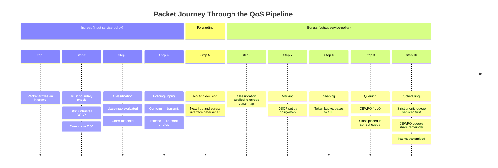

# Cisco IOS-XE: QoS Configuration

Quality of Service (QoS) is the practice of managing traffic so that time-sensitive or
business-critical flows receive the resources they need when a link is congested. On
IOS-XE, QoS is implemented using the **Modular QoS CLI (MQC)**, which separates the
three concerns cleanly: classification (class-map), policy definition (policy-map), and
policy attachment (service-policy). See [Quality of Service](../theory/qos.md) for
protocol theory and [DSCP & QoS Reference](../reference/dscp_qos.md) for DSCP codepoint
tables and per-hop behaviour definitions.

---

## 1. Overview & Principles

- **MQC separates three functions:** classify traffic with `class-map`, define treatment
  with `policy-map`, and apply the policy to an interface with `service-policy`.

- **DSCP is the marking standard.** The 6-bit DSCP field in the IP header (RFC 2474)
  survives across routing boundaries. CoS (802.1p) and ToS are access-layer signals that
  must be re-marked to DSCP at the trust boundary.

- **QoS only matters at congestion points.** On an uncongested link, scheduling and
  queuing have no effect. Size your policies for the slowest link in the path (typically
  the WAN edge).

- **Trust boundary:** Traffic entering the network from an untrusted source (end-user
  workstation, remote site CPE) should have its DSCP reset to CS0 (default) at ingress
  and re-marked by the network according to policy.

- **LLQ (Low Latency Queuing):** The `priority` keyword in a policy-map creates a strict
  priority queue that is always serviced first, bounded by its rate. Used for VoIP (EF)
  and other delay-sensitive traffic.

- **CBWFQ (Class-Based Weighted Fair Queuing):** The `bandwidth percent` keyword
  guarantees minimum bandwidth to a class when the link is congested, without strict
  priority.

- **WRED (Weighted Random Early Detection):** Probabilistic drop applied to AF classes

before queues fill, using DSCP to differentiate drop probability between AF sub-classes
  (e.g., AF31 drops before AF32, AF32 before AF33).

---

## 2. Detection Timelines



---

## 3. Configuration

### A. Classification with class-map

Class-maps classify traffic for policy treatment. Use `match-any` for OR logic and
`match-all` (default) for AND logic.

```ios

! Match VoIP RTP using DSCP EF (marked by IP phones)
class-map match-any CM-VOIP
 match dscp ef
!
! Match business-critical apps by DSCP AF31
class-map match-any CM-CRITICAL
 match dscp af31
!
! Match routing protocol traffic and BFD (CS6)
class-map match-any CM-ROUTING
 match dscp cs6
!
! Match specific application using NBAR protocol discovery
class-map match-any CM-WEBEX
 match protocol attribute application-group webex-group
!
! Match traffic using a named ACL
class-map match-any CM-VOICE-SIGNAL
 match access-group name ACL-VOICE-SIGNALLING
!
! Bulk / scavenger traffic (CS1 or explicit best effort)
class-map match-any CM-BULK
 match dscp cs1
 match dscp default
```

### B. Trust Boundary Re-marking (Ingress)

Traffic arriving from untrusted sources (end-user devices, remote sites without a
managed CPE) must have any pre-set DSCP stripped and reset at ingress. Apply this
policy on the ingress WAN interface or CPE handoff.

```ios

! Ingress re-mark policy — resets all DSCP to CS0 on untrusted interfaces
class-map match-all CM-ALL-TRAFFIC
 match any
!
policy-map PM-INGRESS-UNTRUSTED
 class CM-ALL-TRAFFIC
  set dscp default                    ! Strip all external DSCP markings to CS0
!
interface GigabitEthernet0/1
 description UNTRUSTED-CPE-HANDOFF
 service-policy input PM-INGRESS-UNTRUSTED
```

### C. LLQ + CBWFQ Policy-Map for WAN Edge

This is the primary egress policy applied to a WAN-facing interface. The `priority`
keyword creates LLQ (strict priority) for VoIP. `bandwidth percent` creates CBWFQ
guarantees for other classes. The `class-default` catches all unmatched traffic.

```ios

policy-map PM-WAN-EGRESS
 !
 ! CS6 — routing protocols and BFD (strict priority, small rate)
 class CM-ROUTING
  priority percent 5
 !
 ! EF — VoIP bearer traffic (strict priority, rate-limited)
 class CM-VOIP
  priority percent 30
 !
 ! AF31 — business-critical applications (guaranteed bandwidth)
 class CM-CRITICAL
  bandwidth percent 25
  random-detect dscp-based            ! WRED within this class (see Section D)
 !
 ! CS1 and default — bulk and scavenger (fair-queue, minimal guarantee)
 class CM-BULK
  bandwidth percent 5
  fair-queue
 !
 ! class-default catches all unclassified traffic
 class class-default
  fair-queue
  random-detect
```

### D. WRED (Weighted Random Early Detection) on AF Classes

WRED is configured inside a `policy-map` class with `random-detect dscp-based`. This
causes IOS-XE to use pre-defined DSCP-to-drop-probability maps so that AF_x1 packets
are dropped last, AF_x2 mid-probability, and AF_x3 first — providing drop precedence
within an AF class.

```ios

policy-map PM-WAN-EGRESS
 class CM-CRITICAL
  bandwidth percent 25
  random-detect dscp-based
  ! IOS-XE applies built-in DSCP-based min/max thresholds:
  ! AF31 (001010) — lowest drop probability
  ! AF32 (001100) — medium drop probability
  ! AF33 (001110) — highest drop probability
  !
  ! Override thresholds manually if required:
  random-detect dscp af31 40 60 1     ! min-threshold max-threshold mark-prob
  random-detect dscp af32 30 50 1
  random-detect dscp af33 20 40 1
```

### E. Policing

Policing enforces a rate limit at a hard boundary — traffic conforming to the contract
is transmitted; traffic that exceeds the rate can be re-marked to a lower DSCP (rather
than dropped outright) to survive downstream during uncongested periods.

```ios

policy-map PM-INGRESS-POLICE
 !
 ! Limit total ingress rate from remote site to 10 Mbps
 ! Exceed: re-mark EF down to AF31 rather than hard drop
 class CM-VOIP
  police rate 2000000 bps
   conform-action transmit
   exceed-action set-dscp-transmit af31
 !
 class CM-CRITICAL
  police rate 5000000 bps
   conform-action transmit
   exceed-action set-dscp-transmit cs1   ! Demote to scavenger on burst
   violate-action drop
 !
 class class-default
  police rate 3000000 bps
   conform-action transmit
   exceed-action drop
```

### F. Shaping

Shaping is applied on egress to pace traffic to the provider CIR (Committed Information
Rate) using a token bucket. Unlike policing, shaping buffers excess packets rather than
dropping them, which is required when the physical interface speed exceeds the purchased
WAN speed.

```ios

! Shape all egress traffic to a 50 Mbps CIR (provider circuit)
policy-map PM-SHAPE-PARENT
 class class-default
  shape average 50000000              ! Bits per second — 50 Mbps CIR
  service-policy PM-WAN-EGRESS        ! Nest the LLQ/CBWFQ child policy
!
! Apply the parent shaper on the WAN interface
interface GigabitEthernet0/0
 description WAN-UPLINK
 service-policy output PM-SHAPE-PARENT
```

Using a hierarchical policy (parent shaper + child CBWFQ) is the recommended approach
for WAN interfaces: the parent shaper brings traffic down to the CIR, and the child
policy then schedules within that shaped rate.

### G. Applying Policy to Interfaces

```ios

! Egress policy (most common) — applied to the sending direction
interface GigabitEthernet0/0
 description WAN-UPLINK
 service-policy output PM-SHAPE-PARENT
!
! Ingress policy — trust boundary re-mark and policing on untrusted LAN ports
interface GigabitEthernet0/1
 description UNTRUSTED-LAN-SEGMENT
 service-policy input PM-INGRESS-UNTRUSTED
!
! Ingress policing on WAN uplink (rate-limit inbound from provider)
interface GigabitEthernet0/0
 service-policy input PM-INGRESS-POLICE
```

### H. Access Switch CoS Trust and IOS-XE MQC

On older Catalyst platforms running classic IOS with `mls qos`, trust is configured
per port. On IOS-XE switches (Catalyst 9000 series), the global `mls qos` framework is
replaced by MQC applied per interface, or by `auto qos`, which generates MQC policy
automatically.

```ios

! IOS-XE (Catalyst 9k) — trust DSCP from an IP phone uplink
! Auto QoS (generates class-maps and policy-maps automatically)
interface GigabitEthernet1/0/1
 auto qos voip cisco-phone
!
! Manual MQC trust on uplinks — classify inbound CoS and re-mark to DSCP
class-map match-any CM-COS5
 match cos 5                          ! CoS 5 = VoIP bearer (maps to DSCP EF)
!
policy-map PM-ACCESS-INGRESS
 class CM-COS5
  set dscp ef
 class class-default
  set dscp default
!
interface GigabitEthernet1/0/48
 description UPLINK-TO-DISTRIBUTION
 service-policy input PM-ACCESS-INGRESS
```

---

## 4. Comparison Summary

| Class | DSCP Value | DSCP Name | Treatment | Typical Traffic |
| --- | --- | --- | --- | --- |
| **Routing / Control** | 48 (binary 110000) | CS6 | LLQ `priority percent 5` | OSPF, IS-IS, BGP, BFD |
| **VoIP Bearer** | 46 (binary 101110) | EF | LLQ `priority percent 30` | RTP voice streams |
| **Business Critical** | 26 (binary 011010) | AF31 | CBWFQ `bandwidth percent 25` + WRED | ERP, database replication |
| **Best Effort** | 0 (binary 000000) | CS0 / Default | `fair-queue` in class-default | Web browsing, email |
| **Scavenger / Bulk** | 8 (binary 001000) | CS1 | `bandwidth percent 5` + `fair-queue` | Backups, software updates |

---

## 5. Verification & Troubleshooting

| Command | Purpose |
| --- | --- |
| `show policy-map interface <intf>` | Per-class statistics: offered rate, drop rate, queue depth, WRED drops — primary troubleshooting command |
| `show policy-map interface <intf> input` | Ingress policy statistics for policing conformance and exceed counters |
| `show class-map` | All configured class-maps and their match criteria |
| `show policy-map` | All configured policy-maps and their class/action structure |
| `show policy-map interface <intf> output class <name>` | Drill into a single class on a single interface |
| `show interfaces {intf} \| include output drops` | Fast check for tail-drop on the physical queue |
| `show queueing interface <intf>` | Queue statistics summary per interface |
| `debug qos packet` | Per-packet classification trace — use with caution in production |
