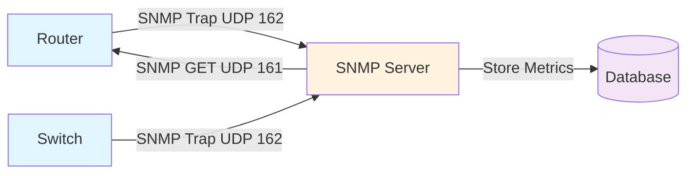

# Cisco IOS-XE SNMP Configuration Guide

## 1. Overview

SNMP (Simple Network Management Protocol) monitors network devices and collects performance
metrics: CPU, memory, interface statistics, temperature, and power supply status.

**Key Functions:**

- **Monitoring:** Query device metrics (GET requests)
- **Traps:** Device-initiated alerts (link down, temperature high)
- **Configuration:** Modify device settings (SET requests)
- **Discovery:** Identify devices on network (SNMP walk)

## 2. SNMP Architecture



**Key Components:**

- **SNMP Agent** (Cisco device): Generates traps, responds to queries
- **SNMP Manager** (Prometheus, Zabbix, Splunk): Polls devices for metrics
- **OID** (Object Identifier): Unique path to each metric (e.g., 1.3.6.1.2.1.1.5.0 = sysName)

## 3. SNMP Versions

| Version | Authentication | Encryption | Recommended |
| --- | --- | --- | --- |
| SNMPv1 | Community string | None | ❌ Legacy only |
| SNMPv2c | Community string | None | ⚠️ With ACL |
| SNMPv3 | Username/auth | Per-message | ✅ Recommended |

**SNMPv1/v2c:** Fast, simple, unencrypted (use only on trusted networks).
**SNMPv3:** Encrypted, authenticated, complex setup (use for production).

## 4. SNMPv2c Configuration

### Basic SNMPv2c Setup

```ios
snmp-server community PUBLIC_STRING ro
snmp-server community PRIVATE_STRING rw
```

- **ro (read-only):** Public community for monitoring (get metrics only)
- **rw (read-write):** Private community for configuration (get and set)

### Restrict SNMPv2c Access

```ios
access-list 1 permit 192.0.2.0 0.0.0.255
! Allow monitoring from 192.0.2.0/24 subnet

snmp-server community PUBLIC_STRING ro 1
snmp-server community PRIVATE_STRING rw 1
! Community names tied to ACL 1
```

### Disable Dangerous SNMP Settings

```ios
no snmp-server trap link-status
! Don't send trap on interface state change (verbose)

no snmp-server trap snmp linkup linkdown
! Don't send link up/down traps

no snmp-server source-interface
! Set source IP explicitly (not automatic)
```

## 5. SNMPv3 Configuration

### SNMPv3 With User Authentication

```ios
snmp-server group ADMIN-GROUP v3 auth
snmp-server user admin ADMIN-GROUP v3 auth sha AUTH_PASSWORD

snmp-server group READ-GROUP v3 noauth
snmp-server user monitor READ-GROUP v3
```

- **auth:** Authenticate with SHA (RFC 3414)
- **noauth:** No authentication (not recommended)
- **priv:** Add privacy (encryption)

### SNMPv3 With Authentication + Encryption

```ios
snmp-server group ADMIN-GROUP v3 priv
snmp-server user admin ADMIN-GROUP v3 auth sha AUTH_PASSWORD \
  priv aes 256 PRIV_PASSWORD

snmp-server user monitor ADMIN-GROUP v3 auth sha AUTH_PASSWORD \
  priv aes 256 PRIV_PASSWORD
```

- **auth sha:** HMAC-SHA authentication
- **priv aes 256:** AES-256 encryption
- Both password and priv password required

### SNMPv3 Group Permissions

```ios
! Read-only group
snmp-server group MONITORING v3 auth read VIEW-MONITORING

! Admin group (read-write)
snmp-server group ADMINS v3 priv read VIEW-ALL write VIEW-ALL

snmp-server view VIEW-MONITORING iso included
snmp-server view VIEW-ALL iso included
```

## 6. SNMP Traps

### Enable Trap Receivers

```ios
snmp-server trap-source Loopback0
! Send traps from loopback (consistent source)

snmp-server enable traps bgp
snmp-server enable traps ospf
snmp-server enable traps eigrp
snmp-server enable traps interface
snmp-server enable traps snmp linkup linkdown
snmp-server enable traps syslog
snmp-server enable traps cpu threshold

snmp-server host 192.0.2.50 public
! Send traps to 192.0.2.50 using community "public"
```

### SNMPv3 Trap Receiver

```ios
snmp-server host 192.0.2.50 version 3 priv admin
! Send traps to 192.0.2.50 using SNMPv3 user "admin"
```

### Trap Types

```text
bgp               BGP state changes
ospf              OSPF neighbor changes
eigrp             EIGRP neighbor changes
interface         Interface up/down
snmp              SNMP authentication failures
syslog            Syslog messages sent
cpu threshold     CPU threshold exceeded
memory            Memory threshold exceeded
temperature       Temperature threshold exceeded
power-supply      Power supply state change
rtr               IP SLA events
```

## 7. Common OIDs

SNMP queries data by OID (Object Identifier):

| OID | Meaning |
| --- | --- |
| 1.3.6.1.2.1.1.1.0 | sysDescr (device description) |
| 1.3.6.1.2.1.1.3.0 | sysUptime (uptime in ticks) |
| 1.3.6.1.2.1.1.5.0 | sysName (hostname) |
| 1.3.6.1.2.1.25.3.2.1.5 | CPU load (%) |
| 1.3.6.1.2.1.25.2.3.1.6 | Memory (bytes) |
| 1.3.6.1.2.1.2.2.1.10 | Interface input octets |
| 1.3.6.1.2.1.2.2.1.16 | Interface output octets |
| 1.3.6.1.2.1.2.2.1.20 | Interface input errors |

## 8. MIB (Management Information Base)

MIBs define the structure of SNMP data. Cisco provides:

- **RFC1213-MIB:** Standard interfaces, routing, system
- **CISCO-PRODUCTS-MIB:** Cisco device models
- **CISCO-CONFIG-MAN-MIB:** Configuration management
- **CISCO-MEMORY-POOL-MIB:** Memory statistics

### Load MIB on Monitoring Station

```bash
# Linux example (Prometheus with SNMP exporter)
# Download Cisco MIBs
git clone https://github.com/cisco/ios-xe-mib.git /usr/share/snmp/mibs/cisco

# Export MIB path
export MIBDIRS=/usr/share/snmp/mibs:/usr/share/snmp/mibs/cisco

# Query with MIB names
snmpget -m ALL -v 2c -c public 10.0.0.1 sysDescr.0
```

## 9. Configuration Management

### Enable Config Change Traps

```ios
snmp-server enable traps config
snmp-server host 192.0.2.50 public
```

Trap sent whenever running config changes.

### Inform Instead of Trap

```ios
snmp-server inform version 2c 192.0.2.50 public
! Inform = trap with acknowledgment (more reliable)
```

## 10. SNMP Engine ID

### View Current Engine ID

```ios
show snmp engineid
```

**Engine ID Uniqueness:** If cloning a device, regenerate:

```ios
snmp-server engineid local UNIQUE_ID_HERE
```

## 11. Troubleshooting

### Verify SNMP Configuration

```ios
show snmp
! Display SNMP configuration, community strings, traps

show snmp group
! Display SNMPv3 groups

show snmp user
! Display SNMPv3 users

show snmp host
! Display trap receivers

show snmp access
! Display SNMP access controls
```

### Test SNMP Query from Remote Server

```bash
# Query sysDescr using SNMPv2c
snmpget -v 2c -c public 10.0.0.1 1.3.6.1.2.1.1.1.0

# Query with MIB names
snmpget -v 2c -c public -m RFC1213-MIB 10.0.0.1 sysDescr.0

# Walk entire tree (list all OIDs)
snmpwalk -v 2c -c public 10.0.0.1 1.3.6.1.2.1
```

### Debug SNMP

```ios
debug snmp packets
! Shows SNMP requests/responses

debug snmp authentication
! Shows authentication attempts

undebug all
! Disable debugging
```

### Common Issues

#### Issue: Can't query device (SNMPv2c)

```text

1. Verify community string: show snmp
1. Check ACL: show access-list
1. Test connectivity: ping 10.0.0.1
1. Check SNMP enabled: show snmp
1. Verify UDP 161 open: netstat -un | grep 161
```

#### Issue: Traps not arriving

```text

1. Check trap receiver: show snmp host
1. Verify trap source reachable: ping 192.0.2.50
1. Verify trap type enabled: show snmp
1. Check syslog for errors: show logging
```

#### Issue: SNMPv3 authentication failures

```text

1. Verify user exists: show snmp user
1. Check username/password: snmp-server user admin GROUP v3
1. Verify group permissions: show snmp group
1. Test with wrong password: should fail with auth error
1. Enable debug: debug snmp authentication
```

## 12. Best Practices

✅ **Do:**

- Use SNMPv3 (auth + encryption) for production
- Restrict communities with ACLs
- Use separate read-only communities
- Enable traps to SNMP server
- Configure trap-source to loopback
- Test SNMP queries before deploying
- Rotate community strings regularly
- Monitor SNMP server disk space

❌ **Don't:**

- Use default community strings (public/private)
- Enable write access (rw) unless necessary
- Send SNMP over untrusted networks without SNMPv3
- Leave SNMPv1 enabled (upgrade to v2c or v3)
- Use same community for all devices
- Enable all trap types (too verbose)
- Query SNMP servers from internet

## 13. Examples

### Example 1: Basic SNMPv2c

```ios
access-list 1 permit 192.0.2.0 0.0.0.255

snmp-server community MONITORING ro 1
snmp-server community ADMIN rw 1

snmp-server trap-source Loopback0
snmp-server host 192.0.2.50 version 2c MONITORING

snmp-server enable traps bgp ospf eigrp interface
snmp-server enable traps snmp linkup linkdown
```

### Example 2: SNMPv3 with Full Security

```ios
snmp-server group ADMINS v3 priv
snmp-server user admin ADMINS v3 auth sha AdminPass123! \
  priv aes 256 PrivPass456!

snmp-server group MONITOR v3 auth
snmp-server user monitor MONITOR v3 auth sha MonPass789!

snmp-server view RESTRICTED iso included
snmp-server group MONITOR read RESTRICTED

snmp-server trap-source Loopback0
snmp-server host 192.0.2.50 version 3 priv admin

snmp-server enable traps bgp ospf eigrp interface
```

### Example 3: Minimal SNMP (Read-Only)

```ios
snmp-server community PUBLIC ro
snmp-server trap-source Loopback0
snmp-server host 192.0.2.50 public
```

## 14. Verification Commands

```ios
show snmp
! Display SNMP configuration and statistics

show snmp community
! Display community strings and ACLs

show snmp user
! Display SNMPv3 users

show snmp host
! Display trap receiver configuration

show snmp groups
! Display SNMPv3 groups

show running-config | include snmp
! Display all SNMP configurations
```

## Next Steps

- Configure syslog logging (see [Syslog configuration guide](cisco_syslog_config.md))
- Set up AAA for device access (see [AAA configuration guide](cisco_aaa_config.md))
- Review minimal SNMP template (see [Security hardening minimal](./security-hardening-minimal.md))
