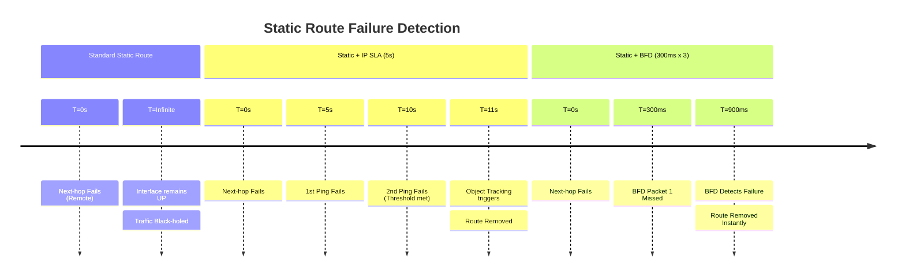

# Cisco IOS-XE: BFD for Static Routes

While dynamic protocols like BGP and OSPF have built-in BFD support, static routes
traditionally rely on interface "Up/Down" status. BFD for static routes allows the
router to monitor the actual reachability of the next-hop IP, even if the physical
interface remains up.

---

## 1. Failure Detection Timeline

Standard static routing only fails over if the local interface goes down. If a provider
switch fails but your local port stays up, traffic is black-holed.



---

## 2. Cisco IOS-XE Configuration

### A. BFD Template Setup

```ios

bfd-template single-hop STATIC-BFD-TIMER
 interval min-tx 300 min-rx 300 multiplier 3
```

### B. Interface Enablement

BFD must be enabled on the interface connecting to the static next-hop.

```ios

interface GigabitEthernet1
 description TO-ISP-GATEWAY
 ip address 192.168.1.2 255.255.255.0
 bfd template STATIC-BFD-TIMER
```

### C. Static Route Integration

Link the static route to the BFD session.

```ios

! Direct BFD peering for static route
ip route 0.0.0.0 0.0.0.0 192.168.1.1 name DEFAULT-GW bfd
!
! Optional: Backup route with higher AD
ip route 0.0.0.0 0.0.0.0 172.16.1.1 200 name BACKUP-GW
```

---

## 3. Advanced: BFD with Object Tracking

If the next-hop is not directly connected (Multiple hops), you must use a Multi-hop
BFD session combined with a track object.

```ios

! 1. Define Multi-hop BFD
bfd-template multi-hop MH-BFD
 interval min-tx 500 min-rx 500 multiplier 3
!
! 2. Configure BFD Map
bfd-map 10.0.0.1 192.168.1.2 source 192.168.1.1 template MH-BFD
!
! 3. Configure Track Object
track 100 bfd vrf default 10.0.0.1
!
! 4. Apply to Static Route
ip route 10.10.10.0 255.255.255.0 192.168.1.1 track 100
```

---

## 4. Comparison Summary

| Metric | Static (Default) | Static + IP SLA | Static + BFD |
| :--- | :--- | :--- | :--- |
| **Detection Speed** | N/A (Link dependent) | ~5 - 15 Seconds | **< 1 Second** |
| **Silent Failure Detection** | No | Yes | **Yes** |
| **CPU Impact** | None | Low | Low (Offloaded) |
| **Mechanism** | Interface State | ICMP/Ping Echo | **UDP Heartbeat** |

---

## 5. Key Principles

### A. Next-Hop Reachability

For `ip route ... bfd` to work, the next-hop **must** be reachable via a connected
interface. If the next-hop is recursive (learned via another route), standard BFD
will not initiate.

### B. BFD Echo Mode

On Cisco, Echo Mode is enabled by default. If your next-hop device is a firewall
or a non-Cisco router that doesn't "loop back" packets, disable echo mode to avoid
false failures:

`no bfd echo`

### C. Resource Efficiency

BFD for static routes is significantly more efficient than IP SLA. While IP SLA
requires a full ICMP process for every check, BFD is processed in the data plane,
allowing for much higher frequency without impacting the control plane.

---

## 6. Verification Commands

| Command | Purpose |
| :--- | :--- |
| `show bfd neighbors` | Confirm the static BFD session is "Up". |
| `show ip route static` | Check if the route is present in the table. |
| `show track` | (If using Object Tracking) Verify the BFD object status. |
| `debug bfd event` | Monitor BFD session transitions in real-time. |
