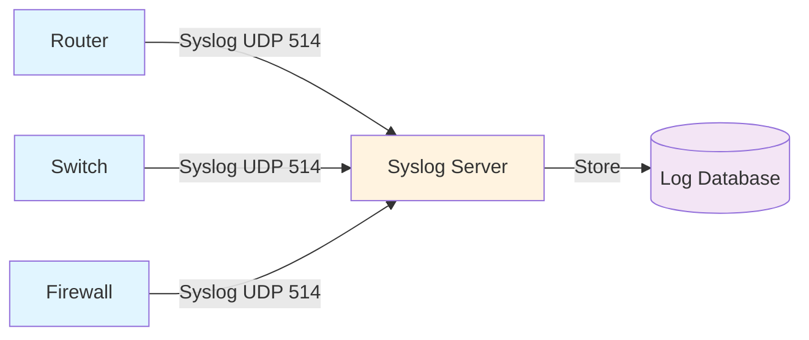

# Cisco IOS-XE Syslog Configuration Guide

## 1. Overview

Syslog provides centralized logging of device events (AAA, BGP, interfaces, config changes). Cisco
devices send logs to a remote syslog server for archival, analysis, and compliance.

**Benefits:**

- **Centralized:** One server collects logs from all devices
- **Persistent:** Logs survive device reboot (stored on server)
- **Searchable:** Query logs for troubleshooting and audit
- **Compliant:** Meet regulatory logging requirements (HIPAA, SOC2, PCI-DSS)

## 2. Syslog Architecture



**Key Components:**

- **Syslog Client** (Cisco device): Generates and sends logs
- **Syslog Server** (Linux/syslog-ng): Receives and stores logs
- **Syslog Collector** (ELK, Splunk): Analyzes and searches logs

## 3. Basic Syslog Configuration

### Minimal Setup

```ios
logging host 192.0.2.50
logging trap informational
logging source-interface Loopback0
```

Sends informational and above (notice, warning, error, critical, alert, emergency) to 192.0.2.50.

### Full Configuration

```ios
logging host 192.0.2.50
logging host 192.0.2.51 transport tcp port 1514
logging source-interface Loopback0
logging facility local7
logging trap informational
logging format rfc5424
logging timestamp milliseconds
logging sequence-numbers
```

**Settings:**

- **host:** Syslog server IP (can have multiple)
- **transport tcp port 1514:** Use TCP instead of UDP (more reliable)
- **source-interface:** Consistent sender IP (required for syslog server filtering)
- **facility local7:** Syslog facility (local0-local7 for custom apps)
- **trap informational:** Minimum log level
- **format rfc5424:** Modern syslog format
- **timestamp milliseconds:** Include milliseconds in timestamps
- **sequence-numbers:** Add sequence number (detect lost logs)

## 4. Syslog Levels

| Level | Value | Meaning | Examples |
| --- | --- | --- | --- |
| Emergency | 0 | System down | Router powered off |
| Alert | 1 | Action required | CPU at 100% |
| Critical | 2 | Critical error | Authentication failed repeatedly |
| Error | 3 | Error condition | Interface down |
| Warning | 4 | Warning | Link flapping |
| Notice | 5 | Normal but significant | BGP session up/down |
| Informational | 6 | Informational | Config saved |
| Debug | 7 | Debug info | Verbose output |

**Command Effect:**

- `logging trap informational` = send levels 0-6 (not debug)
- `logging trap warning` = send levels 0-4 only
- `logging trap debug` = send all levels (verbose)

## 5. Syslog Facilities

Facilities categorize log sources:

```text
facility local0 - local7     Custom applications
facility kern                Kernel messages
facility user                User-level messages
facility mail                Mail system
facility daemon              System daemons
facility auth                Auth messages
facility lpr                 Printer subsystem
facility news                Network news
facility uucp                UUCP subsystem
```

Cisco typically uses `facility local7` for all device logs.

## 6. Logging Filters

### Log Specific Modules Only

```ios
logging host 192.0.2.50
logging trap informational

! Log only BGP and interface events
logging include bgp
logging include interface
```

### Log Exclude Patterns

```ios
logging host 192.0.2.50

! Don't log CDP advertisements (chatty)
logging exclude cdp
```

### Conditional Logging

```ios
! Increase logging verbosity for BGP troubleshooting
debug ip bgp
logging trap debug

! Later, disable
undebug all
logging trap informational
```

## 7. Local Logging

### Buffered Logging (In-Memory)

```ios
logging buffered 10000 informational
! Keep 10,000 lines in router memory
! survives reload but lost on power loss
```

### Flash/Disk Logging

```ios
logging flash: /logs/syslog.txt
logging flash: informational
logging filesize 10000000
! Log to flash memory (if supported)
! 10MB per file
```

### Console Logging

```ios
logging console informational
logging synchronous limit 100
! Send logs to console
! Limit to 100 messages per second (prevent spam)
```

## 8. Syslog Formats

### Legacy Format

```text
Jun 15 10:47:09.432 UTC: %BGP-5-ADJCHANGE: neighbor 10.0.0.2 Up
```

### RFC3164 (BSD Syslog)

```text
<134>Jun 15 10:47:09 router BGP: %BGP-5-ADJCHANGE: neighbor 10.0.0.2 Up
```

### RFC5424 (IETF Syslog)

```text
<134>1 2024-06-15T10:47:09.432+00:00 router BGP - - - %BGP-5-ADJCHANGE: neighbor 10.0.0.2 Up
```

**Configure RFC5424 (recommended):**

```ios
logging format rfc5424
logging timestamp milliseconds
```

## 9. Message Logging

### Syslog Message Structure

```bash
%FACILITY-SEVERITY-MNEMONIC: MESSAGE
```

Example:

```bash
%BGP-5-ADJCHANGE: neighbor 10.0.0.2 Up
 ^    ^
 |    |
 |    +----- Severity (0-7)
 +---------- Facility
```

### Common Cisco Facilities

| Facility | Description |
| --- | --- |
| %BGP | BGP routing protocol |
| %OSPF | OSPF routing protocol |
| %EIGRP | EIGRP routing protocol |
| %IF | Interface events |
| %SYS | System messages |
| %SEC | Security/AAA events |
| %CRYPTO | Crypto/IPsec messages |
| %LINK | Link layer events |

## 10. NTP-Synchronized Timestamps

### Require NTP for Accurate Logging

```ios
ntp server 10.0.0.1 prefer
ntp source Loopback0

logging timestamp datetime msec localtime show-timezone
! Log with NTP-synchronized time, milliseconds, timezone
```

**Why NTP matters:**

- Logs from multiple devices must have synchronized timestamps
- Helps correlate events across the network
- Critical for forensics and root cause analysis

## 11. Redundant Syslog Servers

### Primary and Backup Servers

```ios
logging host 192.0.2.50
logging host 192.0.2.51
logging host 192.0.2.52

logging trap informational
logging source-interface Loopback0
```

Router sends each log message to ALL servers (not failover). Useful for:

- Redundancy (if one server down, others still receive)
- Load distribution (split traffic across servers)

## 12. Syslog Server Configuration (Linux)

### Syslog-ng Example

```bash
# /etc/syslog-ng/conf.d/cisco.conf

source s_cisco {
  network(ip(0.0.0.0) port(514) transport(udp));
};

destination d_cisco {
  file("/var/log/cisco/$HOST/%Y-%m-%d/$HOST-%H:%M:%S");
};

log {
  source(s_cisco);
  destination(d_cisco);
};
```

Router logs stored in: `/var/log/cisco/router1/2024-06-15/router1-10:47:09`

### Rsyslog Example

```bash
# /etc/rsyslog.d/cisco.conf

$ModLoad imudp
$UDPServerRun 514

:hostname, isequal, "router1" /var/log/cisco/router1.log
& stop
```

## 13. Troubleshooting

### Verify Syslog Configuration

```ios
show logging
! Display logging configuration and statistics

show logging host
! Show configured syslog servers

show logging process
! Display logging module status

show logging onetime
! One-time log events since boot
```

### Test Connectivity to Syslog Server

```ios
ping 192.0.2.50
! Verify server reachability

traceroute 192.0.2.50
! Check path to server (firewall, MTU issues)

telnet 192.0.2.50 514
! Test UDP/TCP connectivity (if server supports TCP)
```

### Generate Test Log Message

```ios
send log message "TEST: This is a test syslog message"
```

Or via terminal:

```bash
# From remote server, watch logs
tail -f /var/log/cisco/router1.log

# From router CLI, generate message
test log message "Connection test"
```

### Common Issues

#### Issue: Logs not appearing on server

```text
1. Check IP connectivity: ping 192.0.2.50
2. Verify logging configured: show logging
3. Check facility/level: logging trap informational
4. Firewall rule on server: sudo ufw allow 514/udp
5. Verify source-interface: logging source-interface Loopback0
6. Check syslog service running: systemctl status syslog-ng
```

#### Issue: Duplicate logs

```text
Multiple routers sending with same hostname. Configure unique hostname:

hostname router1-ny-core1
```

#### Issue: Timestamps wrong

```text
1. Verify NTP sync: show ntp status
2. Configure NTP: ntp server 10.0.0.1
3. Check system time: show clock
4. If NTP unavailable, manually set: clock set HH:MM:SS Mon DD YYYY
```

## 14. Best Practices

✅ **Do:**

- Use centralized syslog server for all devices
- Configure NTP for synchronized timestamps
- Set source-interface to loopback (doesn't change if interface down)
- Use TCP transport (more reliable than UDP)
- Enable sequence numbers (detect lost logs)
- Log to local buffer as backup (if syslog server down)
- Use RFC5424 format (modern, unambiguous)
- Rotate logs on server (prevent disk full)
- Monitor syslog server disk space

❌ **Don't:**

- Rely on syslog over untrusted networks (UDP unencrypted)
- Log debug level continuously (fills disk)
- Use device IP as source (changes if interface down)
- Mix different timestamp formats across devices
- Send logs to default syslog port on internet (security risk)
- Forget to configure NTP before enabling syslog

## 15. Examples

### Example 1: Minimal Syslog

```ios
ntp server 10.0.0.1 prefer
ntp source Loopback0

logging host 192.0.2.50
logging trap informational
logging source-interface Loopback0
logging sequence-numbers
```

### Example 2: Enterprise Syslog with TCP

```ios
ntp server 10.0.0.1 prefer
ntp server 10.0.0.2

logging host 192.0.2.50 transport tcp port 1514
logging host 192.0.2.51 transport tcp port 1514
logging trap notice

logging source-interface Loopback0
logging facility local7
logging format rfc5424
logging timestamp datetime msec show-timezone
logging sequence-numbers
logging buffered 50000 debugging
```

### Example 3: Syslog with Local Backup

```ios
logging host 192.0.2.50
logging trap informational
logging source-interface Loopback0

logging buffered 10000 informational
! If syslog server down, local buffer is backup

logging console warnings
! Also send warnings to console for operator awareness
```

## 16. Verification Commands

```ios
show logging
! Display syslog configuration, server status, statistics

show logging onetime
! One-time events since last boot

show logging process
! Show logging subsystem status

show running-config | include logging
! Display all logging configurations
```

## Next Steps

- Configure AAA logging (see [AAA configuration guide](cisco_aaa_config.md))
- Set up SNMP monitoring (see [SNMP configuration guide](cisco_snmp_config.md))
- Review minimal syslog template (see [Security hardening minimal](./security-hardening-minimal.md))
