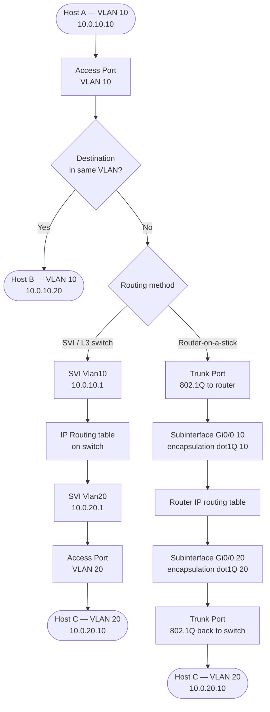

# Cisco IOS-XE: VLAN, Trunking, and Inter-VLAN Routing Configuration

VLANs segment a physical switch into multiple independent broadcast domains. 802.1Q tags
frames on trunk links so that a single physical connection carries traffic for many
VLANs
simultaneously. Inter-VLAN routing is performed either by a Layer 3 switch using
Switched
Virtual Interfaces (SVIs) or by an external router using subinterfaces
(router-on-a-stick).

For protocol background see [VLANs and 802.1Q](../theory/vlans.md).

---

## 1. Overview & Principles

- **VLAN database:** VLANs 1–4094 are defined in the local VLAN database (or propagated

via VTP). Each VLAN is an independent broadcast domain — frames are never forwarded
between
  VLANs without a Layer 3 routing decision.

- **802.1Q tagging:** On trunk ports, every frame carries a 4-byte 802.1Q tag (VLAN ID +

  priority bits) inserted after the source MAC address. The native VLAN is the only VLAN
  whose frames traverse a trunk untagged by default.

- **Native VLAN:** Frames arriving on a trunk without a tag are assigned to the native
VLAN.

VLAN.

VLAN 1 is the factory default native VLAN and also carries CDP, STP, VTP, and PAgP
control
  traffic. Best practice is to set an unused, dedicated native VLAN (e.g., 999) and keep
  VLAN 1 off all user trunk ports.

- **SVI vs router-on-a-stick:** An SVI is a virtual Layer 3 interface on a multilayer
switch

switch

and is the preferred inter-VLAN method for most campus environments — routing is
performed
in hardware. Router-on-a-stick uses a single physical link with 802.1Q subinterfaces and
  is suited to branch sites where no multilayer switch is available.

- **DTP (Dynamic Trunking Protocol):** IOS-XE switches negotiate trunking automatically

with DTP. Disable it with `switchport nonegotiate` on all access and static trunk ports
  to prevent misconfiguration and VLAN-hopping attacks.

---

## 2. Traffic Path: SVI vs Router-on-a-Stick



---

## 3. Configuration

### A. VLAN Creation and Naming

Define VLANs in the VLAN database before assigning them to ports. VLAN 1 exists by default
and cannot be deleted — do not use it for user traffic.

```ios

vlan 10
 name USERS
!
vlan 20
 name SERVERS
!
vlan 30
 name VOICE
!
vlan 999
 name NATIVE-UNUSED               ! Reserved as native VLAN — carries no user traffic
!
! Verify VLAN database
! show vlan brief
```

### B. Access Port Configuration

Access ports carry traffic for exactly one VLAN, untagged. `switchport nonegotiate` disables
DTP negotiation and must be configured on all non-trunk ports.

```ios

interface GigabitEthernet1/0/1
 description User workstation
 switchport mode access            ! Hard-set as access — do not rely on auto-negotiation
 switchport access vlan 10         ! Assign to VLAN 10
 switchport nonegotiate            ! Disable DTP
 spanning-tree portfast            ! Skip STP listening/learning — end-device port only
 spanning-tree bpduguard enable    ! Shutdown port if a BPDU arrives (prevents rogue switches)
 no shutdown
!
! Voice VLAN (IP phone + PC on same port)
interface GigabitEthernet1/0/2
 description IP Phone + PC
 switchport mode access
 switchport access vlan 10         ! Data VLAN for PC
 switchport voice vlan 30          ! Voice VLAN — phone tags its own frames; PC frames untagged
 switchport nonegotiate
 spanning-tree portfast
 no shutdown
```

### C. Trunk Port Configuration

Trunk ports carry multiple VLANs between switches or to a router. Restrict the allowed VLAN
list to only VLANs that are needed on the link — this reduces STP scope and limits the blast
radius of a misconfiguration.

```ios

interface GigabitEthernet1/0/48
 description Uplink to distribution switch
 switchport trunk encapsulation dot1q  ! Required on older platforms (3750, 4500); omit on newer
 switchport mode trunk                 ! Hard-set trunk — do not use dynamic desirable/auto
 switchport trunk allowed vlan 10,20,30,999   ! Whitelist — remove VLAN 1 and all unused VLANs
 switchport trunk native vlan 999     ! Move native VLAN away from VLAN 1
 switchport nonegotiate               ! Disable DTP
 no shutdown
```

### D. SVI — Layer 3 Inter-VLAN Routing

SVIs are virtual interfaces on a multilayer switch. The `ip routing` command enables Layer
3 forwarding in the switch hardware. An SVI only comes up if at least one access port assigned
to that VLAN is in a forwarding state — a VLAN with no active ports will show the SVI as
line protocol down.

```ios

! Enable IP routing globally (required for inter-VLAN routing via SVI)
ip routing
!
interface Vlan10
 description USERS gateway
 ip address 10.0.10.1 255.255.255.0
 no shutdown                          ! SVIs default to administratively down
!
interface Vlan20
 description SERVERS gateway
 ip address 10.0.20.1 255.255.255.0
 no shutdown
!
interface Vlan30
 description VOICE gateway
 ip address 10.0.30.1 255.255.255.0
 no shutdown
!
! SVI will not come up if VLAN does not exist in the VLAN database
! and no active access ports are assigned to it
! Verify: show interfaces vlan 10
```

### E. Router-on-a-Stick (Subinterfaces)

Used at branch sites where a router rather than a multilayer switch provides inter-VLAN
routing. The physical interface has no IP address — each subinterface carries one VLAN.

```ios

! Physical interface — no IP address; just bring it up
interface GigabitEthernet0/0
 no ip address
 no shutdown
!
! Subinterface for VLAN 10
interface GigabitEthernet0/0.10
 description USERS
 encapsulation dot1Q 10             ! Tag matching — must match VLAN ID on the switch trunk
 ip address 10.0.10.1 255.255.255.0
!
! Subinterface for VLAN 20
interface GigabitEthernet0/0.20
 description SERVERS
 encapsulation dot1Q 20
 ip address 10.0.20.1 255.255.255.0
!
! Subinterface for native VLAN (no dot1Q tag on this subinterface)
interface GigabitEthernet0/0.999
 description NATIVE-UNUSED
 encapsulation dot1Q 999 native     ! native keyword — matches untagged frames
 no ip address
```

### F. VTP and Allowed VLAN Pruning

VTP (VLAN Trunking Protocol) propagates the VLAN database from a VTP server to all switches
in the same VTP domain. A VTP server with a higher revision number will overwrite the VLAN
database on all VTP clients — a misconfigured switch inserted into the domain can silently
delete production VLANs across the entire network.

**Recommended:** configure all switches in `transparent` mode. Each switch maintains its
own local VLAN database, VTP advertisements are forwarded but not acted upon, and there
is no risk of accidental VLAN propagation.

```ios

! VTP transparent mode — local VLAN database only; no propagation
vtp mode transparent
vtp domain CORP                      ! Domain name must still match for VTP to pass through

! VTP version 3 (if inter-switch VTP is required — provides primary server protection)
vtp version 3
vtp mode server primary              ! Only explicit primary server can update the database
```

Restrict the VLAN list on every trunk to only VLANs that are actually required on that link.
Remove VLANs as they are decommissioned.

```ios

! Add a VLAN to an existing trunk
interface GigabitEthernet1/0/48
 switchport trunk allowed vlan add 40

! Remove a VLAN from an existing trunk
interface GigabitEthernet1/0/48
 switchport trunk allowed vlan remove 40

! Replace the entire allowed list
interface GigabitEthernet1/0/48
 switchport trunk allowed vlan 10,20,30,999
```

### G. Private VLANs

Private VLANs (PVLANs) allow ports within the same VLAN to be isolated from each other.
The primary VLAN contains secondary VLANs of two types: `isolated` (ports cannot communicate
with any other port in the secondary VLAN) and `community` (ports can communicate within
their community but not with other secondary VLANs).

```ios

! Step 1: Define secondary VLANs
vlan 101
 private-vlan isolated              ! Isolated secondary — ports cannot talk to each other

vlan 102
 private-vlan community             ! Community secondary — ports can talk within group

! Step 2: Define primary VLAN and associate secondaries
vlan 100
 private-vlan primary
 private-vlan association 101,102   ! Associate secondary VLANs to primary

! Step 3: Configure host ports (isolated or community)
interface GigabitEthernet1/0/5
 switchport mode private-vlan host
 switchport private-vlan host-association 100 101  ! primary VLAN, secondary VLAN

! Step 4: Configure promiscuous port (connects to router/firewall — can reach all PVLANs)
interface GigabitEthernet1/0/1
 switchport mode private-vlan promiscuous
 switchport private-vlan mapping 100 101,102       ! Primary maps to all secondaries
```

---

## 4. Comparison Summary

| Method | Tagged/Untagged | VLAN scope | Routing location | Typical use |
| :--- | :--- | :--- | :--- | :--- |
| **Access port** | Untagged | Single VLAN | N/A | End devices, printers, cameras |
| **Trunk port** | Tagged (native untagged) | Multiple VLANs | N/A | Switch-to-switch, switch-to-router uplinks |
| **SVI routing** | Tagged on uplink; untagged on access | All VLANs defined on switch | Multilayer switch hardware | Campus distribution/core, large LAN |
| **Router-on-a-stick** | Tagged subinterfaces on single link | Limited by link bandwidth &#124; subinterface count | Router CPU | Branch sites, low-throughput inter-VLAN routing |

---

## 5. Verification & Troubleshooting

| Command | Purpose |
| :--- | :--- |
| `show vlan brief` | VLAN database — IDs, names, and assigned access ports |
| `show vlan id 10` | Detail for a specific VLAN including port membership |
| `show interfaces trunk` | All trunk interfaces — encapsulation, native VLAN, allowed and active VLANs |
| `show interfaces GigabitEthernet1/0/1 switchport` | Detailed switchport config for a specific port — admin mode, operational mode, access VLAN, voice VLAN |
| `show interfaces GigabitEthernet1/0/48 trunk` | Trunk detail for a specific interface |
| `show ip interface brief` | SVI state — line protocol down indicates no active ports in that VLAN |
| `show interfaces vlan 10` | SVI operational detail — IP address, line protocol state |
| `show vtp status` | VTP mode, domain, revision number, and VLAN count |
| `show vtp counters` | VTP advertisement and error counters |
| `show spanning-tree vlan 10` | STP topology for a specific VLAN — root bridge, port states |
| `show mac address-table vlan 10` | MAC table entries for a VLAN — learned port and age |
| `show ip route` | Routing table on a multilayer switch — verify connected routes for each SVI |
