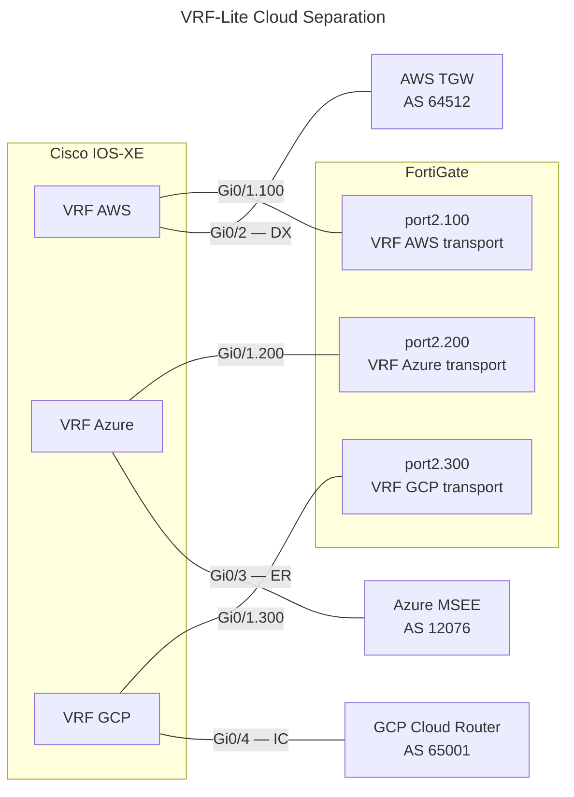

# Cisco IOS-XE: VRF-Lite for Cloud Provider Separation

## 1. Overview

Three separate VRFs isolate cloud provider routing from the internal network and from
each other:

| VRF | Purpose | Cloud-side peer |
| --- | --- | --- |
| `AWS` | AWS Direct Connect + FortiGate IPsec transport | TGW (AS 64512) |
| `Azure` | Azure ExpressRoute + FortiGate IPsec transport | MSEE (AS 12076) |
| `GCP` | GCP Cloud Interconnect + FortiGate IPsec transport | Cloud Router (customer ASN) |

Each VRF holds:

- The WAN interface toward the cloud provider (Direct Connect / ExpressRoute /
Interconnect)
Interconnect)

- A subinterface toward the FortiGate for that cloud's IPsec transport

The FortiGate requires a **dedicated VLAN subinterface per cloud provider** — a single
shared WAN IP cannot be used when the Cisco side places each path in a different VRF.

---

## 2. Architecture



### Address Plan

| VRF | Cisco–FortiGate link | Cisco–Cloud link |
| --- | --- | --- |
| AWS | `10.254.1.0/30` (VLAN 100) | `169.254.x.x/30` (DX BGP) |
| Azure | `10.254.2.0/30` (VLAN 200) | `172.16.0.0/30` (ER private peering) |
| GCP | `10.254.3.0/30` (VLAN 300) | `169.254.0.0/29` (Interconnect) |

---

## 3. VRF Definitions

```ios

vrf definition AWS
 rd 65000:100
 route-target export 65000:100
 route-target import 65000:100
 !
 address-family ipv4
 exit-address-family
!
vrf definition Azure
 rd 65000:200
 route-target export 65000:200
 route-target import 65000:200
 !
 address-family ipv4
 exit-address-family
!
vrf definition GCP
 rd 65000:300
 route-target export 65000:300
 route-target import 65000:300
 !
 address-family ipv4
 exit-address-family
!
```

### Numbering Scheme

The RD and RT use a consistent `<local-AS>:<VRF-ID>` pattern tied to the VRF's purpose:

| VRF | RD | RT Export | RT Import | Meaning |
| --- | --- | --- | --- | --- |
| AWS | `65000:100` | `65000:100` | `65000:100` | AWS-only routes (fully isolated) |
| Azure | `65000:200` | `65000:200` | `65000:200` | Azure-only routes (fully isolated) |
| GCP | `65000:300` | `65000:300` | `65000:300` | GCP-only routes (fully isolated) |

**Why this design:**

- **Route Distinguisher (RD)** — Makes overlapping IP prefixes globally unique in BGP.
  Required even in VRF-Lite (no MPLS). Each VRF's RD must be unique on the router.

- **Route Target (RT) Export** — Tags routes when advertising. Each VRF exports with its
  own RT value.

- **Route Target (RT) Import** — Selects which routes to accept. In this cloud separation
  design, each VRF only accepts routes tagged with its own RT, preventing cross-cloud
  traffic leaking.

**For route leaking** (if needed in future): Spokes could also import the hub's RT
(e.g., `65000:999`) to reach shared services in the hub VRF.

---

## 4. Interface Assignment

### WAN Interfaces (Cloud Provider Side)

```ios

! AWS Direct Connect
interface GigabitEthernet0/2
 vrf forwarding AWS
 ip address 169.254.x.1 255.255.255.252
 no shutdown
!
! Azure ExpressRoute
interface GigabitEthernet0/3
 vrf forwarding Azure
 ip address 172.16.0.1 255.255.255.252
 no shutdown
!
! GCP Cloud Interconnect
interface GigabitEthernet0/4
 vrf forwarding GCP
 ip address 169.254.0.1 255.255.255.248
 no shutdown
!
```

> `vrf forwarding` must be set **before** the IP address. IOS-XE removes the IP
> address when you assign a VRF to an interface — re-apply it afterwards.

### FortiGate-Facing Subinterfaces (VLAN Trunked)

```ios

interface GigabitEthernet0/1
 no ip address
 no shutdown
!
interface GigabitEthernet0/1.100
 encapsulation dot1Q 100
 vrf forwarding AWS
 ip address 10.254.1.1 255.255.255.252
!
interface GigabitEthernet0/1.200
 encapsulation dot1Q 200
 vrf forwarding Azure
 ip address 10.254.2.1 255.255.255.252
!
interface GigabitEthernet0/1.300
 encapsulation dot1Q 300
 vrf forwarding GCP
 ip address 10.254.3.1 255.255.255.252
!
```

---

## 5. BFD Templates

One BFD template applies to all three VRFs — BFD is per-interface regardless of VRF.

```ios

bfd-template single-hop CLOUD-BFD
 interval min-tx 300 min-rx 300 multiplier 3
 no bfd echo
!
```

Apply per-interface:

```ios

interface GigabitEthernet0/2
 bfd template CLOUD-BFD
!
interface GigabitEthernet0/3
 bfd template CLOUD-BFD
!
interface GigabitEthernet0/4
 bfd template CLOUD-BFD
!
```

---

## 6. BGP Configuration

All three VRFs run as address families under a single BGP process.

```ios

router bgp 65000
 bgp router-id 10.0.0.1
 bgp log-neighbor-changes
 !
 ! =====================
 ! VRF AWS
 ! =====================
 address-family ipv4 vrf AWS
  !
  ! AWS TGW — Direct Connect BGP peer
  neighbor 169.254.x.2 remote-as 64512
  neighbor 169.254.x.2 description AWS-TGW-DX
  neighbor 169.254.x.2 fall-over bfd
  neighbor 169.254.x.2 activate
  neighbor 169.254.x.2 route-map RM-AWS-IN in
  neighbor 169.254.x.2 route-map RM-AWS-OUT out
  neighbor 169.254.x.2 send-community both
  !
  ! FortiGate — IPsec transport underlay peer
  neighbor 10.254.1.2 remote-as 65001
  neighbor 10.254.1.2 description FG-WAN-AWS
  neighbor 10.254.1.2 activate
  neighbor 10.254.1.2 route-map RM-FG-AWS-IN in
  neighbor 10.254.1.2 route-map RM-FG-AWS-OUT out
 exit-address-family
 !
 ! =====================
 ! VRF Azure
 ! =====================
 address-family ipv4 vrf Azure
  !
  ! MSEE — ExpressRoute private peering
  neighbor 172.16.0.2 remote-as 12076
  neighbor 172.16.0.2 description ER-MSEE-PRIMARY
  neighbor 172.16.0.2 fall-over bfd
  neighbor 172.16.0.2 activate
  neighbor 172.16.0.2 route-map RM-ER-IN in
  neighbor 172.16.0.2 route-map RM-ER-OUT out
  neighbor 172.16.0.2 send-community both
  !
  ! FortiGate — IPsec transport underlay peer
  neighbor 10.254.2.2 remote-as 65001
  neighbor 10.254.2.2 description FG-WAN-AZURE
  neighbor 10.254.2.2 activate
  neighbor 10.254.2.2 route-map RM-FG-AZ-IN in
  neighbor 10.254.2.2 route-map RM-FG-AZ-OUT out
 exit-address-family
 !
 ! =====================
 ! VRF GCP
 ! =====================
 address-family ipv4 vrf GCP
  !
  ! Cloud Router — Interconnect BGP peer
  neighbor 169.254.0.2 remote-as 65001
  neighbor 169.254.0.2 description GCP-CLOUD-ROUTER-IC
  neighbor 169.254.0.2 fall-over bfd
  neighbor 169.254.0.2 activate
  neighbor 169.254.0.2 route-map RM-GCP-IN in
  neighbor 169.254.0.2 route-map RM-GCP-OUT out
  neighbor 169.254.0.2 send-community both
  !
  ! FortiGate — IPsec transport underlay peer
  neighbor 10.254.3.2 remote-as 65001
  neighbor 10.254.3.2 description FG-WAN-GCP
  neighbor 10.254.3.2 activate
  neighbor 10.254.3.2 route-map RM-FG-GCP-IN in
  neighbor 10.254.3.2 route-map RM-FG-GCP-OUT out
 exit-address-family
!
```

### Route-Map Principles per VRF

The FortiGate-facing peers in each VRF should only carry the routes needed for IPsec
transport — **not** the cloud provider prefixes. The cloud provider prefixes travel
inside the FortiGate overlay BGP session (encrypted). The underlay only needs to
exchange the IPsec tunnel endpoint reachability.

```ios

! AWS VRF: advertise only the DX link subnet to FortiGate
ip prefix-list PFX-AWS-TRANSPORT permit 169.254.x.0/30
route-map RM-FG-AWS-OUT permit 10
 match ip address prefix-list PFX-AWS-TRANSPORT
!
! Azure VRF: advertise only the ER link subnet to FortiGate
ip prefix-list PFX-AZ-TRANSPORT permit 172.16.0.0/30
route-map RM-FG-AZ-OUT permit 10
 match ip address prefix-list PFX-AZ-TRANSPORT
!
! GCP VRF: advertise only the IC link subnet to FortiGate
ip prefix-list PFX-GCP-TRANSPORT permit 169.254.0.0/29
route-map RM-FG-GCP-OUT permit 10
 match ip address prefix-list PFX-GCP-TRANSPORT
!
```

---

## 7. OSPF Configuration with VRF

OSPF can run in multiple VRFs with separate process instances or as address families within a
single process.

### Single OSPF Process with Multiple VRFs

```ios
router ospf 100 vrf AWS
 router-id 10.0.0.1
 network 10.254.1.0 0.0.0.3 area 0
 network 169.254.x.0 0.0.0.3 area 0
 default-information originate
!
router ospf 200 vrf Azure
 router-id 10.0.0.1
 network 10.254.2.0 0.0.0.3 area 0
 network 172.16.0.0 0.0.0.3 area 0
 default-information originate
!
router ospf 300 vrf GCP
 router-id 10.0.0.1
 network 10.254.3.0 0.0.0.3 area 0
 network 169.254.0.0 0.0.0.7 area 0
 default-information originate
!
```

**Key Points:**

- Each VRF requires a **unique OSPF process number** (100, 200, 300) matching the Route Target suffix
- Router ID can be the same across VRFs (IOS-XE handles disambiguation)
- Routes learned via OSPF in one VRF do **not** leak to other VRFs
- Use `network` commands with VRF-specific subnets (cloud link + transport link)

### OSPF with BFD in VRF

```ios
interface GigabitEthernet0/2
 vrf forwarding AWS
 ip ospf dead-interval 9
 ip ospf hello-interval 3
 ip ospf bfd
!
```

---

## 8. EIGRP Configuration with VRF

EIGRP runs as a named instance with separate address families per VRF.

### EIGRP Named Mode with Multiple VRFs

```ios
router eigrp CLOUD-EIGRP
 !
 address-family ipv4 unicast vrf AWS
  network 10.254.1.0 0.0.0.3
  network 169.254.x.0 0.0.0.3
  eigrp router-id 10.0.0.1
  bfd all-interfaces
  af-interface GigabitEthernet0/2
   bfd
   hello-interval 5
   hold-time 15
  exit-af-interface
 exit-address-family
 !
 address-family ipv4 unicast vrf Azure
  network 10.254.2.0 0.0.0.3
  network 172.16.0.0 0.0.0.3
  eigrp router-id 10.0.0.1
  bfd all-interfaces
  af-interface GigabitEthernet0/3
   bfd
   hello-interval 5
   hold-time 15
  exit-af-interface
 exit-address-family
 !
 address-family ipv4 unicast vrf GCP
  network 10.254.3.0 0.0.0.3
  network 169.254.0.0 0.0.0.7
  eigrp router-id 10.0.0.1
  bfd all-interfaces
  af-interface GigabitEthernet0/4
   bfd
   hello-interval 5
   hold-time 15
  exit-af-interface
 exit-address-family
!
```

**Key Points:**

- EIGRP uses **named mode** (instance `CLOUD-EIGRP`) with address-family separation
- Each VRF has its own address-family block within the instance
- Router ID can be the same across VRFs
- BFD is configured per address-family and per interface within the AF
- Routes learned in one VRF **do not** leak to other VRFs

### EIGRP Classic Mode (Older IOS)

For devices using classic EIGRP syntax:

```ios
router eigrp 65000
 !
 address-family ipv4 vrf AWS
  network 10.254.1.0 0.0.0.3
  network 169.254.x.0 0.0.0.3
  exit-address-family
 !
 address-family ipv4 vrf Azure
  network 10.254.2.0 0.0.0.3
  network 172.16.0.0 0.0.0.3
  exit-address-family
 !
 address-family ipv4 vrf GCP
  network 10.254.3.0 0.0.0.3
  network 169.254.0.0 0.0.0.7
  exit-address-family
!
```

---

## 9. Routing Protocol Comparison in VRF

| Protocol | Process/Instance | VRF Isolation | BFD Support | Use Case |
| --- | --- | --- | --- | --- |
| **BGP** | Single process, multiple address-families | Yes (AF scoped) | Yes (native) | Cloud provider peering |
| **OSPF** | Unique process per VRF | Yes (per-process) | Yes (per-interface) | Internal routing within VRF |
| **EIGRP** | Named instance, multiple address-families | Yes (AF scoped) | Yes (per-AF or per-interface) | Internal routing within VRF |
| **RIP** | Not recommended | Yes | No | Legacy only |

---

## 10. FortiGate Interface Requirements

With VRF separation on the Cisco side, the FortiGate must present a **separate
logical interface per cloud provider**. VLAN subinterfaces on a trunk to the
Cisco are the typical approach:

| FortiGate Interface | VLAN | IP Address | Connects to |
| --- | --- | --- | --- |
| `port2.100` | 100 | `10.254.1.2/30` | Cisco VRF AWS |
| `port2.200` | 200 | `10.254.2.2/30` | Cisco VRF Azure |
| `port2.300` | 300 | `10.254.3.2/30` | Cisco VRF GCP |

Each FortiGate IPsec tunnel (AWS VPN, Azure VPN, GCP HA VPN) sources from the
corresponding subinterface, ensuring traffic stays within its VRF on the Cisco side.

---

## 11. Verification Commands

### VRF Status

| Command | Purpose |
| :--- | :--- |
| `show vrf` | List VRFs and their assigned interfaces |
| `show ip route vrf AWS` | Routing table for VRF AWS |
| `show ip route vrf Azure` | Routing table for VRF Azure |
| `show ip route vrf GCP` | Routing table for VRF GCP |

### BGP Verification

| Command | Purpose |
| :--- | :--- |
| `show bgp vpnv4 unicast vrf AWS summary` | BGP neighbour state in VRF AWS |
| `show bgp vpnv4 unicast vrf Azure summary` | BGP neighbour state in VRF Azure |
| `show bgp vpnv4 unicast vrf GCP summary` | BGP neighbour state in VRF GCP |
| `show ip bgp vpnv4 vrf AWS neighbors` | Full BGP detail for VRF AWS peers |

### OSPF Verification

| Command | Purpose |
| :--- | :--- |
| `show ip ospf 100` | OSPF process 100 (VRF AWS) summary |
| `show ip ospf 200` | OSPF process 200 (VRF Azure) summary |
| `show ip ospf 300` | OSPF process 300 (VRF GCP) summary |
| `show ip ospf neighbors vrf AWS` | OSPF neighbors in VRF AWS |
| `show ip ospf database vrf AWS` | OSPF link-state database in VRF AWS |

### EIGRP Verification

| Command | Purpose |
| :--- | :--- |
| `show eigrp address-family ipv4 vrf AWS` | EIGRP AF status for VRF AWS |
| `show eigrp neighbors vrf Azure` | EIGRP neighbors in VRF Azure |
| `show eigrp topology vrf Azure` | EIGRP topology table for VRF Azure |
| `show ip route eigrp vrf Azure` | EIGRP-learned routes in VRF Azure |

### General Connectivity

| Command | Purpose |
| :--- | :--- |
| `show bfd neighbors` | BFD sessions — applies across all VRFs |
| `ping vrf AWS 169.254.x.2` | Reachability test within a specific VRF |
| `traceroute vrf AWS 169.254.x.2` | Trace path within a specific VRF |
