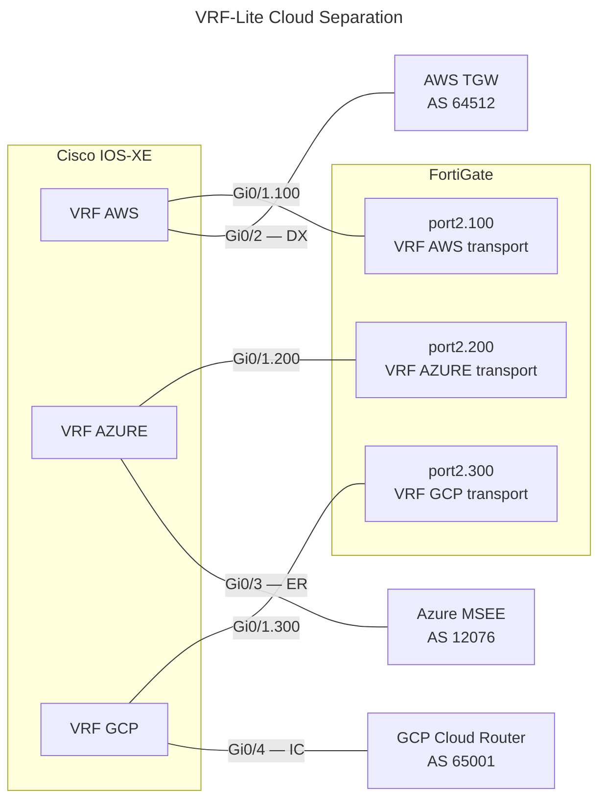

# Cisco IOS-XE: VRF-Lite for Cloud Provider Separation

## 1. Overview

Three separate VRFs isolate cloud provider routing from the internal network and from
each other:

| VRF | Purpose | Cloud-side peer |
| --- | --- | --- |
| `AWS` | AWS Direct Connect + FortiGate IPsec transport | TGW (AS 64512) |
| `AZURE` | Azure ExpressRoute + FortiGate IPsec transport | MSEE (AS 12076) |
| `GCP` | GCP Cloud Interconnect + FortiGate IPsec transport | Cloud Router (customer ASN) |

Each VRF holds:

- The WAN interface toward the cloud provider (Direct Connect / ExpressRoute / Interconnect)
- A subinterface toward the FortiGate for that cloud's IPsec transport

The FortiGate requires a **dedicated VLAN subinterface per cloud provider** — a single
shared WAN IP cannot be used when the Cisco side places each path in a different VRF.

---

## 2. Architecture



### Address Plan

| VRF | Cisco–FortiGate link | Cisco–Cloud link |
| --- | --- | --- |
| AWS | `10.254.1.0/30` (VLAN 100) | `169.254.x.x/30` (DX BGP) |
| AZURE | `10.254.2.0/30` (VLAN 200) | `172.16.0.0/30` (ER private peering) |
| GCP | `10.254.3.0/30` (VLAN 300) | `169.254.0.0/29` (Interconnect) |

---

## 3. VRF Definitions

```ios
vrf definition AWS
 rd 65000:100
 !
 address-family ipv4
 exit-address-family
!
vrf definition AZURE
 rd 65000:200
 !
 address-family ipv4
 exit-address-family
!
vrf definition GCP
 rd 65000:300
 !
 address-family ipv4
 exit-address-family
!
```

> A route distinguisher (`rd`) is required for BGP to operate within a VRF even in a
> VRF-Lite design (no MPLS). Use a simple `<local-AS>:<unique-id>` convention.

---

## 4. Interface Assignment

### WAN Interfaces (Cloud Provider Side)

```ios
! AWS Direct Connect
interface GigabitEthernet0/2
 vrf forwarding AWS
 ip address 169.254.x.1 255.255.255.252
 no shutdown
!
! Azure ExpressRoute
interface GigabitEthernet0/3
 vrf forwarding AZURE
 ip address 172.16.0.1 255.255.255.252
 no shutdown
!
! GCP Cloud Interconnect
interface GigabitEthernet0/4
 vrf forwarding GCP
 ip address 169.254.0.1 255.255.255.248
 no shutdown
!
```

> `vrf forwarding` must be set **before** the IP address. IOS-XE removes the IP
> address when you assign a VRF to an interface — re-apply it afterwards.

### FortiGate-Facing Subinterfaces (VLAN Trunked)

```ios
interface GigabitEthernet0/1
 no ip address
 no shutdown
!
interface GigabitEthernet0/1.100
 encapsulation dot1Q 100
 vrf forwarding AWS
 ip address 10.254.1.1 255.255.255.252
!
interface GigabitEthernet0/1.200
 encapsulation dot1Q 200
 vrf forwarding AZURE
 ip address 10.254.2.1 255.255.255.252
!
interface GigabitEthernet0/1.300
 encapsulation dot1Q 300
 vrf forwarding GCP
 ip address 10.254.3.1 255.255.255.252
!
```

---

## 5. BFD Templates

One BFD template applies to all three VRFs — BFD is per-interface regardless of VRF.

```ios
bfd-template single-hop CLOUD-BFD
 interval min-tx 300 min-rx 300 multiplier 3
 no bfd echo
!
```

Apply per-interface:

```ios
interface GigabitEthernet0/2
 bfd template CLOUD-BFD
!
interface GigabitEthernet0/3
 bfd template CLOUD-BFD
!
interface GigabitEthernet0/4
 bfd template CLOUD-BFD
!
```

---

## 6. BGP Configuration

All three VRFs run as address families under a single BGP process.

```ios
router bgp 65000
 bgp router-id 10.0.0.1
 bgp log-neighbor-changes
 !
 ! =====================
 ! VRF AWS
 ! =====================
 address-family ipv4 vrf AWS
  !
  ! AWS TGW — Direct Connect BGP peer
  neighbor 169.254.x.2 remote-as 64512
  neighbor 169.254.x.2 description AWS-TGW-DX
  neighbor 169.254.x.2 fall-over bfd
  neighbor 169.254.x.2 activate
  neighbor 169.254.x.2 route-map RM-AWS-IN in
  neighbor 169.254.x.2 route-map RM-AWS-OUT out
  neighbor 169.254.x.2 send-community both
  !
  ! FortiGate — IPsec transport underlay peer
  neighbor 10.254.1.2 remote-as 65001
  neighbor 10.254.1.2 description FG-WAN-AWS
  neighbor 10.254.1.2 activate
  neighbor 10.254.1.2 route-map RM-FG-AWS-IN in
  neighbor 10.254.1.2 route-map RM-FG-AWS-OUT out
 exit-address-family
 !
 ! =====================
 ! VRF AZURE
 ! =====================
 address-family ipv4 vrf AZURE
  !
  ! MSEE — ExpressRoute private peering
  neighbor 172.16.0.2 remote-as 12076
  neighbor 172.16.0.2 description ER-MSEE-PRIMARY
  neighbor 172.16.0.2 fall-over bfd
  neighbor 172.16.0.2 activate
  neighbor 172.16.0.2 route-map RM-ER-IN in
  neighbor 172.16.0.2 route-map RM-ER-OUT out
  neighbor 172.16.0.2 send-community both
  !
  ! FortiGate — IPsec transport underlay peer
  neighbor 10.254.2.2 remote-as 65001
  neighbor 10.254.2.2 description FG-WAN-AZURE
  neighbor 10.254.2.2 activate
  neighbor 10.254.2.2 route-map RM-FG-AZ-IN in
  neighbor 10.254.2.2 route-map RM-FG-AZ-OUT out
 exit-address-family
 !
 ! =====================
 ! VRF GCP
 ! =====================
 address-family ipv4 vrf GCP
  !
  ! Cloud Router — Interconnect BGP peer
  neighbor 169.254.0.2 remote-as 65001
  neighbor 169.254.0.2 description GCP-CLOUD-ROUTER-IC
  neighbor 169.254.0.2 fall-over bfd
  neighbor 169.254.0.2 activate
  neighbor 169.254.0.2 route-map RM-GCP-IN in
  neighbor 169.254.0.2 route-map RM-GCP-OUT out
  neighbor 169.254.0.2 send-community both
  !
  ! FortiGate — IPsec transport underlay peer
  neighbor 10.254.3.2 remote-as 65001
  neighbor 10.254.3.2 description FG-WAN-GCP
  neighbor 10.254.3.2 activate
  neighbor 10.254.3.2 route-map RM-FG-GCP-IN in
  neighbor 10.254.3.2 route-map RM-FG-GCP-OUT out
 exit-address-family
!
```

### Route-Map Principles per VRF

The FortiGate-facing peers in each VRF should only carry the routes needed for IPsec
transport — **not** the cloud provider prefixes. The cloud provider prefixes travel
inside the FortiGate overlay BGP session (encrypted). The underlay only needs to
exchange the IPsec tunnel endpoint reachability.

```ios
! AWS VRF: advertise only the DX link subnet to FortiGate
ip prefix-list PFX-AWS-TRANSPORT permit 169.254.x.0/30
route-map RM-FG-AWS-OUT permit 10
 match ip address prefix-list PFX-AWS-TRANSPORT
!
! Azure VRF: advertise only the ER link subnet to FortiGate
ip prefix-list PFX-AZ-TRANSPORT permit 172.16.0.0/30
route-map RM-FG-AZ-OUT permit 10
 match ip address prefix-list PFX-AZ-TRANSPORT
!
! GCP VRF: advertise only the IC link subnet to FortiGate
ip prefix-list PFX-GCP-TRANSPORT permit 169.254.0.0/29
route-map RM-FG-GCP-OUT permit 10
 match ip address prefix-list PFX-GCP-TRANSPORT
!
```

---

## 7. FortiGate Interface Requirements

With VRF separation on the Cisco side, the FortiGate must present a **separate
logical interface per cloud provider**. VLAN subinterfaces on a trunk to the
Cisco are the typical approach:

| FortiGate Interface | VLAN | IP Address | Connects to |
| --- | --- | --- | --- |
| `port2.100` | 100 | `10.254.1.2/30` | Cisco VRF AWS |
| `port2.200` | 200 | `10.254.2.2/30` | Cisco VRF AZURE |
| `port2.300` | 300 | `10.254.3.2/30` | Cisco VRF GCP |

Each FortiGate IPsec tunnel (AWS VPN, Azure VPN, GCP HA VPN) sources from the
corresponding subinterface, ensuring traffic stays within its VRF on the Cisco side.

---

## 8. Verification Commands

| Command | Purpose |
| :--- | :--- |
| `show vrf` | List VRFs and their assigned interfaces |
| `show ip route vrf AWS` | Routing table for VRF AWS |
| `show ip route vrf AZURE` | Routing table for VRF AZURE |
| `show ip route vrf GCP` | Routing table for VRF GCP |
| `show bgp vpnv4 unicast vrf AWS summary` | BGP neighbour state in VRF AWS |
| `show bgp vpnv4 unicast vrf AZURE summary` | BGP neighbour state in VRF AZURE |
| `show bgp vpnv4 unicast vrf GCP summary` | BGP neighbour state in VRF GCP |
| `show ip bgp vpnv4 vrf AWS neighbors` | Full BGP detail for VRF AWS peers |
| `show bfd neighbors` | BFD sessions — applies across all VRFs |
| `ping vrf AWS 169.254.x.2` | Reachability test within a specific VRF |
