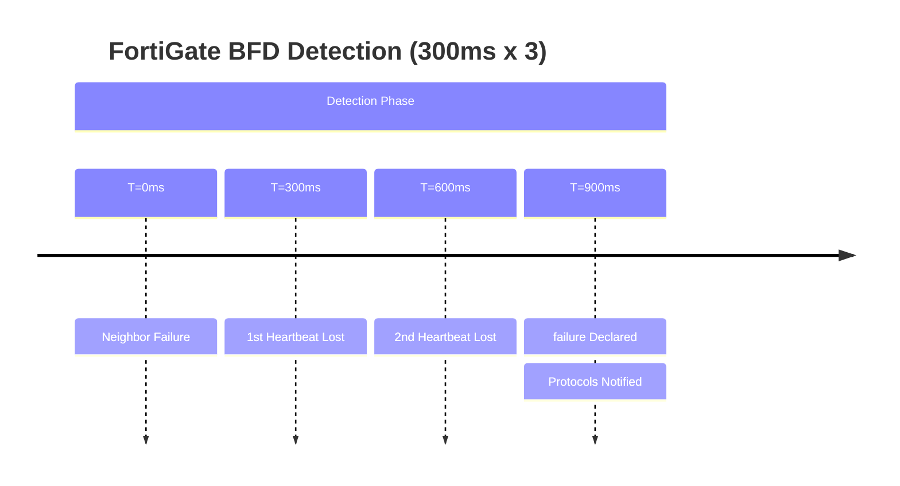

# FortiGate: Optimized BFD Configuration Guide

## 1. Overview & Principles

On FortiGate units (SoC4+), BFD is offloaded to the Network Processor (NPU) for
maximum performance. This allows for sub-second failover without impacting the
Management
CPU, even across hundreds of sessions.

### Key Principles

* **NPU Offload:** Mandatory for stability. It prevents "false positives" during
    high CPU spikes.
    high CPU spikes.

* **Link-Down Failover:** In FortiGate, this command is critical for BGP to ensure
    the RIB is updated immediately when the physical or logical (BFD) state changes.

    the RIB is updated immediately when the physical or logical (BFD) state changes.

## 2. Detection Timelines (Heartbeat)



## 3. Configuration Snippets

### A. Defining BFD Timers

```fortios

config system bfd
    config neighbor
        edit "10.1.1.2"
            set min-rx 300
            set min-tx 300
            set multiplier 3
        next
    end
end
```

### B. Protocol Integration (BGP)

```fortios

config router bgp
    config neighbor
        edit "10.1.1.2"
            set bfd enable
            set link-down-failover enable
        next
    end
end
```

## 4. Comparison Summary

| Metric | Default Settings | FortiGate Optimized (BFD) |
| :--- | :--- | :--- |
| **BGP Detection** | 180 Seconds | **< 1 Second** |
| **OSPF Detection** | 40 Seconds | **< 1 Second** |
| **CPU Impact** | Very Low | **Low (NPU Offloaded)** |
| **Static Route** | Link State Only | **Active Path Health** |

## 5. Verification & Troubleshooting

| Command | Purpose |
| :--- | :--- |
| `get router info bfd neighbor` | Show active BFD sessions and negotiated timers. |
| `diagnose sniffer packet any 'udp port 3784' 4` | Capture BFD heartbeats for troubleshooting. |
| `get router info bgp neighbors 10.1.1.2` | Verify "BFD is enabled" for a specific peer. |
