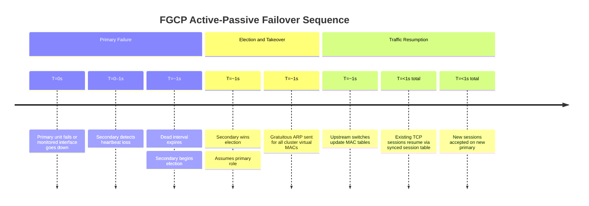

# FortiGate: HA Configuration

FortiGate High Availability uses FGCP (FortiGate Clustering Protocol), a
Fortinet-proprietary
protocol that synchronises configuration, session tables, and routing tables between
cluster
members. FGCP supports two operational modes: Active-Passive (one unit forwards all
traffic,
one is a hot standby) and Active-Active (primary distributes sessions to secondary via
load-balancing). Heartbeat traffic flows over dedicated HA interfaces; failover is
stateful
when session synchronisation is enabled.

For gateway redundancy protocol background see [HSRP vs VRRP vs
GLBP](../theory/hsrp_vrrp_vs_glbp.md).

---

## 1. Overview & Principles

- **FGCP heartbeat:** Cluster members exchange heartbeat packets at sub-second intervals
  over designated HA interfaces. Loss of heartbeat for the duration of the dead interval
  triggers a failover election.

- **Primary election:** The unit with the highest priority value becomes primary. Ties
  are broken by managed device count, then interface link state, then serial number.
  Priority is configurable (0–255; default 128); higher values win.

- **Configuration synchronisation:** The primary pushes its full configuration to all

secondaries. Changes made directly on a secondary are overwritten. Always make
configuration
  changes on the primary or via FortiManager.

- **Session synchronisation:** TCP sessions are synced to the secondary by default. With

session sync enabled, TCP sessions survive failover without client reconnection. UDP and
  ICMP sessions are not synced by default (additional overhead required).

- **Active-Passive (A-P):** One unit handles all forwarding; the secondary monitors
heartbeat

heartbeat

  and is ready to take over. Simpler to operate; recommended for most deployments.

- **Active-Active (A-A):** The primary distributes sessions to the secondary using a
  load-balancing hash. Both units forward traffic. A-A does not double throughput in all
  scenarios — asymmetric traffic paths and UTM inspection requirements can limit gains.
  A-P is preferred unless specific throughput scaling has been validated.

- **HA management interface:** Each cluster member can be assigned a dedicated
  management IP independent of cluster state, allowing direct access to a secondary unit
  for diagnostics and upgrade operations.

---

## 2. A-P Failover Timeline



With session synchronisation enabled (`set session-pickup enable`), established TCP sessions
survive failover without client reconnection. The target convergence time for a stateful
failover is under one second in a properly configured cluster with a direct heartbeat link.

---

## 3. Configuration

### A. Basic Active-Passive Configuration

The same HA configuration block is applied to both units before connecting the heartbeat
cable. The unit with the higher priority value becomes primary.

```fortios

config system ha
    set mode a-p
    set group-id 1
    set group-name "FW-CLUSTER"
    set password <HA-PASSWORD>
    set hbdev "port3" 50               ! Heartbeat interface; 50 = heartbeat priority
    set session-sync-dev "port3"       ! Session sync on same or dedicated interface
    set priority 200                   ! Higher = preferred primary (default 128); set lower on secondary
    set override enable                ! Primary reclaims role after recovery
    set override-wait-time 60          ! Wait 60s before reclaiming — allows BGP/OSPF to reconverge
end
```

Set `priority 200` on the intended primary and `priority 100` (or default 128) on the
secondary. With `override enable`, the higher-priority unit will reclaim the primary role
after it recovers from a failure, once `override-wait-time` seconds have elapsed.

### B. HA Interface Considerations

Dedicated HA ports are strongly preferred. Using in-band interfaces for heartbeat
means HA traffic competes with production data, and a congested link can cause false
failover events.

- Connect heartbeat interfaces directly between units with a crossover cable (or dedicated
  VLAN on a switch not carrying production traffic).

- If only one HA interface is available, heartbeat and session sync will share the same
  link; this is acceptable but increases risk of split-brain on high-utilisation links.

- HA interfaces do not participate in the production forwarding table and should not be
  configured with IP addresses in normal deployments (FGCP manages addressing internally).

### C. Management Access to Secondary Unit

By default, the secondary is reachable only through the primary via `execute ha manage`.
A dedicated HA management interface allows direct access to the secondary regardless of
cluster state — essential for upgrades and out-of-band diagnostics.

```fortios

config system ha
    set ha-mgmt-status enable
    config ha-mgmt-interfaces
        edit 1
            set interface "mgmt"
            set gateway 192.168.100.1
        next
    end
end

! Assign a unique IP to the mgmt interface on the secondary (done locally on secondary unit)
config system interface
    edit "mgmt"
        set ip 192.168.100.12 255.255.255.0
    next
end
```

The management interface IP must be unique per cluster member and reachable from the
management network independently of the cluster virtual MAC.

### D. Session Synchronisation

TCP session sync is enabled by default when HA is configured. UDP and ICMP sessions are
not synced unless `session-pickup-connectionless enable` is set — this trades failover
transparency for additional CPU and bandwidth overhead on the heartbeat link.

```fortios

config system ha
    set session-pickup enable              ! TCP session sync — enabled by default
    set session-pickup-connectionless enable   ! UDP/ICMP session sync — higher overhead
    set session-pickup-expectation enable  ! Sync helper sessions (FTP, SIP ALG, etc.)
end
```

For deployments running SIP, FTP, or other stateful ALG sessions, enabling
`session-pickup-expectation` ensures helper state is preserved across failover.

### E. Monitored Interfaces

If a monitored interface loses link, the unit reduces its effective priority, causing the
peer (with higher effective priority) to win the election and become primary. This ensures
failover occurs when a production interface fails even if the unit itself is healthy.

```fortios

config system ha
    set monitor "port1" "port2"        ! Trigger failover if either interface goes down
end
```

Each monitored interface loss reduces the unit's priority by a fixed decrement (default
50 per failed interface). Configure monitoring on all interfaces that carry production
traffic.

### F. Upgrading an HA Cluster

Always upgrade the secondary before the primary to minimise production impact. FortiOS
provides an uninterruptible upgrade option that automates the sequence.

**Automated (recommended):**

```fortios

config system ha
    set uninterruptible-upgrade enable     ! FortiOS coordinates upgrade order automatically
end
```

With `uninterruptible-upgrade enable`, initiating a firmware upgrade from the primary GUI
or CLI causes FortiOS to upgrade the secondary first, wait for it to rejoin the cluster,
then upgrade the primary with a controlled failover.

**Manual procedure:**

```fortios

! From primary CLI — access secondary and initiate upgrade
execute ha manage 1                        ! Connect to secondary (ID 1)

! On secondary (now in ha manage session):
execute restore image ftp <firmware.bin> <ftp-server>

! Wait for secondary to come back up and rejoin cluster, then upgrade primary:
execute restore image ftp <firmware.bin> <ftp-server>
```

Verify secondary has rejoined before upgrading the primary: `get system ha status` should
show both members in sync.

### G. Active-Active Configuration Differences

A-A mode uses the same base configuration as A-P with the following changes. The primary
load-balances new sessions to the secondary using a hash of source IP, destination IP,
and protocol.

```fortios

config system ha
    set mode a-a
    set load-balance-all enable            ! Load-balance all traffic types (not just UTM)
    set group-id 1
    set group-name "FW-CLUSTER-AA"
    set password <HA-PASSWORD>
    set hbdev "port3" 50
    set session-sync-dev "port3"
    set priority 200
end
```

A-A caveats to consider before deployment:

- Sessions forwarded to the secondary traverse the HA link twice (in and out), consuming
  heartbeat bandwidth. Dedicated HA links with sufficient capacity are critical.

- Asymmetric routing on the WAN side can cause the return traffic to arrive at the secondary
  while the session was established on the primary — FortiGate handles this internally via
  the session sync table, but it adds latency.

- UTM inspection (IPS, AV, SSL inspection) sessions are load-balanced; sessions requiring
  NP (network processor) offload may not benefit from A-A distribution.

- A-P is recommended for most deployments. Use A-A only after validating throughput gains
  in the specific traffic profile.

### H. Cluster Verification and Forced Failover

```fortios

! Force failover to secondary (for maintenance or testing)
execute ha failover set 1              ! Force unit with ID 1 to become primary

! Clear forced failover and restore normal election
execute ha failover unset 1

! Access secondary CLI from primary
execute ha manage 1                    ! Opens CLI session on cluster member ID 1
```

---

## 4. Comparison Summary

| Attribute | Active-Passive | Active-Active |
| :--- | :--- | :--- |
| **Failover time** | &lt; 1 second (stateful with session sync) | &lt; 1 second |
| **Throughput benefit** | None — secondary is idle standby | Potential gain; limited by hash distribution and HA link overhead |
| **Session sync behaviour** | TCP synced; UDP/ICMP optional | Same; HA link carries more traffic |
| **Recommended use case** | Most deployments — simplicity and predictability | High-throughput environments with validated A-A benefit |
| **Complexity** | Low | Higher — asymmetric routing, HA link sizing, NP offload interaction |
| **UTM inspection** | Full on primary | Load-balanced; verify NP offload compatibility |

---

## 5. Verification & Troubleshooting

| Command | Purpose |
| :--- | :--- |
| `get system ha status` | Cluster summary: member roles, priorities, sync status, and uptime |
| `diagnose sys ha status` | Detailed HA state including heartbeat packet counts and sync queue depth |
| `get system ha` | Full HA configuration as applied (effective running config) |
| `diagnose debug application hatalk -1` | Enable verbose FGCP heartbeat and state-machine debug output |
| `execute ha manage <id> get system status` | Run a command on a specific cluster member by ID |
| `diagnose sys session stat` | Session table statistics — verify session counts match expected distribution |
| `diagnose netlink interface list` | Confirm monitored interface link states as seen by the HA subsystem |
